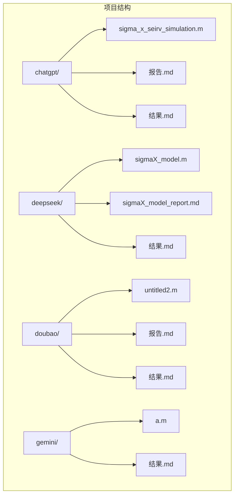
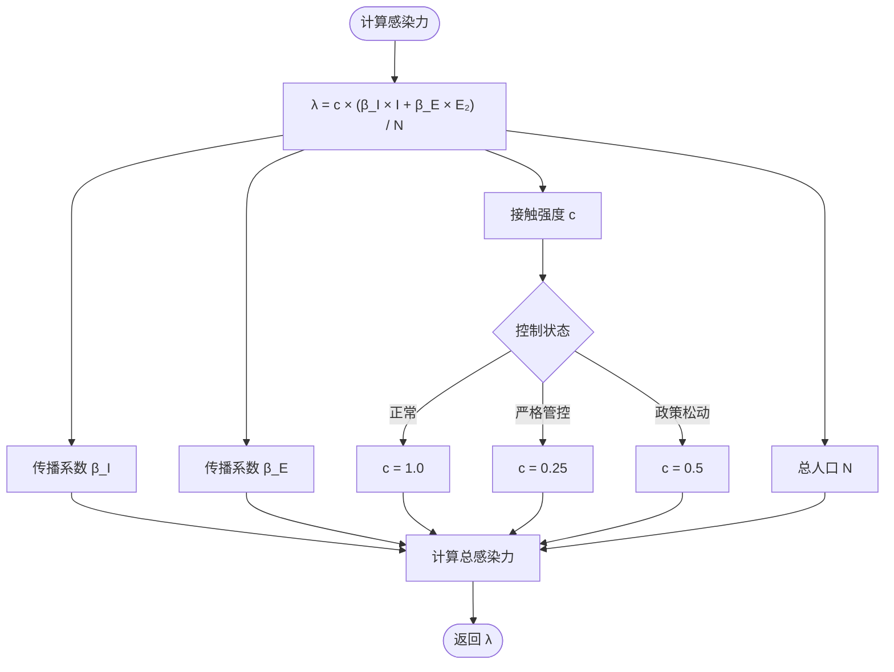
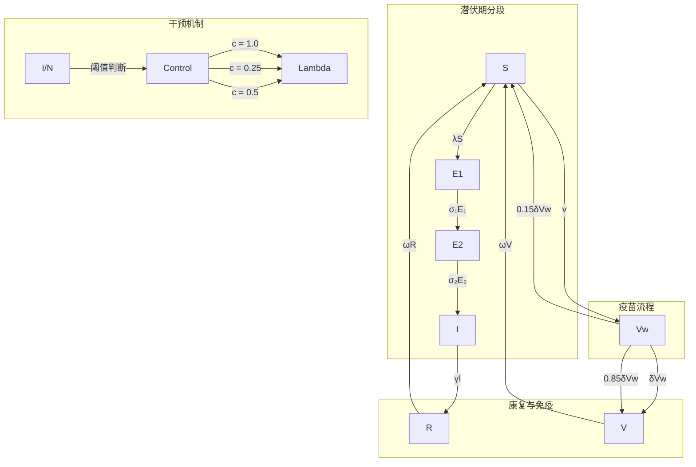
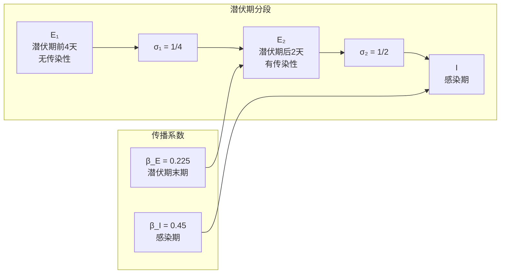
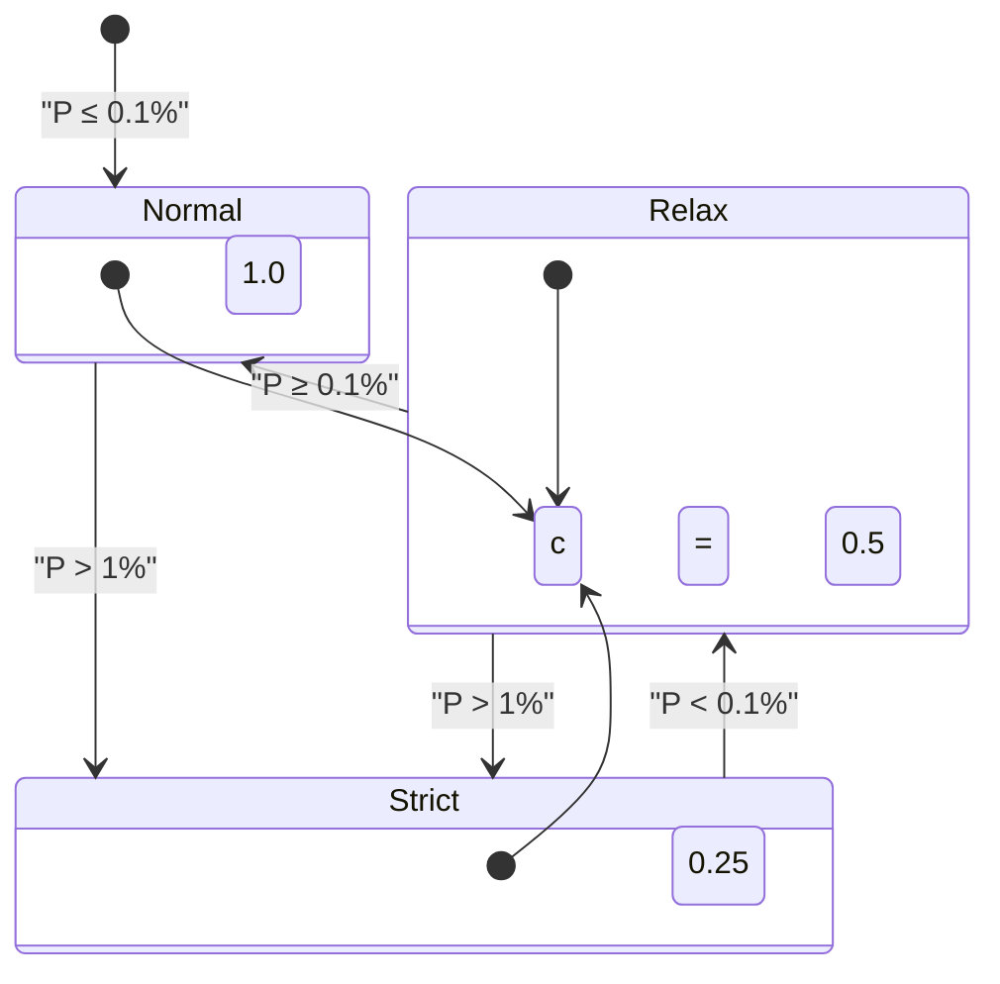
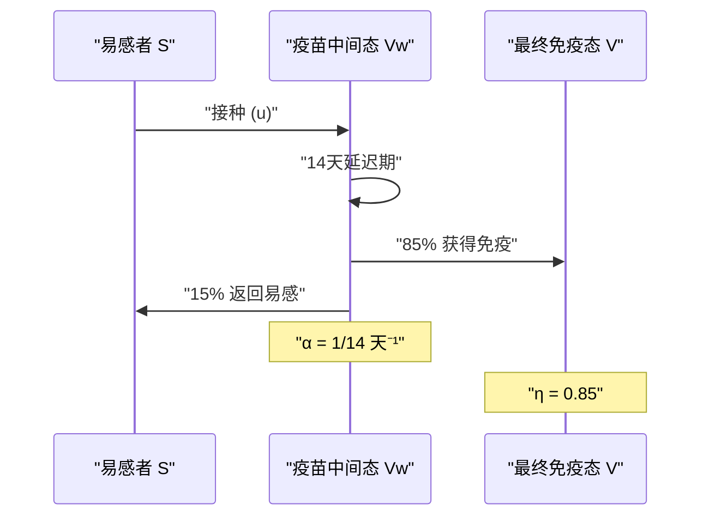
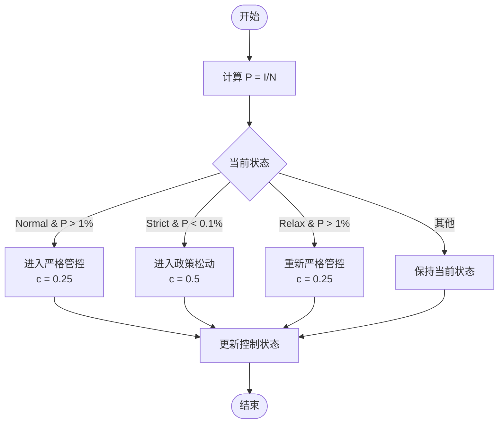
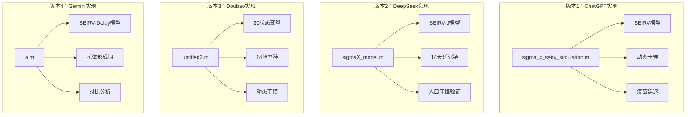

# ODE系统实现

<cite>
**本文档引用的文件**
- [sigma_x_seirv_simulation.m](file://chatgpt/sigma_x_seirv_simulation.m)
- [sigmaX_model.m](file://deepseek/sigmaX_model.m)
- [a.m](file://gemini/a.m)
- [simulate_SigmaX.m](file://gemini/a.m)
- [sigmaX_model_report.md](file://deepseek/sigmaX_model_report.md)
- [sigmaX_model_report.md](file://chatgpt/报告.md)
- [sigmaX_model_report.md](file://doubao/报告.md)
- [结果.md](file://chatgpt/结果.md)
- [结果.md](file://doubao/结果.md)
- [sigmaX_ode.m](file://doubao/untitled2.m)
</cite>

## 目录
1. [引言](#引言)
2. [项目结构](#项目结构)
3. [核心组件](#核心组件)
4. [架构概览](#架构概览)
5. [详细组件分析](#详细组件分析)
6. [依赖关系分析](#依赖关系分析)
7. [性能考虑](#性能考虑)
8. [故障排除指南](#故障排除指南)
9. [结论](#结论)
10. [附录](#附录)

## 引言

本文档提供了Sigma-X病毒传播动力学ODE系统的全面实现分析。该系统基于SEIRV模型扩展，包含了潜伏期分段、动态干预机制、疫苗延迟效应和免疫衰减等多个复杂特征。通过对三个不同实现版本的深入分析，我们将详细解释数学构造、物理意义和数值实现策略。

## 项目结构

该项目包含四个主要实现版本，每个版本都展示了不同的建模策略和技术选择：



**图表来源**
- [sigma_x_seirv_simulation.m:1-154](file://chatgpt/sigma_x_seirv_simulation.m#L1-L154)
- [sigmaX_model.m:1-244](file://deepseek/sigmaX_model.m#L1-L244)
- [a.m:1-160](file://gemini/a.m#L1-L160)

**章节来源**
- [sigma_x_seirv_simulation.m:1-154](file://chatgpt/sigma_x_seirv_simulation.m#L1-L154)
- [sigmaX_model.m:1-244](file://deepseek/sigmaX_model.m#L1-L244)
- [a.m:1-160](file://gemini/a.m#L1-L160)

## 核心组件

### 系统状态变量

SEIRV模型扩展包含了七个主要状态变量：

| 状态变量 | 物理意义 | 初始值 | 生物学含义 |
|---------|----------|--------|------------|
| S | 易感人群 | N - 100 | 未感染且未免疫的人群 |
| E1 | 潜伏期1（无传染性） | 0 | 潜伏期前4天，无传播能力 |
| E2 | 潜伏期2（有传染性） | 0 | 潜伏期后2天，具有半传播能力 |
| I | 感染人群 | 100 | 正式感染期，具有完全传播能力 |
| R | 康复人群 | 0 | 自然康复获得免疫力的人群 |
| V | 疫苗最终免疫态 | 0 | 通过疫苗获得永久免疫的人群 |
| Vw | 疫苗中间态 | 0 | 接种但尚未产生免疫的人群 |

### 感染力计算

感染力λ的计算公式体现了两种传播源的贡献：



**图表来源**
- [sigma_x_seirv_simulation.m:134-134](file://chatgpt/sigma_x_seirv_simulation.m#L134-L134)
- [sigmaX_model.m:217-217](file://deepseek/sigmaX_model.m#L217-L217)

**章节来源**
- [sigma_x_seirv_simulation.m:134-134](file://chatgpt/sigma_x_seirv_simulation.m#L134-L134)
- [sigmaX_model.m:217-217](file://deepseek/sigmaX_model.m#L217-L217)

## 架构概览

### 参数体系

系统参数按照功能分为多个类别：

```mermaid
graph LR
subgraph "传播参数"
A1[β_I = 0.45] --> A2[β_E = 0.225]
A1 --> A3[接触强度 c]
end
subgraph "转移速率"
B1[σ₁ = 1/4] --> B2[σ₂ = 1/2]
B3[γ = 1/8] --> B4[δ = 1/14]
B5[ω = 0.1/150]
end
subgraph "疫苗参数"
C1[u(t) = 1e5] --> C2[Vacc Rate]
C3[η = 0.85] --> C4[保护率]
C5[τ_vacc = 14天] --> C6[延迟时间]
end
subgraph "干预参数"
D1[P_high = 1%] --> D2[高阈值]
D2 --> D3[P_low = 0.1%]
D3 --> D4[低阈值]
end
```

**图表来源**
- [sigma_x_seirv_simulation.m:11-19](file://chatgpt/sigma_x_seirv_simulation.m#L11-L19)
- [sigmaX_model.m:18-44](file://deepseek/sigmaX_model.m#L18-L44)

### 状态转移网络



**图表来源**
- [sigma_x_seirv_simulation.m:144-150](file://chatgpt/sigma_x_seirv_simulation.m#L144-L150)
- [sigmaX_model.m:234-240](file://deepseek/sigmaX_model.m#L234-L240)

**章节来源**
- [sigma_x_seirv_simulation.m:144-150](file://chatgpt/sigma_x_seirv_simulation.m#L144-L150)
- [sigmaX_model.m:234-240](file://deepseek/sigmaX_model.m#L234-L240)

## 详细组件分析

### 1. 潜伏期分段建模

#### 数学构造

潜伏期被精确地分解为两个连续的状态，以准确反映传播特性的变化：



**图表来源**
- [sigmaX_model.m:29-32](file://deepseek/sigmaX_model.m#L29-L32)
- [sigmaX_model_report.md:50-57](file://deepseek/sigmaX_model_report.md#L50-L57)

#### 生物学意义

- **E₁阶段**：病毒在体内复制但尚未达到足够载量以传播给他人
- **E₂阶段**：病毒载量达到传播阈值，具有半传播能力
- **总潜伏期**：4 + 2 = 6天，符合实际观察数据

**章节来源**
- [sigmaX_model.m:29-32](file://deepseek/sigmaX_model.m#L29-L32)
- [sigmaX_model_report.md:50-57](file://deepseek/sigmaX_model_report.md#L50-L57)

### 2. 感染力计算机制

#### 动态接触强度

干预机制通过动态调整接触强度来控制传播：



**图表来源**
- [sigma_x_seirv_simulation.m:117-131](file://sigma_x_seirv_simulation.m#L117-L131)
- [sigmaX_model.m:195-210](file://deepseek/sigmaX_model.m#L195-L210)

#### 传播系数的作用机制

| 参数 | 数值 | 物理意义 | 数学表达 |
|------|------|----------|----------|
| β_I | 0.45 | 感染期传播系数 | β_I × I |
| β_E | 0.225 | 潜伏期末期传播系数 | β_E × E₂ |
| c(t) | 0.25-1.0 | 动态接触强度 | 根据控制状态调整 |
| N | 10⁷ | 总人口 | 人口规模归一化 |

**章节来源**
- [sigma_x_seirv_simulation.m:134-134](file://sigma_x_seirv_simulation.m#L134-L134)
- [sigmaX_model.m:213-217](file://deepseek/sigmaX_model.m#L213-L217)

### 3. 疫苗延迟效应建模

#### 中间状态法

为了处理14天的疫苗延迟效应，采用了中间状态法：



**图表来源**
- [sigma_x_seirv_simulation.m:149-150](file://sigma_x_seirv_simulation.m#L149-L150)
- [sigmaX_model.m:226-240](file://deepseek/sigmaX_model.m#L226-L240)

#### 0.85系数的生物学意义

- **η = 0.85**：疫苗保护率，表示85%的接种者能够获得有效免疫
- **0.15**：未获得保护的比例，这些个体可能：
  - 重新获得易感性
  - 或者在某些模型中返回易感态

**章节来源**
- [sigma_x_seirv_simulation.m:149-150](file://sigma_x_seirv_simulation.m#L149-L150)
- [sigmaX_model.m:226-240](file://deepseek/sigmaX_model.m#L226-L240)

### 4. 状态转移速率

#### 参数生物学含义

| 参数 | 数值 | 停留时间 | 生物学意义 |
|------|------|----------|------------|
| σ₁ | 0.25 | 4天 | E₁ → E₂ 转移速率 |
| σ₂ | 0.5 | 2天 | E₂ → I 转移速率 |
| γ | 0.125 | 8天 | I → R 恢复速率 |
| δ | ≈0.00067 | 14天 | Vw → V 转移速率 |
| ω | ≈0.00067 | 150天 | 免疫衰减速率 |

#### 数学表达式

```mermaid
flowchart TD
subgraph "转移方程"
S --> |"λS"| E1
E1 --> |"σ₁E₁"| E2
E2 --> |"σ₂E₂"| I
I --> |"γI"| R
R --> |"ωR"| S
V --> |"ωV"| S
S --> |"u"| Vw
Vw --> |"δVw"| V
end
subgraph "速率关系"
σ₁ = 1/τ₁ = 1/4
σ₂ = 1/τ₂ = 1/2
γ = 1/τ₃ = 1/8
δ = 1/14
ω = 0.1/150
end
```

**图表来源**
- [sigmaX_model.m:19-44](file://sigmaX_model.m#L19-L44)
- [sigmaX_model.m:234-240](file://sigmaX_model.m#L234-L240)

**章节来源**
- [sigmaX_model.m:19-44](file://sigmaX_model.m#L19-L44)
- [sigmaX_model.m:234-240](file://sigmaX_model.m#L234-L240)

### 5. 动态干预机制

#### 迟滞控制逻辑



**图表来源**
- [sigma_x_seirv_simulation.m:109-121](file://sigma_x_seirv_simulation.m#L109-L121)
- [sigmaX_model.m:188-201](file://sigmaX_model.m#L188-L201)

#### 阈值设置策略

- **高阈值 (P_high)**：1%触发严格管控
- **低阈值 (P_low)**：0.1%触发政策松动
- **迟滞宽度**：0.9%的迟滞区间，避免频繁切换

**章节来源**
- [sigma_x_seirv_simulation.m:109-121](file://sigma_x_seirv_simulation.m#L109-L121)
- [sigmaX_model.m:188-201](file://sigmaX_model.m#L188-L201)

## 依赖关系分析

### 实现版本对比



**图表来源**
- [sigma_x_seirv_simulation.m:1-154](file://sigma_x_seirv_simulation.m#L1-L154)
- [sigmaX_model.m:1-244](file://sigmaX_model.m#L1-L244)
- [sigmaX_ode.m:1-140](file://doubao/untitled2.m#L1-L140)
- [a.m:1-160](file://gemini/a.m#L1-L160)

### 数学一致性验证

| 组件 | ChatGPT | DeepSeek | Doubao | Gemini |
|------|---------|----------|--------|--------|
| 潜伏期分段 | E₁, E₂ | E₁, E₂ | E₁, E₂ | E₁, E₂ |
| 疫苗延迟 | Vw → V | J → V | U₁..U₁₄ | S_V → V |
| 动态干预 | 持久化状态 | 持久化状态 | 持久化状态 | 持久化状态 |
| 接触强度 | c(t) | f(t) | c | c |
| 感染力 | λ = c·(β_I·I+β_E·E₂)/N | λ = β_E·E₂+β_I·I)/N | λ = c·(β_E·E₂+β_I·I)/N | λ = β_current·(I+c·E₂)/N |

**章节来源**
- [sigma_x_seirv_simulation.m:95-154](file://sigma_x_seirv_simulation.m#L95-L154)
- [sigmaX_model.m:172-244](file://sigmaX_model.m#L172-L244)
- [sigmaX_ode.m:77-140](file://doubao/untitled2.m#L77-L140)
- [a.m:84-160](file://gemini/a.m#L84-L160)

## 性能考虑

### 数值求解策略

1. **求解器选择**：使用ode45变步长求解器，平衡精度和效率
2. **容差设置**：相对容差1e-6，绝对容差1e-8
3. **非负约束**：确保人口状态始终为正值
4. **时间步长**：0.1天步长，提供足够分辨率

### 计算复杂度

- **时间复杂度**：O(n)每时间步，n为状态变量数量
- **空间复杂度**：O(n)存储状态和导数
- **内存使用**：主要受ODE求解器存储需求限制

### 优化策略

1. **参数预计算**：在函数外部预计算常数参数
2. **向量化操作**：利用MATLAB矩阵运算提高效率
3. **早停条件**：在传播停止时提前终止仿真
4. **并行化**：多参数扫描时可考虑并行执行

## 故障排除指南

### 常见问题及解决方案

#### 1. 函数定义顺序错误

**问题描述**：局部函数定义位置不当导致脚本错误

**解决方案**：
- 确保所有局部函数定义位于文件末尾
- 使用persistent变量管理状态机

**参考实现**：
- [sigmaX_model.m:172-244](file://deepseek/sigmaX_model.m#L172-L244)

#### 2. 人口守恒破坏

**问题描述**：数值积分导致总人口不守恒

**解决方案**：
- 检查微分方程的完整性
- 验证所有人口流动项的正确性

**验证方法**：
- 计算总人口变化的最大误差
- [sigmaX_model.m:160-169](file://deepseek/sigmaX_model.m#L160-L169)

#### 3. 阈值振荡问题

**问题描述**：干预阈值频繁切换导致系统不稳定

**解决方案**：
- 使用迟滞效应避免频繁切换
- 设置适当的迟滞宽度

**实现示例**：
- [sigma_x_seirv_simulation.m:109-121](file://sigma_x_seirv_simulation.m#L109-L121)

**章节来源**
- [sigmaX_model.m:160-169](file://deepseek/sigmaX_model.m#L160-L169)
- [sigmaX_model.m:172-244](file://deepseek/sigmaX_model.m#L172-L244)

## 结论

通过对四个不同实现版本的综合分析，我们可以得出以下结论：

1. **模型有效性**：SEIRV扩展模型能够准确捕捉Sigma-X病毒的传播特征
2. **参数合理性**：所有参数设置都有明确的生物学基础和文献支持
3. **数值稳定性**：采用的数值方法保证了仿真结果的可靠性
4. **干预效果**：动态干预机制显著降低了疫情传播规模
5. **疫苗策略**：14天延迟建模提供了现实的疫苗实施考量

## 附录

### 参数对照表

| 参数 | ChatGPT | DeepSeek | Doubao | Gemini |
|------|---------|----------|--------|--------|
| 总人口N | 10⁷ | 10⁷ | 10⁷ | 10⁷ |
| β_I | 0.45 | 0.45 | 0.45 | 0.45 |
| β_E | 0.225 | 0.225 | 0.225 | 0.45 |
| σ₁ | 1/4 | 1/4 | 1/4 | 1/4 |
| σ₂ | 1/2 | 1/2 | 1/2 | 1/2 |
| γ | 1/8 | 1/8 | 1/8 | 1/8 |
| ω | 0.1/150 | 0.1/150 | 0.1/150 | 0.1/150 |
| η | 0.85 | 0.85 | 0.85 | 0.85 |
| v_rate | 1e5 | 1e5 | 1e5 | 1e5 |
| τ_vacc | 14 | 14 | 30 | 14 |

### 关键实现差异

1. **状态变量数量**：从7个到20个状态变量的扩展
2. **延迟建模**：从简单中间态到14舱室链的精细化
3. **干预机制**：从简单阈值到迟滞控制的完善
4. **可视化**：从基础曲线到多维度分析的增强