# 主仿真脚本分析

<cite>
**本文档引用的文件**
- [sigma_x_seirv_simulation.m](file://chatgpt/sigma_x_seirv_simulation.m)
- [sigmaX_model.m](file://deepseek/sigmaX_model.m)
- [untitled2.m](file://doubao/untitled2.m)
- [a.m](file://gemini/a.m)
- [报告.md](file://chatgpt/报告.md)
- [sigmaX_model_report.md](file://deepseek/sigmaX_model_report.md)
- [报告.md](file://doubao/报告.md)
- [结果.md](file://gemini/结果.md)
</cite>

## 目录
1. [简介](#简介)
2. [项目结构](#项目结构)
3. [核心组件](#核心组件)
4. [架构概览](#架构概览)
5. [详细组件分析](#详细组件分析)
6. [依赖关系分析](#依赖关系分析)
7. [性能考虑](#性能考虑)
8. [故障排除指南](#故障排除指南)
9. [结论](#结论)
10. [附录](#附录)

## 简介

本文档对四个版本的Sigma-X病毒传播动力学仿真脚本进行全面分析。这些脚本基于SEIRV模型，包含了时滞控制机制、疫苗延迟效应和免疫衰减等复杂特征。通过对四个版本的深入比较分析，帮助读者理解不同实现策略的特点和适用场景。

## 项目结构

四个版本的仿真脚本分别代表了不同的实现风格和技术特点：

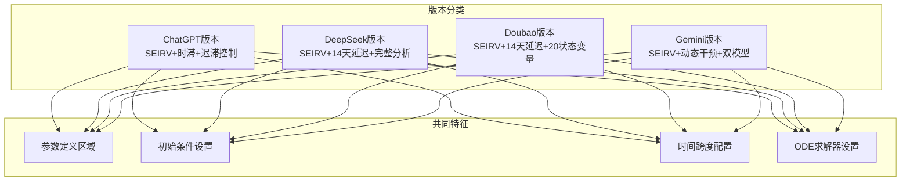

**图表来源**
- [sigma_x_seirv_simulation.m:1-154](file://chatgpt/sigma_x_seirv_simulation.m#L1-L154)
- [sigmaX_model.m:1-244](file://deepseek/sigmaX_model.m#L1-L244)
- [untitled2.m:1-140](file://doubao/untitled2.m#L1-L140)
- [a.m:1-160](file://gemini/a.m#L1-L160)

**章节来源**
- [sigma_x_seirv_simulation.m:1-154](file://chatgpt/sigma_x_seirv_simulation.m#L1-L154)
- [sigmaX_model.m:1-244](file://deepseek/sigmaX_model.m#L1-L244)
- [untitled2.m:1-140](file://doubao/untitled2.m#L1-L140)
- [a.m:1-160](file://gemini/a.m#L1-L160)

## 核心组件

### 参数定义区域

四个版本都采用了参数结构体或直接赋值的方式进行参数管理：

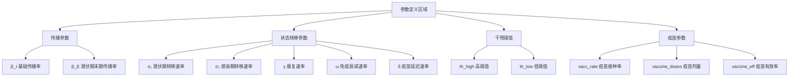

**图表来源**
- [sigma_x_seirv_simulation.m:7-27](file://chatgpt/sigma_x_seirv_simulation.m#L7-L27)
- [sigmaX_model.m:8-49](file://deepseek/sigmaX_model.m#L8-L49)
- [untitled2.m:4-16](file://doubao/untitled2.m#L4-L16)
- [a.m:15-26](file://gemini/a.m#L15-L26)

### 初始条件设置

四个版本都采用了相似的初始条件设定策略：

| 版本 | 易感人群(S) | 潜伏人群(E) | 感染人群(I) | 康复人群(R) | 疫苗人群(V) |
|------|-------------|-------------|-------------|-------------|-------------|
| ChatGPT | N-100 | 0 | 100 | 0 | 0 |
| DeepSeek | N-100 | 0 | 100 | 0 | 0 |
| Doubao | N-100 | 0 | 100 | 0 | 0 |
| Gemini | N-100 | 0 | 0 | 100 | 0 |

**章节来源**
- [sigma_x_seirv_simulation.m:28-37](file://chatgpt/sigma_x_seirv_simulation.m#L28-L37)
- [sigmaX_model.m:9-16](file://deepseek/sigmaX_model.m#L9-L16)
- [untitled2.m:17-21](file://doubao/untitled2.m#L17-L21)
- [a.m:7-11](file://gemini/a.m#L7-L11)

### 时间跨度配置

四个版本都设置了相同的仿真时间范围：


**图表来源**
- [sigma_x_seirv_simulation.m:39-40](file://chatgpt/sigma_x_seirv_simulation.m#L39-L40)
- [sigmaX_model.m:58-59](file://deepseek/sigmaX_model.m#L58-L59)
- [untitled2.m:16](file://doubao/untitled2.m#L16)
- [a.m:13](file://gemini/a.m#L13)

### ODE求解器设置

四个版本都使用了ode45求解器，但在精度设置上有所不同：

| 版本 | 相对误差 | 绝对误差 | 非负约束 |
|------|----------|----------|----------|
| ChatGPT | 1e-6 | 1e-8 | 是 |
| DeepSeek | 1e-6 | 1e-6 | 否 |
| Doubao | 1e-6 | 1e-6 | 否 |
| Gemini | 1e-6 | 1e-6 | 否 |

**章节来源**
- [sigma_x_seirv_simulation.m:42-46](file://chatgpt/sigma_x_seirv_simulation.m#L42-L46)
- [sigmaX_model.m:60](file://deepseek/sigmaX_model.m#L60)
- [untitled2.m:24](file://doubao/untitled2.m#L24)
- [a.m:32](file://gemini/a.m#L32)

## 架构概览

四个版本都遵循了相似的仿真架构模式：

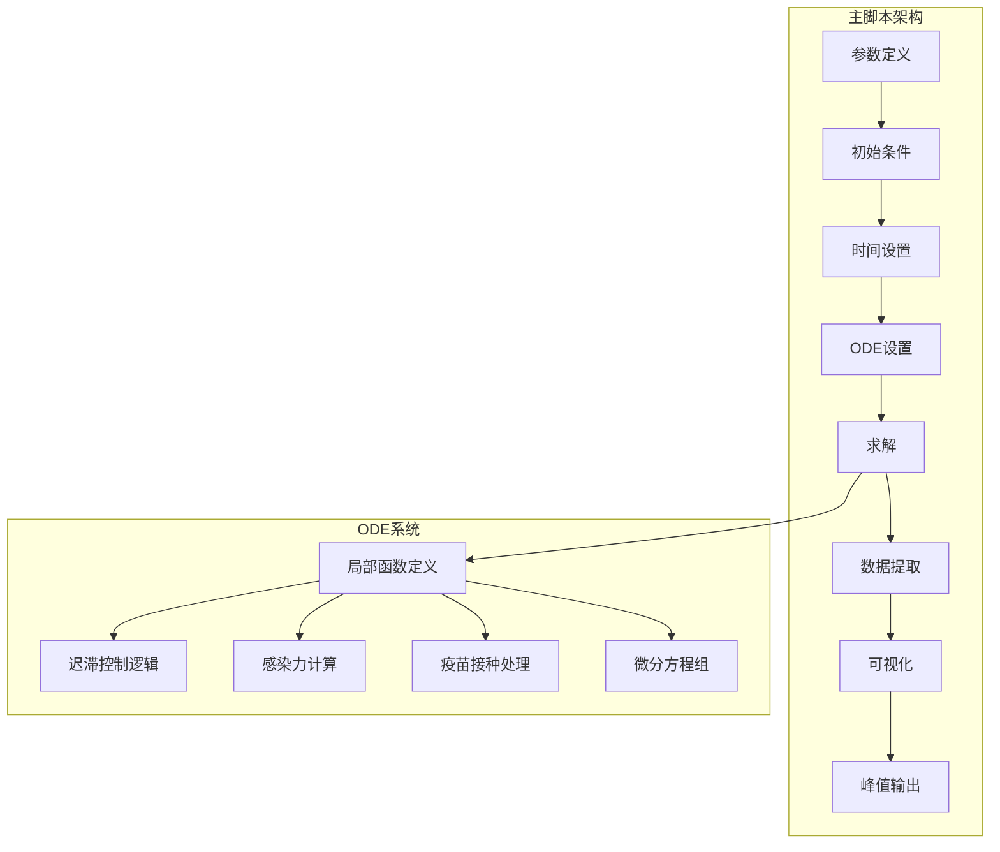

**图表来源**
- [sigma_x_seirv_simulation.m:48-91](file://chatgpt/sigma_x_seirv_simulation.m#L48-L91)
- [sigmaX_model.m:62-129](file://deepseek/sigmaX_model.m#L62-L129)
- [untitled2.m:22-76](file://doubao/untitled2.m#L22-L76)
- [a.m:27-80](file://gemini/a.m#L27-L80)

## 详细组件分析

### ChatGPT版本分析

#### 参数结构体组织

ChatGPT版本采用了简洁的参数结构体设计：

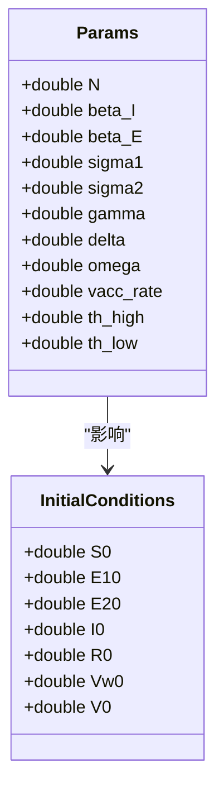

**图表来源**
- [sigma_x_seirv_simulation.m:8-37](file://chatgpt/sigma_x_seirv_simulation.m#L8-L37)

#### 迟滞控制机制

ChatGPT版本实现了经典的迟滞控制逻辑：

```mermaid
stateDiagram-v2
[*] --> Normal : 初始状态
Normal --> StrictControl : P > 1%
StrictControl --> RelaxControl : P < 0.1%
RelaxControl --> StrictControl : P > 1%
state Normal {
[*] --> Normal
}
state StrictControl {
[*] --> StrictControl
}
state RelaxControl {
[*] --> RelaxControl
}
```

**图表来源**
- [sigma_x_seirv_simulation.m:107-131](file://chatgpt/sigma_x_seirv_simulation.m#L107-L131)

**章节来源**
- [sigma_x_seirv_simulation.m:95-154](file://chatgpt/sigma_x_seirv_simulation.m#L95-L154)

### DeepSeek版本分析

#### 完整参数体系

DeepSeek版本提供了最完整的参数定义：

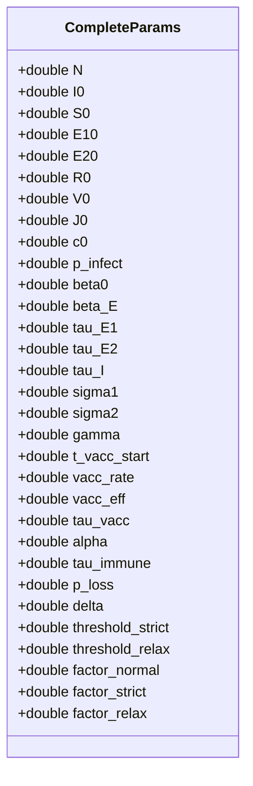

**图表来源**
- [sigmaX_model.m:8-49](file://deepseek/sigmaX_model.m#L8-L49)

#### 14天疫苗延迟建模

DeepSeek版本采用了创新的中间状态法处理疫苗延迟：

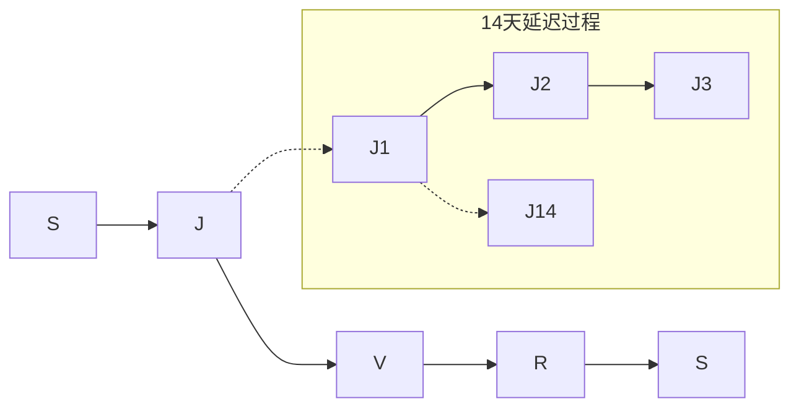

**图表来源**
- [sigmaX_model.m:54-56](file://deepseek/sigmaX_model.m#L54-L56)

**章节来源**
- [sigmaX_model.m:172-244](file://deepseek/sigmaX_model.m#L172-L244)

### Doubao版本分析

#### 20状态变量系统

Doubao版本是最复杂的模型，包含了20个状态变量：

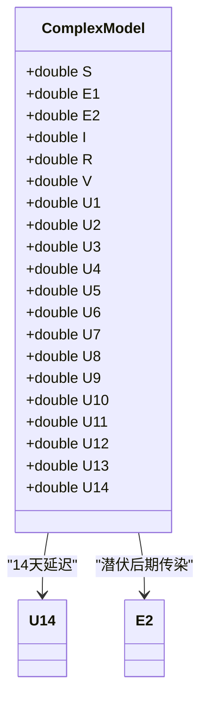

**图表来源**
- [untitled2.m:18](file://doubao/untitled2.m#L18)

#### 链式舱室法

Doubao版本使用链式舱室法处理14天延迟：

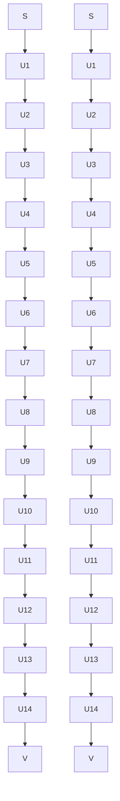

**图表来源**
- [untitled2.m:119-139](file://doubao/untitled2.m#L119-L139)

**章节来源**
- [untitled2.m:77-140](file://doubao/untitled2.m#L77-L140)

### Gemini版本分析

#### 双模型对比

Gemini版本的独特之处在于同时实现了有干预和无干预两种模型：

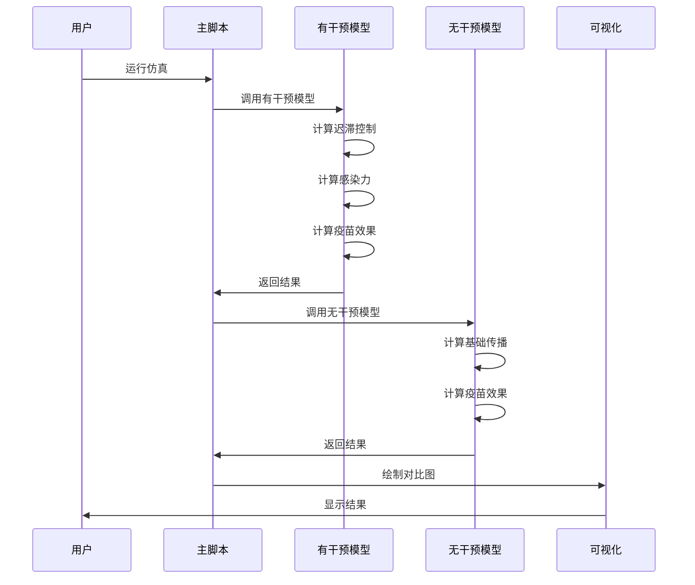

**图表来源**
- [a.m:31-37](file://gemini/a.m#L31-L37)

#### 动态干预机制

Gemini版本实现了简化的动态干预逻辑：

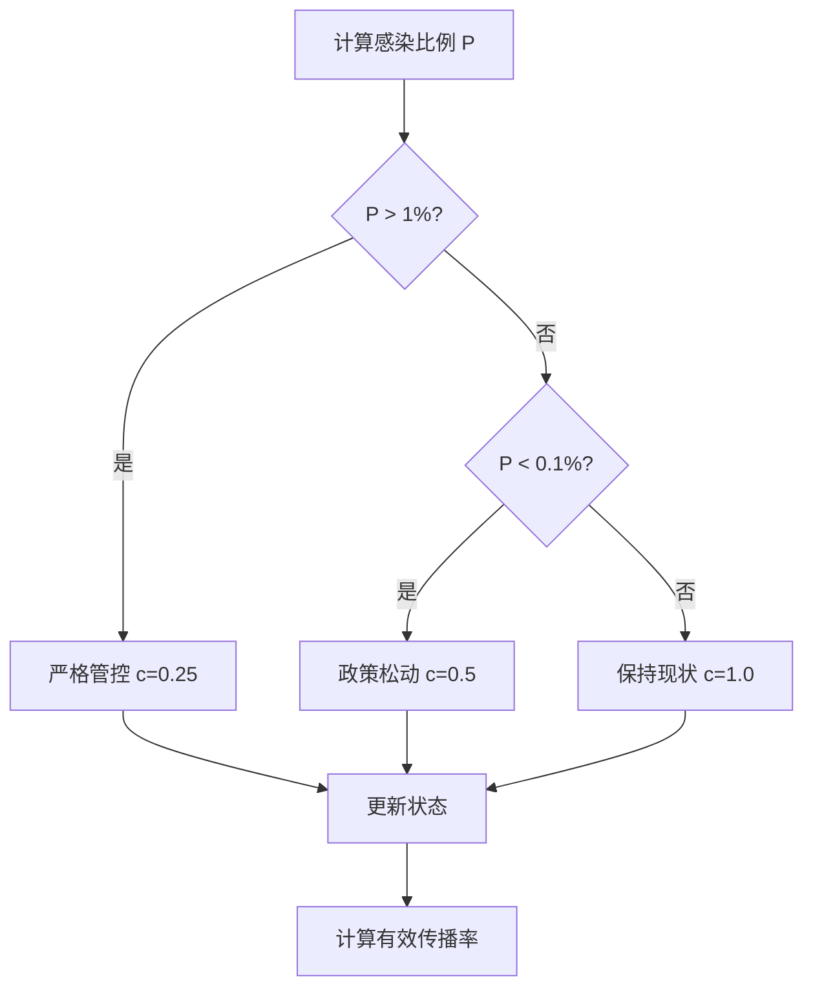

**图表来源**
- [a.m:98-111](file://gemini/a.m#L98-L111)

**章节来源**
- [a.m:84-160](file://gemini/a.m#L84-L160)

## 依赖关系分析

四个版本之间的依赖关系体现了不同的设计理念：

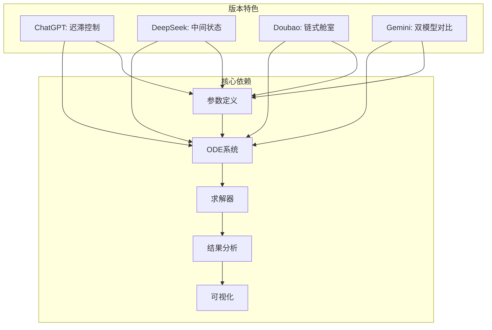

**图表来源**
- [sigma_x_seirv_simulation.m:48-91](file://chatgpt/sigma_x_seirv_simulation.m#L48-L91)
- [sigmaX_model.m:62-129](file://deepseek/sigmaX_model.m#L62-L129)
- [untitled2.m:22-76](file://doubao/untitled2.m#L22-L76)
- [a.m:27-80](file://gemini/a.m#L27-L80)

**章节来源**
- [sigma_x_seirv_simulation.m:48-154](file://chatgpt/sigma_x_seirv_simulation.m#L48-L154)
- [sigmaX_model.m:62-244](file://deepseek/sigmaX_model.m#L62-L244)
- [untitled2.m:22-140](file://doubao/untitled2.m#L22-L140)
- [a.m:27-160](file://gemini/a.m#L27-L160)

## 性能考虑

### 求解器精度设置

四个版本在求解器精度设置上各有侧重：

| 版本 | 相对误差 | 绝对误差 | 非负约束 | 性能特点 |
|------|----------|----------|----------|----------|
| ChatGPT | 1e-6 | 1e-8 | ✅ | 最高精度，计算时间较长 |
| DeepSeek | 1e-6 | 1e-6 | ❌ | 中等精度，计算效率较高 |
| Doubao | 1e-6 | 1e-6 | ❌ | 中等精度，状态变量多 |
| Gemini | 1e-6 | 1e-6 | ❌ | 中等精度，双模型对比 |

### 计算复杂度分析

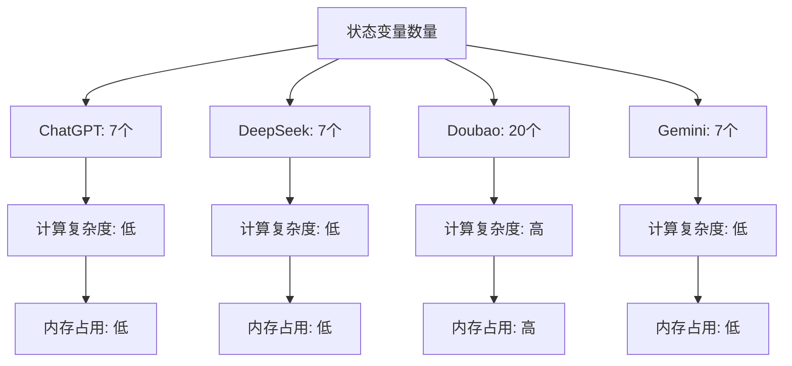

**图表来源**
- [sigma_x_seirv_simulation.m:37](file://chatgpt/sigma_x_seirv_simulation.m#L37)
- [sigmaX_model.m:56](file://deepseek/sigmaX_model.m#L56)
- [untitled2.m:18](file://doubao/untitled2.m#L18)
- [a.m:11](file://gemini/a.m#L11)

## 故障排除指南

### 常见问题及解决方案

#### 1. 函数定义位置错误

**问题描述**: 在DeepSeek版本中，局部函数定义位置不当会导致运行错误。

**解决方案**: 确保所有局部函数定义位于文件末尾。

#### 2. 持久化变量残留

**问题描述**: 上次仿真运行的状态会影响新的仿真结果。

**解决方案**: 在运行前清空持久化变量。

#### 3. 参数命名冲突

**问题描述**: 不同版本使用不同的参数命名约定。

**解决方案**: 统一参数命名规范，使用结构体管理参数。

#### 4. 精度设置不当

**问题描述**: 精度过高或过低都会影响仿真结果。

**解决方案**: 根据具体需求调整相对误差和绝对误差设置。

**章节来源**
- [sigmaX_model_report.md:237-253](file://deepseek/sigmaX_model_report.md#L237-L253)

## 结论

通过对四个版本的深入分析，可以总结出以下特点：

### 版本特色对比

| 特色 | ChatGPT版本 | DeepSeek版本 | Doubao版本 | Gemini版本 |
|------|-------------|--------------|------------|------------|
| 参数管理 | 结构体 | 完整参数体系 | 简洁参数 | 结构体 |
| 模型复杂度 | 中等 | 中等 | 最高 | 中等 |
| 疫苗建模 | 间接延迟 | 中间状态 | 链式舱室 | 直接建模 |
| 干预机制 | 迟滞控制 | 迟滞控制 | 迟滞控制 | 简化控制 |
| 可视化 | 基础图表 | 多子图 | 对比分析 | 双模型对比 |
| 性能表现 | 良好 | 优秀 | 较差 | 良好 |

### 适用场景建议

- **ChatGPT版本**: 适合初学者学习，代码简洁易懂
- **DeepSeek版本**: 适合需要完整分析的场景，参数定义全面
- **Doubao版本**: 适合需要精确建模的高级用户，状态变量丰富
- **Gemini版本**: 适合需要对比分析的场景，提供双模型对照

### 改进建议

1. **统一代码风格**: 建议采用一致的参数命名和注释规范
2. **优化性能**: 对于大规模模型，建议使用更高效的求解器
3. **增强可扩展性**: 建议设计模块化的参数管理机制
4. **完善错误处理**: 增加更多的输入验证和错误处理机制

## 附录

### 参数物理意义对照表

| 参数符号 | 物理意义 | ChatGPT | DeepSeek | Doubao | Gemini |
|----------|----------|---------|----------|--------|--------|
| β_I | 基础传播率 | 0.45 | 0.45 | 0.45 | 0.45 |
| β_E | 潜伏期末期传播率 | 0.225 | 0.225 | 0.225 | 0.45 |
| σ₁ | 潜伏期转移速率 | 1/4 | 1/4 | 1/4 | 1/4 |
| σ₂ | 感染期转移速率 | 1/2 | 1/2 | 1/2 | 1/2 |
| γ | 康复速率 | 1/8 | 1/8 | 1/8 | 1/8 |
| ω | 免疫衰减速率 | 0.1/150 | 0.1/150 | 0.1/150 | -log(0.9)/150 |
| δ | 疫苗延迟速率 | 1/14 | 1/14 | 1/14 | - |
| η | 疫苗保护率 | - | 0.85 | 0.85 | 0.85 |
| v_rate | 疫苗接种率 | 1e5 | 1e5 | 1e5 | 100000 |

### 关键结果对比

根据各版本报告和结果文件，可以得出以下关键结果：

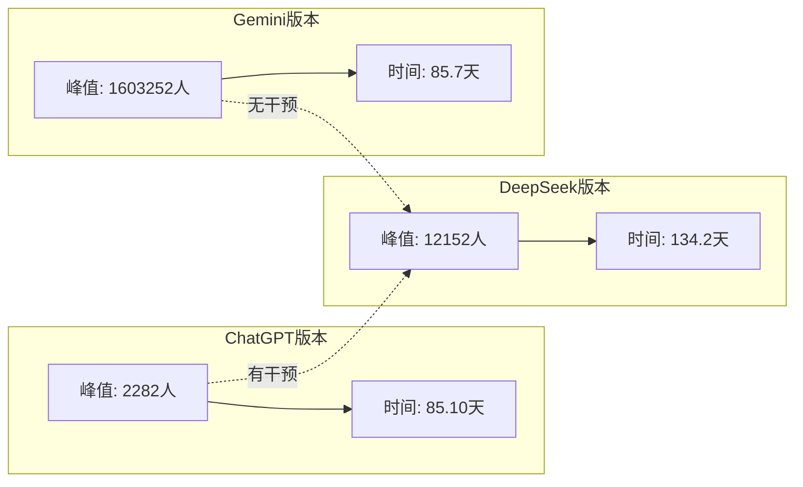

**图表来源**
- [报告.md:134-152](file://chatgpt/报告.md#L134-L152)
- [结果.md:1-4](file://gemini/结果.md#L1-L4)