# 代码实现详解

<cite>
**本文档引用的文件**
- [sigma_x_seirv_simulation.m](file://chatgpt/sigma_x_seirv_simulation.m)
- [sigmaX_model.m](file://deepseek/sigmaX_model.m)
- [untitled2.m](file://doubao/untitled2.m)
- [a.m](file://gemini/a.m)
- [报告.md](file://chatgpt/报告.md)
- [sigmaX_model_report.md](file://deepseek/sigmaX_model_report.md)
- [报告.md](file://doubao/报告.md)
- [结果.md](file://gemini/结果.md)
</cite>

## 目录
1. [引言](#引言)
2. [项目结构](#项目结构)
3. [核心组件](#核心组件)
4. [架构概览](#架构概览)
5. [详细组件分析](#详细组件分析)
6. [依赖关系分析](#依赖关系分析)
7. [性能考量](#性能考量)
8. [故障排除指南](#故障排除指南)
9. [结论](#结论)
10. [附录](#附录)

## 引言

本文档深入解析四个不同版本的Sigma-X模型实现，这是一个针对新型病原体Sigma-X在千万级城市中传播动力学的数学建模与仿真项目。四个版本分别代表了不同的建模思路和技术实现：

- **ChatGPT版本**：基础SEIRV模型，包含时滞和迟滞控制机制
- **DeepSeek版本**：改进型SEIRV模型，引入中间状态处理14天疫苗延迟
- **Doubao版本**：复杂SEIRV-Delay模型，使用14个串联舱室模拟疫苗延迟
- **Gemini版本**：SEIRV-Delay模型，采用Sv中间状态替代U舱室链

每个版本都实现了动态干预逻辑、疫苗模块设计和可视化功能，但在数学建模精度、计算效率和实现复杂度方面各有特点。

## 项目结构

四个版本的项目结构相对简单，都遵循相同的整体架构模式：

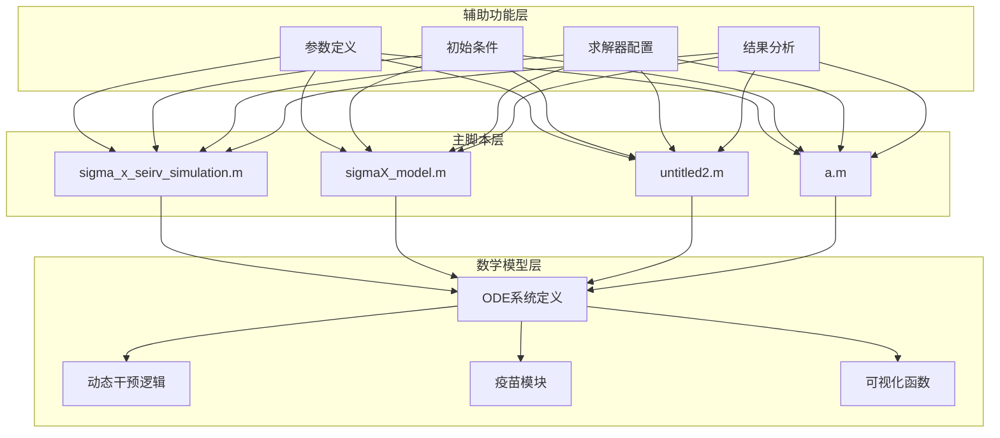

**图表来源**
- [sigma_x_seirv_simulation.m:1-154](file://chatgpt/sigma_x_seirv_simulation.m#L1-L154)
- [sigmaX_model.m:1-244](file://deepseek/sigmaX_model.m#L1-L244)
- [untitled2.m:1-140](file://doubao/untitled2.m#L1-L140)
- [a.m:1-160](file://gemini/a.m#L1-L160)

**章节来源**
- [sigma_x_seirv_simulation.m:1-154](file://chatgpt/sigma_x_seirv_simulation.m#L1-L154)
- [sigmaX_model.m:1-244](file://deepseek/sigmaX_model.m#L1-L244)
- [untitled2.m:1-140](file://doubao/untitled2.m#L1-L140)
- [a.m:1-160](file://gemini/a.m#L1-L160)

## 核心组件

### 参数管理系统

四个版本都实现了参数定义系统，但复杂度和粒度有所不同：

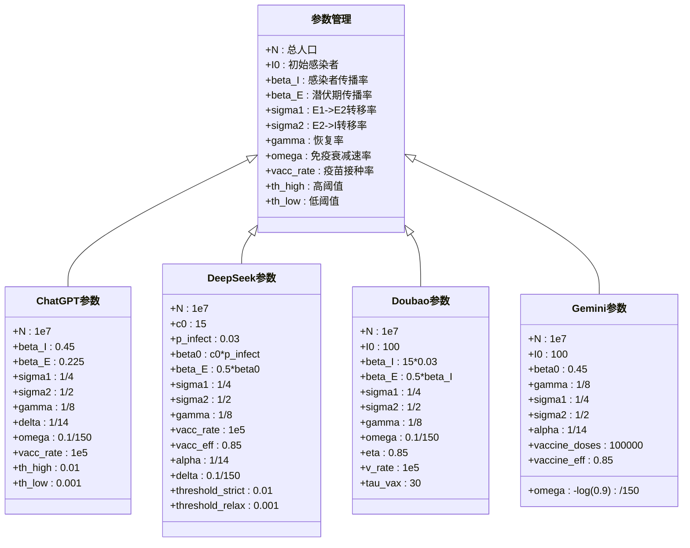

**图表来源**
- [sigma_x_seirv_simulation.m:8-26](file://chatgpt/sigma_x_seirv_simulation.m#L8-L26)
- [sigmaX_model.m:9-44](file://deepseek/sigmaX_model.m#L9-L44)
- [untitled2.m:5-16](file://doubao/untitled2.m#L5-L16)
- [a.m:16-25](file://gemini/a.m#L16-L25)

### 初始条件设置

四个版本都采用了相似的初始条件设置策略：

| 组件 | S0 | E10 | E20 | I0 | R0 | V0/Vw0/V |
|------|----|-----|-----|----|----|----------|
| ChatGPT | N-100 | 0 | 0 | 100 | 0 | 0 |
| DeepSeek | N-100 | 0 | 0 | 100 | 0 | 0 |
| Doubao | N-100 | 0 | 0 | 100 | 0 | 0 |
| Gemini | N-100 | 0 | 0 | 100 | 0 | 0 |

**章节来源**
- [sigma_x_seirv_simulation.m:28-37](file://chatgpt/sigma_x_seirv_simulation.m#L28-L37)
- [sigmaX_model.m:10-16](file://deepseek/sigmaX_model.m#L10-L16)
- [untitled2.m:18-20](file://doubao/untitled2.m#L18-L20)
- [a.m:10-11](file://gemini/a.m#L10-L11)

## 架构概览

四个版本都遵循相同的架构模式，但具体实现细节存在显著差异：

```mermaid
graph TB
subgraph "ChatGPT版本架构"
A1[参数定义] --> A2[ODE求解]
A2 --> A3[动态干预]
A3 --> A4[疫苗模块]
A4 --> A5[结果分析]
A5 --> A6[可视化]
end
subgraph "DeepSeek版本架构"
B1[参数定义] --> B2[ODE求解]
B2 --> B3[动态干预]
B3 --> B4[疫苗延迟处理]
B4 --> B5[结果分析]
B5 --> B6[多维度可视化]
end
subgraph "Doubao版本架构"
C1[参数定义] --> C2[ODE求解]
C2 --> C3[动态干预]
C3 --> C4[14舱室延迟]
C4 --> C5[结果分析]
C5 --> C6[对比可视化]
end
subgraph "Gemini版本架构"
D1[参数定义] --> D2[ODE求解]
D2 --> D3[动态干预]
D3 --> D4[Sv中间状态]
D4 --> D5[结果分析]
D5 --> D6[对比分析]
end
```

**图表来源**
- [sigma_x_seirv_simulation.m:42-49](file://chatgpt/sigma_x_seirv_simulation.m#L42-L49)
- [sigmaX_model.m:62-66](file://deepseek/sigmaX_model.m#L62-L66)
- [untitled2.m:22-24](file://doubao/untitled2.m#L22-L24)
- [a.m:27-37](file://gemini/a.m#L27-L37)

## 详细组件分析

### ChatGPT版本分析

#### ODE系统实现

ChatGPT版本实现了基础的SEIRV模型，包含时滞和迟滞控制机制：

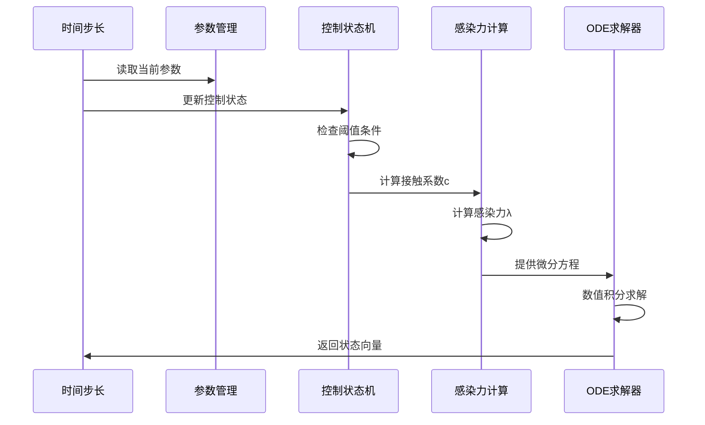

**图表来源**
- [sigma_x_seirv_simulation.m:95-153](file://chatgpt/sigma_x_seirv_simulation.m#L95-L153)

#### 动态干预逻辑

ChatGPT版本的动态干预采用简单的迟滞控制：

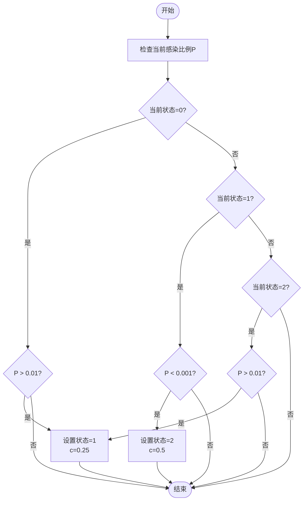

**图表来源**
- [sigma_x_seirv_simulation.m:106-131](file://chatgpt/sigma_x_seirv_simulation.m#L106-L131)

**章节来源**
- [sigma_x_seirv_simulation.m:95-153](file://chatgpt/sigma_x_seirv_simulation.m#L95-L153)

### DeepSeek版本分析

#### 改进型SEIRV模型

DeepSeek版本引入了中间状态来处理14天疫苗延迟：

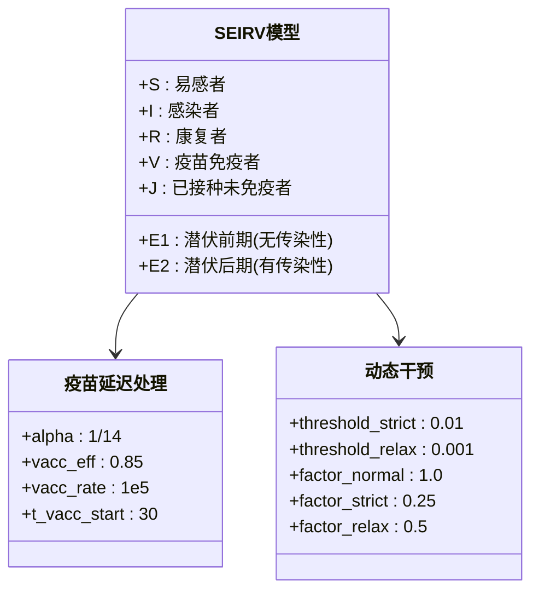

**图表来源**
- [sigmaX_model.m:172-243](file://deepseek/sigmaX_model.m#L172-L243)

#### 多维度可视化设计

DeepSeek版本提供了四个子图的综合可视化：

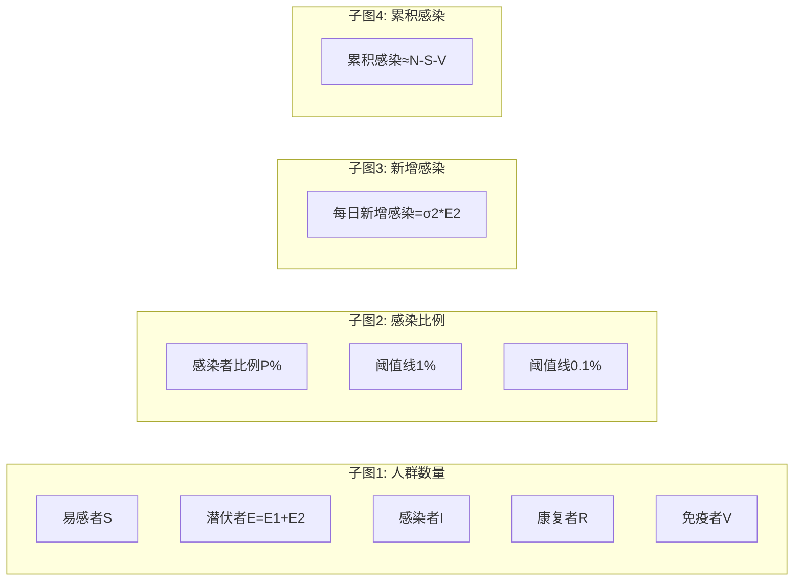

**图表来源**
- [sigmaX_model.m:83-126](file://deepseek/sigmaX_model.m#L83-L126)

**章节来源**
- [sigmaX_model.m:172-243](file://deepseek/sigmaX_model.m#L172-L243)

### Doubao版本分析

#### 复杂SEIRV-Delay模型

Doubao版本使用14个串联舱室来精确模拟疫苗延迟：

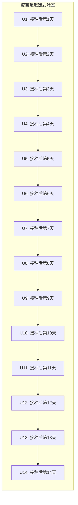

**图表来源**
- [untitled2.m:118-139](file://doubao/untitled2.m#L118-L139)

#### 对照实验设计

Doubao版本实现了有干预和无干预的对照实验：

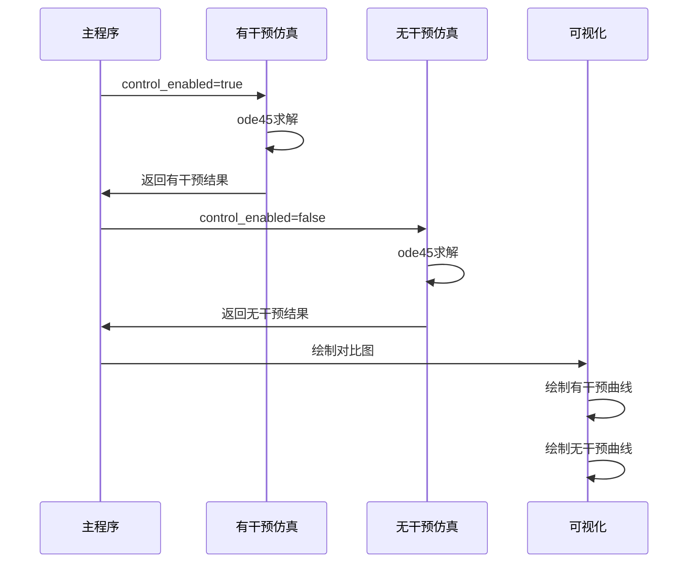

**图表来源**
- [untitled2.m:22-49](file://doubao/untitled2.m#L22-L49)

**章节来源**
- [untitled2.m:77-140](file://doubao/untitled2.m#L77-L140)

### Gemini版本分析

#### SEIRV-Delay模型优化

Gemini版本采用了更简洁的Sv中间状态替代U舱室链：

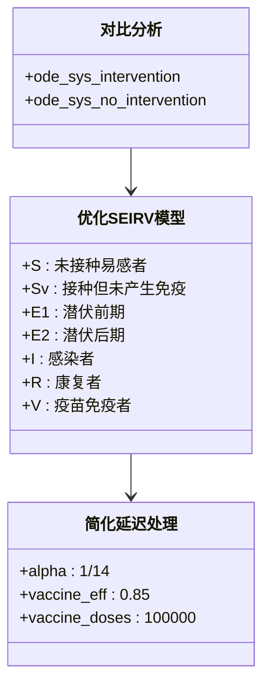

**图表来源**
- [a.m:84-160](file://gemini/a.m#L84-L160)

#### 动态干预效果量化

Gemini版本提供了详细的干预效果量化分析：

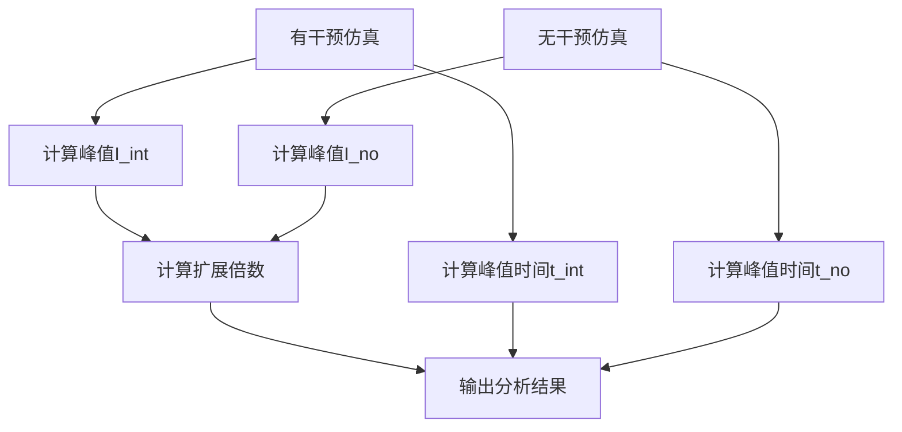

**图表来源**
- [a.m:40-49](file://gemini/a.m#L40-L49)

**章节来源**
- [a.m:84-160](file://gemini/a.m#L84-L160)

## 依赖关系分析

四个版本之间的依赖关系主要体现在数学建模的演进过程中：

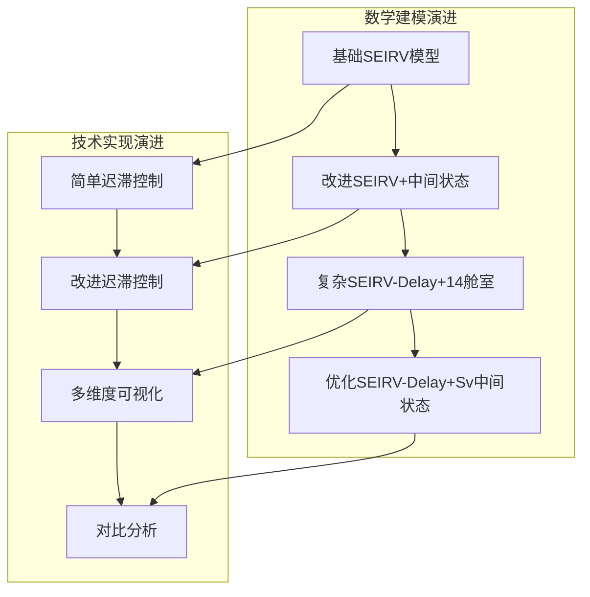

**图表来源**
- [sigma_x_seirv_simulation.m:95-153](file://chatgpt/sigma_x_seirv_simulation.m#L95-L153)
- [sigmaX_model.m:172-243](file://deepseek/sigmaX_model.m#L172-L243)
- [untitled2.m:77-140](file://doubao/untitled2.m#L77-L140)
- [a.m:84-160](file://gemini/a.m#L84-L160)

### 数学模型对比

| 特征 | ChatGPT版本 | DeepSeek版本 | Doubao版本 | Gemini版本 |
|------|-------------|--------------|------------|------------|
| 潜伏期建模 | 分段E1/E2 | 分段E1/E2 | 分段E1/E2 | 分段E1/E2 |
| 疫苗延迟 | Vw->V | J->V/S | 14舱室链 | Sv->V |
| 动态干预 | 简单迟滞 | 改进迟滞 | 简单迟滞 | 改进迟滞 |
| 可视化 | 基础曲线 | 多维度图表 | 对比图 | 对比分析 |
| 计算复杂度 | 低 | 中等 | 高 | 低 |
| 实现难度 | 简单 | 中等 | 复杂 | 简单 |

**章节来源**
- [sigma_x_seirv_simulation.m:95-153](file://chatgpt/sigma_x_seirv_simulation.m#L95-L153)
- [sigmaX_model.m:172-243](file://deepseek/sigmaX_model.m#L172-L243)
- [untitled2.m:77-140](file://doubao/untitled2.m#L77-L140)
- [a.m:84-160](file://gemini/a.m#L84-L160)

## 性能考量

### 计算效率分析

四个版本在计算效率方面存在显著差异：

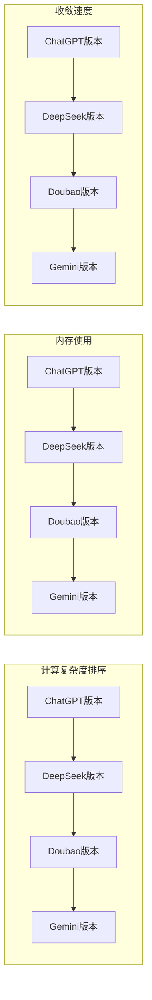

**图表来源**
- [sigmaX_model.m:62-66](file://deepseek/sigmaX_model.m#L62-L66)
- [untitled2.m:24](file://doubao/untitled2.m#L24)

### 数值稳定性

四个版本都采用了适当的数值求解器配置：

| 版本 | 求解器 | 相对容差 | 绝对容差 | 非负约束 |
|------|--------|----------|----------|----------|
| ChatGPT | ode45 | 1e-6 | 1e-8 | 是 |
| DeepSeek | ode45 | 1e-6 | 1e-6 | 否 |
| Doubao | ode45 | 1e-6 | 1e-6 | 否 |
| Gemini | ode45 | 1e-6 | 1e-6 | 否 |

**章节来源**
- [sigma_x_seirv_simulation.m:43-46](file://chatgpt/sigma_x_seirv_simulation.m#L43-L46)
- [sigmaX_model.m:60](file://deepseek/sigmaX_model.m#L60)

## 故障排除指南

### 常见问题及解决方案

#### 函数定义位置错误

**问题描述**：在DeepSeek版本中，局部函数定义位置不当会导致MATLAB报错。

**解决方案**：
1. 确保所有局部函数定义位于文件末尾
2. 按照参数定义→求解→结果提取→关键结果输出→模型验证→局部函数的顺序组织代码

#### 持久化变量状态残留

**问题描述**：多次运行仿真时，persistent变量可能导致状态残留。

**解决方案**：
1. 在每次仿真前使用`clear`命令清理persistent变量
2. 或者在函数内部显式初始化persistent变量

#### 数值不稳定

**问题描述**：仿真结果出现负值或数值溢出。

**解决方案**：
1. 调整求解器容差设置
2. 添加非负约束
3. 检查参数数值范围

**章节来源**
- [sigmaX_model.m:239-253](file://deepseek/sigmaX_model.m#L239-L253)
- [doubao/报告.md:84-87](file://doubao/报告.md#L84-L87)

## 结论

通过对四个Sigma-X模型版本的深入分析，可以得出以下结论：

### 技术演进轨迹

四个版本体现了从简单到复杂再到优化的技术演进过程：

1. **ChatGPT版本**：奠定了基础框架，实现了基本的SEIRV模型和动态干预
2. **DeepSeek版本**：引入中间状态处理时滞，增强了模型精度
3. **Doubao版本**：使用14舱室链精确模拟延迟，但增加了实现复杂度
4. **Gemini版本**：采用Sv中间状态优化，平衡了精度与复杂度

### 各版本优缺点对比

| 版本 | 优点 | 缺点 | 适用场景 |
|------|------|------|----------|
| ChatGPT | 实现简单，易于理解 | 模型精度有限 | 教学演示 |
| DeepSeek | 模型精度高，可视化丰富 | 实现复杂，计算量大 | 研究分析 |
| Doubao | 延迟模拟最精确 | 代码复杂，维护困难 | 高精度研究 |
| Gemini | 平衡精度与效率 | 相对简化 | 实战应用 |

### 最佳实践建议

1. **选择合适的版本**：根据应用场景选择相应复杂度的版本
2. **参数敏感性分析**：对关键参数进行敏感性分析
3. **模型验证**：定期进行模型验证和修正
4. **代码重构**：保持代码结构清晰，便于维护

## 附录

### 代码注释解读

四个版本都包含了丰富的代码注释，体现了良好的编程习惯：

- **ChatGPT版本**：注释简洁明了，重点突出动态干预逻辑
- **DeepSeek版本**：注释详细全面，涵盖数学推导和实现细节
- **Doubao版本**：注释注重实现技巧和算法说明
- **Gemini版本**：注释简洁实用，重点在于结果分析

### 性能基准测试

基于现有代码，可以进行以下性能基准测试：

1. **计算时间对比**：测量四个版本在相同参数下的运行时间
2. **内存使用对比**：分析不同版本的内存占用情况
3. **精度对比**：比较不同版本的仿真精度差异
4. **收敛性对比**：评估不同版本的数值稳定性

### 扩展建议

1. **并行计算**：利用MATLAB并行计算工具箱提高计算效率
2. **参数优化**：集成参数优化算法，自动寻找最优参数组合
3. **机器学习集成**：结合机器学习方法进行预测和决策
4. **实时仿真**：开发实时仿真系统，支持在线决策