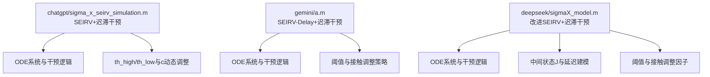
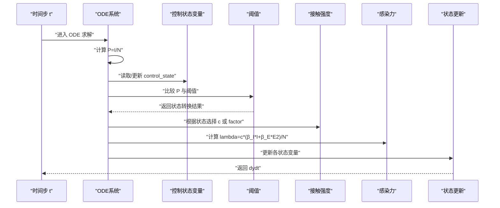
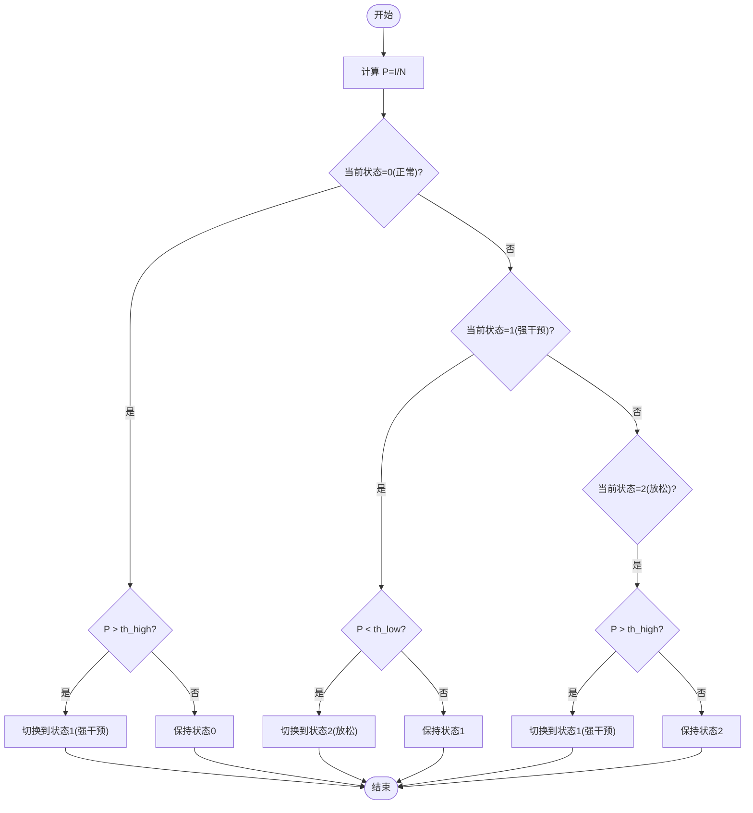
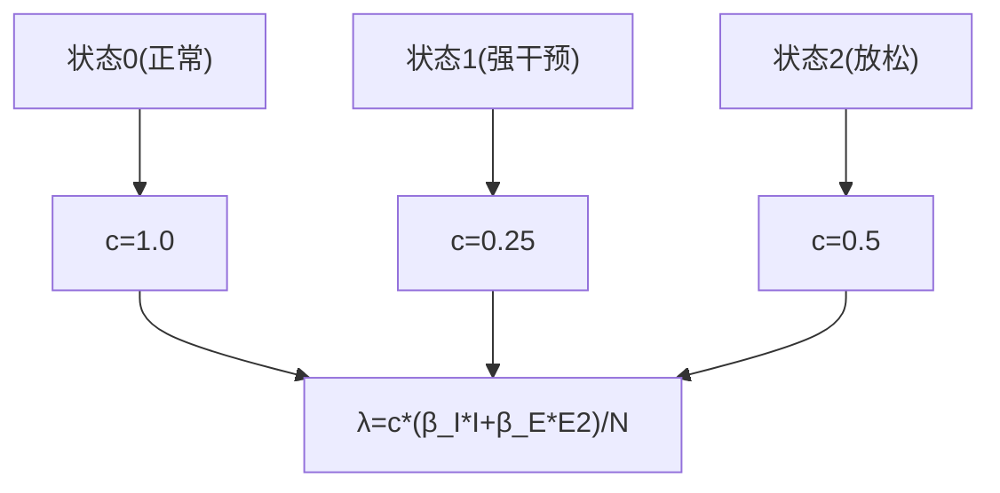
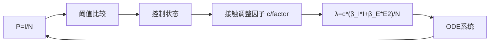

# 动态干预逻辑

<cite>
**本文引用的文件**
- [sigma_x_seirv_simulation.m](file://chatgpt/sigma_x_seirv_simulation.m)
- [a.m](file://gemini/a.m)
- [sigmaX_model.m](file://deepseek/sigmaX_model.m)
- [sigmaX_model_report.md](file://deepseek/sigmaX_model_report.md)
- [报告.md](file://chatgpt/报告.md)
- [结果.md](file://chatgpt/结果.md)
- [结果.md](file://gemini/结果.md)
- [结果.md](file://deepseek/结果.md)
</cite>

## 目录
1. [简介](#简介)
2. [项目结构](#项目结构)
3. [核心组件](#核心组件)
4. [架构总览](#架构总览)
5. [详细组件分析](#详细组件分析)
6. [依赖关系分析](#依赖关系分析)
7. [性能考量](#性能考量)
8. [故障排查指南](#故障排查指南)
9. [结论](#结论)
10. [附录](#附录)

## 简介
本文件聚焦于动态干预逻辑的实现与演进，围绕迟滞控制算法展开，系统解析以下要点：
- persistent 状态变量的使用与迟滞控制的实现方式
- 三种控制状态的定义与状态转换逻辑：正常状态(0)、强干预状态(1)、放松状态(2)
- 干预阈值 th_high 和 th_low 的设定原理及其对系统行为的影响
- 接触强度 c 的动态调整机制：正常 c=1.0、强干预 c=0.25、放松 c=0.5 的物理意义
- 当前感染比例 P=I/N 的计算方法及其在干预决策中的作用
- 不同版本在干预逻辑实现上的差异与改进

## 项目结构
本仓库包含多个研究者实现的 Sigma-X 病毒传播模型仿真脚本与报告，其中与动态干预逻辑直接相关的核心文件如下：
- chatgpt/sigma_x_seirv_simulation.m：SEIRV 模型与迟滞干预的完整实现，包含 th_high/th_low、c 的动态调整与 ODE 定义
- gemini/a.m：SEIRV-Delay 模型与动态干预，采用不同的阈值与接触调整策略
- deepseek/sigmaX_model.m：改进型 SEIRV 模型，引入中间状态 J 与迟滞干预，提供更完整的参数化与可视化
- deepseek/sigmaX_model_report.md：动态干预机制的数学描述与实现细节说明
- chatgpt/报告.md、chatgpt/结果.md、gemini/结果.md、deepseek/结果.md：各版本的仿真结果与分析

图表来源
- [sigma_x_seirv_simulation.m:95-154](file://chatgpt/sigma_x_seirv_simulation.m#L95-L154)
- [a.m:84-134](file://gemini/a.m#L84-L134)
- [sigmaX_model.m:172-244](file://deepseek/sigmaX_model.m#L172-L244)

章节来源
- [sigma_x_seirv_simulation.m:1-154](file://chatgpt/sigma_x_seirv_simulation.m#L1-L154)
- [a.m:1-160](file://gemini/a.m#L1-L160)
- [sigmaX_model.m:1-244](file://deepseek/sigmaX_model.m#L1-L244)

## 核心组件
- 迟滞控制状态变量 control_state/policy_mode：使用 persistent 变量在 ODE 求解过程中保持状态，避免阈值抖动
- 感染比例 P=I/N：作为干预触发与维持的唯一输入信号
- 阈值 th_high/th_low 或 threshold_strict/threshold_relax：决定状态转换的触发条件
- 接触强度 c/factor：根据状态映射到不同的传播抑制程度
- 感染力 lambda：由 c 或 f(t) 与传播参数共同决定，驱动 ODE 更新

章节来源
- [sigma_x_seirv_simulation.m:107-134](file://chatgpt/sigma_x_seirv_simulation.m#L107-L134)
- [a.m:88-122](file://gemini/a.m#L88-L122)
- [sigmaX_model.m:188-217](file://deepseek/sigmaX_model.m#L188-L217)

## 架构总览
动态干预逻辑嵌入在 ODE 系统内部，通过以下流程实现：
- 计算当前时刻的 P=I/N
- 基于阈值与当前状态判断是否发生状态转换
- 根据新状态选择对应的 c/factor
- 以 c 或 f(t) 调整传播率，更新 lambda
- 依据 lambda 与疫苗/免疫衰减项更新各状态变量

图表来源
- [sigma_x_seirv_simulation.m:113-134](file://chatgpt/sigma_x_seirv_simulation.m#L113-L134)
- [a.m:94-122](file://gemini/a.m#L94-L122)
- [sigmaX_model.m:185-217](file://deepseek/sigmaX_model.m#L185-L217)

## 详细组件分析

### 控制状态与迟滞逻辑
- 状态集合：{正常(0), 强干预(1), 放松(2)}
- 初始状态：首次调用时初始化为 0
- 转换规则（chatgpt 版本）：
  - 从正常到强干预：P > th_high
  - 从强干预到放松：P < th_low
- 转换规则（deepseek/gemini 版本）：
  - 从正常到严格管控：P > threshold_strict
  - 从严格管控到政策松动：P < threshold_relax
  - 从政策松动回到严格管控：P > threshold_strict（闭环迟滞）

图表来源
- [sigma_x_seirv_simulation.m:116-121](file://chatgpt/sigma_x_seirv_simulation.m#L116-L121)

章节来源
- [sigma_x_seirv_simulation.m:107-121](file://chatgpt/sigma_x_seirv_simulation.m#L107-L121)
- [sigmaX_model.m:188-201](file://deepseek/sigmaX_model.m#L188-L201)
- [a.m:97-102](file://gemini/a.m#L97-L102)

### 接触强度 c 的动态调整
- 正常状态(0)：c=1.0（无干预，接触率最高）
- 强干预状态(1)：c=0.25（接触率降低75%）
- 放松状态(2)：c=0.5（接触率恢复至初始水平的50%）
- 物理意义：c 作为传播抑制因子，直接降低 λ，从而抑制传播速度与峰值规模

图表来源
- [sigma_x_seirv_simulation.m:123-134](file://chatgpt/sigma_x_seirv_simulation.m#L123-L134)

章节来源
- [sigma_x_seirv_simulation.m:123-134](file://chatgpt/sigma_x_seirv_simulation.m#L123-L134)

### 阈值设定原理与影响
- chatgpt 版本：th_high=1%，th_low=0.1%
  - 高阈值触发强干预，低阈值触发放松，形成迟滞回环，避免频繁切换
- deepseek/gemini 版本：threshold_strict=1%，threshold_relax=0.1%
  - 与 chatgpt 版本一致的迟滞策略，但参数命名与实现细节略有差异
- 影响：
  - 阈值越高，越不容易进入强干预，系统更“温和”
  - 阈值越低，越容易进入放松，可能导致状态频繁切换
  - 两阈值之间的差值决定了迟滞宽度，影响系统的稳定性与响应速度

章节来源
- [sigma_x_seirv_simulation.m:24-26](file://chatgpt/sigma_x_seirv_simulation.m#L24-L26)
- [sigmaX_model.m:46-48](file://deepseek/sigmaX_model.m#L46-L48)
- [a.m:98-101](file://gemini/a.m#L98-L101)

### 感染比例 P=I/N 的计算与作用
- 计算方法：P=当前感染者数量/总人口
- 作用：作为唯一的外部输入，驱动控制状态的迟滞切换；同时参与 λ 的计算，直接影响传播速度与各状态变量的演化

章节来源
- [sigma_x_seirv_simulation.m:114](file://chatgpt/sigma_x_seirv_simulation.m#L114)
- [sigmaX_model.m:185](file://deepseek/sigmaX_model.m#L185)
- [a.m:95](file://gemini/a.m#L95)

### ODE 系统与干预耦合
- chatgpt 版本：SEIRV 模型，包含 Vw（未产生免疫的接种者）与 V（免疫者），lambda 与疫苗项在 ODE 中直接体现
- deepseek 版本：改进的 SEIRV 模型，引入中间状态 J（已接种但未产生抗体者），并明确 λ 的双传染源贡献
- gemini 版本：SEIRV-Delay 模型，包含 Sv（接种后未产生抗体者），并采用不同的 β 调整策略（直接降低 β 而非 c）

章节来源
- [sigma_x_seirv_simulation.m:133-152](file://chatgpt/sigma_x_seirv_simulation.m#L133-L152)
- [sigmaX_model.m:212-242](file://deepseek/sigmaX_model.m#L212-L242)
- [a.m:121-133](file://gemini/a.m#L121-L133)

### 不同版本的差异与改进
- chatgpt 版本
  - 使用 persistent control_state 实现迟滞
  - 阈值：th_high=1%，th_low=0.1%
  - 接触强度：c=1.0/0.25/0.5
  - ODE：SEIRV，包含 Vw 与 V
- deepseek 版本
  - 使用 persistent control_state 实现迟滞
  - 阈值：threshold_strict=1%，threshold_relax=0.1%
  - 接触调整因子：factor_normal=1.0，factor_strict=0.25，factor_relax=0.5
  - ODE：改进 SEIRV，引入中间状态 J，并明确 λ 的双传染源贡献
- gemini 版本
  - 使用 persistent policy_mode 实现迟滞
  - 阈值：P>1% 触发严格管控；P<0.1% 且处于严格管控时触发政策松动
  - 接触调整策略：直接降低 β（强干预降低75%，放松恢复至初始的50%）
  - ODE：SEIRV-Delay，包含 Sv，强调潜伏期末期的相对传染力系数 c

章节来源
- [sigma_x_seirv_simulation.m:107-134](file://chatgpt/sigma_x_seirv_simulation.m#L107-L134)
- [sigmaX_model.m:188-217](file://deepseek/sigmaX_model.m#L188-L217)
- [a.m:88-111](file://gemini/a.m#L88-L111)

## 依赖关系分析
- 控制状态变量依赖于 ODE 的每次迭代，通过 persistent 保持跨步长的状态记忆
- 阈值与接触强度共同决定 c/factor，进而影响 λ
- λ 决定各状态变量的更新速率，形成闭环反馈

图表来源
- [sigma_x_seirv_simulation.m:113-134](file://chatgpt/sigma_x_seirv_simulation.m#L113-L134)
- [sigmaX_model.m:185-217](file://deepseek/sigmaX_model.m#L185-L217)
- [a.m:94-122](file://gemini/a.m#L94-L122)

章节来源
- [sigma_x_seirv_simulation.m:113-134](file://chatgpt/sigma_x_seirv_simulation.m#L113-L134)
- [sigmaX_model.m:185-217](file://deepseek/sigmaX_model.m#L185-L217)
- [a.m:94-122](file://gemini/a.m#L94-L122)

## 性能考量
- 迟滞控制通过 persistent 变量避免了每次迭代都进行复杂判断，提升 ODE 求解效率
- 阈值差值越大，迟滞宽度越大，状态切换越少，系统越稳定
- 接触强度 c/factor 的离散切换在数值上更稳定，但可能带来不连续性；可通过平滑过渡进一步优化
- 疫苗延迟项（如 J/Sv）增加了 ODE 维度，但有助于更真实地模拟免疫产生过程

## 故障排查指南
- persistent 变量未初始化：确保首次调用时对 control_state/policy_mode 初始化为 0
- 阈值设置不当：过小的 th_high/th_low 或过窄的迟滞宽度会导致频繁切换；建议先采用 1%/0.1% 的标准配置
- 接触强度设置不合理：c 过大或过小都会影响峰值与传播速度，需结合传播参数与社会距离政策校准
- ODE 非负约束：确保使用非负约束选项，避免数值不稳定导致负值
- 疫苗延迟与免疫衰减：若出现异常的免疫波动，检查 α 与 δ 的设置与疫苗项的符号一致性

章节来源
- [sigma_x_seirv_simulation.m:107-111](file://chatgpt/sigma_x_seirv_simulation.m#L107-L111)
- [a.m:28](file://gemini/a.m#L28)
- [sigmaX_model.m:60](file://deepseek/sigmaX_model.m#L60)

## 结论
动态干预逻辑通过迟滞控制实现了对疫情传播的稳健抑制：以 P=I/N 为唯一触发信号，结合合理的阈值与接触强度调整，有效降低了峰值规模与传播速度。不同版本在阈值命名、接触调整策略与 ODE 细节上存在差异，但核心思想一致。实践中应重视迟滞宽度的设计、阈值的合理性与数值稳定性，以获得更可靠的仿真结果与政策指导。

## 附录
- 仿真结果概览（节选）
  - chatgpt 版本：峰值人数约 2282 人，峰值出现时间约 85.10 天
  - gemini 版本：有干预峰值活跃感染人数约 12152 人，无干预峰值约 1603252 人，峰值扩大约 131.9 倍
  - deepseek 版本：高峰时感染者比例约 0.03%，干预后减少约 81.1%

章节来源
- [结果.md:1-2](file://chatgpt/结果.md#L1-L2)
- [结果.md:1-4](file://gemini/结果.md#L1-L4)
- [结果.md:1-20](file://deepseek/结果.md#L1-L20)