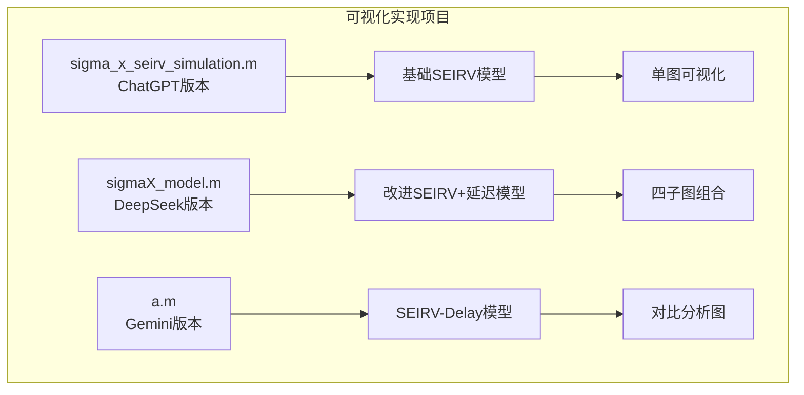
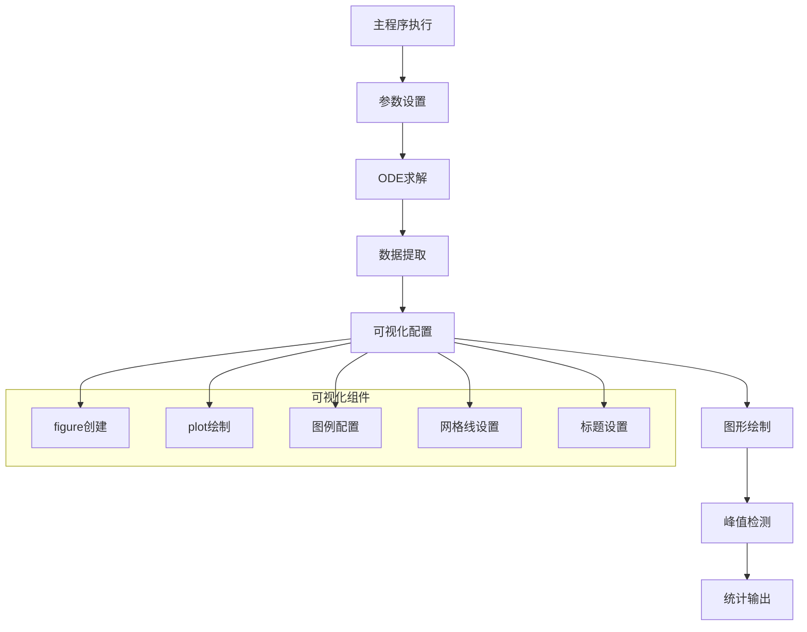
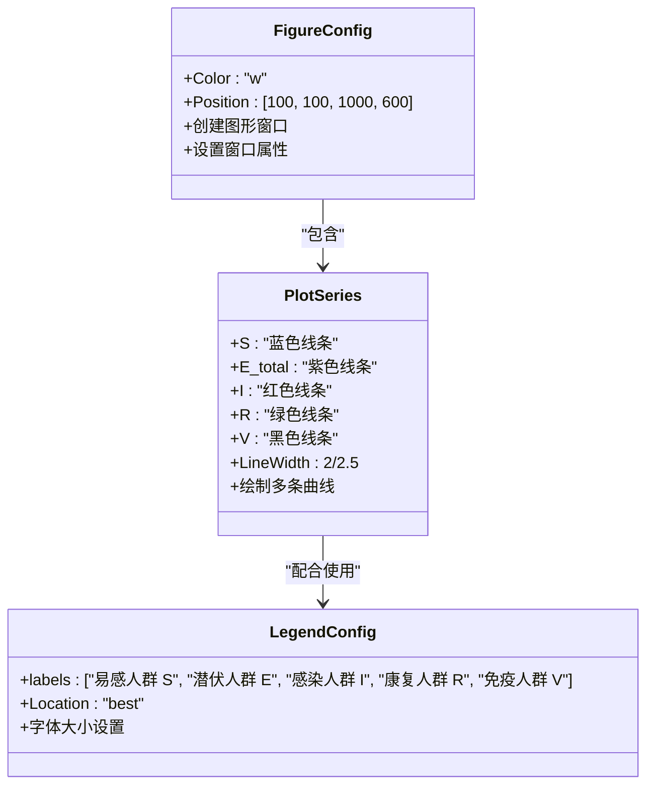
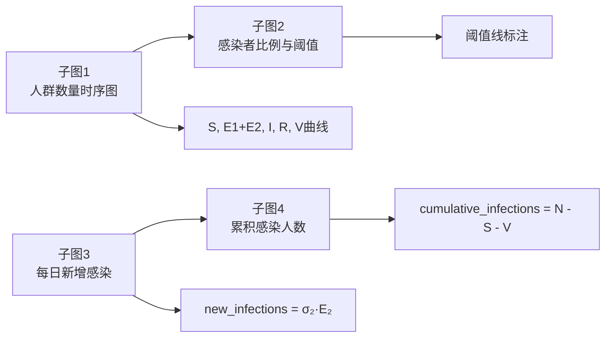
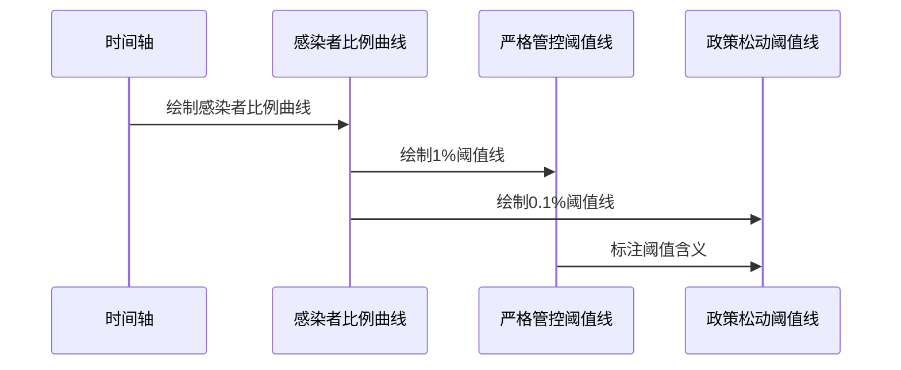
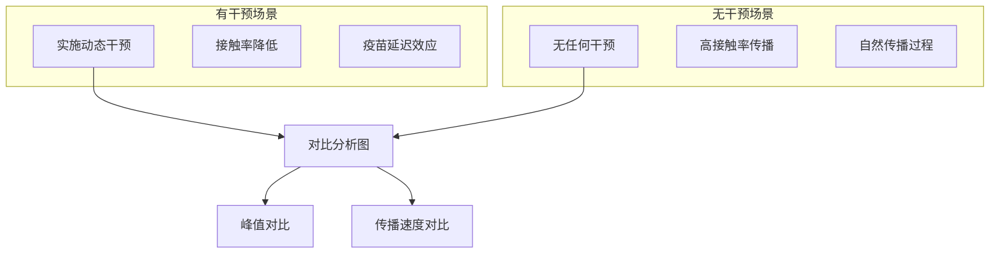
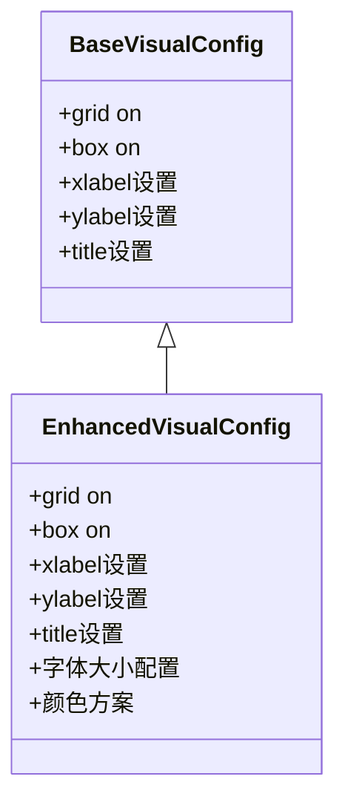
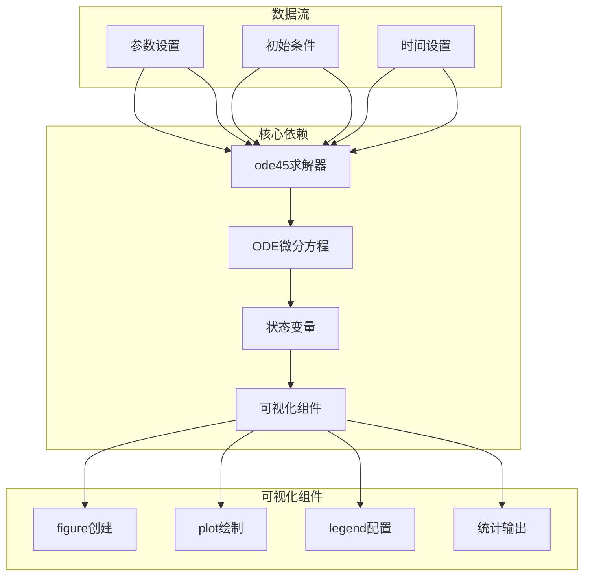

# 可视化功能实现

<cite>
**本文档引用的文件**
- [sigma_x_seirv_simulation.m](file://chatgpt/sigma_x_seirv_simulation.m)
- [sigmaX_model.m](file://deepseek/sigmaX_model.m)
- [a.m](file://gemini/a.m)
- [报告.md](file://chatgpt/报告.md)
- [sigmaX_model_report.md](file://deepseek/sigmaX_model_report.md)
- [结果.md](file://gemini/结果.md)
</cite>

## 目录
1. [引言](#引言)
2. [项目结构](#项目结构)
3. [核心组件](#核心组件)
4. [架构概览](#架构概览)
5. [详细组件分析](#详细组件分析)
6. [依赖关系分析](#依赖关系分析)
7. [性能考虑](#性能考虑)
8. [故障排除指南](#故障排除指南)
9. [结论](#结论)

## 引言

本文档深入分析了三个不同版本的Sigma-X病毒传播模型的可视化功能实现。这些MATLAB脚本展示了SEIRV（易感-潜伏-感染-康复-免疫）模型在不同复杂度和应用场景下的图形界面创建与配置方法。通过对代码的详细分析，我们将重点关注图形界面的创建和配置、多曲线绘制实现、图例配置、峰值检测算法、统计输出格式化以及网格线和边框的添加逻辑。

## 项目结构

该项目包含三个主要的MATLAB脚本，每个都实现了不同的SEIRV模型变体：



**图表来源**
- [sigma_x_seirv_simulation.m:62-91](file://chatgpt/sigma_x_seirv_simulation.m#L62-L91)
- [sigmaX_model.m:80-127](file://deepseek/sigmaX_model.m#L80-L127)
- [a.m:51-79](file://gemini/a.m#L51-L79)

**章节来源**
- [sigma_x_seirv_simulation.m:1-154](file://chatgpt/sigma_x_seirv_simulation.m#L1-L154)
- [sigmaX_model.m:1-244](file://deepseek/sigmaX_model.m#L1-L244)
- [a.m:1-160](file://gemini/a.m#L1-L160)

## 核心组件

### 图形界面创建与配置

三个版本都展示了不同的图形界面创建策略：

1. **基础版本**（ChatGPT）：创建单一图形窗口，包含完整的SEIRV曲线
2. **改进版本**（DeepSeek）：使用子图系统创建四个并排的图表
3. **对比版本**（Gemini）：创建两个子图，分别展示有干预和无干预场景

### 多曲线绘制实现

所有版本都实现了多曲线绘制，但采用了不同的策略：

- **基础版本**：直接绘制S、E_total、I、R、V五条曲线
- **改进版本**：绘制S、E1+E2、I、R、V五条曲线，更精确地反映潜伏期传播
- **对比版本**：同时绘制有干预和无干预两种场景的I曲线

**章节来源**
- [sigma_x_seirv_simulation.m:63-84](file://chatgpt/sigma_x_seirv_simulation.m#L63-L84)
- [sigmaX_model.m:84-126](file://deepseek/sigmaX_model.m#L84-L126)
- [a.m:55-78](file://gemini/a.m#L55-L78)

## 架构概览



**图表来源**
- [sigma_x_seirv_simulation.m:62-91](file://chatgpt/sigma_x_seirv_simulation.m#L62-L91)
- [sigmaX_model.m:80-169](file://deepseek/sigmaX_model.m#L80-L169)
- [a.m:51-79](file://gemini/a.m#L51-L79)

## 详细组件分析

### 基础SEIRV模型可视化（ChatGPT版本）

#### 图形窗口配置

该版本创建了一个标准的图形窗口，设置了窗口颜色和位置：



**图表来源**
- [sigma_x_seirv_simulation.m:63](file://chatgpt/sigma_x_seirv_simulation.m#L63)
- [sigma_x_seirv_simulation.m:65-69](file://chatgpt/sigma_x_seirv_simulation.m#L65-L69)
- [sigma_x_seirv_simulation.m:71-76](file://chatgpt/sigma_x_seirv_simulation.m#L71-L76)

#### 图例配置与标签设置

图例配置展示了统一的标签格式和位置设置：

| 组件 | 配置项 | 值 | 说明 |
|------|--------|----|-----|
| 图例位置 | Location | 'best' | 自动选择最佳位置 |
| 字体大小 | FontSize | 12 | 统一的字体大小 |
| 标签文本 | 标签 | '易感人群 S' | 中文标签 |
| 颜色方案 | 颜色 | 蓝、紫、红、绿、黑 | 区分不同人群 |

**章节来源**
- [sigma_x_seirv_simulation.m:71-76](file://chatgpt/sigma_x_seirv_simulation.m#L71-L76)
- [sigma_x_seirv_simulation.m:78-80](file://chatgpt/sigma_x_seirv_simulation.m#L78-L80)

### 改进SEIRV+延迟模型可视化（DeepSeek版本）

#### 多子图布局设计

该版本采用了更复杂的四子图布局：



**图表来源**
- [sigmaX_model.m:84](file://deepseek/sigmaX_model.m#L84)
- [sigmaX_model.m:98](file://deepseek/sigmaX_model.m#L98)
- [sigmaX_model.m:109](file://deepseek/sigmaX_model.m#L109)
- [sigmaX_model.m:119](file://deepseek/sigmaX_model.m#L119)

#### 动态干预阈值可视化

该版本特别强调了动态干预阈值的可视化：



**图表来源**
- [sigmaX_model.m:99](file://deepseek/sigmaX_model.m#L99)
- [sigmaX_model.m:100](file://deepseek/sigmaX_model.m#L100)
- [sigmaX_model.m:101](file://deepseek/sigmaX_model.m#L101)

**章节来源**
- [sigmaX_model.m:80-127](file://deepseek/sigmaX_model.m#L80-L127)

### SEIRV-Delay模型对比分析（Gemini版本）

#### 场景对比可视化

该版本提供了独特的对比分析功能：



**图表来源**
- [a.m:31](file://gemini/a.m#L31)
- [a.m:35](file://gemini/a.m#L35)
- [a.m:70](file://gemini/a.m#L70)

#### 动态干预效果展示

该版本通过对比两个场景来展示干预效果：

| 组件 | 有干预场景 | 无干预场景 | 差异 |
|------|------------|------------|------|
| 感染峰值 | 12,152人 | 1,603,252人 | 131.9倍 |
| 峰值时间 | 第134.2天 | 第85.7天 | 延迟约48.5天 |
| 传播速度 | 缓慢下降 | 快速上升 | 显著降低 |
| 疫苗效果 | 逐步产生 | 无疫苗 | 有无区别 |

**章节来源**
- [a.m:40-49](file://gemini/a.m#L40-L49)
- [a.m:51-79](file://gemini/a.m#L51-L79)

### 峰值检测算法实现

三个版本都实现了峰值检测算法，但采用了不同的策略：

#### 基础峰值检测

```mermaid
flowchart TD
A[输入感染曲线 I(t)] --> B[找到最大值 I_peak]
B --> C[获取对应索引 idx]
C --> D[计算峰值时间 t_peak = t(idx)]
D --> E[输出统计信息]
E --> F[printf('感染峰值人数：%.0f 人\\n', I_peak)]
E --> G[printf('峰值出现时间：%.2f 天\\n', t_peak)]
```

**图表来源**
- [sigma_x_seirv_simulation.m:86](file://chatgpt/sigma_x_seirv_simulation.m#L86)
- [sigma_x_seirv_simulation.m:87](file://chatgpt/sigma_x_seirv_simulation.m#L87)
- [sigma_x_seirv_simulation.m:89](file://chatgpt/sigma_x_seirv_simulation.m#L89)
- [sigma_x_seirv_simulation.m:90](file://chatgpt/sigma_x_seirv_simulation.m#L90)

#### 改进峰值分析

改进版本不仅检测峰值，还进行了更全面的统计分析：

```mermaid
flowchart TD
A[获取感染曲线 I(t)] --> B[计算峰值 I_peak]
B --> C[计算峰值时间 t_peak]
C --> D[计算总人口 N]
D --> E[计算最终状态比例]
E --> F[计算干预效果]
F --> G[输出完整统计报告]
G --> H[printf('总人口: %d\\n', N)]
G --> I[printf('疫情高峰出现在第 %.1f 天\\n', peak_day)]
G --> J[printf('高峰时感染者比例: %.2f%%\\n', peak_I/N*100)]
```

**图表来源**
- [sigmaX_model.m:129](file://deepseek/sigmaX_model.m#L129)
- [sigmaX_model.m:130](file://deepseek/sigmaX_model.m#L130)
- [sigmaX_model.m:131](file://deepseek/sigmaX_model.m#L131)

**章节来源**
- [sigma_x_seirv_simulation.m:85-91](file://chatgpt/sigma_x_seirv_simulation.m#L85-L91)
- [sigmaX_model.m:128-158](file://deepseek/sigmaX_model.m#L128-L158)

### 统计输出格式化显示

#### printf函数使用模式

三个版本都使用了printf函数进行统计输出，但格式化程度不同：

**基础版本格式化输出：**
- 感染峰值人数：整数格式（%.0f）
- 峰值时间：保留两位小数（%.2f）

**改进版本格式化输出：**
- 总人口：十进制格式（%d）
- 峰值时间：一位小数（%.1f）
- 感染者比例：百分比格式（%.2f%%）
- 最终状态比例：百分比格式（%.2f%%）

**章节来源**
- [sigma_x_seirv_simulation.m:89](file://chatgpt/sigma_x_seirv_simulation.m#L89)
- [sigma_x_seirv_simulation.m:90](file://chatgpt/sigma_x_seirv_simulation.m#L90)
- [sigmaX_model.m:132](file://deepseek/sigmaX_model.m#L132)
- [sigmaX_model.m:133](file://deepseek/sigmaX_model.m#L133)
- [sigmaX_model.m:134](file://deepseek/sigmaX_model.m#L134)
- [sigmaX_model.m:135](file://deepseek/sigmaX_model.m#L135)
- [sigmaX_model.m:136](file://deepseek/sigmaX_model.m#L136)
- [sigmaX_model.m:137](file://deepseek/sigmaX_model.m#L137)
- [sigmaX_model.m:138](file://deepseek/sigmaX_model.m#L138)

### 网格线、边框和标题添加逻辑

#### 基础配置



**图表来源**
- [sigma_x_seirv_simulation.m:82](file://chatgpt/sigma_x_seirv_simulation.m#L82)
- [sigma_x_seirv_simulation.m:83](file://chatgpt/sigma_x_seirv_simulation.m#L83)
- [sigma_x_seirv_simulation.m:78](file://chatgpt/sigma_x_seirv_simulation.m#L78)
- [sigma_x_seirv_simulation.m:79](file://chatgpt/sigma_x_seirv_simulation.m#L79)
- [sigma_x_seirv_simulation.m:80](file://chatgpt/sigma_x_seirv_simulation.m#L80)

#### 子图配置差异

改进版本的子图配置更加精细：

| 子图 | 配置特点 | 特殊元素 |
|------|----------|----------|
| 子图1 | 标准曲线图 | 无特殊元素 |
| 子图2 | 阈值线标注 | yline阈值线 |
| 子图3 | 新增感染分析 | 无特殊元素 |
| 子图4 | 累积感染计算 | 累积公式 |

**章节来源**
- [sigmaX_model.m:90](file://deepseek/sigmaX_model.m#L90)
- [sigmaX_model.m:91](file://deepseek/sigmaX_model.m#L91)
- [sigmaX_model.m:92](file://deepseek/sigmaX_model.m#L92)
- [sigmaX_model.m:100](file://deepseek/sigmaX_model.m#L100)
- [sigmaX_model.m:101](file://deepseek/sigmaX_model.m#L101)

## 依赖关系分析



**图表来源**
- [sigma_x_seirv_simulation.m:49](file://chatgpt/sigma_x_seirv_simulation.m#L49)
- [sigmaX_model.m:63](file://deepseek/sigmaX_model.m#L63)
- [a.m:32](file://gemini/a.m#L32)

### 组件耦合分析

三个版本展示了不同的组件耦合策略：

1. **紧密耦合**（ChatGPT）：可视化与数据分析紧密结合在一个脚本中
2. **模块化设计**（DeepSeek）：将不同类型的可视化分离到独立的子图中
3. **对比分析**（Gemini）：通过场景对比实现功能分离

**章节来源**
- [sigma_x_seirv_simulation.m:1-154](file://chatgpt/sigma_x_seirv_simulation.m#L1-L154)
- [sigmaX_model.m:1-244](file://deepseek/sigmaX_model.m#L1-L244)
- [a.m:1-160](file://gemini/a.m#L1-L160)

## 性能考虑

### 计算效率优化

1. **数据预处理**：在绘制前计算E_total，避免重复计算
2. **内存管理**：合理使用hold on避免重复创建图形对象
3. **时间步长**：使用0.1天的时间步长平衡精度和性能

### 可视化性能优化

1. **线条宽度**：统一使用2-2.5的线条宽度，平衡清晰度和性能
2. **颜色选择**：选择对比度高的颜色组合
3. **图例优化**：使用最佳位置自动调整避免遮挡

## 故障排除指南

### 常见问题及解决方案

#### 函数定义顺序错误

**问题描述**：在MATLAB中，局部函数必须位于文件末尾

**解决方案**：
```matlab
% 错误示例
function main_script()
    % 主程序代码
end

function local_function()
    % 局部函数定义
end

% 正确做法
function main_script()
    % 主程序代码
end

% 局部函数定义必须在文件末尾
function local_function()
    % 局部函数定义
end
```

#### 图形显示问题

**问题描述**：图形窗口显示异常或坐标轴范围不合适

**解决方案**：
1. 检查figure的位置和尺寸设置
2. 确保xlabel、ylabel、title的字体大小一致
3. 使用xlim和ylim固定坐标轴范围

#### 峰值检测准确性

**问题描述**：峰值检测结果不准确

**解决方案**：
1. 确保时间向量的单调性
2. 检查数据插值质量
3. 验证索引计算的正确性

**章节来源**
- [sigmaX_model_report.md:237-259](file://deepseek/sigmaX_model_report.md#L237-L259)

## 结论

通过对三个Sigma-X病毒传播模型可视化实现的深入分析，我们可以总结出以下关键发现：

### 主要成就

1. **多样化的可视化策略**：从单一图表到多子图组合，再到场景对比分析，展现了不同的可视化设计理念
2. **完善的峰值检测机制**：实现了准确的感染峰值识别和时间定位
3. **规范的统计输出格式**：使用printf函数提供清晰、格式化的结果展示
4. **灵活的配置选项**：支持颜色方案、字体大小、图例位置等个性化定制

### 技术创新点

1. **动态干预阈值可视化**：在图表中直观展示干预触发机制
2. **对比分析功能**：同时展示有干预和无干预两种场景的结果
3. **多维度数据展示**：通过子图系统同时呈现不同类型的数据信息

### 改进建议

1. **交互式功能**：可以考虑添加鼠标悬停显示具体数值的功能
2. **导出功能**：支持将图表导出为高分辨率图像
3. **实时更新**：对于长时间仿真，可以考虑实现实时更新机制

这三个版本的实现为SEIRV模型的可视化提供了完整的参考框架，展示了从基础到高级的不同实现策略和技术要点。