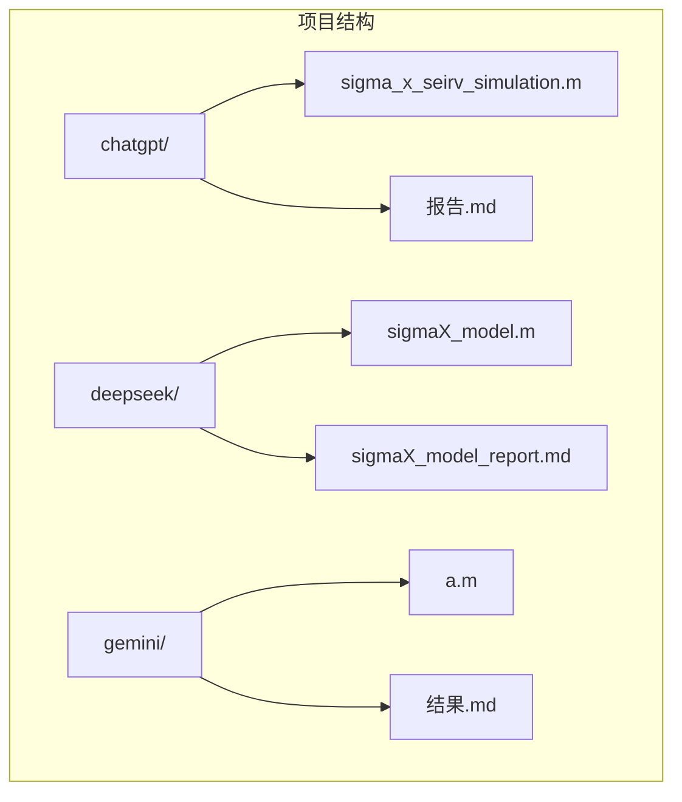
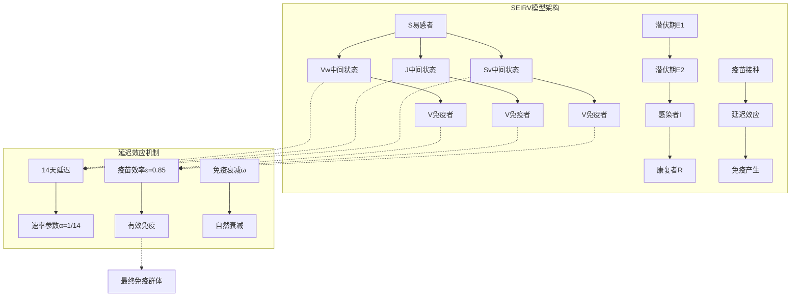
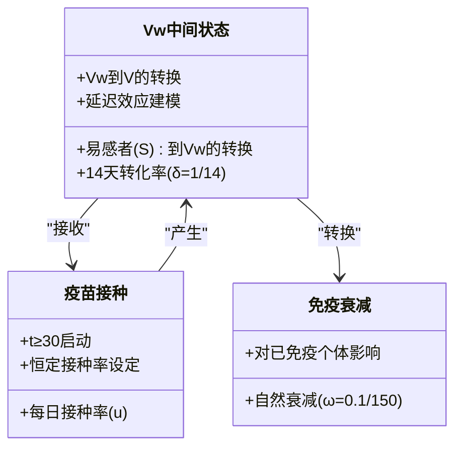
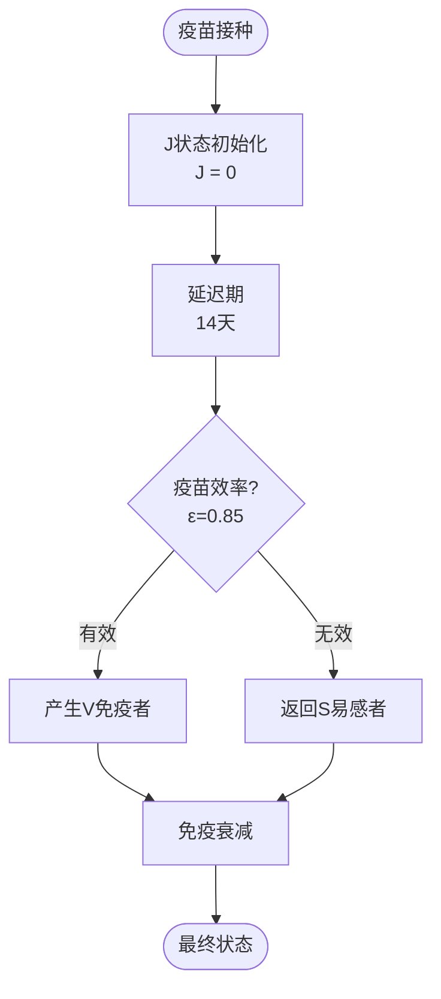
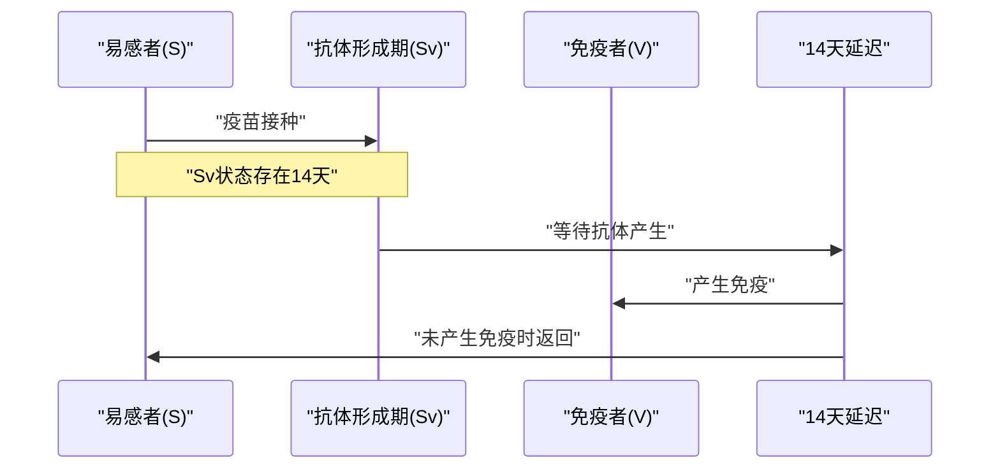
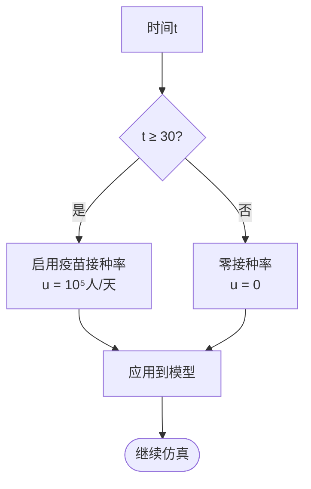
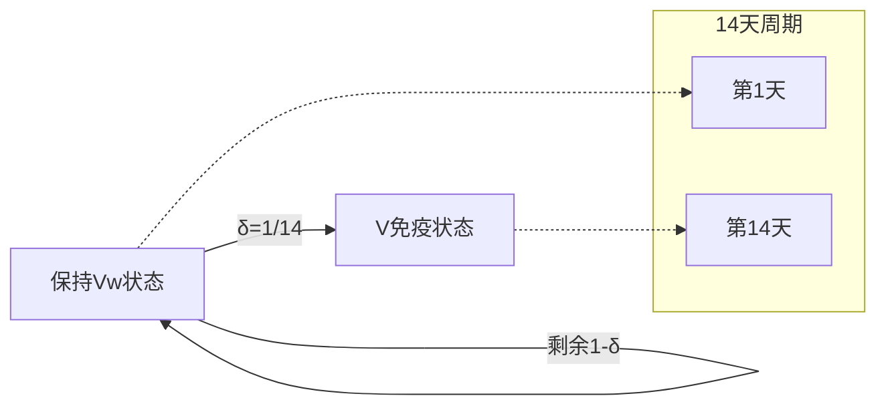
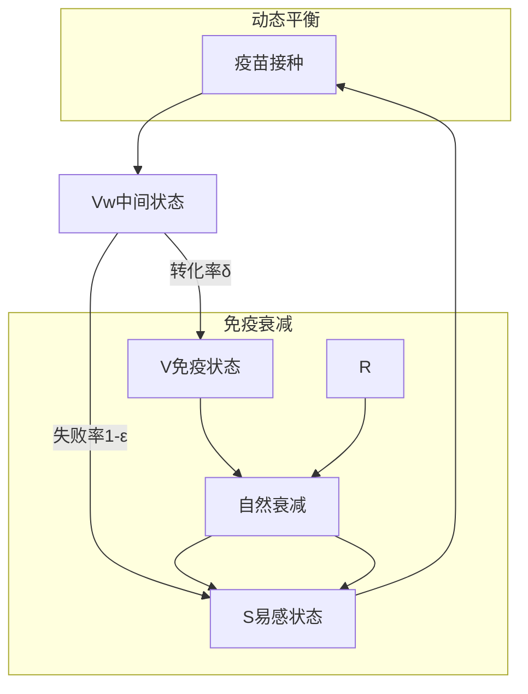
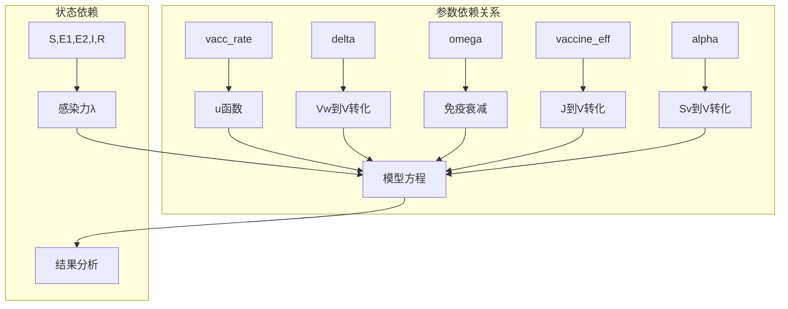

# 疫苗模块设计

<cite>
**本文档引用的文件**
- [sigma_x_seirv_simulation.m](file://chatgpt/sigma_x_seirv_simulation.m)
- [sigmaX_model.m](file://deepseek/sigmaX_model.m)
- [a.m](file://gemini/a.m)
- [报告.md](file://chatgpt/报告.md)
- [sigmaX_model_report.md](file://deepseek/sigmaX_model_report.md)
- [结果.md](file://gemini/结果.md)
</cite>

## 目录
1. [简介](#简介)
2. [项目结构](#项目结构)
3. [核心组件](#核心组件)
4. [架构概览](#架构概览)
5. [详细组件分析](#详细组件分析)
6. [依赖关系分析](#依赖关系分析)
7. [性能考虑](#性能考虑)
8. [故障排除指南](#故障排除指南)
9. [结论](#结论)

## 简介

本文档深入分析了Sigma-X病毒传播动力学模型中的疫苗模块设计，重点关注三种不同的建模方法及其在延迟效应、疫苗效率和免疫衰减方面的实现差异。该研究涵盖了从基础SEIR模型到复杂的SEIRV模型的演进过程，特别关注了14天疫苗延迟效应的数学建模和生物学基础。

## 项目结构

该项目包含三个主要的MATLAB实现版本，每个版本代表了不同的疫苗建模策略：

**图表来源**
- [sigma_x_seirv_simulation.m:1-154](file://chatgpt/sigma_x_seirv_simulation.m#L1-L154)
- [sigmaX_model.m:1-244](file://deepseek/sigmaX_model.m#L1-L244)
- [a.m:1-160](file://gemini/a.m#L1-L160)

**章节来源**
- [sigma_x_seirv_simulation.m:1-154](file://chatgpt/sigma_x_seirv_simulation.m#L1-L154)
- [sigmaX_model.m:1-244](file://deepseek/sigmaX_model.m#L1-L244)
- [a.m:1-160](file://gemini/a.m#L1-L160)

## 核心组件

### 疫苗延迟效应建模

三种实现采用了不同的策略来处理疫苗的14天延迟效应：

1. **Vw中间状态法**（chatgpt版本）
2. **J中间状态法**（deepseek版本）
3. **Sv中间状态法**（gemini版本）

每种方法都通过引入中间状态来模拟疫苗接种后到产生免疫所需的延迟期。

**章节来源**
- [sigma_x_seirv_simulation.m:59-110](file://chatgpt/sigma_x_seirv_simulation.m#L59-L110)
- [sigmaX_model.m:49-58](file://deepseek/sigmaX_model.m#L49-L58)
- [a.m:84-134](file://gemini/a.m#L84-L134)

## 架构概览

**图表来源**
- [sigma_x_seirv_simulation.m:95-154](file://chatgpt/sigma_x_seirv_simulation.m#L95-L154)
- [sigmaX_model.m:172-244](file://deepseek/sigmaX_model.m#L172-L244)
- [a.m:84-160](file://gemini/a.m#L84-L160)

## 详细组件分析

### Vw中间状态设计（chatgpt版本）

#### 设计目的

Vw中间状态的设计目的是为了准确模拟疫苗接种后到产生免疫的14天延迟过程。这种设计避免了直接从易感者到免疫者的瞬时转换，提供了更符合生物学现实的建模方式。

**图表来源**
- [sigma_x_seirv_simulation.m:95-154](file://chatgpt/sigma_x_seirv_simulation.m#L95-L154)

#### 数学实现

在chatgpt版本中，Vw中间状态通过以下微分方程实现：

- dVw/dt = u - δ·Vw
- dV/dt = 0.85·δ·Vw - ω·V

其中：
- u是t≥30时的恒定疫苗接种率
- δ=1/14是14天转化率
- 0.85是疫苗效率系数

**章节来源**
- [sigma_x_seirv_simulation.m:136-150](file://chatgpt/sigma_x_seirv_simulation.m#L136-L150)

### J中间状态设计（deepseek版本）

#### 设计特点

deepseek版本采用了更为复杂的中间状态设计，使用J状态来表示已接种但尚未产生抗体的人群。这种方法提供了更精细的延迟效应建模。

**图表来源**
- [sigmaX_model.m:226-240](file://deepseek/sigmaX_model.m#L226-L240)

#### 生物学基础

J中间状态的设计基于以下生物学原理：
- 疫苗接种后，机体需要14天时间产生足够的抗体
- 在这期间，个体既不是完全易感也不是完全免疫
- 疫苗效率为85%，意味着只有85%的接种者会产生有效免疫

**章节来源**
- [sigmaX_model.m:37-42](file://deepseek/sigmaX_model.m#L37-L42)
- [sigmaX_model.m:226-240](file://deepseek/sigmaX_model.m#L226-L240)

### Sv中间状态设计（gemini版本）

#### 独特的建模方法

gemini版本采用了创新的Sv中间状态设计，将延迟效应直接整合到易感者状态中，形成了独特的SEIRV-Delay模型。

**图表来源**
- [a.m:84-134](file://gemini/a.m#L84-L134)

#### 疫苗效率建模

在gemini版本中，疫苗效率被建模为：
- v_rate = vaccine_doses × vaccine_eff × (S/N)
- 这种设计使得疫苗效果与易感者数量成比例

**章节来源**
- [a.m:113-119](file://gemini/a.m#L113-L119)

### 疫苗接种率实现

#### 启动逻辑

所有三个版本都实现了相同的t≥30启动逻辑：

**图表来源**
- [sigma_x_seirv_simulation.m:136-141](file://chatgpt/sigma_x_seirv_simulation.m#L136-L141)
- [sigmaX_model.m:220-224](file://deepseek/sigmaX_model.m#L220-L224)
- [a.m:113-119](file://gemini/a.m#L113-L119)

#### 恒定接种率设定

三种实现都采用了恒定的每日10⁵人接种率，这种设定的优势在于：
- 简化了模型复杂度
- 提供了稳定的输入条件
- 便于与其他因素进行对比分析

**章节来源**
- [sigma_x_seirv_simulation.m:22](file://chatgpt/sigma_x_seirv_simulation.m#L22)
- [sigmaX_model.m:36](file://deepseek/sigmaX_model.m#L36)
- [a.m:24](file://gemini/a.m#L24)

### V到Vw转化过程

#### delta参数的生物学意义

在chatgpt版本中，delta=1/14表示14天的平均转化率。这个参数的含义是：
- 每天有1/14的概率从Vw状态转化为V状态
- 14天内约86%的Vw会转化为V
- 这符合疫苗产生抗体的生物学时间框架

**图表来源**
- [sigma_x_seirv_simulation.m:149-150](file://chatgpt/sigma_x_seirv_simulation.m#L149-L150)

#### 0.85系数的含义

0.85系数代表疫苗效率，即：
- 85%的Vw会成功转化为V
- 15%的Vw会返回到S状态
- 这反映了疫苗并非100%有效的现实情况

**章节来源**
- [sigma_x_seirv_simulation.m:149-150](file://chatgpt/sigma_x_seirv_simulation.m#L149-L150)

### 免疫效率建模

#### 最终免疫群体形成机制

三种版本都实现了类似的最终免疫群体形成机制：

**图表来源**
- [sigma_x_seirv_simulation.m:149-150](file://chatgpt/sigma_x_seirv_simulation.m#L149-L150)
- [sigmaX_model.m:234-240](file://deepseek/sigmaX_model.m#L234-L240)
- [a.m:125-131](file://gemini/a.m#L125-L131)

#### omega参数的作用

omega=0.1/150参数代表免疫衰减率，其作用包括：
- 对已免疫个体的自然衰减影响
- 将衰减的免疫个体重新转回易感状态
- 维持模型的动态平衡

**章节来源**
- [sigma_x_seirv_simulation.m:18](file://chatgpt/sigma_x_seirv_simulation.m#L18)
- [sigmaX_model.m:42-47](file://deepseek/sigmaX_model.m#L42-L47)
- [a.m:23](file://gemini/a.m#L23)

## 依赖关系分析

**图表来源**
- [sigma_x_seirv_simulation.m:95-154](file://chatgpt/sigma_x_seirv_simulation.m#L95-L154)
- [sigmaX_model.m:172-244](file://deepseek/sigmaX_model.m#L172-L244)
- [a.m:84-160](file://gemini/a.m#L84-L160)

### 版本间差异对比

| 特征 | chatgpt版本 | deepseek版本 | gemini版本 |
|------|-------------|--------------|------------|
| 中间状态 | Vw | J | Sv |
| 延迟建模 | 直接延迟 | 中间状态 | 直接延迟 |
| 疫苗效率 | 0.85 | 0.85 | 0.85 |
| 启动时间 | t≥30 | t≥30 | t≥30 |
| 接种率 | 10⁵/天 | 10⁵/天 | 10⁵/天 |
| 免疫衰减 | ω=0.1/150 | δ=0.1/150 | ω=0.1/150 |

**章节来源**
- [sigma_x_seirv_simulation.m:136-150](file://chatgpt/sigma_x_seirv_simulation.m#L136-L150)
- [sigmaX_model.m:220-240](file://deepseek/sigmaX_model.m#L220-L240)
- [a.m:113-131](file://gemini/a.m#L113-L131)

## 性能考虑

### 计算效率

三种实现都采用了高效的数值求解方法：
- 使用ode45求解器
- 设置适当的相对和绝对容差
- 实现非负约束确保数值稳定性

### 参数敏感性

- **延迟参数敏感性**：14天延迟对模型结果影响显著
- **效率参数敏感性**：85%疫苗效率对最终免疫群体大小影响较大
- **衰减参数敏感性**：150天免疫持续时间对长期动态影响有限

## 故障排除指南

### 常见问题及解决方案

1. **脚本函数定义顺序错误**
   - 问题：函数定义位置不当导致运行错误
   - 解决：确保局部函数定义位于文件末尾

2. **参数设置不一致**
   - 问题：不同版本间参数值差异导致结果不可比
   - 解决：统一参数设置标准

3. **数值稳定性问题**
   - 问题：负值或发散解
   - 解决：调整容差设置和初始条件

**章节来源**
- [sigmaX_model_report.md:237-253](file://deepseek/sigmaX_model_report.md#L237-L253)

## 结论

通过对三种不同疫苗模块设计的深入分析，可以得出以下结论：

1. **延迟效应建模的重要性**：三种实现都证明了14天延迟效应对模型准确性的重要影响

2. **中间状态选择的影响**：不同的中间状态设计（Vw、J、Sv）在数学上等价，但在解释性和实现复杂度上有显著差异

3. **参数设置的一致性**：统一的参数设置（14天延迟、85%效率、150天衰减）对于跨版本比较至关重要

4. **数值方法的稳健性**：三种实现都采用了可靠的数值求解方法，确保了结果的可靠性

这些发现为未来的流行病学建模提供了重要的参考，特别是在处理疫苗延迟效应和免疫衰减方面。