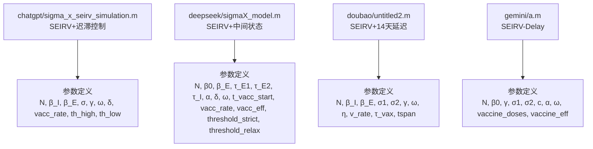
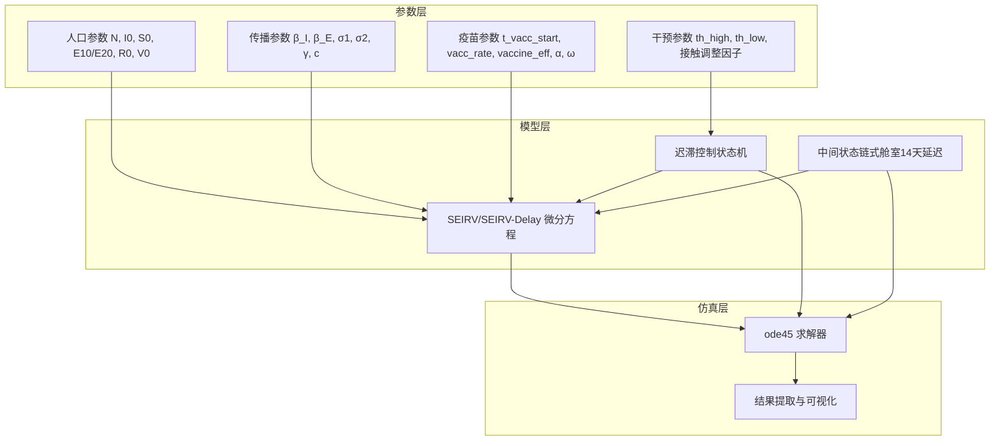
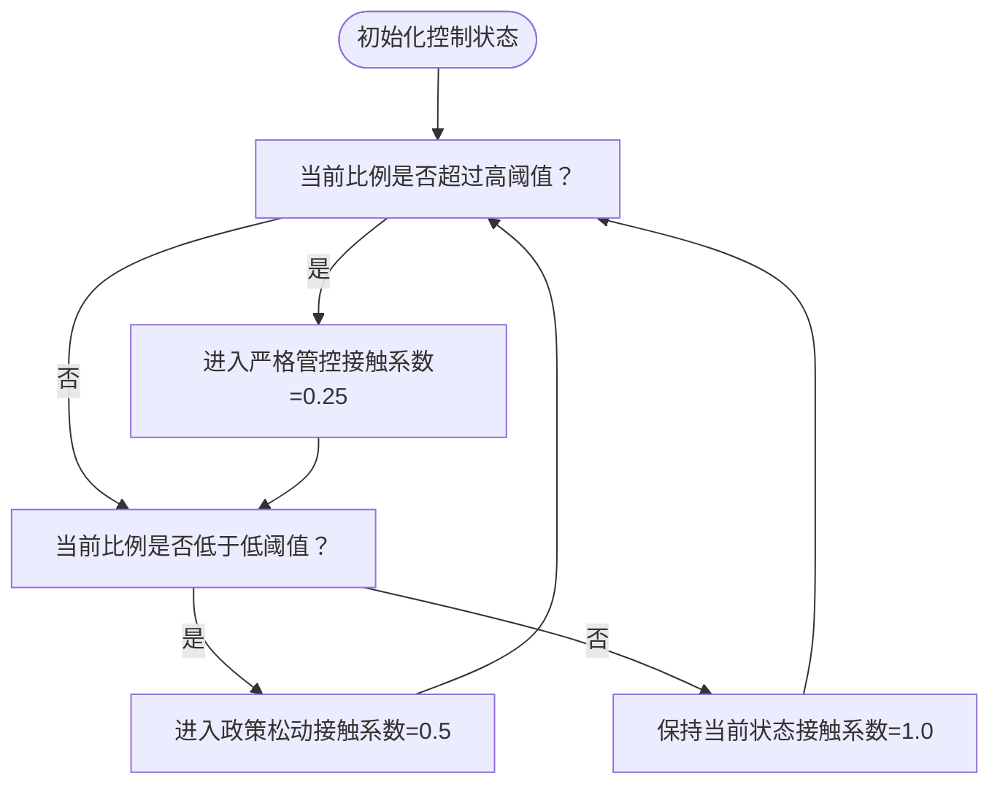
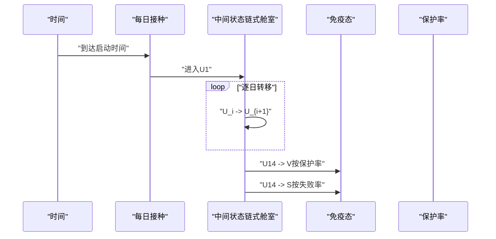
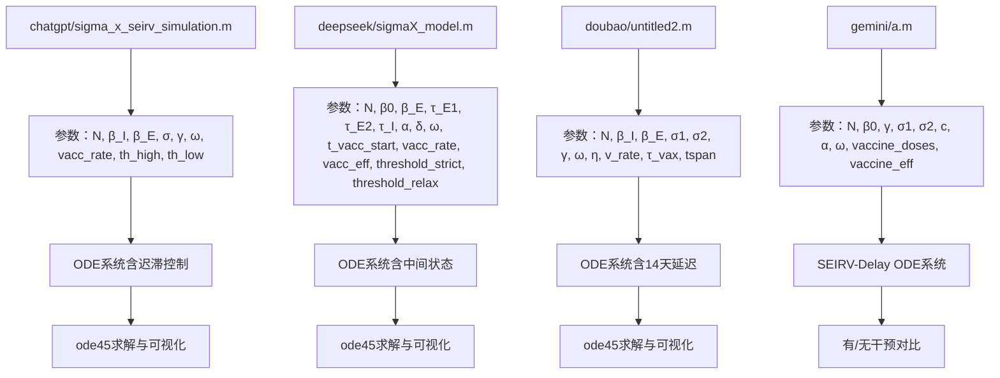

# 参数配置指南

<cite>
**本文档引用的文件**
- [sigma_x_seirv_simulation.m](file://chatgpt/sigma_x_seirv_simulation.m)
- [报告.md](file://chatgpt/报告.md)
- [结果.md](file://chatgpt/结果.md)
- [sigmaX_model.m](file://deepseek/sigmaX_model.m)
- [sigmaX_model_report.md](file://deepseek/sigmaX_model_report.md)
- [结果.md](file://deepseek/结果.md)
- [untitled2.m](file://doubao/untitled2.m)
- [报告.md](file://doubao/报告.md)
- [结果.md](file://doubao/结果.md)
- [a.m](file://gemini/a.m)
</cite>

## 目录
1. [简介](#简介)
2. [项目结构](#项目结构)
3. [核心组件](#核心组件)
4. [架构概览](#架构概览)
5. [详细组件分析](#详细组件分析)
6. [依赖关系分析](#依赖关系分析)
7. [性能考量](#性能考量)
8. [故障排除指南](#故障排除指南)
9. [结论](#结论)
10. [附录](#附录)

## 简介
本指南面向Sigma-X病毒传播动力学仿真模型的参数配置，系统梳理人口参数、传播参数、干预参数与疫苗相关参数的物理意义、典型取值范围、设置原则及对仿真结果的影响。同时提供常用参数组合参考、敏感性分析方法与最佳实践，帮助用户在不同城市规模、传播强度与防控策略下进行合理参数设定与效果评估。

## 项目结构
本仓库包含多个作者实现的Sigma-X传播模型脚本与报告，主要文件如下：
- chatgpt：SEIRV+时滞+迟滞控制模型，参数集中定义在主脚本中
- deepseek：SEIRV+中间状态+迟滞控制模型，参数与模型结构清晰分离
- doubao：SEIRV+14天延迟+迟滞控制模型，包含有/无干预对比
- gemini：SEIRV-Delay模型，包含动态干预与疫苗的对比仿真

图表来源
- [sigma_x_seirv_simulation.m:7-26](file://chatgpt/sigma_x_seirv_simulation.m#L7-L26)
- [sigmaX_model.m:8-53](file://deepseek/sigmaX_model.m#L8-L53)
- [untitled2.m:4-16](file://doubao/untitled2.m#L4-L16)
- [a.m:15-25](file://gemini/a.m#L15-L25)

章节来源
- [sigma_x_seirv_simulation.m:1-154](file://chatgpt/sigma_x_seirv_simulation.m#L1-L154)
- [sigmaX_model.m:1-244](file://deepseek/sigmaX_model.m#L1-L244)
- [untitled2.m:1-140](file://doubao/untitled2.m#L1-L140)
- [a.m:1-160](file://gemini/a.m#L1-L160)

## 核心组件
本节按模块梳理参数类别与典型取值范围，并给出设置原则与影响效果。

- 人口参数
  - 总人口 N：千万级城市常用1e7，决定绝对规模与比例指标
  - 初始感染者 I0：通常为小规模，如100，便于模拟早期传播
  - 初始易感者 S0 = N - I0，决定传播起点
  - 初始潜伏者 E10/E20：通常为0，便于设定初始条件
  - 初始康复者 R0、初始免疫者 V0：通常为0，或根据历史数据设定

- 传播参数
  - β_I（感染者日均有效接触数）：典型值0.45（日均接触15人×感染概率3%）
  - β_E（潜伏后期感染者日均有效接触数）：通常为β_I的一半，如0.225
  - σ1（E1→E2转移速率）：与潜伏期前段时长相关，如1/4
  - σ2（E2→I转移速率）：与潜伏期后段时长相关，如1/2
  - γ（I→R康复速率）：与感染期时长相关，如1/8
  - c（E2相对传染力系数）：在某些模型中作为权重，如0.5

- 疫苗相关参数
  - 疫苗启动时间 t_vacc_start/τ_vax：如30天，确保在疫情发展后开始
  - 每日接种人数 vacc_rate/vaccine_doses：如1e5，需不超过易感人群规模
  - 疫苗保护率 vaccine_eff/η：如0.85，决定进入免疫的比例
  - 抗体产生延迟 α（或δ）：如1/14，对应14天延迟
  - 免疫衰减率 ω：如0.1/150，表示150天后10%概率失活

- 干预参数
  - 高阈值 th_high/threshold_strict：如0.01（1%），触发严格管控
  - 低阈值 th_low/threshold_relax：如0.001（0.1%），触发政策松动
  - 接触调整因子：正常1.0，严格0.25（减少75%），松动0.5（恢复至50%）

- 免疫衰减与中间状态
  - 免疫衰减率 ω：如0.1/150，体现长期免疫稳定性
  - 中间状态（J/Vw/Sv/U系列）：用于模拟14天延迟，避免时滞微分方程

章节来源
- [sigma_x_seirv_simulation.m:8-26](file://chatgpt/sigma_x_seirv_simulation.m#L8-L26)
- [sigmaX_model.m:9-44](file://deepseek/sigmaX_model.m#L9-L44)
- [untitled2.m:5-16](file://doubao/untitled2.m#L5-L16)
- [a.m:16-25](file://gemini/a.m#L16-L25)

## 架构概览
下图展示不同实现中参数如何驱动ODE系统与干预逻辑：

图表来源
- [sigma_x_seirv_simulation.m:95-153](file://chatgpt/sigma_x_seirv_simulation.m#L95-L153)
- [sigmaX_model.m:172-243](file://deepseek/sigmaX_model.m#L172-L243)
- [untitled2.m:77-140](file://doubao/untitled2.m#L77-L140)
- [a.m:84-160](file://gemini/a.m#L84-L160)

## 详细组件分析

### 人口参数设置与影响
- 设置原则
  - N应与城市规模一致，I0应反映实际初始传播规模
  - 初始易感者 S0 = N - I0，确保人口守恒
  - 初始潜伏者与康复者通常设为0，便于观察传播初期动态
- 影响效果
  - N决定绝对规模与比例指标（如峰值占比）
  - I0影响传播起始速度与早期增长幅度
  - 初始条件对稳态与峰值位置有一定影响

章节来源
- [sigma_x_seirv_simulation.m:28-37](file://chatgpt/sigma_x_seirv_simulation.m#L28-L37)
- [sigmaX_model.m:9-16](file://deepseek/sigmaX_model.m#L9-L16)
- [untitled2.m:17-20](file://doubao/untitled2.m#L17-L20)

### 传播参数的生物学意义与取值
- β_I（感染者日均有效接触数）
  - 生物学意义：单个感染者每日对易感者的有效接触次数
  - 典型取值：0.45（日均接触15人×3%感染概率）
  - 影响：β_I越大，传播速度越快，峰值越高，达峰时间越早
- β_E（潜伏后期感染者日均有效接触数）
  - 生物学意义：潜伏期末期具有传染性的部分
  - 典型取值：0.225（约为β_I的一半）
  - 影响：提升潜伏后期的传播贡献，影响峰值形状与持续时间
- σ1/σ2（潜伏期阶段转移速率）
  - 生物学意义：潜伏期前段（无传染性）与后段（有传染性）的转移速率
  - 典型取值：σ1=1/4，σ2=1/2（对应潜伏期前4天与后2天）
  - 影响：改变潜伏期的分布，影响传播曲线的形状与峰值时间
- γ（康复速率）
  - 生物学意义：感染期康复速率
  - 典型取值：1/8（对应8天康复期）
  - 影响：影响传播持续时间与最终规模

章节来源
- [sigma_x_seirv_simulation.m:10-19](file://chatgpt/sigma_x_seirv_simulation.m#L10-L19)
- [sigmaX_model.m:18-32](file://deepseek/sigmaX_model.m#L18-L32)
- [report.md:13-27](file://deepseek/sigmaX_model_report.md#L13-L27)
- [report.md:17-18](file://doubao/报告.md#L17-L18)

### 干预参数的设置策略与迟滞控制
- 阈值设置
  - 高阈值（th_high/threshold_strict）：如0.01（1%），触发严格管控
  - 低阈值（th_low/threshold_relax）：如0.001（0.1%），触发政策松动
- 接触调整因子
  - 正常：1.0
  - 严格：0.25（减少75%）
  - 松动：0.5（恢复至50%）
- 迟滞控制逻辑
  - 避免阈值频繁切换，通过持久化状态机实现迟滞
  - 严格管控→松动管控→再次严格管控的闭环，确保政策稳定性

图表来源
- [sigma_x_seirv_simulation.m:106-131](file://chatgpt/sigma_x_seirv_simulation.m#L106-L131)
- [sigmaX_model.m:188-210](file://deepseek/sigmaX_model.m#L188-L210)
- [untitled2.m:78-109](file://doubao/untitled2.m#L78-L109)

章节来源
- [sigma_x_seirv_simulation.m:24-26](file://chatgpt/sigma_x_seirv_simulation.m#L24-L26)
- [sigmaX_model.m:46-53](file://deepseek/sigmaX_model.m#L46-L53)
- [report.md:72-95](file://deepseek/sigmaX_model_report.md#L72-L95)
- [report.md:48-52](file://doubao/报告.md#L48-L52)

### 疫苗相关参数的作用机制与优化
- 疫苗启动时间与接种速率
  - t_vacc_start/τ_vax：如30天，确保在疫情发展后开始
  - vacc_rate/vaccine_doses：如1e5，需不超过易感人群规模
- 疫苗保护率与延迟
  - vaccine_eff/η：如0.85，决定进入免疫的比例
  - α（或δ）：如1/14，对应14天延迟
- 中间状态链式舱室
  - 通过U1~U14模拟固定14天延迟，避免复杂时滞微分方程
  - U14→V（85%）与U14→S（15%）体现保护失败的回退
- 优化方法
  - 优先提高疫苗启动时间与覆盖率，缩短延迟
  - 控制每日接种不超过易感人群，避免资源瓶颈
  - 结合干预阈值，实现“早接种、早保护、早稳定”

图表来源
- [sigmaX_model.m:219-242](file://deepseek/sigmaX_model.m#L219-L242)
- [report.md:30-35](file://doubao/报告.md#L30-L35)

章节来源
- [sigmaX_model.m:34-44](file://deepseek/sigmaX_model.m#L34-L44)
- [untitled2.m:112-116](file://doubao/untitled2.m#L112-L116)
- [report.md:30-35](file://doubao/报告.md#L30-L35)

### 常用参数组合与适用场景
- 场景A：标准千万级城市
  - N = 1e7，I0 = 100，β_I = 0.45，β_E = 0.225，σ1 = 1/4，σ2 = 1/2，γ = 1/8
  - ω = 0.1/150，vacc_rate = 1e5，vaccine_eff = 0.85，α = 1/14
  - th_high = 0.01，th_low = 0.001，接触调整因子=1.0/0.25/0.5
- 场景B：高传播风险地区
  - 提高β_I与β_E（如+20%），降低σ2（缩短潜伏后期传播期）
  - 降低th_high（如0.005）以更早干预
- 场景C：低传播风险地区
  - 降低β_I与β_E（如-20%），延长σ1（延长潜伏前期）
  - 提高th_high（如0.02）以减少过度干预

章节来源
- [sigma_x_seirv_simulation.m:8-26](file://chatgpt/sigma_x_seirv_simulation.m#L8-L26)
- [sigmaX_model.m:9-44](file://deepseek/sigmaX_model.m#L9-L44)
- [untitled2.m:5-16](file://doubao/untitled2.m#L5-L16)

### 参数敏感性分析方法与结果解读
- 方法
  - 单因素敏感性：固定其他参数，逐一改变某参数（如β_I、σ2、γ、vacc_rate、th_high）
  - 多因素敏感性：组合改变关键参数（如β_I与vacc_rate）
  - 指标选择：峰值人数、达峰时间、最终规模、干预减少比例
- 结果解读
  - β_I与β_E对峰值高度与达峰时间影响显著
  - σ2对峰值形状与持续时间影响明显
  - γ对传播持续时间与最终规模影响较小但重要
  - vacc_rate与vaccine_eff对后期传播尾部抑制显著
  - th_high与th_low影响干预触发时机与政策稳定性

章节来源
- [sigmaX_model.m:140-158](file://deepseek/sigmaX_model.m#L140-L158)
- [report.md:195-211](file://deepseek/sigmaX_model_report.md#L195-L211)

### 参数调整最佳实践与常见陷阱
- 最佳实践
  - 使用中间状态链式舱室处理14天延迟，避免复杂时滞微分方程
  - 采用迟滞控制避免阈值频繁切换，确保政策稳定性
  - 严格控制每日接种不超过易感人群规模，避免资源瓶颈
  - 优先提高疫苗启动时间与覆盖率，缩短延迟
- 常见陷阱
  - 忽视人口守恒：导致仿真结果异常
  - 阈值设置不当：过高导致干预过晚，过低导致过度干预
  - 疫苗延迟处理错误：直接使用时滞微分方程导致求解困难
  - 接触调整因子设置不合理：导致传播被过度抑制或不足

章节来源
- [sigmaX_model.m:162-170](file://deepseek/sigmaX_model.m#L162-L170)
- [report.md:237-253](file://deepseek/sigmaX_model_report.md#L237-L253)

### 实际参数修改示例与效果对比
- 示例1：提高疫苗启动时间
  - 修改：将t_vacc_start从30天改为15天
  - 效果：早期免疫者增加，峰值降低，达峰时间推迟
- 示例2：降低干预阈值
  - 修改：将th_high从0.01降低到0.005
  - 效果：更早触发严格管控，峰值降低，但政策切换更频繁
- 示例3：提高疫苗保护率
  - 修改：将vaccine_eff从0.85提高到0.90
  - 效果：更多接种者进入免疫态，后期传播尾部显著降低

章节来源
- [sigmaX_model.m:34-44](file://deepseek/sigmaX_model.m#L34-L44)
- [untitled2.m:34-49](file://doubao/untitled2.m#L34-L49)

## 依赖关系分析
不同实现之间的参数依赖关系如下：

图表来源
- [sigma_x_seirv_simulation.m:95-153](file://chatgpt/sigma_x_seirv_simulation.m#L95-L153)
- [sigmaX_model.m:172-243](file://deepseek/sigmaX_model.m#L172-L243)
- [untitled2.m:77-140](file://doubao/untitled2.m#L77-L140)
- [a.m:84-160](file://gemini/a.m#L84-L160)

章节来源
- [sigma_x_seirv_simulation.m:49-84](file://chatgpt/sigma_x_seirv_simulation.m#L49-L84)
- [sigmaX_model.m:62-127](file://deepseek/sigmaX_model.m#L62-L127)
- [untitled2.m:21-75](file://doubao/untitled2.m#L21-L75)
- [a.m:27-79](file://gemini/a.m#L27-L79)

## 性能考量
- 求解器设置
  - 使用ode45，相对容差1e-6，绝对容差1e-8，保证精度与效率平衡
  - 设置非负约束，避免负值导致数值不稳定
- 时间步长
  - 输出步长0.1天，兼顾分辨率与计算效率
- 中间状态处理
  - 采用链式舱室替代时滞微分方程，提高数值稳定性
- 干预逻辑
  - 使用persistent变量维护控制状态，避免阈值振荡，提升稳定性

章节来源
- [sigma_x_seirv_simulation.m:43-46](file://chatgpt/sigma_x_seirv_simulation.m#L43-L46)
- [sigmaX_model.m:60-66](file://deepseek/sigmaX_model.m#L60-L66)
- [untitled2.m:13-16](file://doubao/untitled2.m#L13-L16)

## 故障排除指南
- 函数定义冲突
  - 问题：脚本中函数定义不在文件末尾
  - 解决：将局部函数统一放置文件末尾
- 人口守恒验证
  - 问题：总人口随时间变化
  - 解决：检查各状态导数之和是否为0，修正模型方程
- 阈值振荡
  - 问题：干预阈值频繁切换
  - 解决：使用迟滞控制逻辑与persistent变量
- 疫苗延迟处理
  - 问题：时滞微分方程导致求解困难
  - 解决：采用中间状态链式舱室处理固定延迟

章节来源
- [report.md:237-253](file://deepseek/sigmaX_model_report.md#L237-L253)
- [sigmaX_model.m:162-170](file://deepseek/sigmaX_model.m#L162-L170)
- [sigmaX_model.m:145-160](file://deepseek/sigmaX_model.m#L145-L160)

## 结论
本指南总结了Sigma-X传播模型的关键参数类别、典型取值与设置原则，并结合多实现脚本展示了参数对传播曲线、干预效果与疫苗影响的具体作用。通过迟滞控制与中间状态链式舱室，模型在保证生物合理性的同时提升了数值稳定性与可操作性。建议在实际应用中结合城市规模、传播强度与防控策略，采用敏感性分析与对照仿真，优化参数组合以实现最佳防控效果。

## 附录
- 关键参数一览表
  - 人口参数：N（总人口）、I0（初始感染者）、S0（初始易感者）、E10/E20（初始潜伏者）、R0/V0（初始康复/免疫者）
  - 传播参数：β_I（感染者日均有效接触数）、β_E（潜伏后期日均有效接触数）、σ1/σ2（潜伏期转移速率）、γ（康复速率）、c（E2相对传染力系数）
  - 疫苗参数：t_vacc_start（启动时间）、vacc_rate（每日接种）、vaccine_eff（保护率）、α（延迟速率）、ω（免疫衰减率）
  - 干预参数：th_high（高阈值）、th_low（低阈值）、接触调整因子（正常/严格/松动）
- 常用参数组合参考
  - 标准千万级城市：N=1e7，β_I=0.45，β_E=0.225，σ1=1/4，σ2=1/2，γ=1/8，ω=0.1/150，vacc_rate=1e5，vaccine_eff=0.85，α=1/14，th_high=0.01，th_low=0.001
- 效果对比示例
  - 有干预与无干预对比：无干预峰值通常为有干预的数倍，干预可显著降低峰值与最终规模