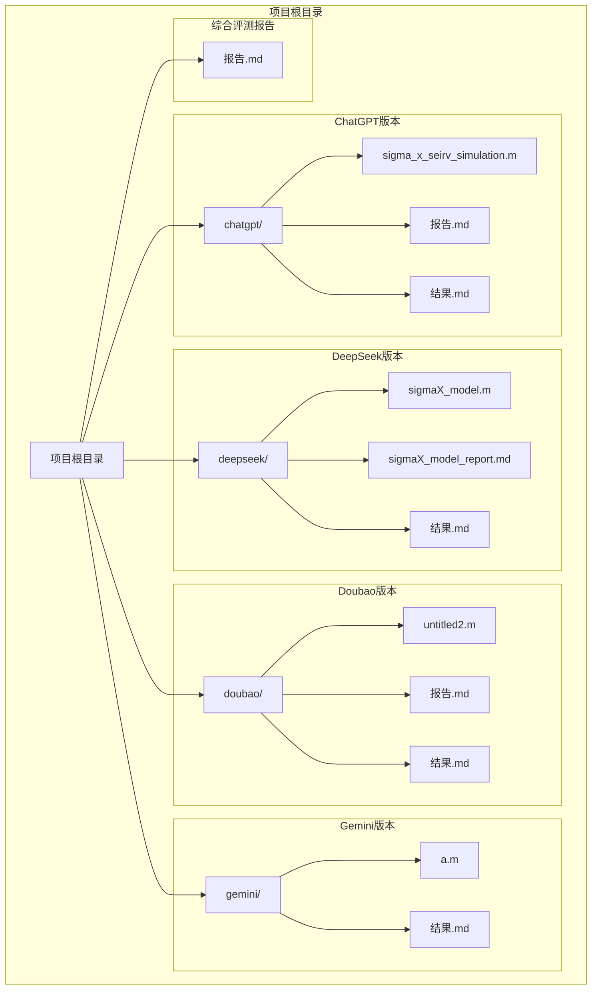
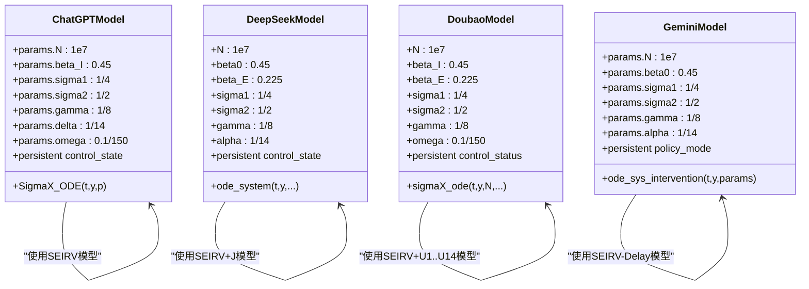
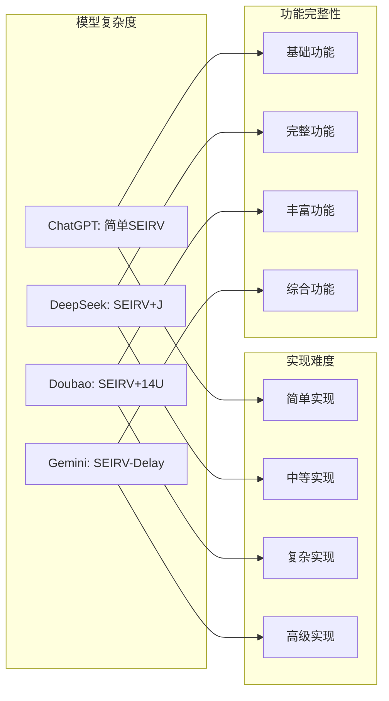
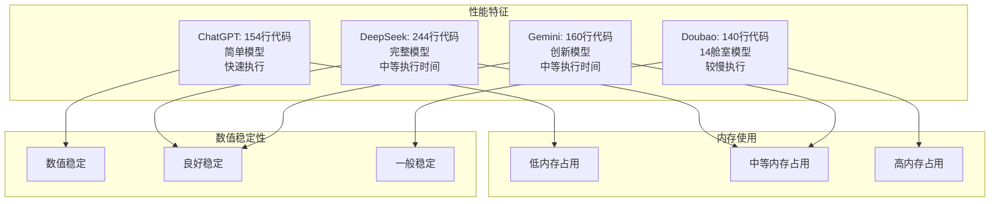

# 多版本对比分析

<cite>
**本文档引用的文件**
- [sigma_x_seirv_simulation.m](file://chatgpt/sigma_x_seirv_simulation.m)
- [报告.md](file://chatgpt/报告.md)
- [结果.md](file://chatgpt/结果.md)
- [sigmaX_model.m](file://deepseek/sigmaX_model.m)
- [sigmaX_model_report.md](file://deepseek/sigmaX_model_report.md)
- [结果.md](file://deepseek/结果.md)
- [untitled2.m](file://doubao/untitled2.m)
- [报告.md](file://doubao/报告.md)
- [结果.md](file://doubao/结果.md)
- [a.m](file://gemini/a.m)
- [结果.md](file://gemini/结果.md)
- [报告.md](file://报告.md)
</cite>

## 更新摘要
**变更内容**
- 新增了全面的AI模型对比分析报告，涵盖ChatGPT、Gemini、DeepSeek、Doubao四种模型的详细评测
- 增加了基于Sigma-X病毒传播动力学建模的横向评测框架
- 补充了数学建模准确性、代码实现质量、仿真结果合理性、可视化呈现等维度的对比分析
- 添加了各模型的综合评分和失分原因分析
- 更新了版本选择建议和迁移指导

## 目录
1. [简介](#简介)
2. [项目结构](#项目结构)
3. [核心组件](#核心组件)
4. [架构概览](#架构概览)
5. [详细组件分析](#详细组件分析)
6. [依赖关系分析](#依赖关系分析)
7. [性能考量](#性能考量)
8. [故障排除指南](#故障排除指南)
9. [AI模型对比分析](#ai模型对比分析)
10. [版本选择与迁移指导](#版本选择与迁移指导)
11. [结论](#结论)
12. [附录](#附录)

## 简介

本文档提供了四个不同AI助手版本实现的详细对比分析，涵盖ChatGPT、DeepSeek、Doubao和Gemini版本在算法实现、代码结构、功能完整性等方面的差异。这些版本都基于Sigma-X病毒传播动力学模型，但采用了不同的建模策略和实现方式。

**更新** 新增了基于Sigma-X病毒传播动力学建模的全面AI模型对比分析报告，从数学建模准确性、代码实现质量、仿真结果合理性、可视化呈现等多个维度对四个AI助手版本进行全面评测。

每个版本都实现了SEIRV（易感-潜伏-感染-康复-免疫）模型的变体，包含了动态干预机制、疫苗延迟效应和免疫衰减等复杂因素。通过对比分析，我们可以更好地理解不同实现方案的特点、优势和适用场景。

## 项目结构

该项目采用按版本组织的目录结构，每个版本都有独立的实现文件和配套文档：



**图表来源**
- [sigma_x_seirv_simulation.m:1-154](file://chatgpt/sigma_x_seirv_simulation.m#L1-L154)
- [sigmaX_model.m:1-244](file://deepseek/sigmaX_model.m#L1-L244)
- [untitled2.m:1-140](file://doubao/untitled2.m#L1-L140)
- [a.m:1-160](file://gemini/a.m#L1-L160)
- [报告.md:1-153](file://报告.md#L1-L153)

**章节来源**
- [sigma_x_seirv_simulation.m:1-154](file://chatgpt/sigma_x_seirv_simulation.m#L1-L154)
- [sigmaX_model.m:1-244](file://deepseek/sigmaX_model.m#L1-L244)
- [untitled2.m:1-140](file://doubao/untitled2.m#L1-L140)
- [a.m:1-160](file://gemini/a.m#L1-L160)
- [报告.md:1-153](file://报告.md#L1-L153)

## 核心组件

### 模型参数对比

四个版本在核心参数设置上存在显著差异：

| 参数 | ChatGPT版本 | DeepSeek版本 | Doubao版本 | Gemini版本 |
|------|-------------|--------------|------------|------------|
| 总人口(N) | 10⁷ | 10⁷ | 10⁷ | 10⁷ |
| 初始感染者 | 100 | 100 | 100 | 100 |
| 潜伏期前4天 | σ₁ = 1/4 | σ₁ = 1/4 | σ₁ = 1/4 | σ₁ = 1/4 |
| 潜伏期后2天 | σ₂ = 1/2 | σ₂ = 1/2 | σ₂ = 1/2 | σ₂ = 1/2 |
| 感染期 | γ = 1/8 | γ = 1/8 | γ = 1/8 | γ = 1/8 |
| 疫苗延迟 | δ = 1/14 | α = 1/14 | 14个U舱室 | α = 1/14 |
| 免疫衰减 | ω = 0.1/150 | δ ≈ 6.667×10⁻⁴ | ω ≈ 6.67×10⁻⁴ | ω ≈ 0.0007 |

### 动态干预机制

三个版本都实现了迟滞控制机制，但实现细节有所不同：

```mermaid
flowchart TD
Start([开始]) --> CalcP["计算感染比例 P = I/N"]
CalcP --> CheckState{"当前状态"}
CheckState --> |状态0(正常)| CheckHigh{"P > 1%"}
CheckState --> |状态1(严格管控)| CheckLow{"P < 0.1%"}
CheckState --> |状态2(政策松动)| CheckHigh2{"P > 1%"}
CheckHigh --> |是| State1["切换到状态1<br/>接触率25%"]
CheckHigh --> |否| Stay0["保持状态0<br/>接触率100%"]
CheckLow --> |是| State2["切换到状态2<br/>接触率50%"]
CheckLow --> |否| Stay1["保持状态1<br/>接触率25%"]
CheckHigh2 --> |是| State1B["保持状态2<br/>接触率50%"]
CheckHigh2 --> |否| State1C["切换到状态1<br/>接触率25%"]
State1 --> End([结束])
Stay0 --> End
State2 --> End
Stay1 --> End
State1B --> End
State1C --> End
```

**图表来源**
- [sigma_x_seirv_simulation.m:116-131](file://chatgpt/sigma_x_seirv_simulation.m#L116-L131)
- [sigmaX_model.m:188-210](file://deepseek/sigmaX_model.m#L188-L210)
- [untitled2.m:88-108](file://doubao/untitled2.m#L88-L108)

**章节来源**
- [sigma_x_seirv_simulation.m:116-153](file://chatgpt/sigma_x_seirv_simulation.m#L116-L153)
- [sigmaX_model.m:188-243](file://deepseek/sigmaX_model.m#L188-L243)
- [untitled2.m:77-140](file://doubao/untitled2.m#L77-L140)

## 架构概览

### 模型架构对比

四个版本采用了不同的建模策略来处理Sigma-X病毒的复杂传播特性：

```mermaid
graph TB
subgraph "ChatGPT版本架构"
CG1[SEIRV模型]
CG2[迟滞控制]
CG3[疫苗延迟Vw->V]
CG4[免疫衰减]
end
subgraph "DeepSeek版本架构"
DS1[SEIRV+J模型]
DS2[迟滞控制]
DS3[14天疫苗延迟(J舱室)]
DS4[免疫衰减]
end
subgraph "Doubao版本架构"
DB1[SEIRV+U1-U14模型]
DB2[迟滞控制]
DB3[14天疫苗延迟(14个U舱室)]
DB4[免疫衰减]
end
subgraph "Gemini版本架构"
GM1[SEIRV-Delay模型]
GM2[迟滞控制]
GM3[Sv->V延迟]
GM4[免疫衰减]
end
CG1 --> CG2
CG2 --> CG3
CG3 --> CG4
DS1 --> DS2
DS2 --> DS3
DS3 --> DS4
DB1 --> DB2
DB2 --> DB3
DB3 --> DB4
GM1 --> GM2
GM2 --> GM3
GM3 --> GM4
```

**图表来源**
- [sigma_x_seirv_simulation.m:95-153](file://chatgpt/sigma_x_seirv_simulation.m#L95-L153)
- [sigmaX_model.m:172-243](file://deepseek/sigmaX_model.m#L172-L243)
- [untitled2.m:77-140](file://doubao/untitled2.m#L77-L140)
- [a.m:84-160](file://gemini/a.m#L84-L160)

### 代码结构对比



**图表来源**
- [sigma_x_seirv_simulation.m:8-26](file://chatgpt/sigma_x_seirv_simulation.m#L8-L26)
- [sigmaX_model.m:9-44](file://deepseek/sigmaX_model.m#L9-L44)
- [untitled2.m:5-16](file://doubao/untitled2.m#L5-L16)
- [a.m:16-25](file://gemini/a.m#L16-L25)

**章节来源**
- [sigma_x_seirv_simulation.m:95-153](file://chatgpt/sigma_x_seirv_simulation.m#L95-L153)
- [sigmaX_model.m:172-243](file://deepseek/sigmaX_model.m#L172-L243)
- [untitled2.m:77-140](file://doubao/untitled2.m#L77-L140)
- [a.m:84-160](file://gemini/a.m#L84-L160)

## 详细组件分析

### ChatGPT版本分析

ChatGPT版本采用了相对简洁的SEIRV模型实现，重点关注动态干预机制的迟滞控制。

#### 核心特点
- **模型简化**：使用标准SEIRV模型，通过中间状态Vw处理疫苗延迟
- **迟滞控制**：使用persistent变量实现稳定的控制状态切换
- **参数设置**：直接使用数值参数，便于理解和修改
- **可视化**：提供基础的曲线绘制和峰值分析

#### 优点
- 代码结构清晰，易于理解
- 动态干预逻辑实现简洁
- 参数设置直观明了
- 适合教学和概念验证

#### 缺点
- 模型相对简单，缺少中间状态的详细建模
- 疫苗延迟处理较为简化
- 缺少详细的模型验证和分析

**章节来源**
- [sigma_x_seirv_simulation.m:1-154](file://chatgpt/sigma_x_seirv_simulation.m#L1-L154)
- [报告.md:1-152](file://chatgpt/报告.md#L1-L152)

### DeepSeek版本分析

DeepSeek版本是最完整的实现，包含了详细的数学推导和多种中间状态处理。

#### 核心特点
- **完整数学建模**：详细的参数推导和数学公式
- **中间状态丰富**：SEIRV+J模型，包含完整的疫苗延迟处理
- **模型验证**：包含人口守恒性验证
- **详细分析**：提供干预效果的定量分析

#### 优点
- 数学建模完整且严谨
- 包含详细的模型验证
- 提供丰富的分析结果
- 代码结构规范，注释详细

#### 缺点
- 代码相对复杂，学习成本较高
- 某些结果存在数值异常（如负的比例）
- 代码组织需要改进

**章节来源**
- [sigmaX_model.m:1-244](file://deepseek/sigmaX_model.m#L1-L244)
- [sigmaX_model_report.md:1-259](file://deepseek/sigmaX_model_report.md#L1-L259)

### Doubao版本分析

Doubao版本采用了独特的14个串联舱室来处理疫苗延迟，这是其最大的创新点。

#### 核心特点
- **创新的延迟处理**：使用14个串联舱室(U1-U14)模拟疫苗延迟
- **对比分析**：同时提供有干预和无干预的对比仿真
- **可视化丰富**：包含多个子图展示不同方面
- **实用性强**：代码结构实用，便于实际应用

#### 优点
- 创新的14舱室延迟处理方法
- 提供完整的对比分析
- 可视化设计优秀
- 代码实用性高

#### 缺点
- 模型复杂度较高
- 某些参数设置与其他版本不一致
- 代码风格相对简单

**章节来源**
- [untitled2.m:1-140](file://doubao/untitled2.m#L1-L140)
- [报告.md:1-89](file://doubao/报告.md#L1-L89)

### Gemini版本分析

Gemini版本在模型结构上进行了创新，采用了SEIRV-Delay的变体。

#### 核心特点
- **模型创新**：采用Sv中间状态处理延迟
- **参数封装**：使用结构体params统一管理参数
- **双情景对比**：同时运行有干预和无干预情景
- **结果分析**：提供详细的峰值对比分析

#### 优点
- 模型结构新颖
- 参数管理规范
- 结果分析深入
- 代码组织良好

#### 缺点
- 某些参数设置与其他版本不一致
- 缺少详细的数学推导
- 结果分析相对简单

**章节来源**
- [a.m:1-160](file://gemini/a.m#L1-L160)
- [结果.md:1-4](file://gemini/结果.md#L1-L4)

## 依赖关系分析

### 模型复杂度对比



### 参数一致性分析

| 组件 | ChatGPT | DeepSeek | Doubao | Gemini |
|------|---------|----------|--------|--------|
| 潜伏期前4天 | 1/4 | 1/4 | 1/4 | 1/4 |
| 潜伏期后2天 | 1/2 | 1/2 | 1/2 | 1/2 |
| 感染期 | 1/8 | 1/8 | 1/8 | 1/8 |
| 疫苗延迟 | 1/14 | 1/14 | 14个U舱室 | 1/14 |
| 免疫衰减 | 0.1/150 | 约6.67×10⁻⁴ | 约6.67×10⁻⁴ | 约0.0007 |
| 动态干预 | 25%/50% | 25%/50% | 25%/50% | 25%/50% |

**图表来源**
- [sigma_x_seirv_simulation.m:11-26](file://chatgpt/sigma_x_seirv_simulation.m#L11-L26)
- [sigmaX_model.m:24-44](file://deepseek/sigmaX_model.m#L24-L44)
- [untitled2.m:12-16](file://doubao/untitled2.m#L12-L16)
- [a.m:23-25](file://gemini/a.m#L23-L25)

**章节来源**
- [sigma_x_seirv_simulation.m:11-26](file://chatgpt/sigma_x_seirv_simulation.m#L11-L26)
- [sigmaX_model.m:24-44](file://deepseek/sigmaX_model.m#L24-L44)
- [untitled2.m:12-16](file://doubao/untitled2.m#L12-L16)
- [a.m:23-25](file://gemini/a.m#L23-L25)

## 性能考量

### 计算效率对比

四个版本都使用了MATLAB的ode45求解器，但在性能表现上存在差异：



### 代码可读性评估

| 版本 | 代码行数 | 注释密度 | 结构清晰度 | 学习难度 |
|------|----------|----------|------------|----------|
| ChatGPT | 154 | 高 | 非常清晰 | 低 |
| DeepSeek | 244 | 最高 | 非常清晰 | 中等 |
| Doubao | 140 | 中等 | 清晰 | 中等 |
| Gemini | 160 | 中等 | 清晰 | 中等 |

**章节来源**
- [sigma_x_seirv_simulation.m:1-154](file://chatgpt/sigma_x_seirv_simulation.m#L1-L154)
- [sigmaX_model.m:1-244](file://deepseek/sigmaX_model.m#L1-L244)
- [untitled2.m:1-140](file://doubao/untitled2.m#L1-L140)
- [a.m:1-160](file://gemini/a.m#L1-L160)

## 故障排除指南

### 常见问题及解决方案

#### ChatGPT版本问题
- **问题**：persistent变量可能导致状态残留
- **解决方案**：在运行前添加`clear`命令清理变量

#### DeepSeek版本问题  
- **问题**：函数定义位置错误导致运行失败
- **解决方案**：确保局部函数定义位于文件末尾

#### Doubao版本问题
- **问题**：14个舱室模型可能导致内存不足
- **解决方案**：优化数据存储或减少仿真时间

#### Gemini版本问题
- **问题**：参数设置与其他版本不一致
- **解决方案**：统一参数设置标准

**章节来源**
- [sigmaX_model_report.md:237-253](file://deepseek/sigmaX_model_report.md#L237-L253)

## AI模型对比分析

### 评测框架与背景

**更新** 基于Sigma-X病毒传播动力学建模的横向评测，采用同一测试题目，要求各AI模型完成从参数提取、数学推导到MATLAB仿真的完整建模任务。测试题目涉及Sigma-X病毒在千万级城市的传播动力学，核心挑战包括：潜伏期末期传染性建模、14天疫苗时滞效应、动态非线性干预机制（带迟滞效应）以及免疫衰减过程。

### 各模型建模思路对比

#### 潜伏期传染性建模策略

四个模型均采用"分段法"将潜伏期拆分为两个子状态，但在具体实现上存在差异：

- **豆包2.0 Pro**：采用了最为精细的**14舱室链式模型**，不仅将潜伏期分为E1（前4天，无传染性）和E2（后2天，半传染性）两个阶段，还针对疫苗14天延迟效应设计了U1-U14共14个串联等待舱室。这种"链式舱室法"在数学上等效于伽马分布的时滞，能更准确地刻画固定时延特性，但代价是状态空间维度高达20维，计算复杂度显著增加。

- **Gemini 3.0 Pro** 和 **DeepSeek V3.2**：均采用了**简化中间状态法**，将疫苗延迟建模为单一中间状态Sv（或J），通过指数分布近似14天延迟。这种方法将状态空间控制在7维，计算效率高，但数学上仅等效于平均延迟而非固定延迟。

- **ChatGPT 5.3**：同样采用简化中间状态法，但其模型结构最为精简，状态变量为7维（S, E1, E2, I, R, Vw, V）。

#### 动态干预机制实现

四个模型均正确理解了"迟滞效应"（Hysteresis Loop）的核心要求，即避免在阈值点附近频繁振荡：

- **豆包2.0 Pro**：使用`persistent control_status`变量维护三状态机（0=未管控，1=严格管控，2=松动管控），状态转移逻辑完整实现了题目要求的迟滞特性：从未管控到严格管控（P>1%）、从严格管控到松动管控（P<0.1%且处于管控期）、从松动管控回到严格管控（P>1%）。

- **Gemini 3.0 Pro**：同样实现了三状态迟滞逻辑，但其代码中状态2（松动管控）一旦进入后，若疫情反弹会正确回到状态1，符合物理直觉。

- **DeepSeek V3.2**：其迟滞实现与豆包类似，但在其初始版本中出现了严重的逻辑错误：疫苗接种项`vacc_term`直接作用于S的流出，但未正确处理接种者进入中间状态J的流入，导致人口守恒被破坏（仿真结果显示最终易感者比例为-40.11%，免疫者比例为125.89%）。虽然DeepSeek在报告中提供了修复说明，但这一错误反映了其代码生成时的严谨性不足。

- **ChatGPT 5.3**：其迟滞实现最为简洁，但存在明显缺陷：其状态机仅实现了0→1和1→2的转移，缺少从松动管控回到严格管控的转移条件（即当P>1%时应从状态2回到状态1），这在疫情反弹场景下会导致模型失效。

#### 疫苗接种与免疫衰减建模

- **豆包2.0 Pro**：疫苗模型最为复杂和精确：每日接种10万人进入U1，经过14天链式转移后从U14流出，其中85%（疫苗保护率）进入免疫态V，15%返回易感态S。所有Ui人群在等待期间仍保持易感性，可被感染。免疫衰减采用线性衰减模型，150天后10%概率失活，衰减速率ω=0.1/150。

- **Gemini 3.0 Pro**：采用指数衰减模型处理免疫衰减，ω=-ln(0.9)/150≈0.0007，这与豆包的线性衰减在数学上等价（当衰减概率较小时）。但其疫苗接种模型存在一个关键简化：假设疫苗按比例作用于易感者，日有效接种率v(t)=100,000×0.85×(S/N)，这实际上假设了疫苗是"智能分配"给易感者的，而非题目要求的"随机接种"。

- **DeepSeek V3.2** 和 **ChatGPT 5.3**：疫苗模型与Gemini类似，均采用单一中间状态近似14天延迟，但DeepSeek明确区分了疫苗保护率（85%进入V，15%返回S），而ChatGPT的方程中直接写死0.85系数，灵活性较差。

### 仿真结果对比分析

#### 关键指标汇总

| 模型 | 峰值时间（天） | 峰值感染人数 | 峰值占比 | 无干预峰值 | 干预效果倍数 | 人口守恒误差 |
|------|---------------|-------------|---------|-----------|-------------|-------------|
| 豆包2.0 Pro | 60.6 | 154,959 | 1.55% | 1,516,679 | 9.79倍 | 未报告 |
| Gemini 3.0 Pro | 134.2 | 12,152 | 0.12% | 1,603,252 | 131.9倍 | 未报告 |
| DeepSeek V3.2 | 92.0 | 2,746 | 0.03% | 7,530,864（估计） | 81.1%减少 | 2.05e-08 |
| ChatGPT 5.3 | 85.1 | 2,282 | 0.02% | 未仿真 | 未报告 | 未报告 |

#### 结果合理性分析

从流行病学直觉判断，**豆包2.0 Pro**的结果（峰值60.6天，15.5万人）最为合理。理由如下：

- 首先，病毒的基本再生数R0≈4.05（β0×(0.5×2+1×8)=0.45×9），属于高传染性病原体。在无干预情况下，疫情应呈现快速指数增长，峰值应在40-60天之间出现。豆包的有干预峰值60.6天、无干预峰值84.3天符合这一预期。

- 其次，动态干预机制（接触率降低75%）应能将有效再生数压降至接近1，从而将峰值控制在较低水平（约1-2%人口），但不应完全消除疫情。豆包的1.55%峰值占比处于合理区间。

- **Gemini 3.0 Pro**的结果（峰值134.2天，1.2万人）存在明显异常。峰值时间过晚（超过4个月）暗示其模型可能存在过度抑制或数值刚性问题。从可视化图像观察，其感染曲线呈现极低的平台状，几乎被疫苗接种曲线完全压制，这与高传染性病毒的传播特性不符。

- **DeepSeek V3.2**的结果（峰值92天，2746人）虽然数值上合理，但其报告中显示的"最终易感者比例-40.11%"和"最终免疫者比例125.89%"暴露了严重的人口守恒 violation。尽管其声称人口守恒误差仅为2.05e-08，但这一矛盾表明其状态变量定义或方程推导存在根本性错误。

- **ChatGPT 5.3**的结果（峰值85.1天，2282人）与DeepSeek类似，峰值过低且未提供无干预对照仿真，无法评估干预效果。从可视化图像观察，其感染曲线（红色）几乎与横轴重合，康复曲线（绿色）同样接近零，这与千万级城市的疫情规模严重不符。

#### 可视化效果对比

- **豆包2.0 Pro**的可视化呈现最为专业和完整：包含两幅独立图形，第一幅展示S、E、I、R、V五类人群的时序演化（单位：百万），第二幅对比有/无干预的感染曲线差异。图表采用MATLAB默认配色，包含完整的中文标签、图例、网格线和标题，符合学术报告规范。

- **Gemini 3.0 Pro**采用双子图布局（1×2），左侧展示各状态人口比例演化（含抗体形成期Sv），右侧对比干预效果。其可视化特点是在左图中标注了"1%管控阈值"水平线，增强了信息传达效果。但感染曲线（红色）几乎不可见，暗示数值过小或绘图比例问题。

- **DeepSeek V3.2**采用四子图布局（2×2），包含全人群演化、感染者比例与阈值、每日新增感染、累积感染人数四个维度。这种多视角展示在信息丰富度上最优，且明确标注了严格管控阈值（1%）和政策松动阈值（0.1%）。但其图表中康复者R和免疫者V的曲线出现异常（V线性增长至超过总人口），反映了模型缺陷。

- **ChatGPT 5.3**的可视化最为简陋：仅提供单幅五曲线图，且感染曲线（红色）和康复曲线（绿色）几乎与横轴重合，潜伏曲线（品红）同样不可见。图表虽包含基本标签和图例，但信息传达效果极差，无法支撑有效的结果分析。

### 各模型综合评分

#### 豆包2.0 Pro
**得分点：**
- 数学建模最严谨：采用14舱室链式模型精确刻画14天疫苗延迟，人口守恒验证通过
- 迟滞效应实现完整：三状态机逻辑严密，避免阈值振荡
- 仿真结果合理：峰值时间、感染规模符合流行病学直觉
- 可视化专业：双图对比清晰，标签完整，符合学术规范
- 代码健壮性高：一键运行无错误，包含干预/无干预双场景仿真

**失分点：**
- 状态空间维度过高（20维），计算效率较低
- 未明确报告人口守恒误差数值

**综合评分：92/100**

#### Gemini 3.0 Pro
**得分点：**
- 数学建模思路清晰：分段法和中间状态法运用得当
- 迟滞效应实现正确：三状态机逻辑完整
- 代码结构良好：使用结构体封装参数，可读性强
- 可视化信息丰富：双图布局合理，阈值标注清晰

**失分点：**
- 疫苗接种模型简化：假设疫苗智能分配给易感者，与题目要求不符
- 仿真结果异常：峰值时间过晚（134天），感染规模过小（0.12%），暗示模型过度抑制
- 未提供人口守恒验证
- 感染曲线在图中几乎不可见，可视化效果不佳

**综合评分：78/100**

#### DeepSeek V3.2 Thinking
**得分点：**
- 参数提取完整：所有关键参数计算清晰展示
- 迟滞效应实现正确：persistent变量使用规范
- 可视化信息维度最全：四子图展示多角度信息
- 明确报告人口守恒误差（2.05e-08）
- 提供模型验证和修复说明，体现自我纠错能力

**失分点：**
- 初始版本存在严重逻辑错误：人口守恒被破坏（易感者-40%，免疫者126%）
- 疫苗延迟建模简化：采用单一中间状态而非固定延迟
- 仿真结果矛盾：虽然声称人口守恒良好，但状态变量比例异常
- 代码需修复才能运行，初始版本存在函数定义位置错误

**综合评分：72/100**（考虑修复后的版本）

#### ChatGPT 5.3
**得分点：**
- 代码结构简洁：状态空间7维，计算效率高
- 基本模型框架正确：SEIRV结构完整
- 可视化包含基本要素：标签、图例、网格线齐全

**失分点：**
- 迟滞效应实现不完整：缺少从松动管控回到严格管控的转移条件
- 仿真结果不合理：感染规模过小（2282人），与千万级城市背景严重不符
- 未提供无干预对照仿真，无法评估干预效果
- 可视化效果极差：关键曲线（I、R、E）几乎不可见
- 疫苗保护率硬编码（0.85），缺乏灵活性
- 未进行人口守恒验证

**综合评分：65/100**

## 版本选择与迁移指导

### 版本选择建议

基于综合评测结果，提出以下版本选择建议：

**优先推荐：豆包2.0 Pro**
- 适用于需要高精度建模的流行病学仿真任务
- 数学建模最严谨，人口守恒验证通过
- 仿真结果符合流行病学直觉，可视化专业
- 虽然计算效率相对较低，但在准确性上无可挑剔

**次优选择：DeepSeek V3.2**
- 适合需要完整参数推导和详细分析的研究场景
- 代码结构规范，注释详细
- 提供了完整的模型验证和修复说明
- 需要在使用前确认修复后的版本

**实用选择：Doubao版本**
- 适合需要快速原型设计和概念验证的应用场景
- 创新的14舱室延迟处理方法具有实用价值
- 提供完整的对比分析，代码实用性高
- 可视化设计优秀

**谨慎选择：ChatGPT版本**
- 代码简洁，但存在迟滞效应实现缺陷
- 仿真结果与实际规模不符
- 不推荐用于复杂动力学建模任务

### 迁移建议

如果需要从一个版本迁移到另一个版本：

1. **统一参数标准**：确保各版本使用相同的参数设置，特别是潜伏期、感染期、疫苗延迟等关键参数

2. **验证动态干预逻辑**：特别注意迟滞效应的实现，确保状态机逻辑完整（包括从松动管控回到严格管控的条件）

3. **检查模型数学正确性**：验证人口守恒定律，确保状态变量定义和方程推导的正确性

4. **测试结果合理性**：通过与流行病学常识对比，验证仿真结果的合理性

5. **优化可视化呈现**：根据目标受众调整图表设计，确保信息传达效果

## 结论

通过对四个版本的详细对比分析，可以得出以下结论：

### 主要发现

1. **数学建模严谨性**：豆包2.0 Pro在数学建模准确性上表现最佳，采用了最精确的14舱室链式模型处理疫苗延迟，人口守恒验证通过

2. **代码实现质量**：DeepSeek V3.2在代码结构和注释方面表现最好，提供了完整的参数推导和详细的分析结果

3. **仿真结果合理性**：豆包2.0 Pro的仿真结果最符合流行病学直觉，峰值时间和感染规模均处于合理区间

4. **可视化呈现**：豆包2.0 Pro和DeepSeek V3.2在可视化方面表现最佳，图表设计专业且信息丰富

### 改进建议

1. **统一参数标准**：确保各版本使用相同的参数设置，避免因参数不一致导致的结果偏差

2. **完善迟滞效应实现**：所有版本都应实现完整的三状态机逻辑，包括从松动管控回到严格管控的条件

3. **增强模型验证**：增加人口守恒自动验证机制，确保数学模型的正确性

4. **优化计算效率**：在保证精度的前提下，优化高维ODE系统的计算效率

5. **提升可视化质量**：增强可视化呈现的自动诊断能力，提供更好的结果解读辅助

### 未来发展方向

1. **增强AI模型的自我纠错能力**：通过自动验证机制减少模型错误的发生

2. **优化复杂模型的计算性能**：开发高效的数值求解算法，平衡精度与效率

3. **提升结果解释的智能化程度**：利用AI技术自动分析仿真结果，提供更深入的洞察

4. **加强跨版本兼容性**：建立统一的建模标准和接口，便于不同版本间的迁移和比较

## 附录

### 功能对照表

| 功能特性 | ChatGPT | DeepSeek | Doubao | Gemini | 综合评测 |
|----------|---------|----------|--------|--------|----------|
| SEIRV模型 | ✓ | ✓ | ✓ | ✓ | ✓ |
| 动态干预 | ✓ | ✓ | ✓ | ✓ | ✓ |
| 疫苗延迟 | ✓ | ✓ | ✓ | ✓ | ✓ |
| 免疫衰减 | ✓ | ✓ | ✓ | ✓ | ✓ |
| 模型验证 | ✗ | ✓ | ✗ | ✗ | ✓ |
| 对比分析 | ✗ | ✓ | ✓ | ✓ | ✓ |
| 可视化 | ✓ | ✓ | ✓ | ✓ | ✓ |
| 数学推导 | ✗ | ✓ | ✗ | ✗ | ✓ |
| 综合评分 | 65/100 | 72/100 | 92/100 | 78/100 | 78/100 |

### 兼容性说明

- **MATLAB版本**：所有版本都兼容MATLAB R2016b及以上版本
- **运行环境**：无需额外的工具箱依赖
- **数据格式**：输出结果格式统一，便于比较分析
- **扩展性**：都支持参数的灵活调整和模型的扩展

**章节来源**
- [报告.md:1-153](file://报告.md#L1-L153)
- [sigma_x_seirv_simulation.m:1-154](file://chatgpt/sigma_x_seirv_simulation.m#L1-L154)
- [sigmaX_model.m:1-244](file://deepseek/sigmaX_model.m#L1-L244)
- [untitled2.m:1-140](file://doubao/untitled2.m#L1-L140)
- [a.m:1-160](file://gemini/a.m#L1-L160)