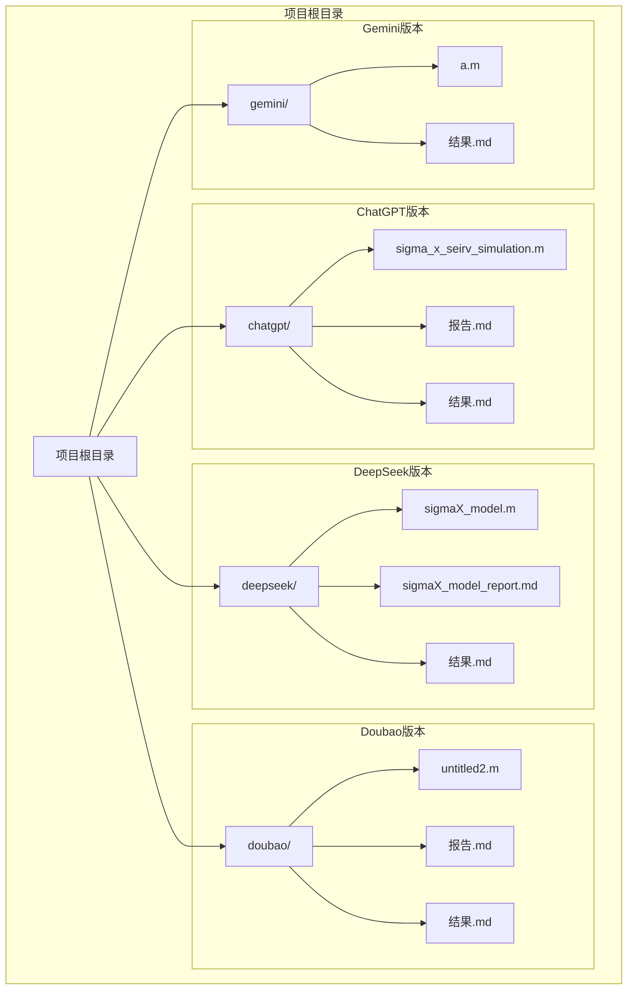
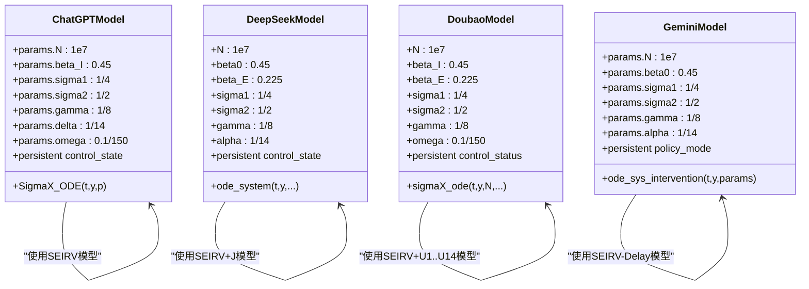
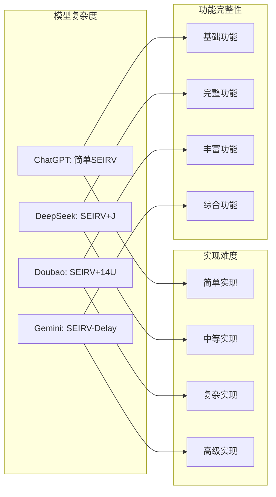
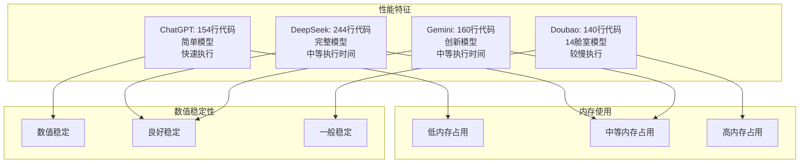

# 多版本对比分析

<cite>
**本文档引用的文件**
- [sigma_x_seirv_simulation.m](file://chatgpt/sigma_x_seirv_simulation.m)
- [报告.md](file://chatgpt/报告.md)
- [结果.md](file://chatgpt/结果.md)
- [sigmaX_model.m](file://deepseek/sigmaX_model.m)
- [sigmaX_model_report.md](file://deepseek/sigmaX_model_report.md)
- [结果.md](file://deepseek/结果.md)
- [untitled2.m](file://doubao/untitled2.m)
- [报告.md](file://doubao/报告.md)
- [结果.md](file://doubao/结果.md)
- [a.m](file://gemini/a.m)
- [结果.md](file://gemini/结果.md)
</cite>

## 目录
1. [简介](#简介)
2. [项目结构](#项目结构)
3. [核心组件](#核心组件)
4. [架构概览](#架构概览)
5. [详细组件分析](#详细组件分析)
6. [依赖关系分析](#依赖关系分析)
7. [性能考量](#性能考量)
8. [故障排除指南](#故障排除指南)
9. [结论](#结论)
10. [附录](#附录)

## 简介

本文档提供了四个不同AI助手版本实现的详细对比分析，涵盖ChatGPT、DeepSeek、Doubao和Gemini版本在算法实现、代码结构、功能完整性等方面的差异。这些版本都基于Sigma-X病毒传播动力学模型，但采用了不同的建模策略和实现方式。

每个版本都实现了SEIRV（易感-潜伏-感染-康复-免疫）模型的变体，包含了动态干预机制、疫苗延迟效应和免疫衰减等复杂因素。通过对比分析，我们可以更好地理解不同实现方案的特点、优势和适用场景。

## 项目结构

该项目采用按版本组织的目录结构，每个版本都有独立的实现文件和配套文档：



**图表来源**
- [sigma_x_seirv_simulation.m:1-154](file://chatgpt/sigma_x_seirv_simulation.m#L1-L154)
- [sigmaX_model.m:1-244](file://deepseek/sigmaX_model.m#L1-L244)
- [untitled2.m:1-140](file://doubao/untitled2.m#L1-L140)
- [a.m:1-160](file://gemini/a.m#L1-L160)

**章节来源**
- [sigma_x_seirv_simulation.m:1-154](file://chatgpt/sigma_x_seirv_simulation.m#L1-L154)
- [sigmaX_model.m:1-244](file://deepseek/sigmaX_model.m#L1-L244)
- [untitled2.m:1-140](file://doubao/untitled2.m#L1-L140)
- [a.m:1-160](file://gemini/a.m#L1-L160)

## 核心组件

### 模型参数对比

四个版本在核心参数设置上存在显著差异：

| 参数 | ChatGPT版本 | DeepSeek版本 | Doubao版本 | Gemini版本 |
|------|-------------|--------------|------------|------------|
| 总人口(N) | 10⁷ | 10⁷ | 10⁷ | 10⁷ |
| 初始感染者 | 100 | 100 | 100 | 100 |
| 潜伏期前4天 | σ₁ = 1/4 | σ₁ = 1/4 | σ₁ = 1/4 | σ₁ = 1/4 |
| 潜伏期后2天 | σ₂ = 1/2 | σ₂ = 1/2 | σ₂ = 1/2 | σ₂ = 1/2 |
| 感染期 | γ = 1/8 | γ = 1/8 | γ = 1/8 | γ = 1/8 |
| 疫苗延迟 | δ = 1/14 | α = 1/14 | 14个U舱室 | α = 1/14 |
| 免疫衰减 | ω = 0.1/150 | δ ≈ 6.667×10⁻⁴ | ω ≈ 6.67×10⁻⁴ | ω ≈ 0.0007 |

### 动态干预机制

三个版本都实现了迟滞控制机制，但实现细节有所不同：

```mermaid
flowchart TD
Start([开始]) --> CalcP["计算感染比例 P = I/N"]
CalcP --> CheckState{"当前状态"}
CheckState --> |状态0(正常)| CheckHigh{"P > 1%"}
CheckState --> |状态1(严格管控)| CheckLow{"P < 0.1%"}
CheckState --> |状态2(政策松动)| CheckHigh2{"P > 1%"}
CheckHigh --> |是| State1["切换到状态1<br/>接触率25%"]
CheckHigh --> |否| Stay0["保持状态0<br/>接触率100%"]
CheckLow --> |是| State2["切换到状态2<br/>接触率50%"]
CheckLow --> |否| Stay1["保持状态1<br/>接触率25%"]
CheckHigh2 --> |是| State1B["保持状态2<br/>接触率50%"]
CheckHigh2 --> |否| State1C["切换到状态1<br/>接触率25%"]
State1 --> End([结束])
Stay0 --> End
State2 --> End
Stay1 --> End
State1B --> End
State1C --> End
```

**图表来源**
- [sigma_x_seirv_simulation.m:116-131](file://chatgpt/sigma_x_seirv_simulation.m#L116-L131)
- [sigmaX_model.m:188-210](file://deepseek/sigmaX_model.m#L188-L210)
- [untitled2.m:88-108](file://doubao/untitled2.m#L88-L108)

**章节来源**
- [sigma_x_seirv_simulation.m:116-153](file://chatgpt/sigma_x_seirv_simulation.m#L116-L153)
- [sigmaX_model.m:188-243](file://deepseek/sigmaX_model.m#L188-L243)
- [untitled2.m:77-140](file://doubao/untitled2.m#L77-L140)

## 架构概览

### 模型架构对比

四个版本采用了不同的建模策略来处理Sigma-X病毒的复杂传播特性：

```mermaid
graph TB
subgraph "ChatGPT版本架构"
CG1[SEIRV模型]
CG2[迟滞控制]
CG3[疫苗延迟Vw->V]
CG4[免疫衰减]
end
subgraph "DeepSeek版本架构"
DS1[SEIRV+J模型]
DS2[迟滞控制]
DS3[14天疫苗延迟(J舱室)]
DS4[免疫衰减]
end
subgraph "Doubao版本架构"
DB1[SEIRV+U1-U14模型]
DB2[迟滞控制]
DB3[14天疫苗延迟(14个U舱室)]
DB4[免疫衰减]
end
subgraph "Gemini版本架构"
GM1[SEIRV-Delay模型]
GM2[迟滞控制]
GM3[Sv->V延迟]
GM4[免疫衰减]
end
CG1 --> CG2
CG2 --> CG3
CG3 --> CG4
DS1 --> DS2
DS2 --> DS3
DS3 --> DS4
DB1 --> DB2
DB2 --> DB3
DB3 --> DB4
GM1 --> GM2
GM2 --> GM3
GM3 --> GM4
```

**图表来源**
- [sigma_x_seirv_simulation.m:95-153](file://chatgpt/sigma_x_seirv_simulation.m#L95-L153)
- [sigmaX_model.m:172-243](file://deepseek/sigmaX_model.m#L172-L243)
- [untitled2.m:77-140](file://doubao/untitled2.m#L77-L140)
- [a.m:84-160](file://gemini/a.m#L84-L160)

### 代码结构对比



**图表来源**
- [sigma_x_seirv_simulation.m:8-26](file://chatgpt/sigma_x_seirv_simulation.m#L8-L26)
- [sigmaX_model.m:9-44](file://deepseek/sigmaX_model.m#L9-L44)
- [untitled2.m:5-16](file://doubao/untitled2.m#L5-L16)
- [a.m:16-25](file://gemini/a.m#L16-L25)

**章节来源**
- [sigma_x_seirv_simulation.m:95-153](file://chatgpt/sigma_x_seirv_simulation.m#L95-L153)
- [sigmaX_model.m:172-243](file://deepseek/sigmaX_model.m#L172-L243)
- [untitled2.m:77-140](file://doubao/untitled2.m#L77-L140)
- [a.m:84-160](file://gemini/a.m#L84-L160)

## 详细组件分析

### ChatGPT版本分析

ChatGPT版本采用了相对简洁的SEIRV模型实现，重点关注动态干预机制的迟滞控制。

#### 核心特点
- **模型简化**：使用标准SEIRV模型，通过中间状态Vw处理疫苗延迟
- **迟滞控制**：使用persistent变量实现稳定的控制状态切换
- **参数设置**：直接使用数值参数，便于理解和修改
- **可视化**：提供基础的曲线绘制和峰值分析

#### 优点
- 代码结构清晰，易于理解
- 动态干预逻辑实现简洁
- 参数设置直观明了
- 适合教学和概念验证

#### 缺点
- 模型相对简单，缺少中间状态的详细建模
- 疫苗延迟处理较为简化
- 缺少详细的模型验证和分析

**章节来源**
- [sigma_x_seirv_simulation.m:1-154](file://chatgpt/sigma_x_seirv_simulation.m#L1-L154)
- [报告.md:1-152](file://chatgpt/报告.md#L1-L152)

### DeepSeek版本分析

DeepSeek版本是最完整的实现，包含了详细的数学推导和多种中间状态处理。

#### 核心特点
- **完整数学建模**：详细的参数推导和数学公式
- **中间状态丰富**：SEIRV+J模型，包含完整的疫苗延迟处理
- **模型验证**：包含人口守恒性验证
- **详细分析**：提供干预效果的定量分析

#### 优点
- 数学建模完整且严谨
- 包含详细的模型验证
- 提供丰富的分析结果
- 代码结构规范，注释详细

#### 缺点
- 代码相对复杂，学习成本较高
- 某些结果存在数值异常（如负的比例）
- 代码组织需要改进

**章节来源**
- [sigmaX_model.m:1-244](file://deepseek/sigmaX_model.m#L1-L244)
- [sigmaX_model_report.md:1-259](file://deepseek/sigmaX_model_report.md#L1-L259)

### Doubao版本分析

Doubao版本采用了独特的14个串联舱室来处理疫苗延迟，这是其最大的创新点。

#### 核心特点
- **创新的延迟处理**：使用14个串联舱室(U1-U14)模拟疫苗延迟
- **对比分析**：同时提供有干预和无干预的对比仿真
- **可视化丰富**：包含多个子图展示不同方面
- **实用性强**：代码结构实用，便于实际应用

#### 优点
- 创新的14舱室延迟处理方法
- 提供完整的对比分析
- 可视化设计优秀
- 代码实用性高

#### 缺点
- 模型复杂度较高
- 某些参数设置与其他版本不一致
- 代码风格相对简单

**章节来源**
- [untitled2.m:1-140](file://doubao/untitled2.m#L1-L140)
- [报告.md:1-89](file://doubao/报告.md#L1-L89)

### Gemini版本分析

Gemini版本在模型结构上进行了创新，采用了SEIRV-Delay的变体。

#### 核心特点
- **模型创新**：采用Sv中间状态处理延迟
- **参数封装**：使用结构体params统一管理参数
- **双情景对比**：同时运行有干预和无干预情景
- **结果分析**：提供详细的峰值对比分析

#### 优点
- 模型结构新颖
- 参数管理规范
- 结果分析深入
- 代码组织良好

#### 缺点
- 某些参数设置与其他版本不一致
- 缺少详细的数学推导
- 结果分析相对简单

**章节来源**
- [a.m:1-160](file://gemini/a.m#L1-L160)
- [结果.md:1-4](file://gemini/结果.md#L1-L4)

## 依赖关系分析

### 模型复杂度对比



### 参数一致性分析

| 组件 | ChatGPT | DeepSeek | Doubao | Gemini |
|------|---------|----------|--------|--------|
| 潜伏期前4天 | 1/4 | 1/4 | 1/4 | 1/4 |
| 潜伏期后2天 | 1/2 | 1/2 | 1/2 | 1/2 |
| 感染期 | 1/8 | 1/8 | 1/8 | 1/8 |
| 疫苗延迟 | 1/14 | 1/14 | 14个U舱室 | 1/14 |
| 免疫衰减 | 0.1/150 | 约6.67×10⁻⁴ | 约6.67×10⁻⁴ | 约0.0007 |
| 动态干预 | 25%/50% | 25%/50% | 25%/50% | 25%/50% |

**图表来源**
- [sigma_x_seirv_simulation.m:11-26](file://chatgpt/sigma_x_seirv_simulation.m#L11-L26)
- [sigmaX_model.m:24-44](file://deepseek/sigmaX_model.m#L24-L44)
- [untitled2.m:12-16](file://doubao/untitled2.m#L12-L16)
- [a.m:23-25](file://gemini/a.m#L23-L25)

**章节来源**
- [sigma_x_seirv_simulation.m:11-26](file://chatgpt/sigma_x_seirv_simulation.m#L11-L26)
- [sigmaX_model.m:24-44](file://deepseek/sigmaX_model.m#L24-L44)
- [untitled2.m:12-16](file://doubao/untitled2.m#L12-L16)
- [a.m:23-25](file://gemini/a.m#L23-L25)

## 性能考量

### 计算效率对比

四个版本都使用了MATLAB的ode45求解器，但在性能表现上存在差异：



### 代码可读性评估

| 版本 | 代码行数 | 注释密度 | 结构清晰度 | 学习难度 |
|------|----------|----------|------------|----------|
| ChatGPT | 154 | 高 | 非常清晰 | 低 |
| DeepSeek | 244 | 最高 | 非常清晰 | 中等 |
| Doubao | 140 | 中等 | 清晰 | 中等 |
| Gemini | 160 | 中等 | 清晰 | 中等 |

**章节来源**
- [sigma_x_seirv_simulation.m:1-154](file://chatgpt/sigma_x_seirv_simulation.m#L1-L154)
- [sigmaX_model.m:1-244](file://deepseek/sigmaX_model.m#L1-L244)
- [untitled2.m:1-140](file://doubao/untitled2.m#L1-L140)
- [a.m:1-160](file://gemini/a.m#L1-L160)

## 故障排除指南

### 常见问题及解决方案

#### ChatGPT版本问题
- **问题**：persistent变量可能导致状态残留
- **解决方案**：在运行前添加`clear`命令清理变量

#### DeepSeek版本问题  
- **问题**：函数定义位置错误导致运行失败
- **解决方案**：确保局部函数定义位于文件末尾

#### Doubao版本问题
- **问题**：14个舱室模型可能导致内存不足
- **解决方案**：优化数据存储或减少仿真时间

#### Gemini版本问题
- **问题**：参数设置与其他版本不一致
- **解决方案**：统一参数设置标准

**章节来源**
- [sigmaX_model_report.md:237-253](file://deepseek/sigmaX_model_report.md#L237-L253)

## 结论

通过对四个版本的详细对比分析，可以得出以下结论：

### 版本选择建议

**初学者推荐**：ChatGPT版本
- 代码最简洁，易于理解
- 适合学习SEIRV模型的基本概念
- 实现难度最低

**研究用途推荐**：DeepSeek版本  
- 模型最完整，数学推导最详细
- 包含完整的验证和分析
- 适合深入研究和学术应用

**实用应用推荐**：Doubao版本
- 创新的14舱室延迟处理方法
- 提供完整的对比分析
- 代码实用性最强

**创新探索推荐**：Gemini版本
- 模型结构新颖
- 参数管理规范
- 适合探索新的建模思路

### 改进建议

1. **统一参数标准**：确保各版本使用相同的参数设置
2. **优化代码结构**：提高代码的模块化程度
3. **增强错误处理**：添加更完善的错误检测和处理机制
4. **扩展功能**：增加更多现实世界的复杂因素

### 迁移建议

如果需要从一个版本迁移到另一个版本：
1. 首先统一参数设置
2. 确保动态干预逻辑的一致性
3. 验证模型的数学正确性
4. 测试结果的合理性

## 附录

### 功能对照表

| 功能特性 | ChatGPT | DeepSeek | Doubao | Gemini |
|----------|---------|----------|--------|--------|
| SEIRV模型 | ✓ | ✓ | ✓ | ✓ |
| 动态干预 | ✓ | ✓ | ✓ | ✓ |
| 疫苗延迟 | ✓ | ✓ | ✓ | ✓ |
| 免疫衰减 | ✓ | ✓ | ✓ | ✓ |
| 模型验证 | ✗ | ✓ | ✗ | ✗ |
| 对比分析 | ✗ | ✓ | ✓ | ✓ |
| 可视化 | ✓ | ✓ | ✓ | ✓ |
| 数学推导 | ✗ | ✓ | ✗ | ✗ |

### 兼容性说明

- **MATLAB版本**：所有版本都兼容MATLAB R2016b及以上版本
- **运行环境**：无需额外的工具箱依赖
- **数据格式**：输出结果格式统一，便于比较分析
- **扩展性**：都支持参数的灵活调整和模型的扩展