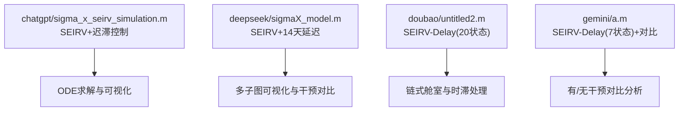
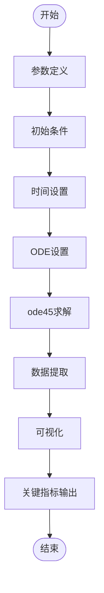
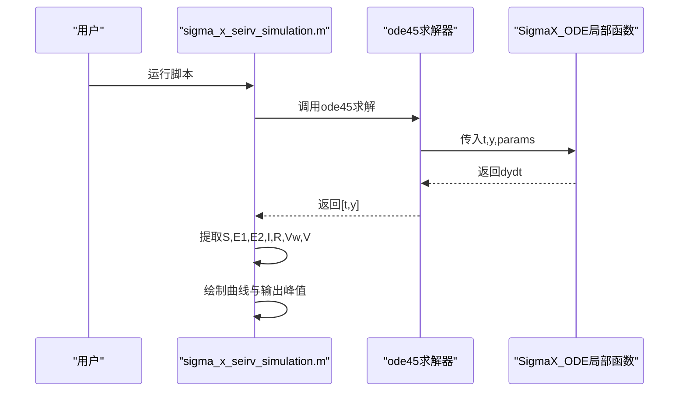
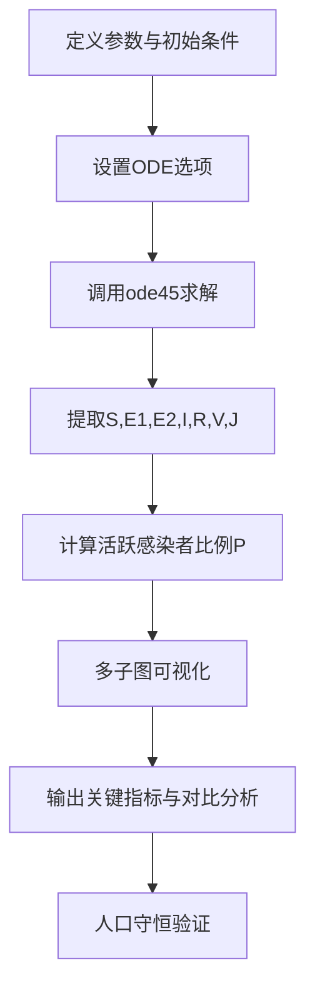
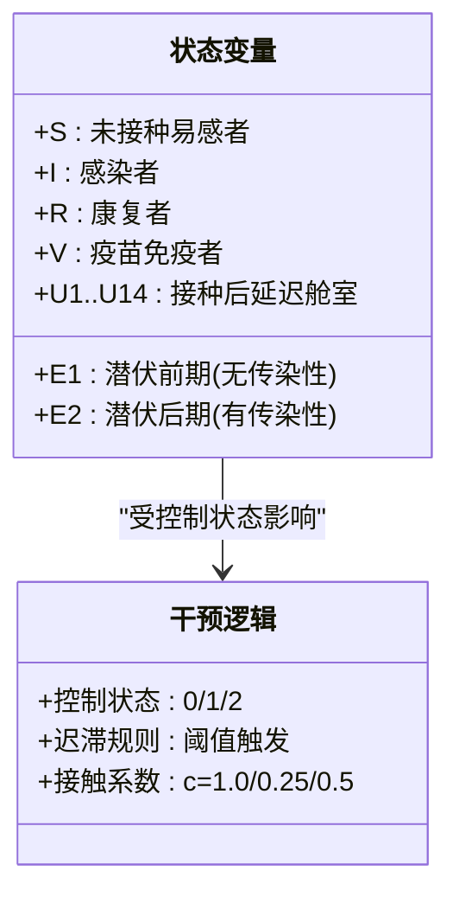
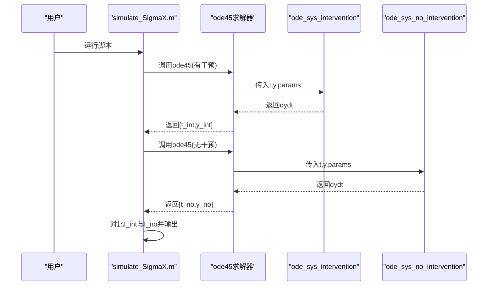
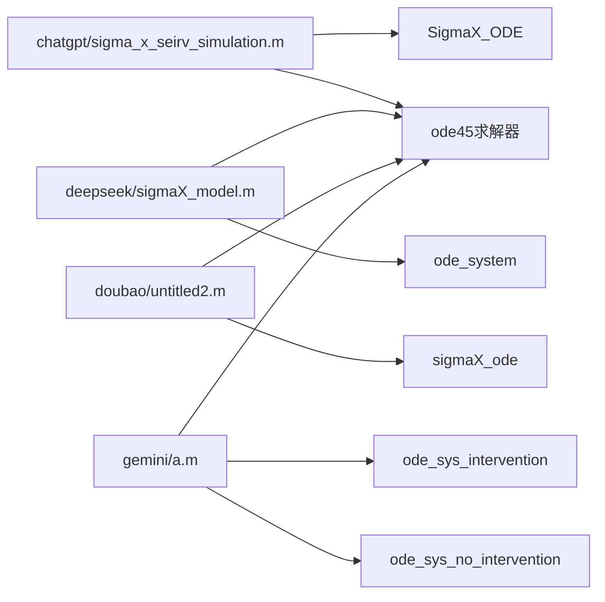

# 快速开始

<cite>
**本文引用的文件**
- [sigma_x_seirv_simulation.m](file://chatgpt/sigma_x_seirv_simulation.m)
- [sigmaX_model.m](file://deepseek/sigmaX_model.m)
- [untitled2.m](file://doubao/untitled2.m)
- [simulate_SigmaX.m](file://gemini/a.m)
- [报告.md](file://chatgpt/报告.md)
- [sigmaX_model_report.md](file://deepseek/sigmaX_model_report.md)
- [报告.md](file://doubao/报告.md)
- [结果.md](file://chatgpt/结果.md)
- [结果.md](file://gemini/结果.md)
</cite>

## 目录
1. [简介](#简介)
2. [项目结构](#项目结构)
3. [核心组件](#核心组件)
4. [架构概览](#架构概览)
5. [详细组件分析](#详细组件分析)
6. [依赖关系分析](#依赖关系分析)
7. [性能考量](#性能考量)
8. [故障排除指南](#故障排除指南)
9. [结论](#结论)
10. [附录](#附录)

## 简介
本指南面向首次接触MATLAB传染病传播动力学仿真的用户，帮助您在30分钟内完成环境准备、安装配置、首次运行以及基础参数修改。项目包含四个版本的Sigma-X病毒传播模型脚本，均基于SEIRV（或SEIRV-Delay）模型，结合动态干预（迟滞控制）与疫苗延迟机制，展示不同实现方式与可视化策略。每个脚本都内置了完整的参数定义、ODE求解、数据提取、可视化与关键指标输出，适合快速上手与对比学习。

## 项目结构
仓库包含四个主要脚本，分别位于不同子目录：
- chatgpt：SEIRV+时滞+迟滞控制的单文件脚本，参数集中定义，局部函数实现ODE与干预逻辑
- deepseek：SEIRV+14天疫苗延迟的完整脚本，包含多子图可视化与干预效果对比
- doubao：SEIRV-Delay（20个状态变量）+迟滞控制的脚本，强调链式舱室处理时滞
- gemini：SEIRV-Delay（7个状态变量）+动态干预与疫苗的脚本，对比有/无干预情景

**图表来源**
- [sigma_x_seirv_simulation.m:1-154](file://chatgpt/sigma_x_seirv_simulation.m#L1-L154)
- [sigmaX_model.m:1-244](file://deepseek/sigmaX_model.m#L1-L244)
- [untitled2.m:1-140](file://doubao/untitled2.m#L1-L140)
- [simulate_SigmaX.m:1-160](file://gemini/a.m#L1-L160)

**章节来源**
- [sigma_x_seirv_simulation.m:1-154](file://chatgpt/sigma_x_seirv_simulation.m#L1-L154)
- [sigmaX_model.m:1-244](file://deepseek/sigmaX_model.m#L1-L244)
- [untitled2.m:1-140](file://doubao/untitled2.m#L1-L140)
- [simulate_SigmaX.m:1-160](file://gemini/a.m#L1-L160)

## 核心组件
- 参数定义区：人口总数、初始状态、传播参数、状态转移速率、干预阈值、疫苗参数等
- 初始条件区：S、E1、E2、I、R、V等状态的初始分布
- 时间设置区：仿真时间跨度与输出步长
- ODE设置区：求解器选项（如相对/绝对容差、非负约束）
- 求解与数据提取：调用ode45求解，提取各状态序列
- 可视化与关键指标：绘制曲线、标注峰值、输出感染峰值与出现时间
- 局部函数：实现ODE系统与动态干预逻辑（迟滞控制）

**章节来源**
- [sigma_x_seirv_simulation.m:7-91](file://chatgpt/sigma_x_seirv_simulation.m#L7-L91)
- [sigmaX_model.m:8-127](file://deepseek/sigmaX_model.m#L8-L127)
- [untitled2.m:4-76](file://doubao/untitled2.m#L4-L76)
- [simulate_SigmaX.m:15-79](file://gemini/a.m#L15-L79)

## 架构概览
四个脚本均遵循“参数定义→初始条件→时间设置→ODE设置→求解→数据提取→可视化→关键指标”的统一流程。差异主要体现在：
- 状态变量数量与模型复杂度：chatgpt为7状态，deepseek为7状态但含14天延迟中间态，doubao为20状态（链式舱室），gemini为7状态（Sv中间态）
- 动态干预实现：均使用persistent变量维持控制状态，避免阈值振荡
- 可视化策略：chatgpt与gemini侧重单图展示，deepseek与doubao提供多子图对比分析

**图表来源**
- [sigma_x_seirv_simulation.m:43-91](file://chatgpt/sigma_x_seirv_simulation.m#L43-L91)
- [sigmaX_model.m:60-127](file://deepseek/sigmaX_model.m#L60-L127)
- [untitled2.m:22-76](file://doubao/untitled2.m#L22-L76)
- [simulate_SigmaX.m:27-79](file://gemini/a.m#L27-L79)

## 详细组件分析

### chatgpt版本（SEIRV+迟滞控制）
- 模型结构：S、E1（无传染性）、E2（有传染性）、I、R、Vw（接种未免疫）、V（免疫）
- 动态干预：基于感染者比例的迟滞控制，切换接触系数
- 疫苗：自第30天起以固定速率接种，引入Vw→V延迟
- 输出：峰值感染人数与出现时间

**图表来源**
- [sigma_x_seirv_simulation.m:49-91](file://chatgpt/sigma_x_seirv_simulation.m#L49-L91)
- [sigma_x_seirv_simulation.m:95-153](file://chatgpt/sigma_x_seirv_simulation.m#L95-L153)

**章节来源**
- [sigma_x_seirv_simulation.m:7-91](file://chatgpt/sigma_x_seirv_simulation.m#L7-L91)
- [sigma_x_seirv_simulation.m:95-153](file://chatgpt/sigma_x_seirv_simulation.m#L95-L153)
- [结果.md:1-2](file://chatgpt/结果.md#L1-L2)

### deepseek版本（SEIRV+14天延迟）
- 模型结构：S、E1、E2、I、R、V、J（已接种未免疫）
- 动态干预：迟滞控制，切换接触调整因子
- 疫苗：每日接种人数，延迟项αJ，保护率ε
- 可视化：四子图（人群数量、比例、新增感染、累积感染）
- 关键指标：峰值时间与人数、最终比例、干预效果对比、人口守恒验证

**图表来源**
- [sigmaX_model.m:60-127](file://deepseek/sigmaX_model.m#L60-L127)
- [sigmaX_model.m:128-169](file://deepseek/sigmaX_model.m#L128-L169)

**章节来源**
- [sigmaX_model.m:8-127](file://deepseek/sigmaX_model.m#L8-L127)
- [sigmaX_model_report.md:172-178](file://deepseek/sigmaX_model_report.md#L172-L178)

### doubao版本（SEIRV-Delay（20状态））
- 模型结构：S、E1、E2、I、R、V、U1..U14（链式舱室）
- 动态干预：迟滞控制，接触系数按状态切换
- 疫苗：每日接种，不超过易感人群，U14→V或返回S
- 可视化：有/无干预对比曲线

**图表来源**
- [untitled2.m:77-140](file://doubao/untitled2.m#L77-L140)

**章节来源**
- [untitled2.m:4-76](file://doubao/untitled2.m#L4-L76)
- [报告.md:23-35](file://doubao/报告.md#L23-L35)

### gemini版本（SEIRV-Delay（7状态）+对比）
- 模型结构：S、Sv（抗体形成期）、E1、E2、I、R、V
- 动态干预：迟滞控制，β按状态调整
- 疫苗：v_rate按易感者比例计算
- 对比：有/无干预两组情景，输出峰值对比

**图表来源**
- [simulate_SigmaX.m:31-49](file://gemini/a.m#L31-L49)
- [simulate_SigmaX.m:84-134](file://gemini/a.m#L84-L134)
- [simulate_SigmaX.m:139-160](file://gemini/a.m#L139-L160)

**章节来源**
- [simulate_SigmaX.m:15-79](file://gemini/a.m#L15-L79)
- [结果.md:1-4](file://gemini/结果.md#L1-L4)

## 依赖关系分析
- 共同依赖：MATLAB ODE求解器（ode45）、绘图工具、非负约束设置
- 特殊依赖：
  - chatgpt：局部函数SigmaX_ODE
  - deepseek：局部函数ode_system
  - doubao：局部函数sigmaX_ode
  - gemini：局部函数ode_sys_intervention与ode_sys_no_intervention
- 持久化变量：用于维持控制状态，避免阈值振荡

**图表来源**
- [sigma_x_seirv_simulation.m:95-153](file://chatgpt/sigma_x_seirv_simulation.m#L95-L153)
- [sigmaX_model.m:172-243](file://deepseek/sigmaX_model.m#L172-L243)
- [untitled2.m:77-140](file://doubao/untitled2.m#L77-L140)
- [simulate_SigmaX.m:84-160](file://gemini/a.m#L84-L160)

**章节来源**
- [sigma_x_seirv_simulation.m:43-49](file://chatgpt/sigma_x_seirv_simulation.m#L43-L49)
- [sigmaX_model.m:60-66](file://deepseek/sigmaX_model.m#L60-L66)
- [untitled2.m:23-24](file://doubao/untitled2.m#L23-L24)
- [simulate_SigmaX.m:29-32](file://gemini/a.m#L29-L32)

## 性能考量
- 求解器选择：默认ode45（变步长），适用于大多数SEIRV模型
- 容差设置：相对/绝对容差通常足够，可根据收敛性调整
- 非负约束：启用以保证数值稳定性
- 时间步长：0.1天输出步长已足够平滑，不影响求解速度
- 可视化开销：多子图与多次绘图会增加CPU时间，建议在调试阶段使用，发布时可关闭

[本节为通用指导，无需特定文件来源]

## 故障排除指南
- 函数定义位置错误（仅限deepseek版本）：局部函数必须置于文件末尾，否则报错。请参考报告中的修复说明与文件结构重排。
- persistent变量残留：若上次运行状态影响本次结果，请在运行前清空局部函数中的persistent变量（例如在gemini版本中清空局部函数）。
- 阈值振荡：使用persistent变量维持控制状态，避免频繁切换。
- 疫苗接种上限：确保每日接种不超过剩余易感人群（doubao版本已内置min限制）。
- 输出图形异常：检查figure与subplot设置，确保坐标轴范围与标签正确。

**章节来源**
- [sigmaX_model_report.md:237-253](file://deepseek/sigmaX_model_report.md#L237-L253)
- [simulate_SigmaX.m:28-29](file://gemini/a.m#L28-L29)
- [untitled2.m:112-116](file://doubao/untitled2.m#L112-L116)

## 结论
四个版本脚本展示了SEIRV模型的不同实现路径：从简化的7状态（chatgpt/gemini）到包含14天延迟的中间态（deepseek/doubao）。它们共同体现了动态干预（迟滞控制）与疫苗延迟的关键机制。建议新手先从chatgpt版本入手，理解基本流程后再对比其他版本的差异与优势。

[本节为总结性内容，无需特定文件来源]

## 附录

### 运行环境要求
- MATLAB版本：推荐R2016b及以上（doubao版本明确标注支持脚本内嵌局部函数）
- 基本工具箱：MATLAB核心工具箱（含ode45、绘图功能）
- 硬件要求：普通桌面或笔记本即可，内存建议≥4GB

[本节为通用指导，无需特定文件来源]

### 安装配置步骤
- 安装MATLAB并启动
- 将四个脚本文件复制到同一工作目录（或添加到MATLAB路径）
- 确保本地函数位于文件末尾（特别是deepseek版本）
- 运行任一脚本，查看输出与图形

[本节为通用指导，无需特定文件来源]

### 第一次运行完整流程
- chatgpt版本
  - 在命令窗口输入脚本名称运行
  - 查看峰值输出与曲线图
  - 示例命令：运行[sigma_x_seirv_simulation.m](file://chatgpt/sigma_x_seirv_simulation.m)
  - 预期输出：打印感染峰值人数与出现时间
- deepseek版本
  - 运行[sigmaX_model.m](file://deepseek/sigmaX_model.m)
  - 查看四子图与关键指标汇总
  - 预期输出：包含峰值、最终比例、干预效果与人口守恒验证
- doubao版本
  - 运行[untitled2.m](file://doubao/untitled2.m)
  - 查看有/无干预对比图与结果
  - 预期输出：有干预与无干预的峰值对比
- gemini版本
  - 运行[simulate_SigmaX.m](file://gemini/a.m)
  - 查看两组情景的曲线与对比分析
  - 预期输出：有/无干预峰值对比与放大倍数

**章节来源**
- [sigma_x_seirv_simulation.m:85-91](file://chatgpt/sigma_x_seirv_simulation.m#L85-L91)
- [sigmaX_model.m:128-169](file://deepseek/sigmaX_model.m#L128-L169)
- [untitled2.m:34-49](file://doubao/untitled2.m#L34-L49)
- [simulate_SigmaX.m:46-49](file://gemini/a.m#L46-L49)

### 修改基本参数进行简单实验
- 传播参数：β_I、β_E、σ1、σ2、γ、ω等
- 干预阈值：th_high、th_low（chatgpt）或threshold_strict、threshold_relax（deepseek）
- 疫苗参数：vacc_rate、vacc_eff、t_vacc_start、alpha等
- 时间跨度：tspan（仿真天数与步长）
- 初始条件：S0、E10、E20、I0、R0、V0等

**章节来源**
- [sigma_x_seirv_simulation.m:8-26](file://chatgpt/sigma_x_seirv_simulation.m#L8-L26)
- [sigmaX_model.m:8-56](file://deepseek/sigmaX_model.m#L8-L56)
- [untitled2.m:4-16](file://doubao/untitled2.m#L4-L16)
- [simulate_SigmaX.m:15-26](file://gemini/a.m#L15-L26)

### 常见启动错误与解决方案
- 函数定义位置错误：将局部函数移动到文件末尾
- persistent变量残留：运行前清空局部函数中的persistent变量
- 阈值振荡：使用persistent变量维持控制状态
- 疫苗接种超限：限制每日接种不超过易感人群
- 图形显示异常：检查figure与subplot设置

**章节来源**
- [sigmaX_model_report.md:237-253](file://deepseek/sigmaX_model_report.md#L237-L253)
- [simulate_SigmaX.m:28-29](file://gemini/a.m#L28-L29)
- [untitled2.m:112-116](file://doubao/untitled2.m#L112-L116)

### 实际命令行示例与预期输出
- chatgpt版本
  - 命令：运行[sigma_x_seirv_simulation.m](file://chatgpt/sigma_x_seirv_simulation.m)
  - 输出：打印感染峰值人数与出现时间
- deepseek版本
  - 命令：运行[sigmaX_model.m](file://deepseek/sigmaX_model.m)
  - 输出：四子图与关键指标汇总
- doubao版本
  - 命令：运行[untitled2.m](file://doubao/untitled2.m)
  - 输出：有/无干预对比与峰值信息
- gemini版本
  - 命令：运行[simulate_SigmaX.m](file://gemini/a.m)
  - 输出：有/无干预峰值对比与放大倍数

**章节来源**
- [结果.md:1-2](file://chatgpt/结果.md#L1-L2)
- [sigmaX_model.m:128-169](file://deepseek/sigmaX_model.m#L128-L169)
- [untitled2.m:34-49](file://doubao/untitled2.m#L34-L49)
- [结果.md:1-4](file://gemini/结果.md#L1-L4)