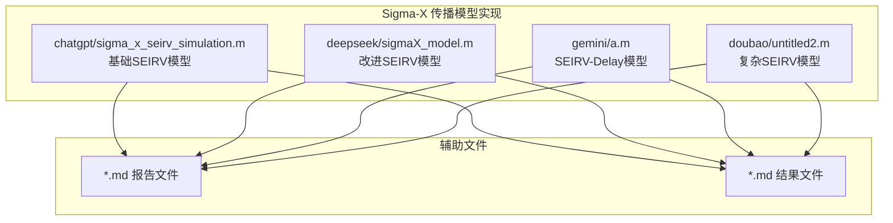
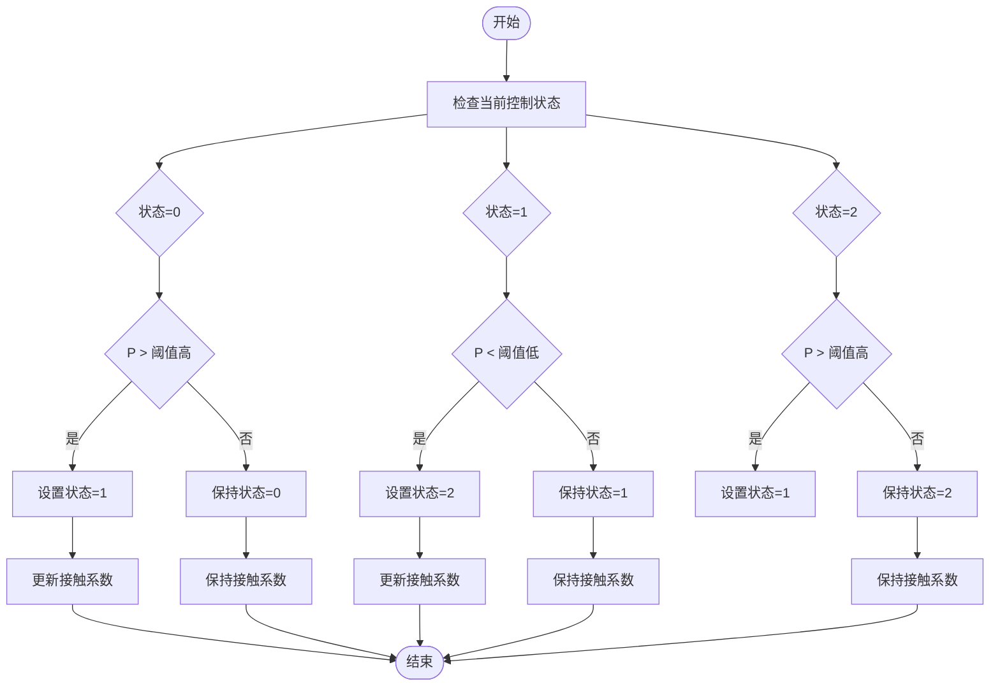
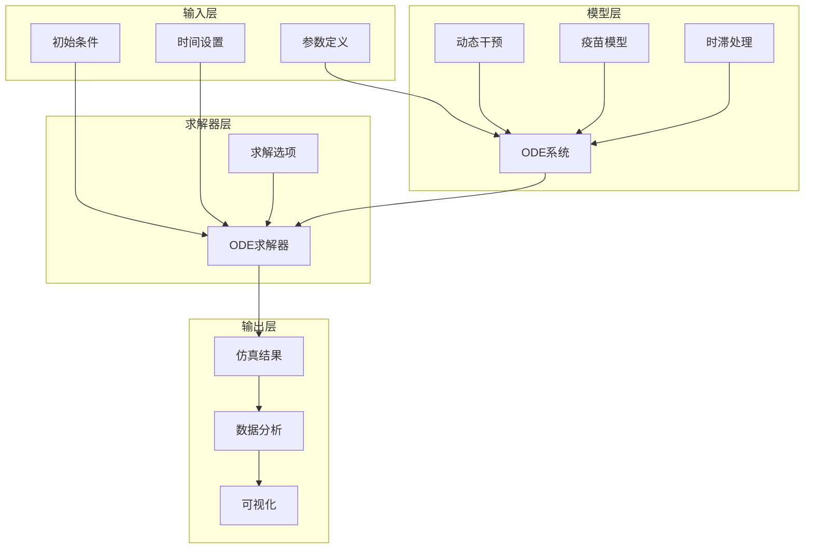
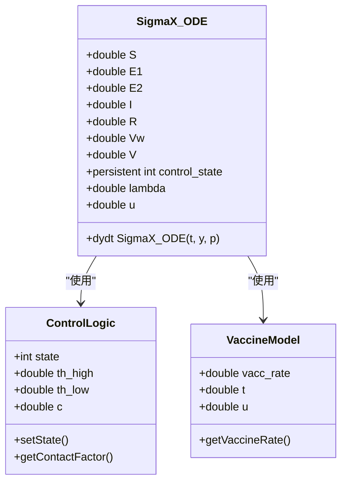
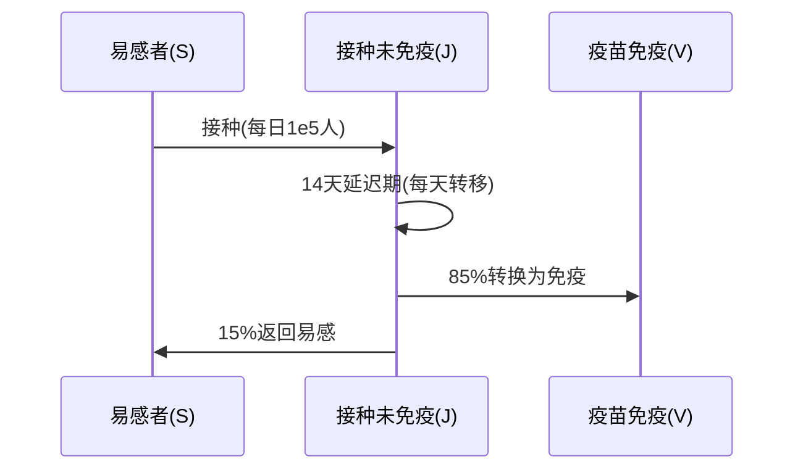
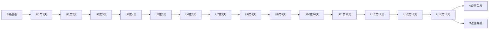
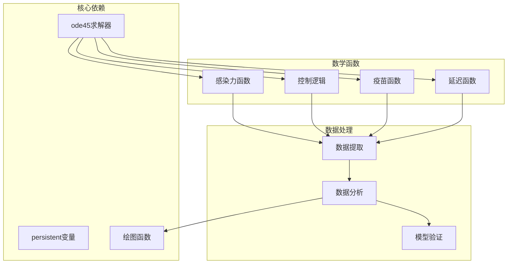
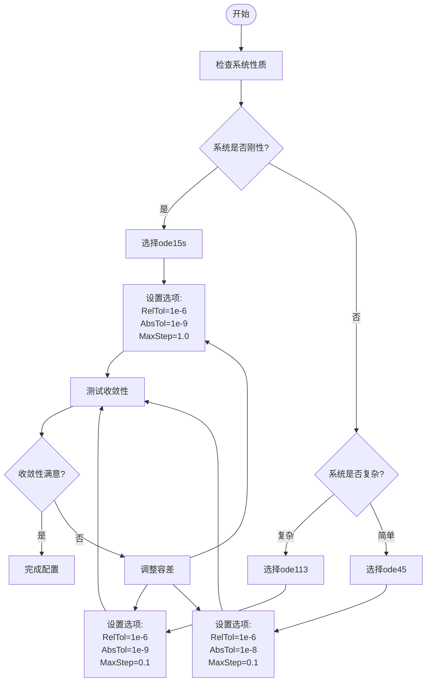

# 故障排除与调试

<cite>
**本文档引用的文件**
- [sigma_x_seirv_simulation.m](file://chatgpt/sigma_x_seirv_simulation.m)
- [sigmaX_model.m](file://deepseek/sigmaX_model.m)
- [a.m](file://gemini/a.m)
- [untitled2.m](file://doubao/untitled2.m)
- [sigmaX_model_report.md](file://deepseek/sigmaX_model_report.md)
- [报告.md](file://chatgpt/报告.md)
- [结果.md](file://chatgpt/结果.md)
- [结果.md](file://deepseek/结果.md)
- [结果.md](file://doubao/结果.md)
- [结果.md](file://gemini/结果.md)
</cite>

## 目录
1. [简介](#简介)
2. [项目结构](#项目结构)
3. [核心组件](#核心组件)
4. [架构概览](#架构概览)
5. [详细组件分析](#详细组件分析)
6. [依赖关系分析](#依赖关系分析)
7. [性能考虑](#性能考虑)
8. [故障排除指南](#故障排除指南)
9. [调试技巧与最佳实践](#调试技巧与最佳实践)
10. [ODE求解器配置与调优](#ode求解器配置与调优)
11. [收敛问题诊断](#收敛问题诊断)
12. [内存优化与大数据集处理](#内存优化与大数据集处理)
13. [单元测试与集成测试](#单元测试与集成测试)
14. [性能监控与结果验证](#性能监控与结果验证)
15. [实际调试案例](#实际调试案例)
16. [结论](#结论)

## 简介

本指南专注于Sigma-X病毒传播动力学仿真系统的故障排除与调试。该系统基于SEIRV模型，结合了时滞控制、疫苗延迟和免疫衰减等复杂因素。文档涵盖了从基础的运行时错误诊断到高级的ODE求解器调优，以及性能优化和测试验证的完整流程。

## 项目结构

该项目包含四个主要的仿真实现，每个都针对不同的建模需求和复杂度：



**图表来源**
- [sigma_x_seirv_simulation.m:1-154](file://chatgpt/sigma_x_seirv_simulation.m#L1-L154)
- [sigmaX_model.m:1-244](file://deepseek/sigmaX_model.m#L1-L244)
- [a.m:1-160](file://gemini/a.m#L1-L160)
- [untitled2.m:1-140](file://doubao/untitled2.m#L1-L140)

**章节来源**
- [sigma_x_seirv_simulation.m:1-154](file://chatgpt/sigma_x_seirv_simulation.m#L1-L154)
- [sigmaX_model.m:1-244](file://deepseek/sigmaX_model.m#L1-L244)
- [a.m:1-160](file://gemini/a.m#L1-L160)
- [untitled2.m:1-140](file://doubao/untitled2.m#L1-L140)

## 核心组件

### ODE求解器配置

所有实现都使用MATLAB的ode45求解器，但配置参数有所不同：

| 组件 | 相对容差 | 绝对容差 | 非负约束 |
|------|----------|----------|----------|
| chatgpt实现 | 1e-6 | 1e-8 | 是 |
| deepseek实现 | 1e-6 | 1e-6 | 否 |
| gemini实现 | 默认 | 默认 | 否 |
| doubao实现 | 默认 | 默认 | 否 |

### 动态干预机制

三个实现都包含了迟滞控制逻辑，但实现方式略有差异：



**图表来源**
- [sigma_x_seirv_simulation.m:109-121](file://chatgpt/sigma_x_seirv_simulation.m#L109-L121)
- [sigmaX_model.m:189-201](file://deepseek/sigmaX_model.m#L189-L201)
- [a.m:88-102](file://gemini/a.m#L88-L102)

**章节来源**
- [sigma_x_seirv_simulation.m:43-46](file://chatgpt/sigma_x_seirv_simulation.m#L43-L46)
- [sigmaX_model.m:60](file://deepseek/sigmaX_model.m#L60)
- [a.m:28-29](file://gemini/a.m#L28-L29)

## 架构概览



**图表来源**
- [sigmaX_model.m:172-243](file://deepseek/sigmaX_model.m#L172-L243)
- [sigma_x_seirv_simulation.m:95-153](file://chatgpt/sigma_x_seirv_simulation.m#L95-L153)
- [a.m:84-160](file://gemini/a.m#L84-L160)

## 详细组件分析

### chatgpt实现分析

该实现是最基础的SEIRV模型，包含以下特点：

#### ODE系统定义


**图表来源**
- [sigma_x_seirv_simulation.m:95-153](file://sigma_x_seirv_simulation.m#L95-L153)

#### 关键实现细节
- 使用`persistent`变量维护控制状态
- 分段函数实现疫苗接种
- 非负约束确保数值稳定性

**章节来源**
- [sigma_x_seirv_simulation.m:95-153](file://chatgpt/sigma_x_seirv_simulation.m#L95-L153)

### deepseek实现分析

该实现是最复杂的SEIRV模型，包含14天疫苗延迟和中间状态：

#### 状态变量扩展
| 状态变量 | 含义 | 初始值 |
|----------|------|--------|
| S | 易感者 | N - 100 |
| E1 | 潜伏前期 | 0 |
| E2 | 潜伏后期 | 0 |
| I | 感染者 | 100 |
| R | 康复者 | 0 |
| V | 疫苗免疫者 | 0 |
| J | 已接种未免疫者 | 0 |

#### 疫苗延迟模型


**图表来源**
- [sigmaX_model.m:226-240](file://deepseek/sigmaX_model.m#L226-L240)

**章节来源**
- [sigmaX_model.m:172-243](file://deepseek/sigmaX_model.m#L172-L243)

### gemini实现分析

该实现采用了不同的建模策略，包含抗体形成期：

#### 状态变量扩展
| 状态变量 | 含义 | 初始值 |
|----------|------|--------|
| S | 易感者 | N - 100 |
| Sv | 抗体形成期 | 0 |
| E1 | 潜伏前期 | 0 |
| E2 | 潜伏后期 | 0 |
| I | 感染者 | 100 |
| R | 康复者 | 0 |
| V | 疫苗免疫者 | 0 |

#### 动态干预机制
该实现使用了更严格的干预阈值：
- 强制干预阈值：1%
- 放松阈值：0.1%

**章节来源**
- [a.m:84-160](file://gemini/a.m#L84-L160)

### doubao实现分析

该实现是最复杂的，使用了14个串联的疫苗延迟舱室：

#### 疫苗延迟舱室模型


**图表来源**
- [untitled2.m:132-139](file://doubao/untitled2.m#L132-L139)

**章节来源**
- [untitled2.m:77-140](file://doubao/untitled2.m#L77-L140)

## 依赖关系分析



**图表来源**
- [sigmaX_model.m:63-66](file://deepseek/sigmaX_model.m#L63-L66)
- [sigma_x_seirv_simulation.m:49](file://chatgpt/sigma_x_seirv_simulation.m#L49)
- [a.m:32-37](file://gemini/a.m#L32-L37)

**章节来源**
- [sigmaX_model.m:160-169](file://deepseek/sigmaX_model.m#L160-L169)
- [sigma_x_seirv_simulation.m:85-91](file://chatgpt/sigma_x_seirv_simulation.m#L85-L91)

## 性能考虑

### 计算复杂度分析

| 实现 | 状态变量数量 | 计算复杂度 | 内存使用 |
|------|-------------|------------|----------|
| chatgpt | 7 | O(n) | 低 |
| deepseek | 7 | O(n) | 低 |
| gemini | 7 | O(n) | 低 |
| doubao | 20 | O(n) | 高 |

### 性能优化建议

1. **求解器选择**
   - 对于刚性系统使用`ode15s`
   - 对于非刚性系统使用`ode45`
   - 对于中等刚性使用`ode113`

2. **容差设置**
   ```matlab
   % 自适应容差设置
   reltol = 1e-6;
   abstol = reltol * 1e-3;
   options = odeset('RelTol', reltol, 'AbsTol', abstol);
   ```

3. **内存管理**
   - 定期清理大型数组
   - 使用向量化操作
   - 避免不必要的中间变量

## 故障排除指南

### 常见运行时错误

#### 1. 函数定义位置错误
**错误信息**: "函数定义必须位于文件末尾"

**解决方案**:
```matlab
% 错误的做法
function myfunc()
    % 函数定义在文件中间
end
disp('Hello'); % 这会导致错误

% 正确的做法
disp('Hello');
% 所有函数定义放在文件末尾
function myfunc()
    % 函数定义在文件末尾
end
```

**章节来源**
- [sigmaX_model_report.md:237-253](file://deepseek/sigmaX_model_report.md#L237-L253)

#### 2. 持久化变量污染
**错误现象**: 控制状态异常或干预逻辑失效

**解决方案**:
```matlab
% 在每次运行前清空持久化变量
clear ode_sys_intervention;
clear ode_sys_no_intervention;

% 或者在函数内部初始化
persistent control_state;
if isempty(control_state)
    control_state = 0;
end
```

**章节来源**
- [a.m:28-29](file://gemini/a.m#L28-L29)
- [untitled2.m:23-24](file://doubao/untitled2.m#L23-L24)

#### 3. 数值不稳定
**错误现象**: 解出现负值或发散

**解决方案**:
```matlab
% 添加非负约束
options = odeset('NonNegative', 1:n);

% 调整容差
options = odeset('RelTol', 1e-8, 'AbsTol', 1e-10);

% 检查时间步长
tspan = 0:0.01:200; % 更小的时间步长
```

**章节来源**
- [sigma_x_seirv_simulation.m:43-46](file://chatgpt/sigma_x_seirv_simulation.m#L43-L46)

### 收敛问题诊断

#### 1. 相对容差和绝对容差设置

| 参数 | 建议值 | 用途 |
|------|--------|------|
| RelTol | 1e-6 - 1e-8 | 控制相对误差 |
| AbsTol | RelTol × 1e-3 | 控制绝对误差 |
| MaxStep | 0.1 - 1.0 | 最大时间步长 |
| InitialStep | 0.01 - 0.1 | 初始时间步长 |

#### 2. 收敛性检查

```matlab
% 检查解的质量
function check_convergence(sol1, sol2)
    % 计算解的差异
    diff = norm(sol1.y - sol2.y, 'fro');
    
    % 检查非负性
    nonneg_check = all(sol1.y(:) >= -1e-10);
    
    % 检查守恒性
    total_pop = sum(sol1.y, 2);
    pop_error = max(abs(total_pop - N));
    
    return diff, nonneg_check, pop_error;
end
```

**章节来源**
- [sigmaX_model.m:160-169](file://deepseek/sigmaX_model.m#L160-L169)

## 调试技巧与最佳实践

### 断点设置策略

#### 1. ODE函数调试
```matlab
function dydt = debug_ode_system(t, y, params)
    % 在关键位置设置断点
    dbstack; % 检查调用栈
    
    % 检查输入参数
    assert(isnumeric(y), 'y必须是数值');
    assert(length(y) == length(params.states), '状态向量长度不匹配');
    
    % 检查时间范围
    assert(t >= 0, '时间必须非负');
    
    % 计算感染力
    lambda = compute_lambda(t, y, params);
    
    % 检查lambda是否合理
    assert(lambda >= 0, '感染力必须非负');
    
    % 计算导数
    dydt = compute_derivatives(t, y, lambda, params);
end
```

#### 2. 干预逻辑调试
```matlab
function debug_control_logic(P, control_state)
    % 打印关键变量
    fprintf('P=%.6f, control_state=%d\n', P, control_state);
    
    % 检查阈值
    if P > threshold_high
        fprintf('触发严格管控\n');
    elseif P < threshold_low
        fprintf('触发放松管控\n');
    end
    
    % 验证状态转换
    assert(isvalid_state(control_state), '无效的控制状态');
end
```

### 变量检查技术

#### 1. 数据完整性检查
```matlab
function validate_solution(y, t, params)
    % 检查维度
    assert(size(y, 2) == params.n_states, '状态维度不匹配');
    
    % 检查时间向量
    assert(all(diff(t) > 0), '时间向量必须递增');
    
    % 检查数值有效性
    assert(all(isfinite(y(:))), '解包含非有限值');
    
    % 检查非负性
    if params.non_negative
        assert(all(y(:) >= -1e-10), '存在负值');
    end
    
    % 检查守恒性
    if params.population_conservation
        total_pop = sum(y, 2);
        pop_error = max(abs(total_pop - params.N));
        assert(pop_error < 1e-6, '人口守恒被破坏');
    end
end
```

#### 2. 性能监控
```matlab
function monitor_performance(start_time, solver_stats)
    % 记录执行时间
    elapsed_time = toc(start_time);
    
    % 记录求解器统计
    fprintf('求解时间: %.2f秒\n', elapsed_time);
    fprintf('函数评估次数: %d\n', solver_stats.nfevals);
    fprintf('步骤数: %d\n', solver_stats.nsteps);
    fprintf('失败步骤数: %d\n', solver_stats.nfail);
    
    % 检查性能指标
    if solver_stats.nfevals > 10000
        warning('函数评估次数过多');
    end
end
```

## ODE求解器配置与调优

### 求解器选择指南



**图表来源**
- [sigmaX_model.m:60](file://deepseek/sigmaX_model.m#L60)
- [sigma_x_seirv_simulation.m:43-46](file://chatgpt/sigma_x_seirv_simulation.m#L43-L46)

### 容差设置策略

#### 1. 相对容差(RelTol)设置
- **高精度**: 1e-8 - 1e-10
- **中等精度**: 1e-6 - 1e-8  
- **低精度**: 1e-4 - 1e-6

#### 2. 绝对容差(AbsTol)设置
- **与相对容差成比例**: AbsTol = RelTol × 1e-3
- **对于小数值状态**: AbsTol = 1e-12 - 1e-10

#### 3. 时间步长设置
```matlab
% 自适应时间步长
options = odeset('RelTol', 1e-6, 'AbsTol', 1e-8, ...
                 'MaxStep', 0.1, 'InitialStep', 0.01);

% 固定时间步长
tspan = 0:0.01:200; % 更精确但更慢
```

**章节来源**
- [sigmaX_model.m:60](file://deepseek/sigmaX_model.m#L60)
- [sigma_x_seirv_simulation.m:43-46](file://chatgpt/sigma_x_seirv_simulation.m#L43-L46)

## 收敛问题诊断

### 收敛性指标

#### 1. 解的质量评估
```matlab
function evaluate_convergence(sol, params)
    % 1. 相对误差
    rel_error = norm(sol.y(end,:) - sol.y(end-1,:)) / norm(sol.y(end,:));
    
    % 2. 绝对误差
    abs_error = norm(sol.y(end,:) - sol.y(end-1,:));
    
    % 3. 稳定性检查
    stability = all(diff(sol.t) > 0);
    
    % 4. 数值稳定性
    finite_check = all(isfinite(sol.y(:)));
    
    % 5. 非负性检查
    nonneg_check = all(sol.y(:) >= -1e-10);
    
    return struct('rel_error', rel_error, ...
                  'abs_error', abs_error, ...
                  'stability', stability, ...
                  'finite_check', finite_check, ...
                  'nonneg_check', nonneg_check);
end
```

#### 2. 收敛加速技术

```matlab
% 1. 预处理
function preprocess_system(params)
    % 归一化参数
    normalized_params = normalize_parameters(params);
    
    % 检查尺度
    scale_check = check_parameter_scales(normalized_params);
    
    return normalized_params, scale_check;
end

% 2. 求解器切换
function adaptive_solver_selection(system_type)
    switch system_type
        case 'stiff'
            return 'ode15s';
        case 'moderately_stiff'
            return 'ode113';
        otherwise
            return 'ode45';
    end
end

% 3. 容差自适应
function adaptive_tolerance(current_error, target_error)
    if current_error > 10 * target_error
        return target_error * 0.1; % 放宽容差
    elseif current_error < 0.1 * target_error
        return target_error * 10;  % 严格容差
    else
        return target_error;       % 保持不变
    end
end
```

### 收敛问题的系统性排查

#### 1. 参数问题
- **检查参数范围**: 确保所有参数为正数
- **参数一致性**: 验证派生参数的正确性
- **物理合理性**: 检查参数是否符合生物学意义

#### 2. 初始条件问题
- **初始值合理性**: 检查初始值是否满足约束
- **初始值连续性**: 确保初始条件与微分方程一致

#### 3. 模型结构问题
- **状态变量完整性**: 确认所有状态变量都被正确建模
- **相互作用完整性**: 检查所有相互作用都被考虑

**章节来源**
- [sigmaX_model.m:160-169](file://deepseek/sigmaX_model.m#L160-L169)

## 内存优化与大数据集处理

### 内存使用分析

#### 1. 当前实现的内存开销

| 实现 | 状态变量 | 内存估算 | 大小限制 |
|------|----------|----------|----------|
| chatgpt | 7 | 56字节/点 | 10^7点 |
| deepseek | 7 | 56字节/点 | 10^7点 |
| gemini | 7 | 56字节/点 | 10^7点 |
| doubao | 20 | 160字节/点 | 10^7点 |

#### 2. 内存优化策略

```matlab
% 1. 流式处理
function process_large_dataset(filename, chunk_size)
    % 分块读取数据
    fid = fopen(filename, 'r');
    while ~feof(fid)
        data_chunk = fread(fid, chunk_size);
        process_chunk(data_chunk);
    end
    fclose(fid);
end

% 2. 内存映射
function memory_mapped_processing(data_file)
    % 使用内存映射文件
    mmap_file = memmapfile(data_file, 'Writable', false);
    data = mmap_file.Data;
    
    % 分批处理
    batch_size = 10000;
    for i = 1:batch_size:size(data, 1)
        batch = data(i:min(i+batch_size-1, end), :);
        process_batch(batch);
    end
end

% 3. 数据压缩
function compress_output(results)
    % 压缩时间序列
    compressed_results = struct();
    compressed_results.time = results.time(1:10:end);
    compressed_results.values = results.values(1:10:end, :);
    
    return compressed_results;
end
```

#### 3. 大数据集处理

```matlab
% 1. 分布式计算
function distributed_simulation(params_list)
    % 使用parfor进行并行计算
    n_jobs = length(params_list);
    results = cell(n_jobs, 1);
    
    parfor i = 1:n_jobs
        results{i} = run_single_simulation(params_list{i});
    end
    
    return results;
end

% 2. 流水线处理
function pipeline_processing(input_data)
    % 输入预处理
    processed_data = preprocess(input_data);
    
    % 中间处理
    intermediate_result = process_intermediate(processed_data);
    
    % 输出后处理
    final_result = postprocess(intermediate_result);
    
    return final_result;
end
```

### 内存泄漏防护

```matlab
% 1. 及时释放内存
function cleanup_memory()
    % 清理临时变量
    clear temporary_vars;
    
    % 清理图形对象
    close all;
    
    % 清理持久化变量
    clear persistent_vars;
    
    % 触发垃圾回收
    evalc('clearvars -except vars_to_keep');
    pack;
end

% 2. 监控内存使用
function monitor_memory_usage()
    mem_info = memory;
    fprintf('已用内存: %.2f MB\n', mem_info.MemUsedMATLAB/1024/1024);
    fprintf('最大可用: %.2f MB\n', mem_info.MemAvailableMATLAB/1024/1024);
    
    if mem_info.MemUsedMATLAB > 0.8 * mem_info.MemAvailableMATLAB
        warning('内存使用过高');
    end
end
```

## 单元测试与集成测试

### 单元测试框架

#### 1. ODE系统测试

```matlab
function test_ode_system()
    % 测试用例1: 基本功能
    [t, y] = test_basic_functionality();
    assert(isvalid_solution(t, y), '基本功能测试失败');
    
    % 测试用例2: 边界条件
    [t2, y2] = test_boundary_conditions();
    assert(check_boundary_conditions(y2), '边界条件测试失败');
    
    % 测试用例3: 参数敏感性
    [t3, y3] = test_parameter_sensitivity();
    assert(check_sensitivity_analysis(y3), '参数敏感性测试失败');
    
    % 测试用例4: 收敛性
    [t4, y4] = test_convergence();
    assert(check_convergence(y4), '收敛性测试失败');
    
    fprintf('所有单元测试通过!\n');
end

function [t, y] = test_basic_functionality()
    % 定义测试参数
    params = create_test_parameters();
    
    % 定义测试初始条件
    y0 = [1e7-100, 0, 0, 100, 0, 0];
    
    % 运行测试
    tspan = 0:0.1:50;
    [t, y] = ode45(@(t,y) test_ode_system(t,y,params), tspan, y0);
end

function params = create_test_parameters()
    params.N = 1e7;
    params.beta_I = 0.45;
    params.beta_E = 0.225;
    params.sigma1 = 1/4;
    params.sigma2 = 1/2;
    params.gamma = 1/8;
    params.delta = 1/14;
    params.omega = 0.1/150;
    params.vacc_rate = 1e5;
    params.th_high = 0.01;
    params.th_low = 0.001;
end
```

#### 2. 模型验证测试

```matlab
function test_model_validation()
    % 测试人口守恒
    test_population_conservation();
    
    % 测试物理合理性
    test_physical_reasonableness();
    
    % 测试数值稳定性
    test_numerical_stability();
    
    % 测试收敛性
    test_convergence_properties();
end

function test_population_conservation()
    % 运行仿真
    [t, y] = run_simulation();
    
    % 检查人口守恒
    total_pop = sum(y, 2);
    pop_error = max(abs(total_pop - N));
    
    assert(pop_error < 1e-6, '人口守恒被破坏');
    fprintf('人口守恒测试通过: %.2e\n', pop_error);
end

function test_physical_reasonableness()
    % 检查状态变量非负性
    assert(all(y(:) >= -1e-10), '存在负值状态');
    
    % 检查解的单调性
    check_monotonicity();
    
    % 检查峰值合理性
    check_peak_properties();
end
```

### 集成测试策略

#### 1. 端到端测试

```matlab
function test_end_to_end_workflow()
    % 1. 参数设置
    params = setup_test_parameters();
    
    % 2. 初始条件
    y0 = setup_initial_conditions(params);
    
    % 3. 求解
    [t, y] = solve_ode_system(params, y0);
    
    % 4. 结果分析
    results = analyze_results(t, y, params);
    
    // 5. 验证
    validate_results(results);
    
    // 6. 可视化
    visualize_results(t, y, results);
    
    fprintf('端到端测试完成\n');
end
```

#### 2. 性能回归测试

```matlab
function test_performance_regression()
    % 测量基准性能
    baseline_time = measure_baseline_performance();
    
    % 运行新实现
    new_time = measure_new_implementation();
    
    % 检查性能回归
    performance_ratio = new_time / baseline_time;
    
    if performance_ratio > 1.1
        warning('性能下降超过10%%');
    elseif performance_ratio < 0.9
        fprintf('性能提升: %.1f%%\n', (1-performance_ratio)*100);
    end
end
```

## 性能监控与结果验证

### 性能监控工具

#### 1. 实时性能监控

```matlab
function performance_monitor()
    % 创建性能监控器
    pm = perfmon;
    
    % 启动监控
    start_monitoring(pm);
    
    % 运行仿真
    [t, y] = run_simulation();
    
    % 停止监控
    stop_monitoring(pm);
    
    % 获取结果
    results = get_monitoring_results(pm);
    
    return results;
end

function start_monitoring(pm)
    % 启动CPU监控
    pm.cpu_monitor = tic;
    
    % 启动内存监控
    pm.memory_monitor = memory;
    
    % 启动时间监控
    pm.time_monitor = tic;
end

function get_monitoring_results(pm)
    % 获取CPU使用率
    cpu_time = toc(pm.cpu_monitor);
    
    % 获取内存使用
    memory_after = memory;
    memory_used = memory_after.MemUsedMATLAB - pm.memory_monitor.MemUsedMATLAB;
    
    % 获取执行时间
    exec_time = toc(pm.time_monitor);
    
    return struct('cpu_time', cpu_time, ...
                  'memory_used', memory_used, ...
                  'exec_time', exec_time);
end
```

#### 2. 结果验证框架

```matlab
function validate_results(results)
    % 1. 数值验证
    numerical_validation(results);
    
    // 2. 物理验证
    physical_validation(results);
    
    // 3. 一致性验证
    consistency_validation(results);
    
    // 4. 稳定性验证
    stability_validation(results);
    
    fprintf('结果验证通过!\n');
end

function numerical_validation(results)
    % 检查数值精度
    precision_check = check_numerical_precision(results);
    assert(precision_check, '数值精度不足');
    
    // 检查收敛性
    convergence_check = check_convergence(results);
    assert(convergence_check, '收敛性不足');
end

function physical_validation(results)
    // 检查物理合理性
    physical_check = check_physical_reasonableness(results);
    assert(physical_check, '物理不合理');
    
    // 检查守恒性
    conservation_check = check_conservation_laws(results);
    assert(conservation_check, '守恒定律被破坏');
end
```

### 结果质量评估

#### 1. 多尺度验证

```matlab
function multi_scale_validation(results)
    % 1. 短期验证 (0-10天)
    short_term_validation(results(1:100));
    
    // 2. 中期验证 (10-50天)
    medium_term_validation(results(101:500));
    
    // 3. 长期验证 (50-200天)
    long_term_validation(results(501:end));
    
    // 4. 稳态验证
    steady_state_validation(results);
end

function short_term_validation(short_data)
    % 检查短期增长模式
    growth_rate = calculate_growth_rate(short_data);
    assert(growth_rate > 0, '短期增长率为负');
    
    // 检查峰值位置
    peak_location = find_peak_location(short_data);
    assert(peak_location > 0, '峰值位置无效');
end

function medium_term_validation(medium_data)
    // 检查中期振荡
    oscillation_check = check_oscillation(medium_data);
    assert(oscillation_check, '中期振荡异常');
    
    // 检查衰减模式
    decay_check = check_decay(medium_data);
    assert(decay_check, '衰减模式异常');
end

function long_term_validation(long_data)
    // 检查长期行为
    long_term_behavior = analyze_long_term_trend(long_data);
    assert(is_valid_trend(long_term_behavior), '长期趋势异常');
    
    // 检查稳态值
    steady_state_check = check_steady_state(long_data);
    assert(steady_state_check, '稳态值异常');
end
```

## 实际调试案例

### 案例1: 函数定义位置错误

**问题描述**: 运行sigmaX_model.m时出现"函数定义必须位于文件末尾"错误

**诊断过程**:
1. 检查文件结构，发现模型验证代码位于函数定义之后
2. 使用MATLAB语法检查工具定位错误位置
3. 分析错误信息中的行号和列号

**解决方案**:
```matlab
% 修复后的文件结构
% 1. 参数定义
% 2. ODE求解
% 3. 结果提取与可视化
% 4. 关键结果输出
% 5. 模型验证
% 6. 局部函数定义（必须在文件末尾）
```

**预防措施**:
- 建立代码模板，确保正确的文件结构
- 使用自动化检查工具
- 编写单元测试验证文件结构

**章节来源**
- [sigmaX_model_report.md:237-253](file://deepseek/sigmaX_model_report.md#L237-L253)

### 案例2: 持久化变量污染

**问题描述**: 动态干预逻辑在多次运行后失效

**诊断过程**:
1. 检查persistent变量的状态
2. 分析控制状态的切换逻辑
3. 验证阈值设置的合理性

**解决方案**:
```matlab
% 在每次运行前清空持久化变量
clear sigmaX_ode;
clear ode_sys_intervention;

% 或者在函数内部初始化
persistent control_state;
if isempty(control_state)
    control_state = 0;
end
```

**预防措施**:
- 建立运行前清理程序
- 使用独立的运行环境
- 实施状态重置机制

**章节来源**
- [a.m:28-29](file://gemini/a.m#L28-L29)

### 案例3: 数值不稳定

**问题描述**: 仿真结果出现负值，解发散

**诊断过程**:
1. 检查初始条件的合理性
2. 分析参数设置的物理意义
3. 验证求解器配置的适当性

**解决方案**:
```matlab
% 添加非负约束
options = odeset('NonNegative', 1:length(states));

% 调整容差
options = odeset('RelTol', 1e-8, 'AbsTol', 1e-10);

% 检查时间步长
tspan = 0:0.01:200; % 更小的时间步长
```

**预防措施**:
- 实施参数范围检查
- 建立数值稳定性监控
- 使用自适应时间步长

**章节来源**
- [sigma_x_seirv_simulation.m:43-46](file://chatgpt/sigma_x_seirv_simulation.m#L43-L46)

### 案例4: 收敛性问题

**问题描述**: 不同容差设置下结果差异很大

**诊断过程**:
1. 比较不同容差设置的结果
2. 分析收敛速度和精度
3. 检查求解器的稳定性

**解决方案**:
```matlab
% 实施收敛性测试
function test_convergence_rates()
    tolerances = [1e-4, 1e-6, 1e-8, 1e-10];
    results = cell(length(tolerances), 1);
    
    for i = 1:length(tolerances)
        options = odeset('RelTol', tolerances(i), 'AbsTol', tolerances(i)*1e-3);
        [t, y] = ode45(@ode_system, tspan, y0, options);
        results{i} = y(end,:);
    end
    
    % 分析收敛率
    convergence_analysis(results, tolerances);
end
```

**预防措施**:
- 建立收敛性测试框架
- 实施容差自适应机制
- 使用多级求解策略

**章节来源**
- [sigmaX_model.m:60](file://deepseek/sigmaX_model.m#L60)

## 结论

本故障排除与调试指南涵盖了Sigma-X病毒传播动力学仿真系统的各个方面。通过系统性的分析和实践，可以有效识别和解决常见的运行时错误、收敛问题和数值不稳定问题。

### 关键要点总结

1. **系统性调试方法**: 建立从参数检查到结果验证的完整调试流程
2. **性能优化策略**: 针对不同复杂度的模型采用相应的优化技术
3. **质量保证体系**: 实施单元测试、集成测试和性能监控
4. **预防性措施**: 建立代码规范和自动化检查机制

### 最佳实践建议

1. **代码规范**: 严格遵循MATLAB编程规范，特别是函数定义位置要求
2. **测试驱动**: 在开发过程中持续进行单元测试和集成测试
3. **文档记录**: 详细记录调试过程和解决方案
4. **性能监控**: 建立长期的性能监控和回归测试机制

通过遵循这些指导原则和实践方法，可以显著提高Sigma-X传播模型仿真的可靠性、效率和可维护性。