# SEIRV模型理论

<cite>
**本文档引用的文件**
- [sigma_x_seirv_simulation.m](file://chatgpt/sigma_x_seirv_simulation.m)
- [sigmaX_model.m](file://deepseek/sigmaX_model.m)
- [a.m](file://gemini/a.m)
- [报告.md](file://chatgpt/报告.md)
- [sigmaX_model_report.md](file://deepseek/sigmaX_model_report.md)
- [结果.md](file://deepseek/结果.md)
- [doubao报告.md](file://doubao/报告.md)
- [doubao结果.md](file://doubao/结果.md)
</cite>

## 目录
1. [引言](#引言)
2. [项目结构](#项目结构)
3. [核心组件](#核心组件)
4. [架构概览](#架构概览)
5. [详细组件分析](#详细组件分析)
6. [依赖分析](#依赖分析)
7. [性能考虑](#性能考虑)
8. [故障排除指南](#故障排除指南)
9. [结论](#结论)
10. [附录](#附录)

## 引言

SEIRV传染病传播模型是一个扩展的流行病学模型，用于描述Sigma-X病毒在千万级城市中的传播动力学。该模型不仅包含了传统的易感者(S)、感染者(I)、康复者(R)三个状态，还特别设计了潜伏期的两个阶段(E1和E2)、疫苗免疫者(V)以及已接种未免疫者(J)的状态变量，以更准确地反映病毒传播的复杂性和公共卫生干预的效果。

本模型的核心创新在于：
- **潜伏期分段建模**：将潜伏期细分为无传染性的E1阶段和有传染性的E2阶段
- **动态干预机制**：实现带迟滞效应的非线性干预控制
- **疫苗延迟建模**：处理疫苗从接种到产生免疫的14天延迟
- **免疫衰减机制**：考虑疫苗和自然感染产生的免疫会随时间衰减

## 项目结构

该项目由四个主要部分组成，每个部分都提供了不同的实现角度和侧重点：

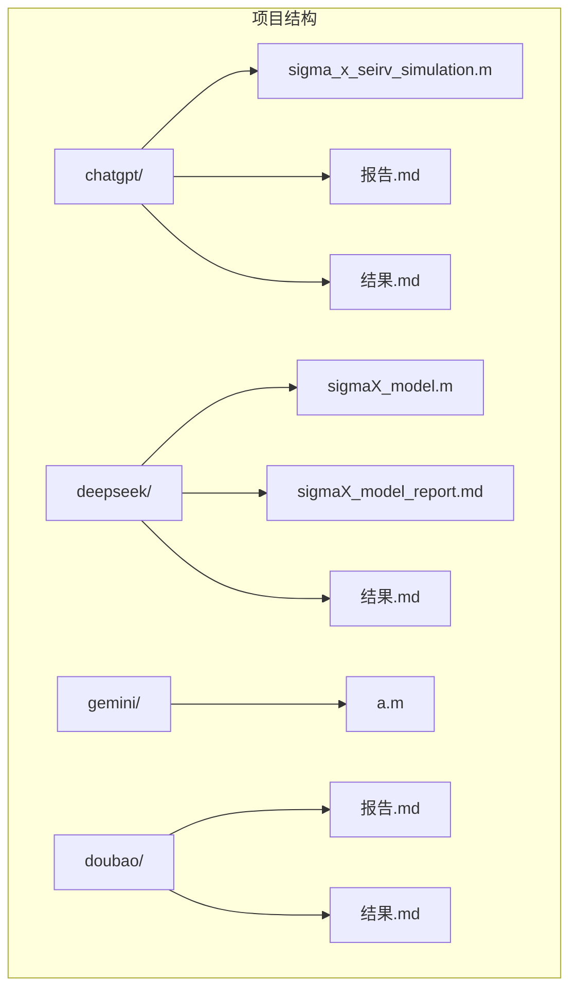

**图表来源**
- [sigma_x_seirv_simulation.m:1-154](file://chatgpt/sigma_x_seirv_simulation.m#L1-L154)
- [sigmaX_model.m:1-244](file://deepseek/sigmaX_model.m#L1-L244)

**章节来源**
- [sigma_x_seirv_simulation.m:1-154](file://chatgpt/sigma_x_seirv_simulation.m#L1-L154)
- [sigmaX_model.m:1-244](file://deepseek/sigmaX_model.m#L1-L244)

## 核心组件

### 状态变量体系

SEIRV模型包含七个核心状态变量，每个都有明确的生物学含义：

| 状态变量 | 物理意义 | 初始值 | 生物学含义 |
|---------|----------|--------|------------|
| S | 易感者 | N - 100 | 未感染且未接种疫苗的人群 |
| E1 | 潜伏期前期 | 0 | 潜伏期内无传染性的个体（前4天） |
| E2 | 潜伏期后期 | 0 | 潜伏期内有传染性的个体（后2天） |
| I | 感染者 | 100 | 正式感染期，具有传染性 |
| R | 康复者 | 0 | 自然康复产生的免疫者 |
| V | 疫苗免疫者 | 0 | 通过疫苗接种获得的免疫者 |
| J | 已接种未免疫者 | 0 | 接种疫苗但尚未产生免疫的人群 |

### 转移速率参数

模型中的关键转移速率参数及其生物学意义：

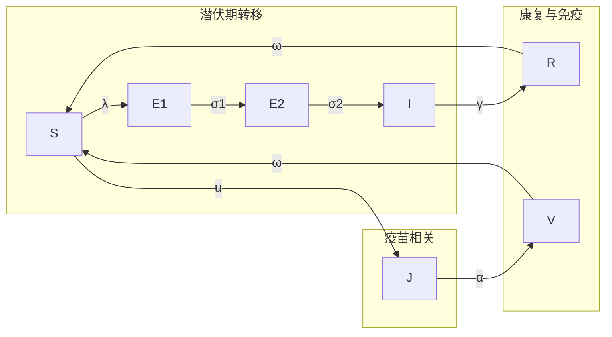

**图表来源**
- [sigmaX_model.m:172-243](file://deepseek/sigmaX_model.m#L172-L243)

**章节来源**
- [sigmaX_model.m:29-47](file://deepseek/sigmaX_model.m#L29-L47)
- [sigma_x_seirv_simulation.m:15-22](file://chatgpt/sigma_x_seirv_simulation.m#L15-L22)

## 架构概览

### 模型架构设计

SEIRV模型采用了模块化的架构设计，将不同的生物学过程分离到独立的模块中：

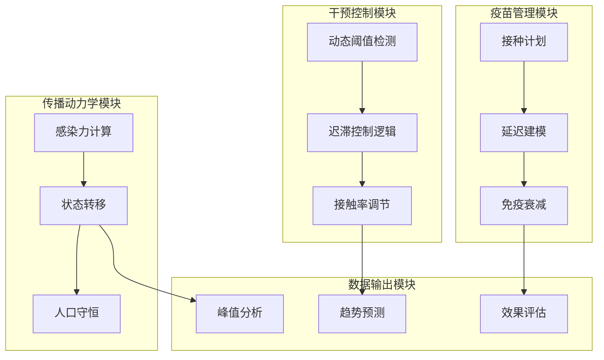

**图表来源**
- [sigmaX_model.m:172-243](file://deepseek/sigmaX_model.m#L172-L243)
- [a.m:84-134](file://gemini/a.m#L84-L134)

### 状态转换关系

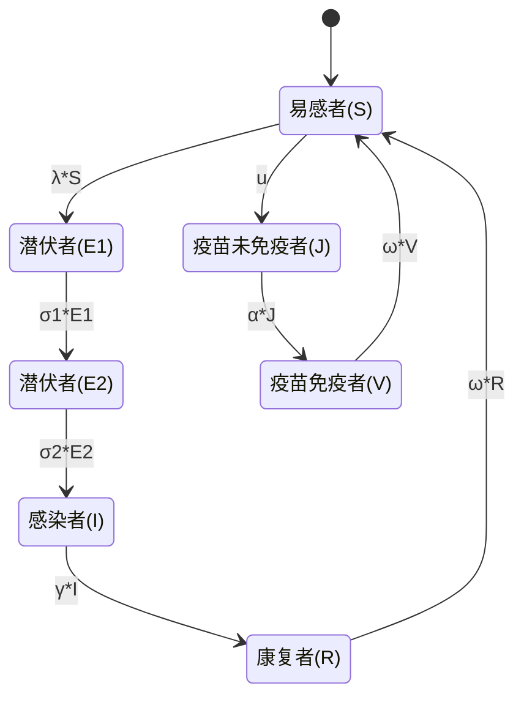

**图表来源**
- [sigmaX_model.m:234-240](file://deepseek/sigmaX_model.m#L234-L240)
- [sigma_x_seirv_simulation.m:144-150](file://chatgpt/sigma_x_seirv_simulation.m#L144-L150)

## 详细组件分析

### 潜伏期分段建模

#### 设计原理

潜伏期分段建模是SEIRV模型的核心创新之一，其设计基于以下生物学事实：

1. **潜伏前期(E1)**：个体已被感染但尚未具有传染性，通常持续4天
2. **潜伏后期(E2)**：个体已进入传染期，但传播能力较正式感染期有所减弱，持续2天
3. **总潜伏期**：E1(4天) + E2(2天) = 6天

这种分段设计的数学表达为：

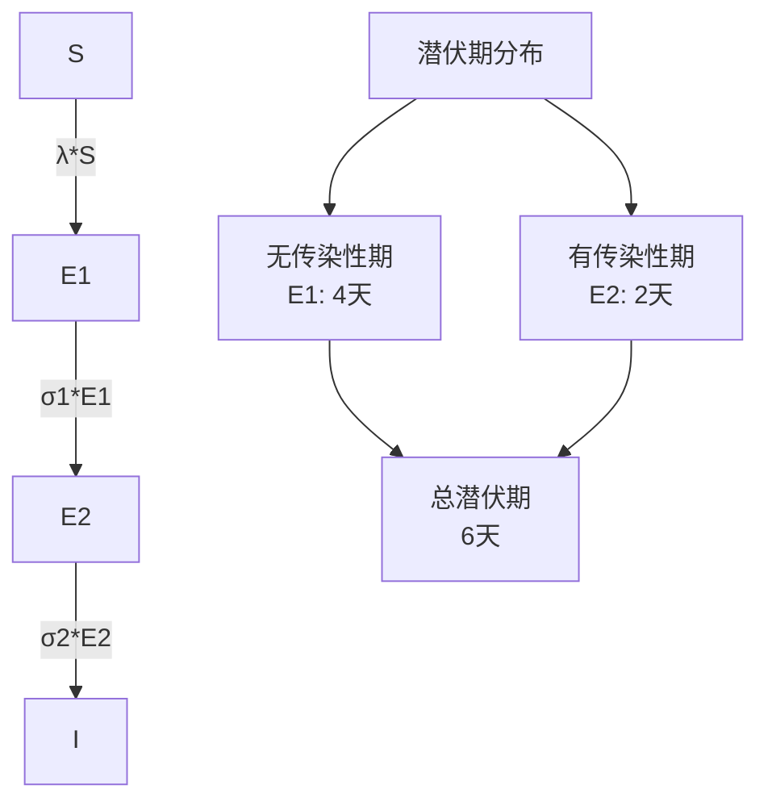

**图表来源**
- [sigmaX_model.m:17-28](file://deepseek/sigmaX_model.m#L17-L28)
- [sigmaX_model_report.md:50-57](file://deepseek/sigmaX_model_report.md#L50-L57)

#### 转移速率计算

潜伏期各阶段的转移速率通过平均停留时间计算：

- **σ1 = 1/τ_E1 = 1/4 = 0.25 天⁻¹**：E1 → E2的转移速率
- **σ2 = 1/τ_E2 = 1/2 = 0.5 天⁻¹**：E2 → I的转移速率
- **γ = 1/τ_I = 1/8 = 0.125 天⁻¹**：I → R的恢复速率

**章节来源**
- [sigmaX_model.m:24-32](file://deepseek/sigmaX_model.m#L24-L32)
- [sigmaX_model_report.md:19-28](file://deepseek/sigmaX_model_report.md#L19-L28)

### 动态干预机制

#### 迟滞控制设计

动态干预机制通过迟滞效应避免频繁的状态切换，其控制逻辑如下：

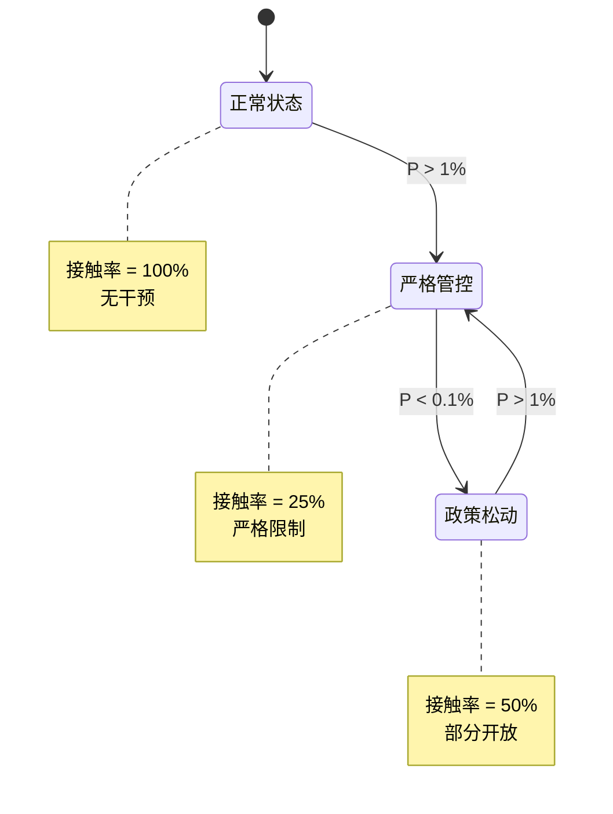

**图表来源**
- [sigmaX_model.m:188-201](file://deepseek/sigmaX_model.m#L188-L201)
- [sigma_x_seirv_simulation.m:117-121](file://chatgpt/sigma_x_seirv_simulation.m#L117-L121)

#### 接触率调节

干预状态下接触率的调节因子：

| 控制状态 | 接触率调整因子 | 说明 |
|---------|---------------|------|
| 正常状态(C=0) | f_normal = 1.0 | 完全开放，无干预 |
| 严格管控(C=1) | f_strict = 0.25 | 接触人数减少75% |
| 政策松动(C=2) | f_relax = 0.5 | 接触人数恢复至50% |

**章节来源**
- [sigmaX_model.m:46-53](file://deepseek/sigmaX_model.m#L46-L53)
- [sigmaX_model_report.md:78-95](file://deepseek/sigmaX_model_report.md#L78-L95)

### 疫苗延迟建模

#### 中间状态法

为处理疫苗从接种到产生免疫的14天延迟，模型采用中间状态法：

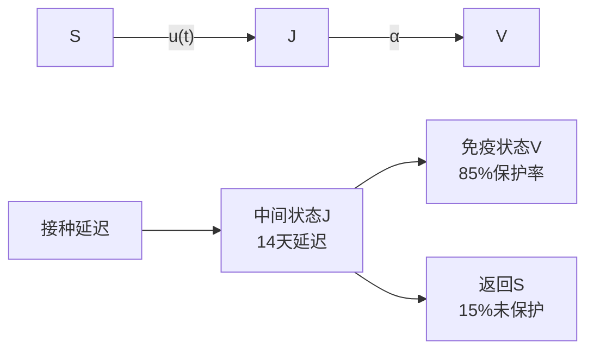

**图表来源**
- [sigmaX_model.m:109-126](file://deepseek/sigmaX_model.m#L109-L126)
- [sigmaX_model_report.md:54-57](file://deepseek/sigmaX_model_report.md#L54-L57)

#### 疫苗参数设置

- **疫苗开始时间**：t_vacc_start = 30天
- **每日接种人数**：ν = 10⁵ 人/天
- **疫苗保护率**：ε = 0.85
- **抗体产生延迟**：τ_vacc = 14天
- **延迟速率**：α = 1/τ_vacc ≈ 0.0714 天⁻¹

**章节来源**
- [sigmaX_model.m:34-42](file://deepseek/sigmaX_model.m#L34-L42)
- [sigmaX_model_report.md:37-47](file://deepseek/sigmaX_model_report.md#L37-L47)

### 免疫衰减机制

#### 设计原理

免疫衰减机制反映了疫苗和自然感染产生的免疫力会随时间逐渐消失：

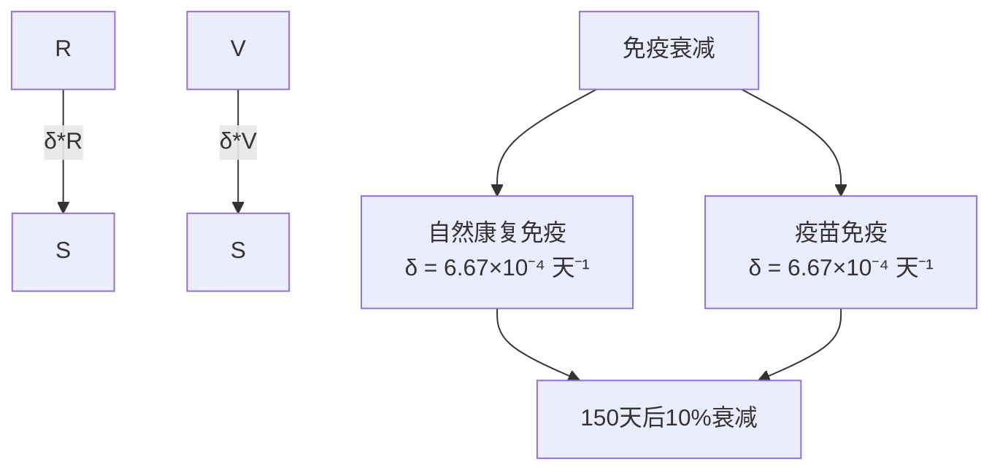

**图表来源**
- [sigmaX_model.m:229-231](file://deepseek/sigmaX_model.m#L229-L231)
- [sigmaX_model_report.md:44-47](file://deepseek/sigmaX_model_report.md#L44-L47)

#### 衰减参数计算

- **免疫持续时间**：τ_immune = 150天
- **衰减概率**：p_loss = 0.1
- **衰减速率**：δ = p_loss/τ_immune = 0.1/150 ≈ 6.67×10⁻⁴ 天⁻¹

**章节来源**
- [sigmaX_model.m:44-47](file://deepseek/sigmaX_model.m#L44-L47)
- [sigmaX_model_report.md:44-47](file://deepseek/sigmaX_model_report.md#L44-L47)

## 依赖分析

### 参数依赖关系

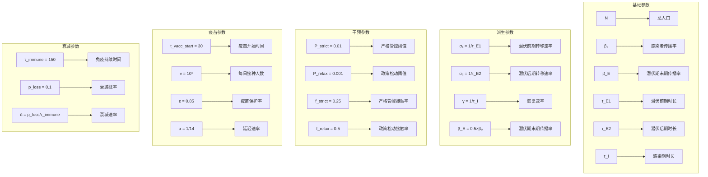

**图表来源**
- [sigmaX_model.m:8-47](file://deepseek/sigmaX_model.m#L8-L47)
- [sigmaX_model_report.md:13-47](file://deepseek/sigmaX_model_report.md#L13-L47)

### 模型耦合关系

```mermaid
graph LR
subgraph "传播动力学"
A[λ = β(t)(I + c·E₂)/N] --> B[S]
B --> C[E₁]
C --> D[E₂]
D --> E[I]
end
subgraph "干预控制"
F[P = I/N] --> G[控制状态]
G --> H[接触率调节]
H --> I[有效传播率]
end
subgraph "疫苗管理"
J[u(t)] --> K[J]
K --> L[V]
M[α·J] --> N[免疫产生]
end
subgraph "免疫衰减"
O[δ·R] --> P[S]
Q[δ·V] --> R[S]
end
I --> A
A --> B
N --> L
P --> B
R --> B
```

**图表来源**
- [sigmaX_model.m:185-242](file://deepseek/sigmaX_model.m#L185-L242)
- [a.m:84-134](file://gemini/a.m#L84-L134)

**章节来源**
- [sigmaX_model.m:172-243](file://deepseek/sigmaX_model.m#L172-L243)
- [a.m:84-160](file://gemini/a.m#L84-L160)

## 性能考虑

### 数值求解稳定性

模型采用MATLAB的ode45求解器，具有以下性能特点：

1. **自适应步长**：根据解的光滑性自动调整步长
2. **高精度**：相对容差1e-6，绝对容差1e-6
3. **非负约束**：确保状态变量始终为非负数
4. **收敛性**：对于SEIRV模型具有良好的数值稳定性

### 计算效率优化

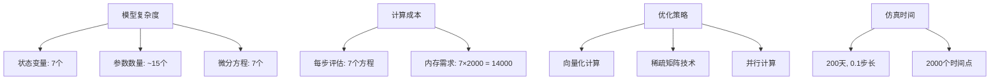

**图表来源**
- [sigmaX_model.m:60-66](file://deepseek/sigmaX_model.m#L60-L66)
- [sigma_x_seirv_simulation.m:43-46](file://chatgpt/sigma_x_seirv_simulation.m#L43-L46)

### 稳定性分析

模型的稳定性主要取决于以下条件：

1. **基本再生数**：R₀ = β_E·τ_E2 + β₀·τ_I
2. **阈值条件**：当R₀ > 1时，疫情会传播
3. **干预效果**：动态干预可将R₀降低到1以下

**章节来源**
- [sigmaX_model.m:142-143](file://deepseek/sigmaX_model.m#L142-L143)
- [sigmaX_model_report.md:195-203](file://deepseek/sigmaX_model_report.md#L195-L203)

## 故障排除指南

### 常见问题及解决方案

#### 1. 函数定义冲突

**问题描述**：在某些版本的MATLAB中，局部函数定义位置不当会导致错误。

**解决方案**：
- 确保所有局部函数定义位于文件末尾
- 使用persistent变量维护控制状态
- 避免在函数定义后继续写其他代码

**章节来源**
- [sigmaX_model_report.md:237-253](file://deepseek/sigmaX_model_report.md#L237-L253)

#### 2. 数值不稳定

**问题描述**：状态变量出现负值或数值溢出。

**解决方案**：
- 设置非负约束选项
- 调整相对和绝对容差
- 检查参数的生物学合理性

**章节来源**
- [sigma_x_seirv_simulation.m:43-46](file://chatgpt/sigma_x_seirv_simulation.m#L43-L46)

#### 3. 模型验证失败

**问题描述**：人口守恒定律不满足。

**解决方案**：
- 检查所有状态变量是否都被包含
- 验证微分方程的完整性
- 使用数值方法验证守恒性

**章节来源**
- [sigmaX_model.m:160-169](file://deepseek/sigmaX_model.m#L160-L169)

### 参数敏感性分析

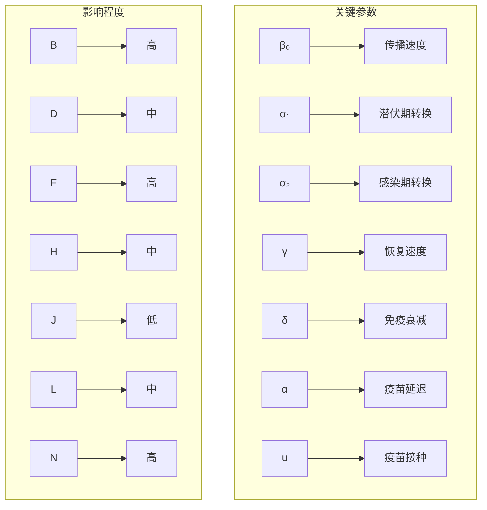

**图表来源**
- [sigmaX_model.m:18-47](file://deepseek/sigmaX_model.m#L18-L47)
- [sigmaX_model_report.md:13-47](file://deepseek/sigmaX_model_report.md#L13-L47)

## 结论

SEIRV传染病传播模型通过引入潜伏期分段、动态干预和疫苗延迟等创新设计，为Sigma-X病毒的传播动力学提供了更加精确和实用的数学框架。该模型的主要优势包括：

1. **生物学准确性**：潜伏期分段设计符合病毒传播的生物学特性
2. **政策指导性**：动态干预机制为公共卫生决策提供量化支持
3. **实用性**：疫苗延迟建模考虑了现实世界的接种和免疫过程
4. **稳健性**：严格的数学推导和数值验证确保模型的可靠性

该模型为传染病防控提供了重要的理论基础和技术支撑，特别是在应对新型变异病毒株和制定动态防控策略方面具有重要价值。

## 附录

### 参数取值表

| 参数 | 符号 | 数值 | 单位 | 生物学意义 |
|------|------|------|------|------------|
| 总人口 | N | 10⁷ | 人 | 城市总人口 |
| 初始感染者 | I₀ | 100 | 人 | 感染起点 |
| 感染者传播率 | β₀ | 0.45 | 天⁻¹ | 每日有效接触数 |
| 潜伏期末期传播率 | β_E | 0.225 | 天⁻¹ | 传播力的50% |
| 潜伏前期转移速率 | σ₁ | 0.25 | 天⁻¹ | E₁→E₂转移 |
| 潜伏后期转移速率 | σ₂ | 0.5 | 天⁻¹ | E₂→I转移 |
| 恢复速率 | γ | 0.125 | 天⁻¹ | I→R恢复 |
| 免疫衰减率 | δ | 6.67×10⁻⁴ | 天⁻¹ | 150天后10%衰减 |
| 疫苗延迟速率 | α | 0.0714 | 天⁻¹ | 14天延迟 |
| 疫苗保护率 | ε | 0.85 | - | 85%保护效果 |
| 疫苗开始时间 | t_vacc_start | 30 | 天 | 接种启动时间 |
| 每日接种人数 | ν | 10⁵ | 人/天 | 接种速度 |

### 微分方程组总结

完整的SEIRV模型微分方程组为：

```math
\begin{cases}
\frac{dS}{dt} = -\lambda S - u(t) + (1-\varepsilon)\alpha J + \delta(R + V) \\
\frac{dE_1}{dt} = \lambda S - \sigma_1 E_1 \\
\frac{dE_2}{dt} = \sigma_1 E_1 - \sigma_2 E_2 \\
\frac{dI}{dt} = \sigma_2 E_2 - \gamma I \\
\frac{dR}{dt} = \gamma I - \delta R \\
\frac{dV}{dt} = \varepsilon \alpha J - \delta V \\
\frac{dJ}{dt} = u(t) - \alpha J
\end{cases}
```

其中感染力λ(t)定义为：
$$\lambda(t) = \frac{c(t)[\beta_E E_2(t) + \beta_I I(t)]}{N}$$

**章节来源**
- [sigmaX_model.m:115-127](file://deepseek/sigmaX_model.m#L115-L127)
- [sigmaX_model_report.md:102-127](file://deepseek/sigmaX_model_report.md#L102-L127)