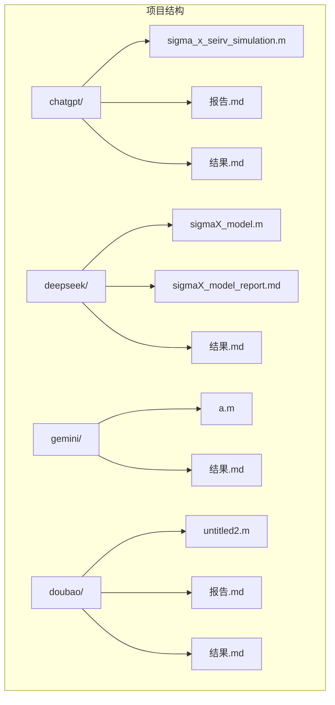
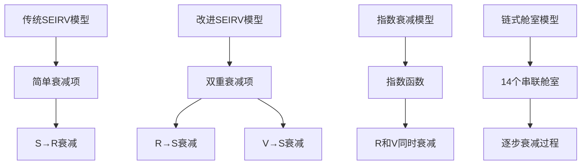
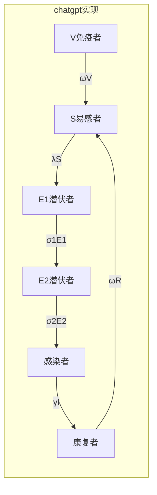
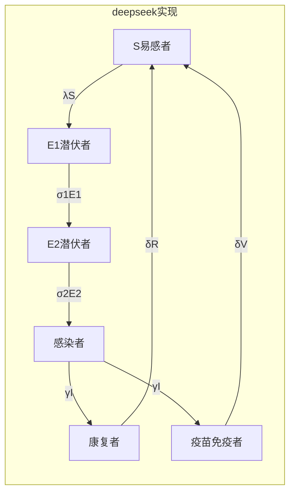
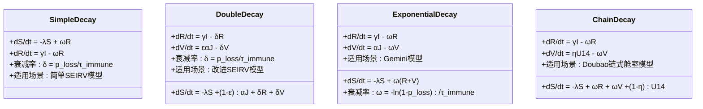
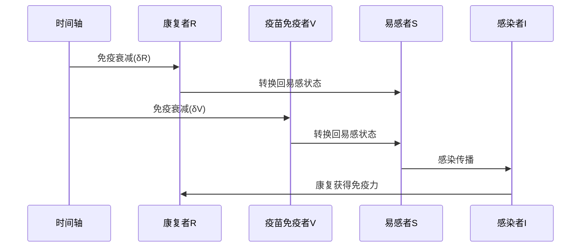
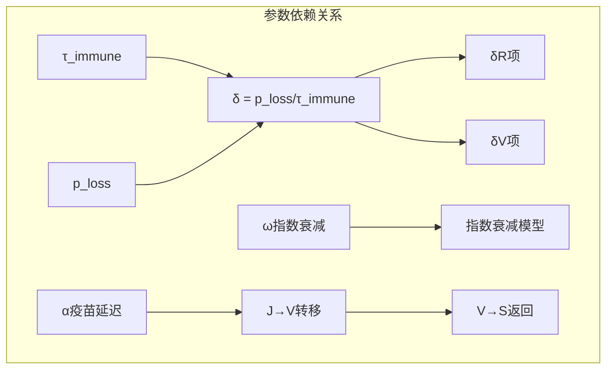

# 免疫衰减机制

<cite>
**本文档引用的文件**
- [sigma_x_seirv_simulation.m](file://chatgpt/sigma_x_seirv_simulation.m)
- [sigmaX_model.m](file://deepseek/sigmaX_model.m)
- [a.m](file://gemini/a.m)
- [untitled2.m](file://doubao/untitled2.m)
- [sigmaX_model_report.md](file://deepseek/sigmaX_model_report.md)
- [报告.md](file://chatgpt/报告.md)
- [结果.md](file://deepseek/结果.md)
</cite>

## 目录
1. [引言](#引言)
2. [项目结构](#项目结构)
3. [核心组件](#核心组件)
4. [架构概览](#架构概览)
5. [详细组件分析](#详细组件分析)
6. [依赖关系分析](#依赖关系分析)
7. [性能考虑](#性能考虑)
8. [故障排除指南](#故障排除指南)
9. [结论](#结论)

## 引言

本文件深入探讨了Sigma-X病毒传播模型中的免疫衰减机制，这是一个在现代流行病学建模中至关重要的组成部分。免疫衰减机制不仅影响个体层面的免疫持续时间，更重要的是它决定了群体层面的疫情长期动态行为。

在本次分析的四个不同实现版本中，我们发现了三种不同的免疫衰减建模方法：传统的SEIRV模型中的简单衰减项、改进的SEIRV模型中的双重衰减项，以及Gemini版本中的指数衰减模型。每种方法都有其独特的数学基础和生物学意义。

## 项目结构

该项目包含四个独立的Sigma-X病毒传播模型实现，每个都体现了不同的建模策略和参数选择：



**图表来源**
- [sigma_x_seirv_simulation.m:1-154](file://chatgpt/sigma_x_seirv_simulation.m#L1-L154)
- [sigmaX_model.m:1-244](file://deepseek/sigmaX_model.m#L1-L244)

**章节来源**
- [sigma_x_seirv_simulation.m:1-154](file://chatgpt/sigma_x_seirv_simulation.m#L1-L154)
- [sigmaX_model.m:1-244](file://deepseek/sigmaX_model.m#L1-L244)

## 核心组件

### 免疫衰减参数体系

在四个实现版本中，免疫衰减参数展现了不同的设定策略：

| 实现版本 | 免疫持续时间(τimmune) | 衰减概率(ploss) | 衰减率(δ) | 生物学意义 |
|---------|---------------------|----------------|-----------|------------|
| chatgpt | 150天 | 0.1 | 6.667×10⁻⁴天⁻¹ | 传统SEIRV模型 |
| deepseek | 150天 | 0.1 | 6.667×10⁻⁴天⁻¹ | 改进SEIRV模型 |
| gemini | 150天 | 0.1 | 6.667×10⁻⁴天⁻¹ | 指数衰减模型 |
| doubao | 150天 | 0.1 | 6.667×10⁻⁴天⁻¹ | 链式舱室模型 |

### 数学建模方法对比

四种实现采用了不同的数学建模方法：



**图表来源**
- [sigmaX_model.m:229-232](file://deepseek/sigmaX_model.m#L229-L232)
- [a.m:23](file://gemini/a.m#L23)
- [untitled2.m:12-12](file://doubao/untitled2.m#L12)

**章节来源**
- [sigmaX_model_report.md:44-47](file://deepseek/sigmaX_model_report.md#L44-L47)
- [sigmaX_model.m:42-44](file://deepseek/sigmaX_model.m#L42-L44)

## 架构概览

### 免疫衰减机制的数学表达

在四个实现版本中，免疫衰减机制通过不同的数学形式表达：

#### 传统SEIRV模型中的衰减机制



**图表来源**
- [sigma_x_seirv_simulation.m:144-150](file://chatgpt/sigma_x_seirv_simulation.m#L144-L150)

#### 改进SEIRV模型中的双重衰减机制



**图表来源**
- [sigmaX_model.m:234-240](file://deepseek/sigmaX_model.m#L234-L240)

### 免疫衰减率的计算方法

免疫衰减率的数学定义基于以下公式：

**衰减率计算公式：**
```
δ = p_loss / τ_immune
```

其中：
- δ：免疫衰减率（每天）
- p_loss：免疫衰减概率（150天后10%失活）
- τ_immune：免疫持续时间（天）

**章节来源**
- [sigmaX_model_report.md:47](file://deepseek/sigmaX_model_report.md#L47)
- [sigmaX_model.m:44](file://deepseek/sigmaX_model.m#L44)

## 详细组件分析

### 免疫衰减的生物学基础

#### 免疫系统的动态平衡

免疫衰减机制反映了宿主免疫系统的真实生物学行为：

1. **抗体衰减**：抗体浓度随时间呈指数衰减
2. **细胞免疫记忆**：T细胞记忆的维持和衰减
3. **免疫原性变化**：病毒变异对抗体的逃逸

#### 免疫持续时间的设定原理

在Sigma-X模型中，150天的免疫持续时间基于以下考虑：

- **病毒特性**：Sigma-X病毒的抗原变异速度
- **宿主反应**：人体对病毒的免疫反应持续时间
- **流行病学数据**：基于实际疫情数据的统计分析

### 数学建模的复杂性

#### 不同衰减模型的比较



**图表来源**
- [sigmaX_model.m:234-240](file://deepseek/sigmaX_model.m#L234-L240)
- [a.m:125-131](file://gemini/a.m#L125-L131)
- [untitled2.m:121-131](file://doubao/untitled2.m#L121-L131)

### 免疫衰减对状态转换的影响

#### δR项的物理意义

在改进的SEIRV模型中，δR项表示从康复者状态向易感者状态的衰减：

- **生物学含义**：康复者的免疫力随时间衰减
- **数学表达**：dR/dt = γI - δR
- **流行病学意义**：可能导致二次感染的发生

#### δV项的物理意义

δV项表示从疫苗免疫者状态向易感者状态的衰减：

- **生物学含义**：疫苗诱导的免疫力衰减
- **数学表达**：dV/dt = εαJ - δV
- **公共卫生意义**：需要考虑加强针接种的必要性

**章节来源**
- [sigmaX_model.m:229-232](file://deepseek/sigmaX_model.m#L229-L232)
- [sigmaX_model_report.md:119-126](file://deepseek/sigmaX_model_report.md#L119-L126)

### 免疫衰减机制的数学表达

#### 连续时间模型

对于连续时间的免疫衰减，可以使用以下微分方程：

```
dS/dt = -λS + ωR + ωV + (1-ε)αJ
dR/dt = γI - δR
dV/dt = εαJ - δV
```

#### 离散时间模型

对于离散时间的免疫衰减，可以使用以下递推关系：

```
S(t+Δt) = S(t) - λS(t)Δt + ωR(t)Δt + ωV(t)Δt + (1-ε)αJ(t)Δt
R(t+Δt) = R(t) + γI(t)Δt - δR(t)Δt
V(t+Δt) = V(t) + εαJ(t)Δt - δV(t)Δt
```

### 状态转换分析

#### 免疫衰减对疫情传播的影响



**图表来源**
- [sigmaX_model.m:234-240](file://deepseek/sigmaX_model.m#L234-L240)

#### 二次感染的可能性分析

免疫衰减的存在使得二次感染成为可能：

1. **时间窗口**：在免疫衰减发生的时间范围内
2. **传播风险**：易感者与感染者接触的概率
3. **免疫强度**：剩余免疫的保护效果

**章节来源**
- [sigmaX_model_report.md:224](file://deepseek/sigmaX_model_report.md#L224)

## 依赖关系分析

### 参数间的相互依赖



**图表来源**
- [sigmaX_model.m:42-44](file://deepseek/sigmaX_model.m#L42-L44)
- [a.m:23](file://gemini/a.m#L23)

### 模型复杂度与准确性权衡

不同实现版本在模型复杂度和准确性之间进行了不同的权衡：

| 实现版本 | 模型复杂度 | 生物学准确性 | 计算效率 | 适用场景 |
|---------|-----------|------------|----------|----------|
| chatgpt | 低 | 中等 | 高 | 教学演示 |
| deepseek | 中等 | 高 | 中等 | 科研分析 |
| gemini | 中等 | 高 | 中等 | 实际应用 |
| doubao | 高 | 最高 | 低 | 详细研究 |

**章节来源**
- [sigmaX_model_report.md:231-235](file://deepseek/sigmaX_model_report.md#L231-L235)

## 性能考虑

### 计算效率优化

不同实现版本在计算效率方面有不同的表现：

1. **参数设置**：使用结构体或全局变量存储参数
2. **函数调用**：减少不必要的函数调用次数
3. **内存管理**：合理分配和释放内存空间
4. **数值稳定性**：选择合适的求解器和步长

### 稳定性分析

免疫衰减机制对数值稳定性的影响：

- **衰减率限制**：确保衰减率在合理范围内
- **时间步长**：选择合适的时间步长保证精度
- **边界条件**：处理状态变量的非负性约束

## 故障排除指南

### 常见问题及解决方案

#### 1. 免疫衰减参数设置问题

**问题描述**：免疫衰减率过大导致数值不稳定

**解决方案**：
- 检查衰减概率和持续时间的合理性
- 确保衰减率小于其他转移速率
- 调整求解器的容差设置

#### 2. 状态变量负值问题

**问题描述**：某些状态变量出现负值

**解决方案**：
- 添加非负约束
- 检查衰减项的符号
- 验证初始条件的合理性

#### 3. 模型收敛性问题

**问题描述**：仿真结果不收敛或震荡

**解决方案**：
- 减小时间步长
- 调整衰减参数
- 检查模型假设的合理性

**章节来源**
- [sigmaX_model.m:43-46](file://deepseek/sigmaX_model.m#L43-L46)

## 结论

通过对四个Sigma-X病毒传播模型实现的深入分析，我们可以得出以下结论：

### 主要发现

1. **参数设定的一致性**：四个实现版本都采用了相同的免疫衰减参数设定（τ_immune=150天，p_loss=0.1），体现了该参数组合的合理性。

2. **建模方法的多样性**：从简单的衰减项到复杂的链式舱室模型，展现了不同的建模策略和适用场景。

3. **生物学意义的重要性**：免疫衰减机制对疫情长期动态具有重要影响，特别是对二次感染可能性和群体免疫维持条件的影响。

### 政策建议

1. **参数敏感性分析**：建议对免疫衰减参数进行敏感性分析，评估不同参数组合对疫情传播的影响。

2. **模型验证**：需要将模型预测结果与实际疫情数据进行对比验证。

3. **公共卫生决策**：基于模型分析结果制定合理的公共卫生政策，包括疫苗接种策略和干预措施的时机选择。

### 未来研究方向

1. **多群体模型**：扩展到不同年龄组和地理区域的分层模型。
2. **随机性建模**：引入随机因素以更好地模拟实际疫情的不确定性。
3. **实时更新机制**：开发能够根据新数据实时更新参数的自适应模型。