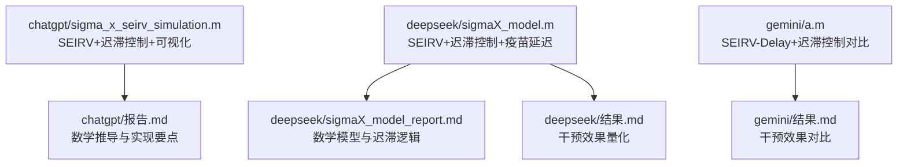
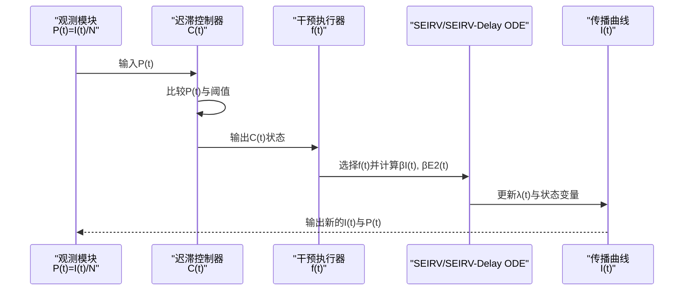
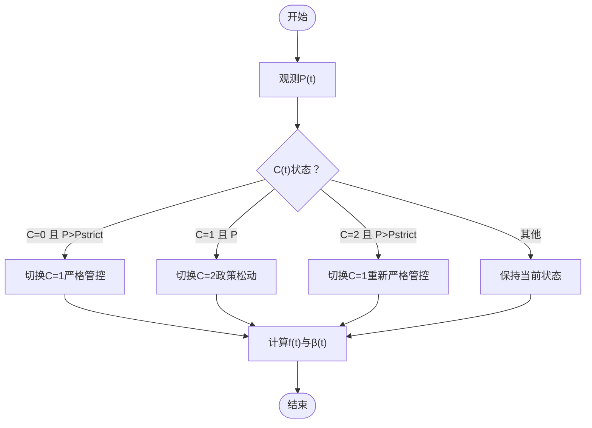
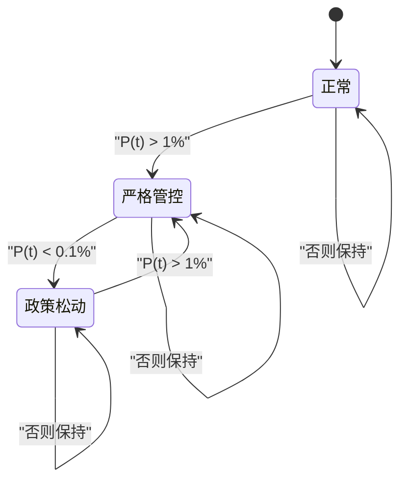
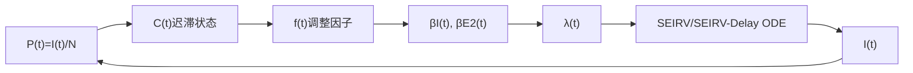

# 动态干预原理

<cite>
**本文引用的文件**
- [sigma_x_seirv_simulation.m](file://chatgpt/sigma_x_seirv_simulation.m)
- [sigmaX_model.m](file://deepseek/sigmaX_model.m)
- [a.m](file://gemini/a.m)
- [报告.md](file://chatgpt/报告.md)
- [sigmaX_model_report.md](file://deepseek/sigmaX_model_report.md)
- [结果.md](file://deepseek/结果.md)
- [结果.md](file://gemini/结果.md)
</cite>

## 目录
1. [引言](#引言)
2. [项目结构](#项目结构)
3. [核心组件](#核心组件)
4. [架构总览](#架构总览)
5. [详细组件分析](#详细组件分析)
6. [依赖关系分析](#依赖关系分析)
7. [性能考量](#性能考量)
8. [故障排查指南](#故障排查指南)
9. [结论](#结论)
10. [附录](#附录)

## 引言
本文件围绕动态干预系统（含迟滞控制）的理论基础展开，结合仓库中的SEIRV传播模型与迟滞干预实现，系统阐述：
- 控制状态变量C(t)的三个状态（正常、严格管控、政策松动）及其转换逻辑；
- 干预阈值（Pstrict=1%、Prelax=0.1%）的设定原理与生物学意义；
- 迟滞效应如何避免频繁抖动，提升政策稳定性；
- 接触人数调整因子（fnormal、fstrict、frelax）的设定依据与干预强度量化；
- 迟滞控制的数学表达式与状态转移图；
- 干预机制对有效再生数R0eff的影响及对疫情传播曲线的调节作用；
- 迟滞宽度ΔP=Pstrict−Prelax对干预效果的影响。

## 项目结构
本仓库包含多个版本的Sigma-X病毒传播模型与动态干预实现，主要文件如下：
- chatgpt/sigma_x_seirv_simulation.m：SEIRV+时滞+迟滞控制的完整仿真脚本，包含迟滞控制逻辑与可视化。
- deepseek/sigmaX_model.m：改进型SEIRV模型，明确引入中间状态J（已接种未免疫），并实现完整的迟滞控制与疫苗延迟。
- gemini/a.m：SEIRV-Delay模型（含Sv中间态），对比“有干预”与“无干预”的仿真结果。
- chatgpt/报告.md：对SEIRV模型与迟滞干预的数学推导与实现要点说明。
- deepseek/sigmaX_model_report.md：对迟滞控制、接触调整因子、有效传播率与人口守恒的系统化数学描述。
- deepseek/结果.md、gemini/结果.md：仿真结果与干预效果对比数据。

**图表来源**
- [sigma_x_seirv_simulation.m:95-154](file://chatgpt/sigma_x_seirv_simulation.m#L95-L154)
- [sigmaX_model.m:172-244](file://deepseek/sigmaX_model.m#L172-L244)
- [a.m:84-160](file://gemini/a.m#L84-L160)
- [报告.md:70-117](file://chatgpt/报告.md#L70-L117)
- [sigmaX_model_report.md:72-133](file://deepseek/sigmaX_model_report.md#L72-L133)
- [结果.md:1-20](file://deepseek/结果.md#L1-L20)
- [结果.md:1-4](file://gemini/结果.md#L1-L4)

**章节来源**
- [sigma_x_seirv_simulation.m:1-154](file://chatgpt/sigma_x_seirv_simulation.m#L1-L154)
- [sigmaX_model.m:1-244](file://deepseek/sigmaX_model.m#L1-L244)
- [a.m:1-160](file://gemini/a.m#L1-L160)
- [报告.md:1-152](file://chatgpt/报告.md#L1-L152)
- [sigmaX_model_report.md:1-259](file://deepseek/sigmaX_model_report.md#L1-L259)
- [结果.md:1-20](file://deepseek/结果.md#L1-L20)
- [结果.md:1-4](file://gemini/结果.md#L1-L4)

## 核心组件
- 控制状态变量C(t) ∈ {0, 1, 2}：分别对应正常、严格管控、政策松动。
- 感染比例P(t)=I(t)/N：作为迟滞控制的观测信号。
- 阈值：Pstrict=1%（触发严格管控）、Prelax=0.1%（触发政策松动）。
- 接触调整因子：fnormal=1.0、fstrict=0.25、frelax=0.5。
- 有效传播率：βI(t)=f(t)·β0，βE2(t)=f(t)·βE。
- ODE系统：SEIRV或SEIRV-Delay，含疫苗延迟与免疫衰减。

**章节来源**
- [sigmaX_model_report.md:72-100](file://deepseek/sigmaX_model_report.md#L72-L100)
- [sigma_x_seirv_simulation.m:114-134](file://chatgpt/sigma_x_seirv_simulation.m#L114-L134)
- [sigmaX_model.m:185-217](file://deepseek/sigmaX_model.m#L185-L217)
- [a.m:94-122](file://gemini/a.m#L94-L122)

## 架构总览
动态干预系统由“状态观测—迟滞判断—干预切换—传播抑制”构成闭环。其核心在于：
- 通过P(t)与阈值比较，基于迟滞逻辑决定C(t)的状态；
- 根据C(t)选择接触调整因子f(t)，从而改变有效传播率；
- ODE系统在每个时间步根据当前f(t)更新感染力λ(t)，实现对疫情曲线的调节。

**图表来源**
- [sigmaX_model.m:185-217](file://deepseek/sigmaX_model.m#L185-L217)
- [sigmaX_model.m:234-242](file://deepseek/sigmaX_model.m#L234-L242)
- [a.m:94-122](file://gemini/a.m#L94-L122)
- [a.m:124-133](file://gemini/a.m#L124-L133)

## 详细组件分析

### 控制状态与迟滞逻辑
- 状态定义：C(t)∈{0,1,2}，分别表示正常、严格管控、政策松动。
- 转换规则：
  - C=0且P(t)>Pstrict → C=1（进入严格管控）
  - C=1且P(t)<Prelax → C=2（政策松动）
  - C=2且P(t)>Pstrict → C=1（重新严格管控）
- 该规则形成“上阈值触发、下阈值释放”的迟滞回线，避免P(t)在阈值附近频繁抖动。

**图表来源**
- [sigmaX_model.m:194-201](file://deepseek/sigmaX_model.m#L194-L201)
- [sigmaX_model.m:203-210](file://deepseek/sigmaX_model.m#L203-L210)
- [sigmaX_model.m:212-217](file://deepseek/sigmaX_model.m#L212-L217)

**章节来源**
- [sigmaX_model_report.md:72-85](file://deepseek/sigmaX_model_report.md#L72-L85)
- [sigmaX_model.m:188-201](file://deepseek/sigmaX_model.m#L188-L201)
- [sigma_x_seirv_simulation.m:116-121](file://chatgpt/sigma_x_seirv_simulation.m#L116-L121)

### 阈值设定原理与生物学意义
- Pstrict=1%：当活跃感染者比例超过1%时，意味着社区传播已进入较高风险区间，需立即采取强干预以阻断传播链。
- Prelax=0.1%：当活跃感染者比例降至0.1%以下，表明传播已显著受控，可适度放松限制，避免过度压制引发社会经济压力。
- 生物学意义：阈值反映“可容忍的传播水平”，Pstrict用于“防爆”，Prelax用于“稳态”。

**章节来源**
- [sigmaX_model_report.md:29-35](file://deepseek/sigmaX_model_report.md#L29-L35)
- [sigmaX_model.m:46-48](file://deepseek/sigmaX_model.m#L46-L48)

### 接触调整因子与干预强度量化
- fnormal=1.0：正常情况下，传播保持基准强度。
- fstrict=0.25：严格管控将接触强度降至25%，相当于抑制75%的传播机会。
- frelax=0.5：政策松动将接触强度恢复至50%，兼顾传播控制与社会运行。
- 干预强度量化：通过f(t)直接缩放βI(t)与βE2(t)，从而降低有效传播率，抑制I(t)增长。

**章节来源**
- [sigmaX_model_report.md:32-35](file://deepseek/sigmaX_model_report.md#L32-L35)
- [sigmaX_model.m:203-210](file://deepseek/sigmaX_model.m#L203-L210)
- [sigmaX_model.m:212-214](file://deepseek/sigmaX_model.m#L212-L214)
- [sigma_x_seirv_simulation.m:123-131](file://chatgpt/sigma_x_seirv_simulation.m#L123-L131)

### 迟滞宽度ΔP与干预稳定性
- ΔP=Pstrict−Prelax=1%−0.1%=0.9%
- 宽度越大，迟滞回线越宽，切换门槛越高，越能抑制高频抖动，提高政策稳定性；但过宽可能导致响应滞后。
- 宽度越小，切换更敏感，响应更快，但易产生“抖动”和“过度反应”。

**章节来源**
- [sigmaX_model_report.md:72-85](file://deepseek/sigmaX_model_report.md#L72-L85)
- [sigmaX_model.m:194-201](file://deepseek/sigmaX_model.m#L194-L201)

### 有效再生数R0eff与干预调节
- 有效再生数：R0eff=βE·τE2+βI·τI（潜伏期末期与感染者两部分贡献之和）。
- 无干预估计：R0≈4.05，最终感染比例≈75%。
- 有干预后：通过迟滞控制与f(t)抑制，峰值提前、规模下降、最终感染比例显著降低（例如干预减少比例达81.1%）。
- 调节作用：迟滞控制使传播率在C(t)切换点处发生阶跃变化，从而改变R0eff的动态路径，抑制传播曲线的陡峭上升。

**章节来源**
- [sigmaX_model_report.md:195-211](file://deepseek/sigmaX_model_report.md#L195-L211)
- [结果.md:10-16](file://deepseek/结果.md#L10-L16)
- [结果.md:1-4](file://gemini/结果.md#L1-L4)

### 状态转移图（数学表达）

**图表来源**
- [sigmaX_model.m:194-201](file://deepseek/sigmaX_model.m#L194-L201)
- [sigmaX_model.m:203-210](file://deepseek/sigmaX_model.m#L203-L210)

## 依赖关系分析
- 控制状态C(t)依赖于P(t)=I(t)/N，而P(t)由ODE系统状态变量I(t)决定。
- 接触调整因子f(t)由C(t)决定，进而影响βI(t)与βE2(t)，最终通过λ(t)影响ODE的传播项。
- 疫苗延迟与免疫衰减在SEIRV/SEIRV-Delay模型中独立于迟滞控制，但共同影响I(t)的长期轨迹。

**图表来源**
- [sigmaX_model.m:185-217](file://deepseek/sigmaX_model.m#L185-L217)
- [sigmaX_model.m:234-242](file://deepseek/sigmaX_model.m#L234-L242)
- [a.m:121-129](file://gemini/a.m#L121-L129)

**章节来源**
- [sigmaX_model.m:185-242](file://deepseek/sigmaX_model.m#L185-L242)
- [a.m:121-133](file://gemini/a.m#L121-L133)

## 性能考量
- 数值求解：使用ode45，相对/绝对容差设置合理，非负约束保证稳定性。
- 迟滞实现：通过persistent变量保存C(t)，避免每次调用重置状态，确保连续性。
- 计算复杂度：每步仅进行一次阈值比较与一次f(t)选择，开销极低，适合实时或准实时应用。
- 稳定性：迟滞宽度ΔP=0.9%有效抑制高频切换，降低政策抖动带来的不确定性。

**章节来源**
- [sigma_x_seirv_simulation.m:43-46](file://chatgpt/sigma_x_seirv_simulation.m#L43-L46)
- [sigmaX_model.m:60-66](file://deepseek/sigmaX_model.m#L60-L66)
- [sigmaX_model.m:188-201](file://deepseek/sigmaX_model.m#L188-L201)

## 故障排查指南
- 函数定义位置错误：确保局部函数位于文件末尾，避免与主脚本混排。
- 人口守恒验证：若总人口随时间漂移过大，检查各项流入/流出是否平衡。
- 阈值设置不当：若C(t)频繁切换，适当增大ΔP；若响应过慢，适当减小ΔP。
- 疫苗延迟与免疫衰减：若I(t)长期居高不下，检查α、δ与ε设置是否合理。

**章节来源**
- [sigmaX_model_report.md:237-253](file://deepseek/sigmaX_model_report.md#L237-L253)
- [sigmaX_model.m:160-169](file://deepseek/sigmaX_model.m#L160-L169)

## 结论
动态干预系统通过“迟滞控制+接触调整因子”的组合，实现了对疫情传播曲线的稳健调节：
- 以P(t)为观测信号，基于Pstrict与Prelax形成迟滞回线，避免政策频繁抖动；
- 通过f(t)对传播率进行阶跃抑制，有效降低峰值规模与最终感染比例；
- ΔP的合理设置在“响应速度”与“稳定性”之间取得平衡；
- 结合疫苗延迟与免疫衰减，模型在中长期也能维持较好的预测一致性。

## 附录

### 数学表达式与参数表
- 感染比例：P(t)=I(t)/N
- 控制状态：C(t)∈{0,1,2}
- 阈值：Pstrict=1%，Prelax=0.1%
- 接触调整因子：fnormal=1.0，fstrict=0.25，frelax=0.5
- 有效传播率：βI(t)=f(t)·β0，βE2(t)=f(t)·βE
- 有效再生数：R0eff=βE·τE2+βI·τI
- 人口守恒：S+E1+E2+I+R+V+J=N

**章节来源**
- [sigmaX_model_report.md:72-100](file://deepseek/sigmaX_model_report.md#L72-L100)
- [sigmaX_model_report.md:195-203](file://deepseek/sigmaX_model_report.md#L195-L203)