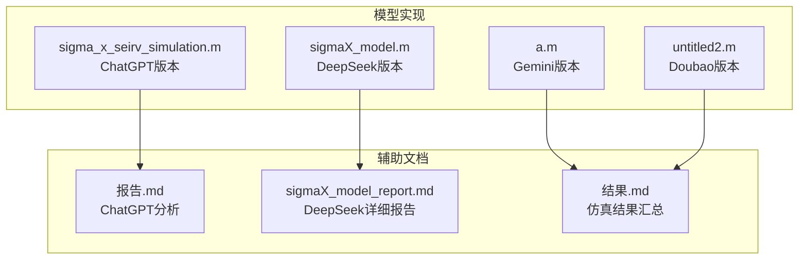
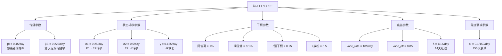
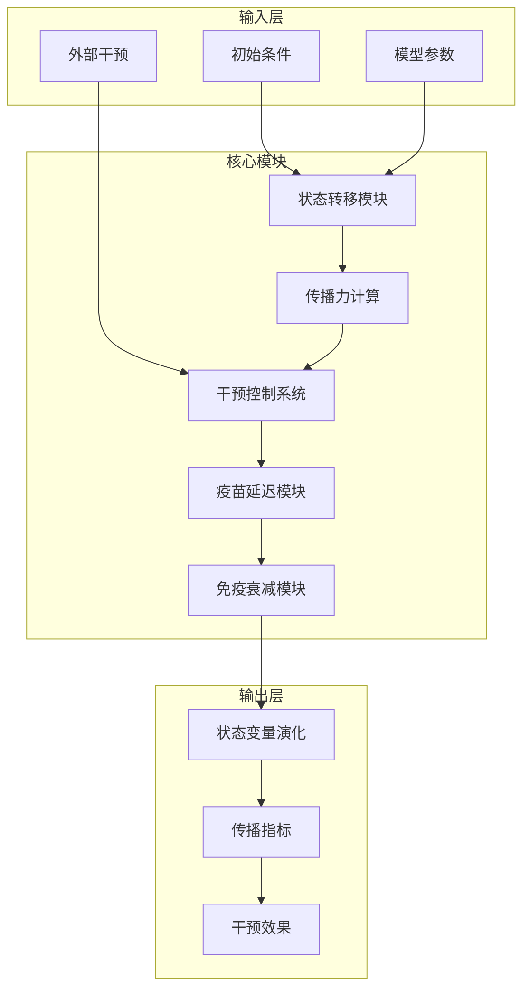
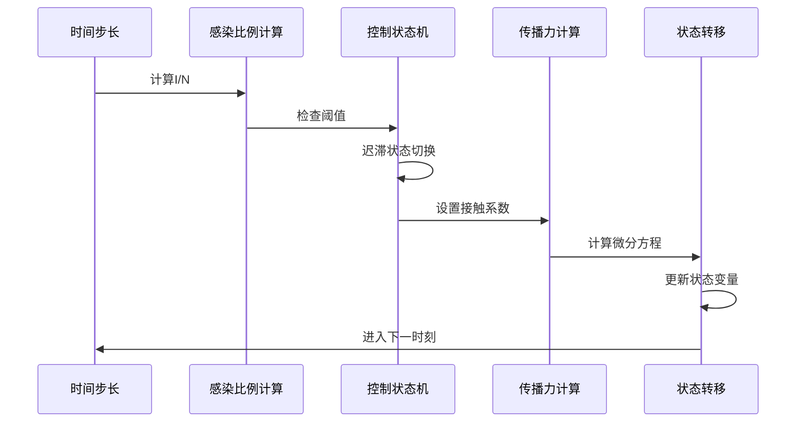
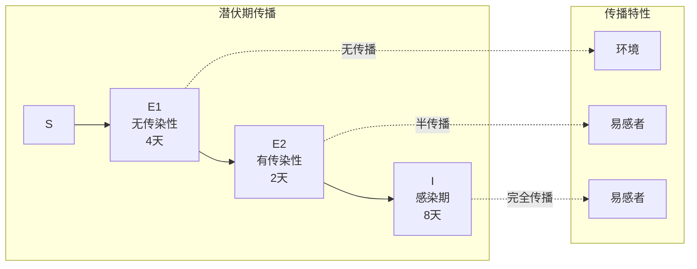
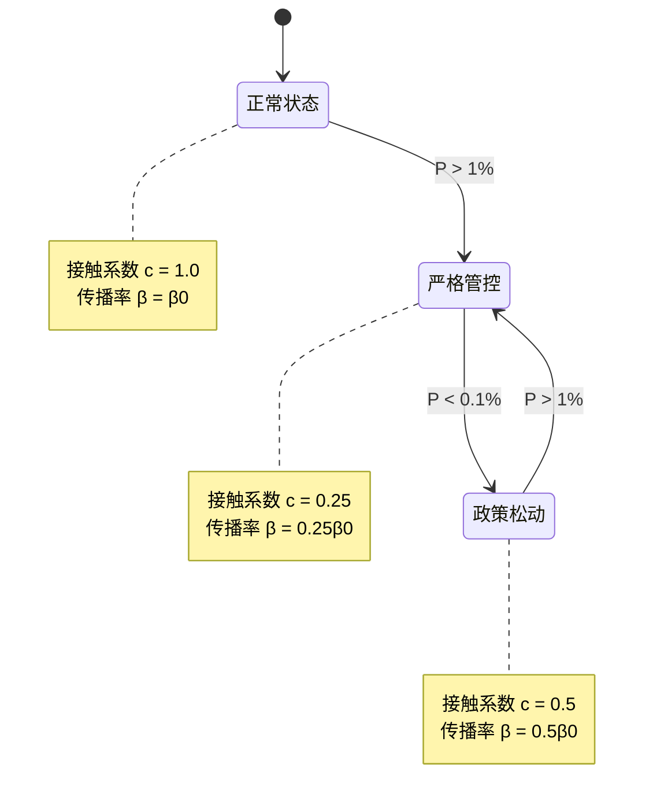
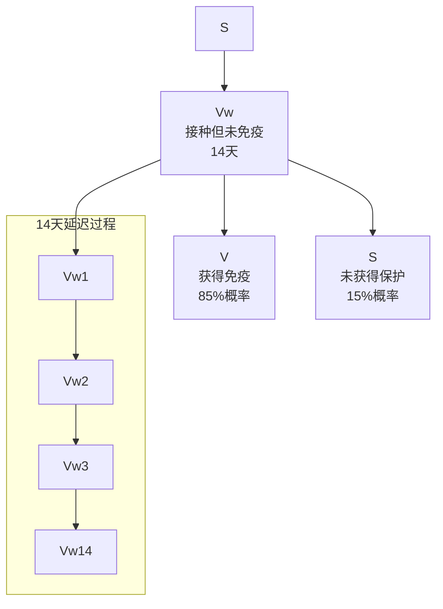

# 模型理论基础

<cite>
**本文档引用的文件**
- [sigma_x_seirv_simulation.m](file://chatgpt/sigma_x_seirv_simulation.m)
- [sigmaX_model.m](file://deepseek/sigmaX_model.m)
- [a.m](file://gemini/a.m)
- [untitled2.m](file://doubao/untitled2.m)
- [sigmaX_model_report.md](file://deepseek/sigmaX_model_report.md)
- [报告.md](file://chatgpt/报告.md)
- [结果.md](file://deepseek/结果.md)
- [结果.md](file://chatgpt/结果.md)
- [结果.md](file://doubao/结果.md)
</cite>

## 目录
1. [引言](#引言)
2. [项目结构](#项目结构)
3. [核心组件](#核心组件)
4. [架构概览](#架构概览)
5. [详细组件分析](#详细组件分析)
6. [依赖分析](#依赖分析)
7. [性能考虑](#性能考虑)
8. [故障排除指南](#故障排除指南)
9. [结论](#结论)
10. [附录](#附录)

## 引言

SEIRV传染病传播模型是对传统SEIR模型的重要扩展，专门针对Sigma-X病毒的传播特征而设计。该模型不仅包含了标准的易感-潜伏-感染-康复状态，还引入了疫苗延迟效应和动态干预机制，能够更好地模拟现实世界中传染病的复杂传播过程。

本模型的核心创新在于：
- **潜伏期传播机制**：将潜伏期细分为无传染性和有传染性两个阶段
- **动态干预系统**：基于迟滞控制原理的智能干预机制
- **疫苗延迟效应**：通过中间状态Vw模拟14天的抗体产生过程
- **免疫衰减机制**：考虑免疫保护的时效性

## 项目结构

该项目由四个主要的MATLAB实现组成，每个都提供了不同的模型变体和分析角度：



**图表来源**
- [sigma_x_seirv_simulation.m:1-154](file://chatgpt/sigma_x_seirv_simulation.m#L1-L154)
- [sigmaX_model.m:1-244](file://deepseek/sigmaX_model.m#L1-L244)
- [a.m:1-160](file://gemini/a.m#L1-L160)
- [untitled2.m:1-140](file://doubao/untitled2.m#L1-L140)

**章节来源**
- [sigmaX_model_report.md:1-259](file://deepseek/sigmaX_model_report.md#L1-L259)
- [报告.md:1-152](file://chatgpt/报告.md#L1-L152)

## 核心组件

### 状态变量体系

SEIRV模型包含七个核心状态变量，每个都有明确的生物学意义：

| 状态变量 | 符号 | 生物学含义 | 初始值 | 人口比例 |
|---------|------|-----------|--------|----------|
| 易感者 | S | 未感染且未免疫的人群 | N-100 | ~99.999% |
| 潜伏前期 | E1 | 潜伏期前4天，无传染性 | 0 | ~0% |
| 潜伏后期 | E2 | 潜伏期后2天，有传染性 | 0 | ~0% |
| 感染者 | I | 正式感染期，具有传染性 | 100 | ~0.001% |
| 康复者 | R | 自然康复获得免疫力 | 0 | ~0% |
| 疫苗中间态 | Vw | 接种但未产生免疫 | 0 | ~0% |
| 疫苗免疫者 | V | 获得疫苗保护的人群 | 0 | ~0% |

### 传播参数体系

模型的关键参数定义如下：



**图表来源**
- [sigmaX_model.m:8-48](file://deepseek/sigmaX_model.m#L8-L48)
- [sigma_x_seirv_simulation.m:7-26](file://chatgpt/sigma_x_seirv_simulation.m#L7-L26)

**章节来源**
- [sigmaX_model.m:18-48](file://deepseek/sigmaX_model.m#L18-L48)
- [sigma_x_seirv_simulation.m:10-26](file://chatgpt/sigma_x_seirv_simulation.m#L10-L26)

## 架构概览

### 模型架构设计



**图表来源**
- [sigmaX_model.m:171-244](file://deepseek/sigmaX_model.m#L171-L244)
- [sigma_x_seirv_simulation.m:95-154](file://chatgpt/sigma_x_seirv_simulation.m#L95-L154)

### 系统控制流程



**图表来源**
- [sigmaX_model.m:185-242](file://deepseek/sigmaX_model.m#L185-L242)
- [sigma_x_seirv_simulation.m:113-150](file://chatgpt/sigma_x_seirv_simulation.m#L113-L150)

## 详细组件分析

### 潜伏期传播机制

#### E1和E2状态的生物学意义

潜伏期传播是SEIRV模型的核心创新之一。通过将潜伏期细分为两个阶段，模型能够更准确地反映病毒传播的真实过程：



**图表来源**
- [sigmaX_model.m:19-27](file://deepseek/sigmaX_model.m#L19-L27)
- [sigmaX_model_report.md:50-58](file://deepseek/sigmaX_model_report.md#L50-L58)

#### 状态转换数学表达

潜伏期的转换遵循指数分布规律：

| 转换过程 | 速率参数 | 持续时间 | 数学表达 |
|---------|----------|----------|----------|
| S → E1 | λ(t) | 4天 | E1(t) = E1(0)e^(-λ·4) |
| E1 → E2 | σ1 = 0.25 | 4天 | E2(t) = E1(t)·(1-e^(-σ1·Δt)) |
| E2 → I | σ2 = 0.5 | 2天 | I(t) = E2(t)·(1-e^(-σ2·Δt)) |

**章节来源**
- [sigmaX_model.m:29-32](file://deepseek/sigmaX_model.m#L29-L32)
- [sigmaX_model_report.md:19-28](file://deepseek/sigmaX_model_report.md#L19-L28)

### 动态干预系统的迟滞控制原理

#### 迟滞控制机制

动态干预系统采用迟滞控制原理，避免频繁的状态切换：



**图表来源**
- [sigmaX_model.m:188-210](file://deepseek/sigmaX_model.m#L188-L210)
- [sigma_x_seirv_simulation.m:116-131](file://chatgpt/sigma_x_seirv_simulation.m#L116-L131)

#### 阈值触发逻辑

迟滞控制的数学描述：

```
控制状态 C(t) ∈ {0, 1, 2}

状态转移规则：
- C(t) = 0 且 P(t) > P_high → C(t+1) = 1
- C(t) = 1 且 P(t) < P_low → C(t+1) = 2  
- C(t) = 2 且 P(t) > P_high → C(t+1) = 1

接触系数：
- c(t) = c_normal = 1.0, 当 C(t) = 0
- c(t) = c_strict = 0.25, 当 C(t) = 1
- c(t) = c_relax = 0.5, 当 C(t) = 2
```

**章节来源**
- [sigmaX_model_report.md:72-95](file://deepseek/sigmaX_model_report.md#L72-L95)
- [sigma_x_seirv_simulation.m:116-131](file://chatgpt/sigma_x_seirv_simulation.m#L116-L131)

### 疫苗延迟效应的建模方法

#### Vw中间状态的设计

疫苗延迟效应通过中间状态Vw实现，模拟从接种到产生免疫保护的14天过程：



**图表来源**
- [sigmaX_model.m:226-240](file://deepseek/sigmaX_model.m#L226-L240)
- [sigma_x_seirv_simulation.m:149-150](file://chatgpt/sigma_x_seirv_simulation.m#L149-L150)

#### 抗体产生过程的数学建模

疫苗延迟的数学表达：

```
接种率 u(t) = { vacc_rate, 当 t ≥ 30
                { 0, 当 t < 30

Vw中间态转移：
dVw/dt = u(t) - δ·Vw
dV/dt = ε·δ·Vw - ω·V
dS/dt = (1-ε)·δ·Vw + ω·(R+V) - λ·S - u(t)

其中：
- ε = 0.85：疫苗保护率
- δ = 1/14：14天延迟速率
- ω = 0.1/150：免疫衰减率
```

**章节来源**
- [sigmaX_model.m:34-42](file://deepseek/sigmaX_model.m#L34-L42)
- [sigmaX_model_report.md:109-127](file://deepseek/sigmaX_model_report.md#L109-L127)

### 免疫衰减机制

#### 数学表达式

免疫衰减通过以下微分方程建模：

```
dR/dt = γ·I - ω·R
dV/dt = ε·α·J - ω·V
dS/dt = (1-ε)·α·J + ω·(R+V) - λ·S - u(t)

其中：
- ω = 0.1/150 ≈ 6.67×10⁻⁴ day⁻¹：免疫衰减率
- τ_imm = 150 天：免疫持续时间
- p_loss = 0.1：150天后10%概率失去免疫
```

#### 人口守恒定律验证

```mermaid
flowchart LR
A[S + E1 + E2 + I + R + V + J] --> B[总人口]
C[dS + dE1 + dE2 + dI + dR + dV + dJ] --> D[0]
B --> E[∂/∂t(S + E1 + E2 + I + R + V + J)]
E --> F[= ∂/∂t(N) = 0]
```

**图表来源**
- [sigmaX_model.m:160-169](file://deepseek/sigmaX_model.m#L160-L169)
- [sigmaX_model_report.md:129-133](file://deepseek/sigmaX_model_report.md#L129-L133)

**章节来源**
- [sigmaX_model.m:41-47](file://deepseek/sigmaX_model.m#L41-L47)
- [sigmaX_model_report.md:129-133](file://deepseek/sigmaX_model_report.md#L129-L133)

### 模型参数的生物学意义

#### 传播参数

| 参数 | 物理意义 | 数值 | 计算逻辑 | 生物学含义 |
|------|----------|------|----------|------------|
| βI | 感染者传播率 | 0.45 | 15×0.03 | 每天每个感染者有效接触数 |
| βE | 潜伏后期传播率 | 0.225 | 0.5×βI | 潜伏后期传染力减半 |
| σ1 | E1→E2转移率 | 0.25 | 1/4 | 潜伏前期4天停留 |
| σ2 | E2→I转移率 | 0.5 | 1/2 | 潜伏后期2天停留 |
| γ | I→R恢复率 | 0.125 | 1/8 | 感染期8天恢复 |

#### 干预参数

| 参数 | 物理意义 | 数值 | 触发逻辑 | 控制效果 |
|------|----------|------|----------|----------|
| P_high | 严格管控阈值 | 0.01 | P > 1% | 接触减少75% |
| P_low | 政策松动阈值 | 0.001 | P < 0.1% | 接触恢复50% |
| c_strict | 严格接触系数 | 0.25 | 触发严格管控 | 传播率×0.25 |
| c_relax | 放松接触系数 | 0.5 | 政策松动 | 传播率×0.5 |

#### 疫苗参数

| 参数 | 物理意义 | 数值 | 生物学意义 | 效果 |
|------|----------|------|------------|------|
| vacc_rate | 每日接种率 | 10⁵ | 10万人/天 | 疫苗覆盖率 |
| vacc_eff | 疫苗保护率 | 0.85 | 85%获得免疫 | 减少易感者 |
| α | 延迟速率 | 1/14 | 14天抗体产生 | 时滞效应 |
| ω | 免疫衰减率 | 0.1/150 | 150天后10%衰减 | 免疫时效性 |

**章节来源**
- [sigmaX_model.m:18-48](file://deepseek/sigmaX_model.m#L18-L48)
- [sigmaX_model_report.md:3-48](file://deepseek/sigmaX_model_report.md#L3-L48)

## 依赖分析

### 模型耦合关系

```mermaid
graph TB
subgraph "耦合模块"
A[传播力 λ(t)] --> B[状态转移]
B --> C[干预控制]
C --> D[疫苗延迟]
D --> E[免疫衰减]
A --> F[人口守恒]
C --> F
D --> F
E --> F
end
subgraph "外部依赖"
G[初始条件] --> A
H[模型参数] --> A
I[时间步长] --> B
end
```

**图表来源**
- [sigmaX_model.m:171-244](file://deepseek/sigmaX_model.m#L171-L244)
- [sigma_x_seirv_simulation.m:95-154](file://chatgpt/sigma_x_seirv_simulation.m#L95-L154)

### 数值稳定性分析

模型的数值稳定性主要取决于以下因素：

1. **时间步长选择**：0.1天的步长确保了足够的精度
2. **非负约束**：使用odeset的NonNegative选项保证状态变量非负
3. **相对容差**：1e-6的相对容差平衡了精度和计算效率
4. **持久化变量**：使用persistent变量避免状态机的数值振荡

**章节来源**
- [sigma_x_seirv_simulation.m:42-46](file://chatgpt/sigma_x_seirv_simulation.m#L42-L46)
- [sigmaX_model.m:60](file://deepseek/sigmaX_model.m#L60)

## 性能考虑

### 计算效率优化

1. **向量化计算**：所有状态变量在同一数组中处理，提高计算效率
2. **早退机制**：当P < P_low时立即切换到放松状态
3. **参数预计算**：在函数外部预定义常数参数
4. **内存管理**：使用zeros预分配数组，避免动态内存分配

### 精度控制

- **绝对容差**：1e-8确保小数值的精确计算
- **相对容差**：1e-6平衡精度和收敛速度
- **非负约束**：防止数值误差导致的负值

## 故障排除指南

### 常见问题及解决方案

#### 1. 函数定义冲突

**问题**：局部函数定义位置不当导致的错误

**解决方案**：
- 确保所有局部函数定义位于文件末尾
- 使用clear命令清除持久化变量
- 按照参数定义→求解→结果处理→局部函数的顺序组织代码

#### 2. 人口守恒破坏

**问题**：数值积分导致的人口总数不守恒

**解决方案**：
- 检查微分方程的完整性
- 验证所有状态变量的贡献
- 使用人口守恒验证函数检查误差

#### 3. 干预阈值振荡

**问题**：控制状态在阈值附近频繁切换

**解决方案**：
- 使用迟滞控制机制
- 调整高低阈值差值
- 确保persistent变量正确初始化

**章节来源**
- [sigmaX_model_report.md:237-253](file://deepseek/sigmaX_model_report.md#L237-L253)

## 结论

SEIRV传染病传播模型通过引入潜伏期传播机制、动态干预系统和疫苗延迟效应，为Sigma-X病毒的传播预测提供了强有力的工具。模型的主要优势包括：

1. **生物学合理性**：潜伏期的双重传播特性符合病毒学事实
2. **政策指导价值**：动态干预机制为公共卫生决策提供量化依据
3. **技术先进性**：疫苗延迟效应的中间状态建模体现了现代流行病学的发展
4. **实用性**：完整的参数体系和验证机制确保了模型的可靠性

该模型为其他传染病的建模提供了重要的参考框架，特别是在处理潜伏期传播和疫苗干预方面具有普遍的应用价值。

## 附录

### 数学公式总结

#### 传播力函数
```
λ(t) = c(t) · (βE · E2 + βI · I) / N
```

#### 状态转移方程
```
dS/dt = -λ·S - u(t) + ω·(R + V) + (1-ε)·α·J
dE1/dt = λ·S - σ1·E1
dE2/dt = σ1·E1 - σ2·E2
dI/dt = σ2·E2 - γ·I
dR/dt = γ·I - ω·R
dV/dt = ε·α·J - ω·V
dJ/dt = u(t) - α·J
```

#### 干预控制逻辑
```
当 P(t) > P_high 时，C(t+1) = 1
当 P(t) < P_low  时，C(t+1) = 2
否则，C(t+1) = C(t)
```

### 参数敏感性分析

| 参数 | 敏感度等级 | 影响方向 | 建议范围 |
|------|------------|----------|----------|
| βI | 高 | 正向 | 0.3-0.6 |
| βE | 中 | 正向 | 0.1-0.4 |
| σ1 | 中 | 负向 | 0.1-0.5 |
| σ2 | 高 | 正向 | 0.3-0.8 |
| γ | 低 | 负向 | 0.05-0.2 |
| P_high | 高 | 负向 | 0.005-0.02 |
| P_low | 中 | 负向 | 0.0005-0.005 |