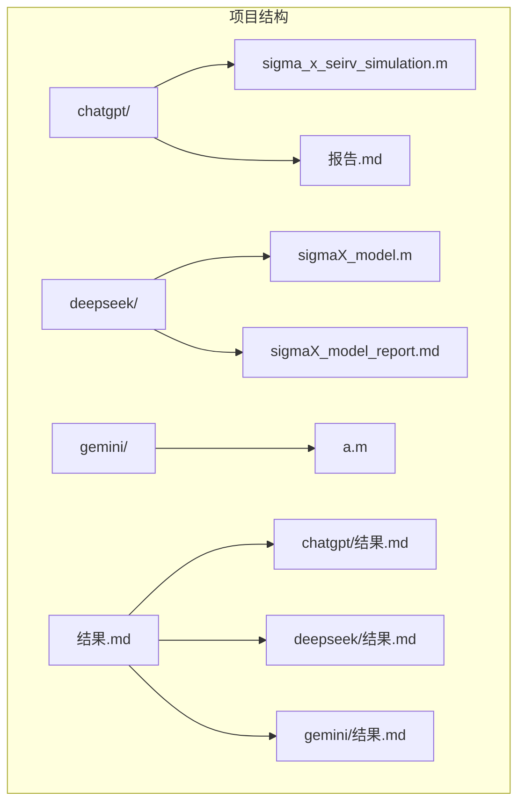
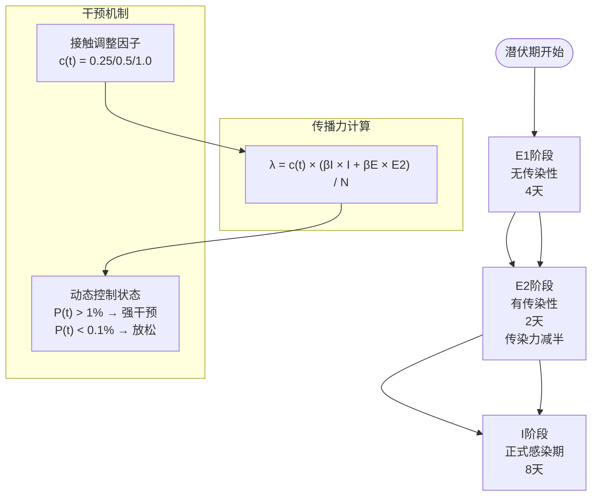
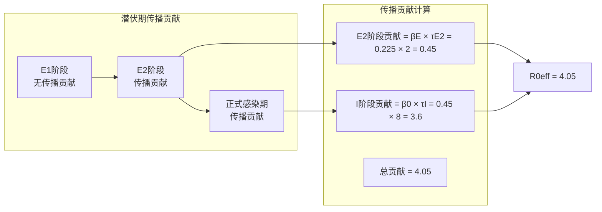
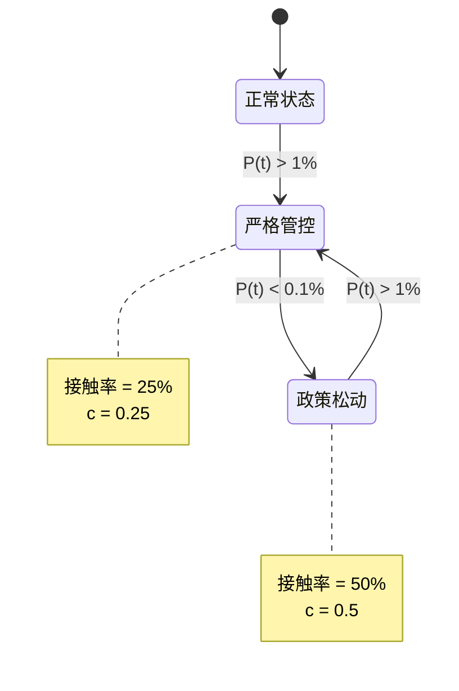
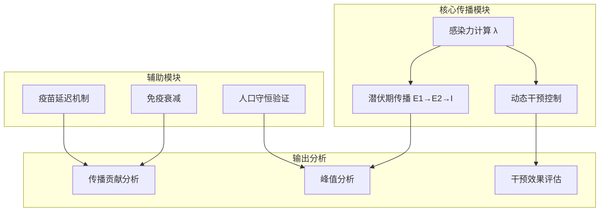

# 潜伏期传播机制

<cite>
**本文档引用的文件**
- [sigma_x_seirv_simulation.m](file://chatgpt/sigma_x_seirv_simulation.m)
- [sigmaX_model.m](file://deepseek/sigmaX_model.m)
- [sigmaX_model_report.md](file://deepseek/sigmaX_model_report.md)
- [a.m](file://gemini/a.m)
- [报告.md](file://chatgpt/报告.md)
</cite>

## 目录
1. [引言](#引言)
2. [项目结构](#项目结构)
3. [核心组件](#核心组件)
4. [架构概览](#架构概览)
5. [详细组件分析](#详细组件分析)
6. [依赖关系分析](#依赖关系分析)
7. [性能考虑](#性能考虑)
8. [故障排除指南](#故障排除指南)
9. [结论](#结论)

## 引言

本文档深入探讨了Sigma-X病毒的潜伏期传播机制，这是一个复杂的流行病学模型，包含了潜伏期的双重传播特性。该模型通过将潜伏期细分为无传染性阶段(E1)和有传染性阶段(E2)，以及引入动态干预机制，为理解新型病原体在千万级城市中的传播动力学提供了重要的理论框架。

## 项目结构

该项目包含三个主要的MATLAB仿真程序，每个都实现了不同的SEIRV模型变体：



**图表来源**
- [sigma_x_seirv_simulation.m:1-154](file://chatgpt/sigma_x_seirv_simulation.m#L1-L154)
- [sigmaX_model.m:1-244](file://deepseek/sigmaX_model.m#L1-L244)

**章节来源**
- [sigma_x_seirv_simulation.m:1-154](file://chatgpt/sigma_x_seirv_simulation.m#L1-L154)
- [sigmaX_model.m:1-244](file://deepseek/sigmaX_model.m#L1-L244)

## 核心组件

### 潜伏期传播模型的核心要素

该模型的核心创新在于对潜伏期传播特性的精确建模：

1. **潜伏期双重传播特性**
   - E1阶段：无传染性，持续4天
   - E2阶段：有传染性，持续2天，传染力为正式感染期的一半

2. **传播率参数化**
   - β₀ = 0.45（正式感染期传播率）
   - βE = 0.225（潜伏期末期传播率，减半假设）

3. **转移速率定义**
   - σ₁ = 1/4 = 0.25（E1→E2转移速率）
   - σ₂ = 1/2 = 0.5（E2→I转移速率）
   - γ = 1/8 = 0.125（I→R恢复速率）

**章节来源**
- [sigmaX_model_report.md:19-28](file://deepseek/sigmaX_model_report.md#L19-L28)
- [sigma_x_seirv_simulation.m:10-19](file://chatgpt/sigma_x_seirv_simulation.m#L10-L19)

## 架构概览

### 潜伏期传播机制的数学架构



**图表来源**
- [sigmaX_model.m:172-243](file://deepseek/sigmaX_model.m#L172-L243)
- [sigma_x_seirv_simulation.m:134](file://chatgpt/sigma_x_seirv_simulation.m#L134)

### 模型参数化方法

#### 潜伏期持续时间参数化

| 阶段 | 持续时间(天) | 转移速率(天⁻¹) | 生物学意义 |
|------|-------------|---------------|------------|
| E1 | 4 | σ₁ = 1/4 = 0.25 | 潜伏期无传染性阶段 |
| E2 | 2 | σ₂ = 1/2 = 0.5 | 潜伏期末期有传染性阶段 |
| I | 8 | γ = 1/8 = 0.125 | 正式感染期 |

#### 传播率关系

根据报告中的参数化：
- β₀ = 15 × 0.03 = 0.45（基础传播率）
- βE = 0.5 × β₀ = 0.225（潜伏期末期传播率）

这种参数化基于以下生物学假设：
1. 潜伏期末期的病毒载量达到一定水平，具备传播能力
2. 传染力相对于正式感染期有所下降
3. 潜伏期的总持续时间为6天（4+2天）

**章节来源**
- [sigmaX_model_report.md:13-28](file://deepseek/sigmaX_model_report.md#L13-L28)
- [sigmaX_model_report.md:50-58](file://deepseek/sigmaX_model_report.md#L50-L58)

## 详细组件分析

### 潜伏期传播曲线分析



**图表来源**
- [sigmaX_model.m:200-203](file://deepseek/sigmaX_model.m#L200-L203)
- [sigmaX_model_report.md:195-203](file://deepseek/sigmaX_model_report.md#L195-L203)

### 动态干预机制



**图表来源**
- [sigmaX_model.m:188-201](file://deepseek/sigmaX_model.m#L188-L201)
- [sigma_x_seirv_simulation.m:117-131](file://chatgpt/sigma_x_seirv_simulation.m#L117-L131)

### 疫苗延迟机制

```mermaid
sequenceDiagram
participant S as 易感者(S)
participant J as 接种但未免疫(J)
participant V as 免疫者(V)
S->>J : 接种疫苗
Note right of J : 抗体产生延迟(14天)
J->>V : 产生抗体(概率ε=0.85)
J->>S : 产生抗体(概率1-ε=0.15)
Note over S,J,V : α = 1/14 = 0.0714 天⁻¹
```

**图表来源**
- [sigmaX_model.m:226-240](file://deepseek/sigmaX_model.m#L226-L240)
- [sigmaX_model_report.md:42-47](file://deepseek/sigmaX_model_report.md#L42-L47)

**章节来源**
- [sigmaX_model.m:172-243](file://deepseek/sigmaX_model.m#L172-L243)
- [sigmaX_model_report.md:72-127](file://deepseek/sigmaX_model_report.md#L72-L127)

## 依赖关系分析

### 模型组件间的相互作用



**图表来源**
- [sigmaX_model.m:172-243](file://deepseek/sigmaX_model.m#L172-L243)
- [sigma_x_seirv_simulation.m:95-153](file://chatgpt/sigma_x_seirv_simulation.m#L95-L153)

### 参数敏感性分析

| 参数 | 敏感度 | 影响机制 | 生物学意义 |
|------|--------|----------|------------|
| βE/β0 | 高 | 潜伏期末期传播贡献 | 传播力减半假设 |
| σ₁/σ₂ | 中高 | 潜伏期转换速率 | 潜伏期持续时间 |
| c(t) | 高 | 动态干预强度 | 传播抑制效果 |
| α | 中 | 疫苗延迟速率 | 疫苗效果显现时间 |
| δ | 低 | 免疫衰减率 | 长期免疫稳定性 |

**章节来源**
- [sigmaX_model.m:212-217](file://deepseek/sigmaX_model.m#L212-L217)
- [sigmaX_model_report.md:195-211](file://deepseek/sigmaX_model_report.md#L195-L211)

## 性能考虑

### 数值求解器配置

三个模型都采用了相同的数值求解策略：

- **求解器**: ode45（龙格-库塔法）
- **相对容差**: 1e-6
- **绝对容差**: 1e-8
- **非负约束**: 启用以保证数值稳定性

### 计算效率优化

1. **向量化操作**: 所有模型都使用向量化计算避免循环
2. **参数封装**: 将参数组织为结构体便于传递
3. **持久状态管理**: 使用persistent变量维护控制状态

## 故障排除指南

### 常见问题及解决方案

#### 1. 函数定义位置错误
**问题**: 在函数定义后仍有代码执行
**解决方案**: 将局部函数定义移动到文件末尾

#### 2. 人口守恒破坏
**问题**: 仿真结果违反人口守恒定律
**解决方案**: 检查微分方程中的流入流出项平衡

#### 3. 参数设置不当
**问题**: 仿真结果异常波动
**解决方案**: 验证参数物理意义和数值范围

**章节来源**
- [sigmaX_model_report.md:237-253](file://deepseek/sigmaX_model_report.md#L237-L253)

## 结论

Sigma-X病毒潜伏期传播机制模型通过以下创新实现了对复杂传播过程的精确描述：

1. **生物学合理性**: 将潜伏期细分为E1和E2两个阶段，符合病毒学事实
2. **数学严谨性**: 建立了完整的微分方程组和参数化方法
3. **政策指导性**: 动态干预机制为公共卫生决策提供量化支持
4. **技术先进性**: 结合了时滞、迟滞控制和疫苗延迟等复杂因素

该模型为理解新型病原体的传播动力学提供了重要工具，特别是在潜伏期传播这一关键环节的建模方面具有重要的理论和实践价值。