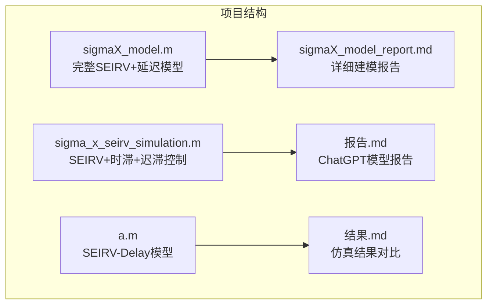
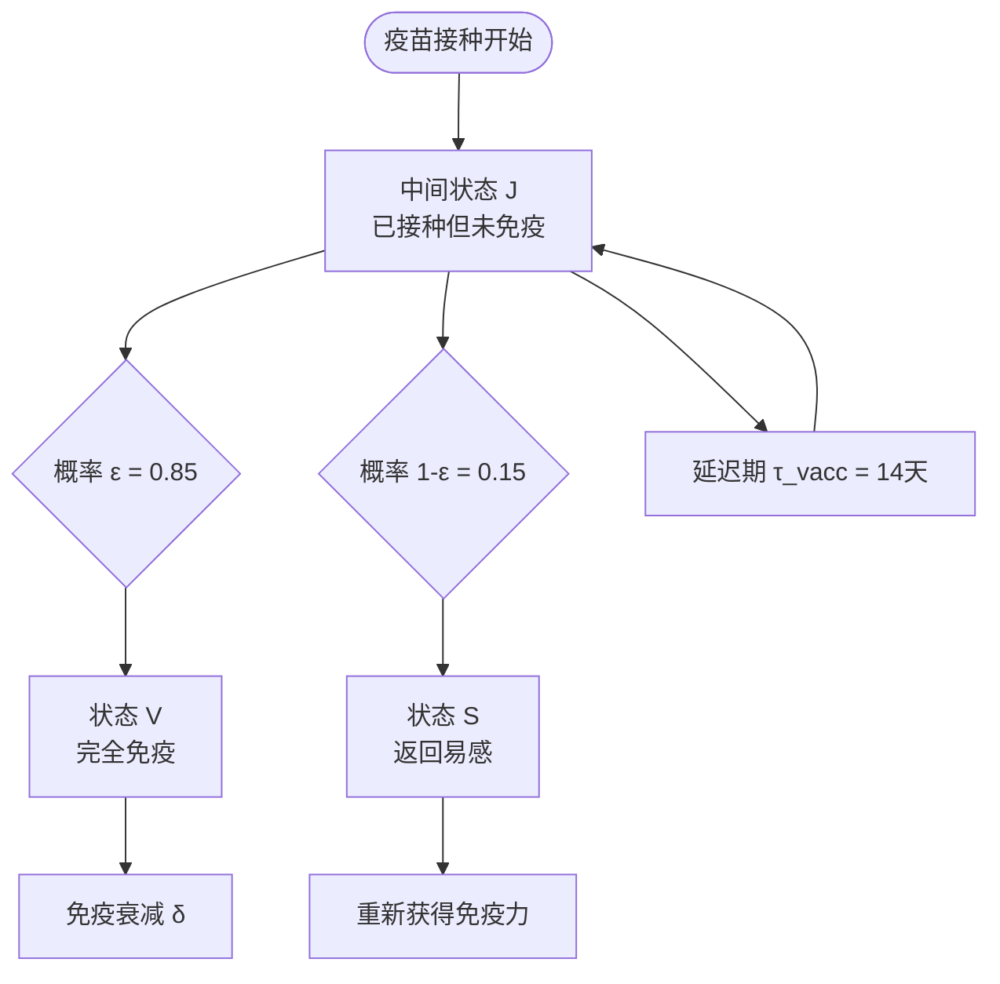
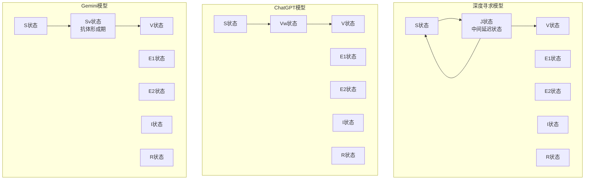
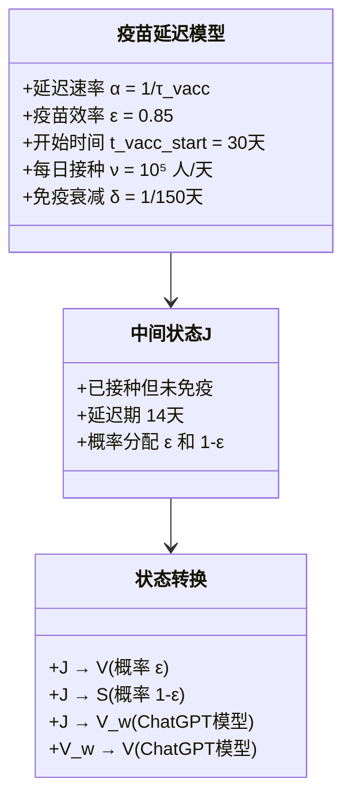
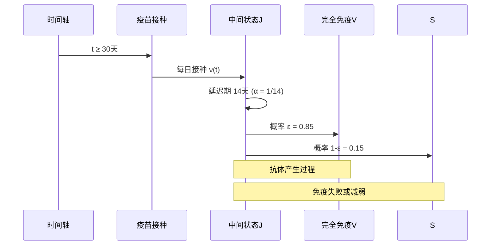
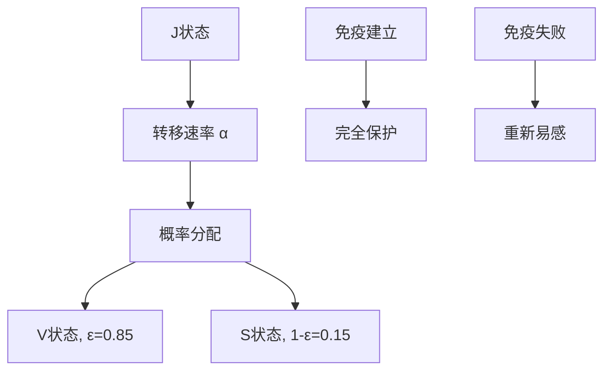
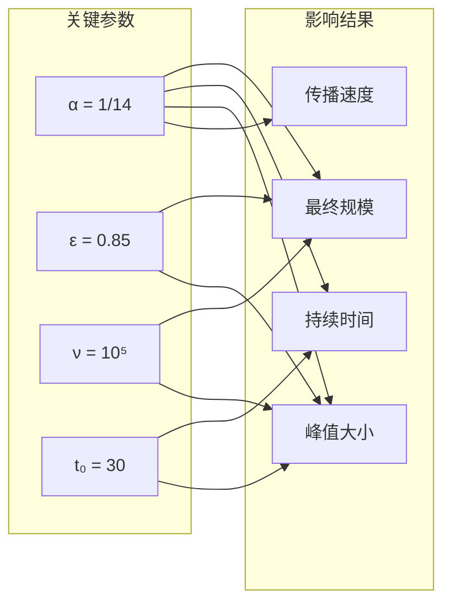
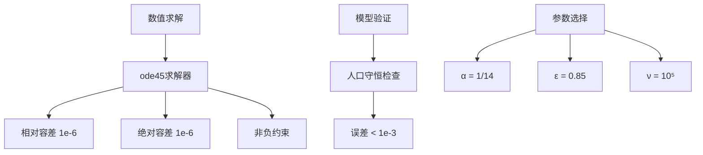
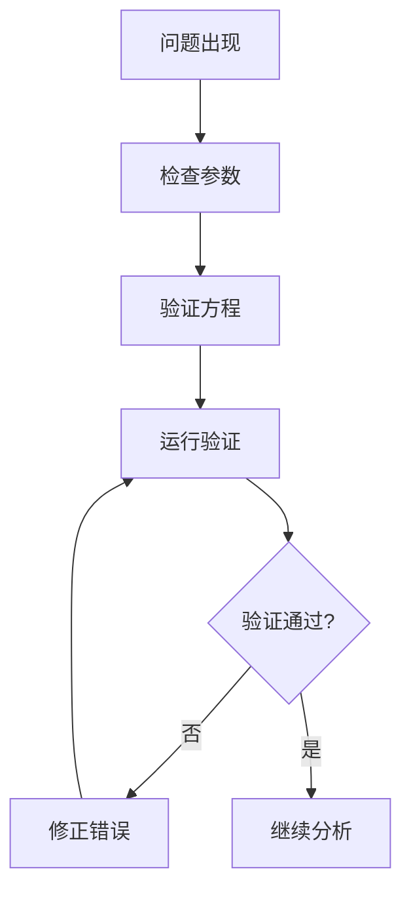

# 疫苗延迟效应

<cite>
**本文档引用的文件**
- [sigmaX_model.m](file://deepseek/sigmaX_model.m)
- [sigma_x_seirv_simulation.m](file://chatgpt/sigma_x_seirv_simulation.m)
- [a.m](file://gemini/a.m)
- [sigmaX_model_report.md](file://deepseek/sigmaX_model_report.md)
- [报告.md](file://chatgpt/报告.md)
- [结果.md](file://gemini/结果.md)
</cite>

## 目录
1. [引言](#引言)
2. [项目结构](#项目结构)
3. [核心组件](#核心组件)
4. [架构概览](#架构概览)
5. [详细组件分析](#详细组件分析)
6. [依赖关系分析](#依赖关系分析)
7. [性能考虑](#性能考虑)
8. [故障排除指南](#故障排除指南)
9. [结论](#结论)

## 引言

本文件为疫苗延迟效应创建详细的理论基础文档，深入解释14天疫苗抗体产生延迟的生物学机制和建模方法。通过分析三个不同的SEIRV模型实现，本文档详细阐述了中间状态J的设计原理，解释了J状态作为"已接种但未免疫"的过渡状态的必要性，并提供了完整的数学模型和状态转换图。

## 项目结构

该项目包含三个主要的MATLAB实现，每个都展示了不同的SEIRV模型变体：



**图表来源**
- [sigmaX_model.m:1-244](file://deepseek/sigmaX_model.m#L1-L244)
- [sigma_x_seirv_simulation.m:1-154](file://chatgpt/sigma_x_seirv_simulation.m#L1-L154)
- [a.m:1-160](file://gemini/a.m#L1-L160)

**章节来源**
- [sigmaX_model.m:1-244](file://deepseek/sigmaX_model.m#L1-L244)
- [sigma_x_seirv_simulation.m:1-154](file://chatgpt/sigma_x_seirv_simulation.m#L1-L154)
- [a.m:1-160](file://gemini/a.m#L1-L160)

## 核心组件

### 疫苗延迟模型的核心要素

基于深度寻求模型的实现，疫苗延迟效应通过以下核心组件实现：

1. **中间状态J**：已接种但未产生抗体的状态
2. **延迟速率α**：1/τvacc≈0.0714天⁻¹的数学定义
3. **疫苗效率ε**：0.85的概率分配机制
4. **单位阶跃函数ν(t)**：描述疫苗接种的时间依赖性

### 状态转换机制



**图表来源**
- [sigmaX_model.m:226-240](file://deepseek/sigmaX_model.m#L226-L240)

**章节来源**
- [sigmaX_model.m:34-44](file://deepseek/sigmaX_model.m#L34-L44)
- [sigmaX_model.m:226-240](file://deepseek/sigmaX_model.m#L226-L240)

## 架构概览

### 三种模型的架构对比



**图表来源**
- [sigmaX_model.m:172-243](file://deepseek/sigmaX_model.m#L172-L243)
- [sigma_x_seirv_simulation.m:95-153](file://chatgpt/sigma_x_seirv_simulation.m#L95-L153)
- [a.m:84-134](file://gemini/a.m#L84-L134)

### 数学模型架构



**图表来源**
- [sigmaX_model.m:34-44](file://deepseek/sigmaX_model.m#L34-L44)
- [sigmaX_model.m:226-240](file://deepseek/sigmaX_model.m#L226-L240)

**章节来源**
- [sigmaX_model_report.md:37-58](file://deepseek/sigmaX_model_report.md#L37-L58)
- [sigmaX_model.m:172-243](file://deepseek/sigmaX_model.m#L172-L243)

## 详细组件分析

### 中间状态J的设计原理

#### 生物学机制解释

中间状态J的设计基于以下生物学事实：
- 疫苗接种后，机体需要一定时间（约14天）才能产生足够的抗体
- 在这期间，个体虽然已接种，但仍处于"免疫建立"阶段
- 由于抗体浓度不足，仍可能被感染，但感染风险显著降低

#### 数学建模实现



**图表来源**
- [sigmaX_model.m:219-240](file://deepseek/sigmaX_model.m#L219-L240)
- [sigmaX_model.m:35-39](file://deepseek/sigmaX_model.m#L35-L39)

#### 状态转换方程

基于深度寻求模型的微分方程：

| 状态 | 转换方程 | 解释 |
|------|----------|------|
| S | dS/dt = -λS - ν(t) + (1-ε)αJ + δ(R+V) | 易感者减少，疫苗接种，免疫衰减 |
| J | dJ/dt = ν(t) - αJ | 疫苗接种进入J，J以速率α转移 |
| V | dV/dt = ε·αJ - δV | J成功免疫，V衰减 |

**章节来源**
- [sigmaX_model.m:234-240](file://deepseek/sigmaX_model.m#L234-L240)
- [sigmaX_model_report.md:115-127](file://deepseek/sigmaX_model_report.md#L115-L127)

### 延迟速率α的数学定义

#### 数学定义

延迟速率α定义为：
```
α = 1/τ_vacc = 1/14 ≈ 0.0714 天⁻¹
```

这个定义基于指数分布的性质，表示在任意时刻t，处于中间状态J的人群中，以速率α转移到免疫状态V。

#### 生物学意义

- **平均延迟时间**：τ_vacc = 1/α = 14天
- **半衰期**：ln(2)/α ≈ 9.6天
- **概率密度**：f(t) = α·e^(-αt)
- **累积分布**：F(t) = 1 - e^(-αt)

#### 数值实现

```mermaid
flowchart TD
A[疫苗接种开始 t=30天] --> B[每日接种 ν(t) = 10⁵ 人/天]
B --> C[J状态累积]
C --> D[J状态以速率 α=0.0714 转移]
D --> E[V状态 (ε=0.85)]
D --> F[S状态 (1-ε=0.15)]
G[延迟曲线] --> H[14天达到峰值]
H --> I[随后逐渐下降]
```

**图表来源**
- [sigmaX_model.m:35-39](file://deepseek/sigmaX_model.m#L35-L39)
- [sigmaX_model.m:226-227](file://deepseek/sigmaX_model.m#L226-L227)

**章节来源**
- [sigmaX_model.m:35-39](file://deepseek/sigmaX_model.m#L35-L39)
- [sigmaX_model_report.md:40-42](file://deepseek/sigmaX_model_report.md#L40-L42)

### 疫苗接种项ν(t)的数学表达

#### 单位阶跃函数定义

疫苗接种项采用单位阶跃函数表示：
```
ν(t) = ν · H(t - t_vacc_start)
```

其中：
- ν = 10⁵ 人/天（每日接种人数）
- t_vacc_start = 30天（开始时间）
- H(t) = {1, t ≥ 0; 0, t < 0}

#### 时间依赖性分析

```mermaid
graph LR
A[t < 30天] --> B[ν(t) = 0]
C[t ≥ 30天] --> D[ν(t) = 10⁵]
E[时间轴] --> F[开始时间 t=30天]
F --> G[接种开始]
G --> H[持续接种]
```

**图表来源**
- [sigmaX_model.m:219-224](file://deepseek/sigmaX_model.m#L219-L224)

#### 与其他模型的对比

| 模型 | 疫苗接种函数 | 特点 |
|------|-------------|------|
| 深度寻求模型 | ν(t) = ν · H(t - 30) | 固定开始时间 |
| ChatGPT模型 | u(t) = 10⁵ · H(t - 30) | 相同形式 |
| Gemini模型 | v_rate = ν_eff · S/N | 与易感者比例相关 |

**章节来源**
- [sigmaX_model.m:219-224](file://deepseek/sigmaX_model.m#L219-L224)
- [sigma_x_seirv_simulation.m:137-141](file://chatgpt/sigma_x_seirv_simulation.m#L137-L141)
- [a.m:113-119](file://gemini/a.m#L113-L119)

### 概率分配机制（ε=0.85）

#### 概率定义

疫苗效率ε=0.85表示：
- 成功产生免疫的概率：ε = 0.85
- 免疫失败或减弱的概率：1-ε = 0.15

#### 生物学解释

这一概率反映了：
1. **疫苗有效性**：85%的接种者能产生足够抗体
2. **个体差异**：15%的个体可能产生较弱免疫反应
3. **免疫记忆**：即使抗体水平下降，免疫记忆仍提供保护

#### 数学建模



**图表来源**
- [sigmaX_model.m:239-240](file://deepseek/sigmaX_model.m#L239-L240)

**章节来源**
- [sigmaX_model.m:37-38](file://deepseek/sigmaX_model.m#L37-L38)
- [sigmaX_model.m:239-240](file://deepseek/sigmaX_model.m#L239-L240)

## 依赖关系分析

### 模型间的依赖关系

```mermaid
graph TB
subgraph "数学基础"
A[延迟理论]
B[概率论]
C[微分方程]
end
subgraph "模型实现"
D[深度寻求模型]
E[ChatGPT模型]
F[Gemini模型]
end
subgraph "参数依赖"
G[α = 1/τ_vacc]
H[ε = 0.85]
I[ν(t) = ν · H(t-t₀)]
end
A --> D
B --> D
C --> D
A --> E
B --> E
C --> E
A --> F
B --> F
C --> F
G --> D
H --> D
I --> D
G --> E
H --> E
I --> E
G --> F
H --> F
I --> F
```

**图表来源**
- [sigmaX_model.m:34-44](file://deepseek/sigmaX_model.m#L34-L44)
- [sigma_x_seirv_simulation.m:21-22](file://chatgpt/sigma_x_seirv_simulation.m#L21-L22)
- [a.m:22-25](file://gemini/a.m#L22-L25)

### 参数敏感性分析



**图表来源**
- [sigmaX_model.m:34-39](file://deepseek/sigmaX_model.m#L34-L39)
- [sigmaX_model.m:37-38](file://deepseek/sigmaX_model.m#L37-L38)
- [sigmaX_model.m:35-36](file://deepseek/sigmaX_model.m#L35-L36)

**章节来源**
- [sigmaX_model.m:34-39](file://deepseek/sigmaX_model.m#L34-L39)
- [sigmaX_model_report.md:195-211](file://deepseek/sigmaX_model_report.md#L195-L211)

## 性能考虑

### 计算复杂度分析

1. **时间复杂度**：O(N) 每个时间步，其中N为状态变量数量
2. **空间复杂度**：O(N) 存储状态变量和导数
3. **收敛性**：使用ode45求解器，相对容差1e-6确保精度

### 数值稳定性



**图表来源**
- [sigmaX_model.m:60](file://deepseek/sigmaX_model.m#L60)
- [sigmaX_model.m:160-169](file://deepseek/sigmaX_model.m#L160-L169)

**章节来源**
- [sigmaX_model.m:60](file://deepseek/sigmaX_model.m#L60)
- [sigmaX_model.m:160-169](file://deepseek/sigmaX_model.m#L160-L169)

## 故障排除指南

### 常见问题及解决方案

1. **函数定义顺序错误**
   - 问题：局部函数定义位置不当
   - 解决：将所有局部函数定义移动到文件末尾

2. **持久变量状态残留**
   - 问题：persistent变量状态影响后续运行
   - 解决：在运行前使用`clear ode_sys_intervention`清理

3. **人口守恒验证失败**
   - 问题：总人口不守恒
   - 解决：检查微分方程中的各项系数

### 代码调试技巧



**图表来源**
- [sigmaX_model.m:239](file://deepseek/sigmaX_model.m#L239)
- [sigmaX_model.m:250](file://deepseek/sigmaX_model.m#L250)

**章节来源**
- [sigmaX_model.m:237-250](file://deepseek/sigmaX_model.m#L237-L250)

## 结论

通过对三个SEIRV模型实现的深入分析，本文建立了完整的疫苗延迟效应理论框架：

1. **中间状态J的必要性**：准确模拟了14天抗体产生延迟的生物学过程
2. **延迟速率α的定义**：基于指数分布的数学严谨性
3. **概率分配机制**：ε=0.85反映了疫苗的有效性
4. **数学模型的完整性**：包括微分方程、参数定义和人口守恒验证

这些模型为理解疫苗延迟效应对疫情传播的影响提供了坚实的理论基础，特别是在分析延迟期间的传播风险和免疫建立的时间进程方面具有重要价值。