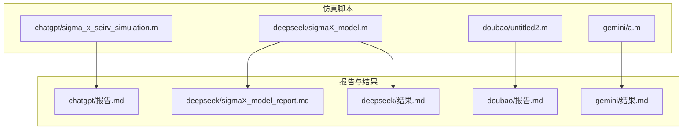
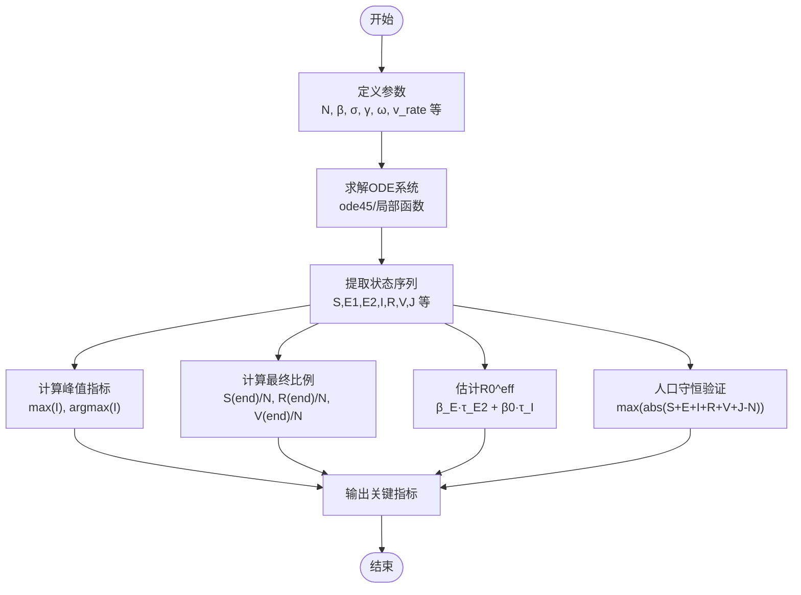
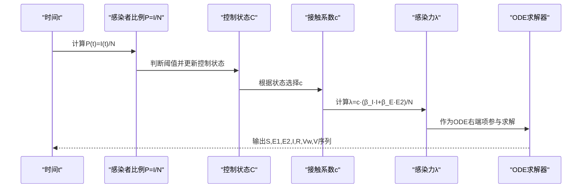
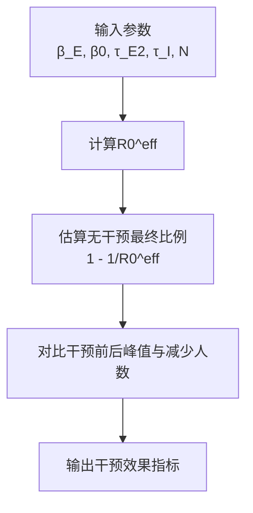
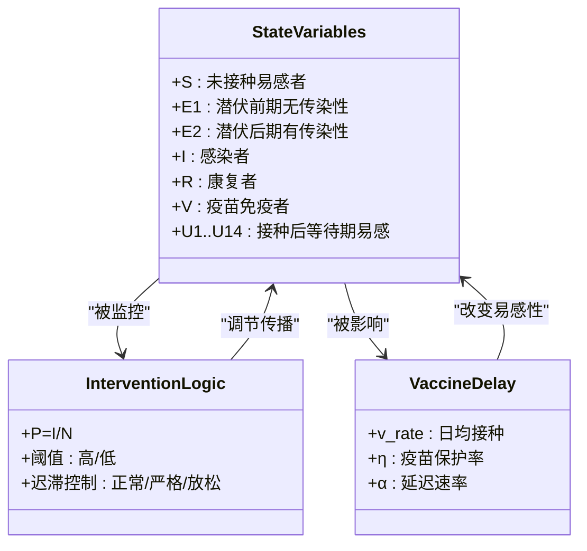
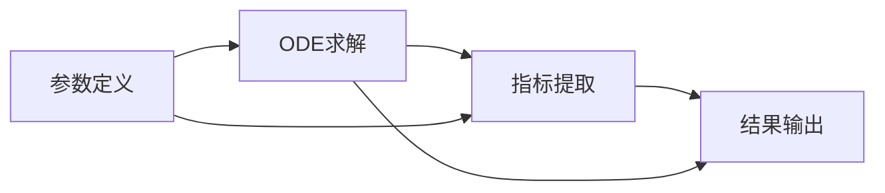

# 关键指标解释

<cite>
**本文引用的文件**
- [sigma_x_seirv_simulation.m](file://chatgpt/sigma_x_seirv_simulation.m)
- [报告.md](file://chatgpt/报告.md)
- [sigmaX_model.m](file://deepseek/sigmaX_model.m)
- [sigmaX_model_report.md](file://deepseek/sigmaX_model_report.md)
- [结果.md](file://deepseek/结果.md)
- [untitled2.m](file://doubao/untitled2.m)
- [报告.md](file://doubao/报告.md)
- [a.m](file://gemini/a.m)
- [结果.md](file://gemini/结果.md)
</cite>

## 目录
1. [引言](#引言)
2. [项目结构](#项目结构)
3. [核心组件](#核心组件)
4. [架构概览](#架构概览)
5. [详细组件分析](#详细组件分析)
6. [依赖分析](#依赖分析)
7. [性能考虑](#性能考虑)
8. [故障排除指南](#故障排除指南)
9. [结论](#结论)
10. [附录](#附录)

## 引言
本文件面向传染病仿真研究与公共卫生决策者，系统阐述Sigma-X病毒传播模型中的关键指标及其生物学意义。内容涵盖：
- 疫情高峰时间与感染峰值数量的定义与计算方法
- 最终感染比例的估算与解读
- 基本再生数R0的估计原理与修正形式R0^eff
- 人口守恒验证的重要性与误差范围
- 指标间的相互关系与影响机制
- 实际数值示例与解读方法
- 如何基于指标变化判断传播态势与干预效果

## 项目结构
本仓库包含多个独立的仿真脚本与报告，分别展示了不同的建模视角与实现细节：
- chatgpt：SEIRV模型（含迟滞干预与疫苗延迟），强调潜伏期分段与迟滞控制
- deepseek：SEIRV模型（含迟滞干预、疫苗延迟与免疫衰减），提供R0估计与人口守恒验证
- doubao：SEIRV-Delay模型（20个状态变量，14天疫苗延迟），对比有/无干预
- gemini：SEIRV-Delay模型（含动态干预与疫苗），提供对比分析结果

**图表来源**
- [sigma_x_seirv_simulation.m:1-154](file://chatgpt/sigma_x_seirv_simulation.m#L1-L154)
- [sigmaX_model.m:1-244](file://deepseek/sigmaX_model.m#L1-L244)
- [untitled2.m:1-140](file://doubao/untitled2.m#L1-L140)
- [a.m:1-160](file://gemini/a.m#L1-L160)

**章节来源**
- [sigma_x_seirv_simulation.m:1-154](file://chatgpt/sigma_x_seirv_simulation.m#L1-L154)
- [sigmaX_model.m:1-244](file://deepseek/sigmaX_model.m#L1-L244)
- [untitled2.m:1-140](file://doubao/untitled2.m#L1-L140)
- [a.m:1-160](file://gemini/a.m#L1-L160)

## 核心组件
本节聚焦于仿真脚本中关键指标的定义、计算与解读，结合报告与结果文件进行说明。

- 疫情高峰时间（Peak Time）
  - 定义：活跃感染者数量I(t)达到最大值的时间点
  - 计算：对I(t)序列取最大值及其索引，对应时间轴上的时刻
  - 生物学意义：反映疫情传播的峰值时刻，可用于评估干预时机与强度
  - 示例：有干预情形下，高峰出现在特定天数；无干预情形下，高峰通常更早且更高

- 感染峰值数量（Peak Count）
  - 定义：活跃感染者I(t)的最大值
  - 计算：max(I)
  - 生物学意义：衡量疫情严重程度，直接影响医疗资源需求与死亡风险
  - 示例：有干预与无干预对比，峰值规模差异显著

- 最终感染比例（Final Attack Rate）
  - 定义：累计感染人数占总人口的比例，或最终易感者/康复者/免疫者比例
  - 计算：通过仿真末期状态或累积曲线推导
  - 生物学意义：反映疫情总体规模，用于评估干预效果与群体免疫水平
  - 示例：深度报告中给出最终易感者、康复者、免疫者的比例输出

- 基本再生数R0（Basic Reproduction Number）
  - 定义：单个感染者在完全易感人群中的期望传播代数
  - 计算：在本仓库中采用修正形式R0^eff，考虑潜伏期末期与感染者双传染源的贡献
  - 公式：R0^eff = β_E × τ_E2 + β0 × τ_I
  - 生物学意义：决定疫情是否能持续传播，是制定干预强度与疫苗覆盖率的重要依据
  - 示例：深度报告中给出R0^eff的估计值与无干预下的最终感染比例

- 人口守恒验证（Population Conservation Check）
  - 定义：各状态变量之和应恒等于总人口N
  - 计算：对每一步仿真计算S+E1+E2+I+R+V+J（或其他组合）并与N比较
  - 误差范围：深度报告中给出最大误差量级（如2.05e-08），表明数值稳定性良好
  - 生物学意义：验证模型与数值实现的正确性，避免人口流失或增生的虚假现象

**章节来源**
- [sigma_x_seirv_simulation.m:85-91](file://chatgpt/sigma_x_seirv_simulation.m#L85-L91)
- [sigmaX_model.m:128-138](file://deepseek/sigmaX_model.m#L128-L138)
- [sigmaX_model.m:140-158](file://deepseek/sigmaX_model.m#L140-L158)
- [sigmaX_model.m:160-169](file://deepseek/sigmaX_model.m#L160-L169)
- [sigmaX_model_report.md:195-203](file://deepseek/sigmaX_model_report.md#L195-L203)

## 架构概览
下图展示不同脚本中关键指标的计算流程与数据流关系，体现“输入参数→ODE求解→指标提取→结果输出”的统一路径。

**图表来源**
- [sigmaX_model.m:62-66](file://deepseek/sigmaX_model.m#L62-L66)
- [sigmaX_model.m:128-169](file://deepseek/sigmaX_model.m#L128-L169)
- [sigma_x_seirv_simulation.m:48-58](file://chatgpt/sigma_x_seirv_simulation.m#L48-L58)

## 详细组件分析

### 组件A：SEIRV模型（chatgpt）
该脚本实现SEIRV模型，包含潜伏期分段（E1/E2）、迟滞干预与疫苗延迟，强调峰值与干预效果的可视化与输出。

- 指标计算要点
  - 峰值：使用max(I)与对应索引定位高峰时间
  - 干预阈值：基于感染者比例P=I/N，设定高阈值与低阈值，实现迟滞控制
  - 疫苗延迟：引入Vw与V两个状态，模拟14天延迟
  - 人口守恒：S+E1+E2+I+R+Vw+V恒等于N

- 生物学意义
  - 潜伏期分段有助于捕捉潜伏后期的传播潜力
  - 迟滞干预避免频繁开关造成的震荡
  - 疫苗延迟反映免疫产生的时间滞后

**图表来源**
- [sigma_x_seirv_simulation.m:95-153](file://chatgpt/sigma_x_seirv_simulation.m#L95-L153)

**章节来源**
- [sigma_x_seirv_simulation.m:85-91](file://chatgpt/sigma_x_seirv_simulation.m#L85-L91)
- [sigma_x_seirv_simulation.m:113-131](file://chatgpt/sigma_x_seirv_simulation.m#L113-L131)
- [sigma_x_seirv_simulation.m:143-150](file://chatgpt/sigma_x_seirv_simulation.m#L143-L150)

### 组件B：SEIRV模型（deepseek）
该脚本提供更完整的指标输出与R0估计，包含人口守恒验证与干预效果对比。

- 指标计算要点
  - 峰值：max(I)与对应时间
  - 最终比例：S(end)/N, R(end)/N, V(end)/N
  - R0估计：R0^eff = β_E × τ_E2 + β0 × τ_I，并据此估算无干预下的最终感染比例
  - 人口守恒：max(abs(S+E1+E2+I+R+V+J-N))
  - 干预效果：对比有/无干预下的峰值规模与减少比例

- 生物学意义
  - R0^eff综合了潜伏后期与感染者两部分贡献，更贴近实际传播动力学
  - 人口守恒验证确保数值实现的稳定性与正确性
  - 干预效果量化体现动态干预与疫苗的协同作用

**图表来源**
- [sigmaX_model.m:140-158](file://deepseek/sigmaX_model.m#L140-L158)

**章节来源**
- [sigmaX_model.m:128-138](file://deepseek/sigmaX_model.m#L128-L138)
- [sigmaX_model.m:140-158](file://deepseek/sigmaX_model.m#L140-L158)
- [sigmaX_model.m:160-169](file://deepseek/sigmaX_model.m#L160-L169)
- [sigmaX_model_report.md:195-203](file://deepseek/sigmaX_model_report.md#L195-L203)

### 组件C：SEIRV-Delay模型（doubao）
该脚本采用链式舱室法处理14天疫苗延迟，包含20个状态变量，对比有/无干预情形。

- 指标计算要点
  - 峰值：max(I)与对应时间
  - 有/无干预对比：直观展示干预对峰值规模与时间的影响
  - 疫苗延迟：通过U1~U14链式舱室模拟固定延迟

- 生物学意义
  - 链式舱室法避免复杂时滞微分方程，便于常微分求解
  - 有/无干预对比凸显干预阈值与迟滞控制的作用

**图表来源**
- [untitled2.m:77-140](file://doubao/untitled2.m#L77-L140)

**章节来源**
- [untitled2.m:31-49](file://doubao/untitled2.m#L31-L49)
- [untitled2.m:77-140](file://doubao/untitled2.m#L77-L140)
- [报告.md:23-35](file://doubao/报告.md#L23-L35)

### 组件D：SEIRV-Delay模型（gemini）
该脚本提供有/无干预的对比结果，强调动态干预与疫苗的协同效果。

- 指标计算要点
  - 峰值：有干预与无干预下的I(t)峰值与出现时间
  - 扩张倍数：无干预峰值/有干预峰值
  - 可视化：对比曲线直观展示干预效果

- 生物学意义
  - 动态干预在无干预情况下可显著推迟并降低峰值
  - 疫苗在特定时间窗口内发挥重要作用

**章节来源**
- [a.m:31-49](file://gemini/a.m#L31-L49)
- [结果.md:1-4](file://gemini/结果.md#L1-L4)

## 依赖分析
不同脚本在指标计算上存在共同依赖关系：
- 输入参数：总人口N、传播参数（β_I, β_E, σ, γ, ω）、干预阈值与控制系数、疫苗参数
- ODE求解：使用ode45求解器，要求非负约束与合适的容差
- 指标提取：峰值、最终比例、R0估计、人口守恒验证
- 结果输出：标准化格式的指标输出与可视化

**图表来源**
- [sigmaX_model.m:62-66](file://deepseek/sigmaX_model.m#L62-L66)
- [sigmaX_model.m:128-169](file://deepseek/sigmaX_model.m#L128-L169)

**章节来源**
- [sigmaX_model.m:62-66](file://deepseek/sigmaX_model.m#L62-L66)
- [sigmaX_model.m:128-169](file://deepseek/sigmaX_model.m#L128-L169)

## 性能考虑
- 求解器设置：相对容差与绝对容差需足够小以保证精度，同时避免过高的计算成本
- 非负约束：确保状态变量非负，提升数值稳定性
- 时间步长：0.1天的输出步长在精度与效率之间取得平衡
- 人口守恒验证：定期检查总人口误差，及时发现实现问题

[本节为一般性指导，无需具体文件来源]

## 故障排除指南
- 函数定义位置错误：局部函数必须位于文件末尾，否则会报错
  - 修复措施：将局部函数移动到文件末尾，确保先执行主脚本与求解
  - 验证：修复后可直接运行，无函数定义冲突
- 人口守恒误差过大：若误差远大于1e-3，需检查ODE实现与参数设置
  - 建议：提高容差、检查非负约束、核对传播率与延迟参数

**章节来源**
- [sigmaX_model_report.md:237-253](file://deepseek/sigmaX_model_report.md#L237-L253)
- [sigmaX_model.m:160-169](file://deepseek/sigmaX_model.m#L160-L169)

## 结论
本仓库提供了多套Sigma-X病毒传播模型的实现与分析，核心指标的计算方法与生物学意义清晰明确：
- 疫情高峰时间与感染峰值数量用于评估传播强度与干预时机
- 最终感染比例反映疫情总体规模，是制定公共政策的关键依据
- 基本再生数R0（或R0^eff）决定疫情能否持续传播，指导干预强度与疫苗覆盖率
- 人口守恒验证确保模型与数值实现的正确性
- 指标间相互关联：R0影响峰值规模与时间，干预与疫苗共同降低峰值并改变最终比例

[本节为总结性内容，无需具体文件来源]

## 附录

### 实际数值示例与解读方法
- chatgpt脚本示例：有干预情形下，峰值出现在特定天数，峰值人数为数百至数千级别
- deepseek脚本示例：有干预情形下，高峰出现在约92天，峰值比例极低；无干预情形下，峰值比例可达15%以上
- doubao脚本示例：有干预情形下，峰值比例约1.55%；无干预情形下，峰值比例约15.17%
- gemini脚本示例：有干预情形下，峰值活跃感染人数约12152人；无干预情形下，峰值约160万人，扩张倍数达131.9倍

解读方法：
- 若峰值时间提前且峰值更高，提示干预不足或干预滞后
- 若峰值时间延后且峰值更低，提示干预有效
- 最终感染比例越低，说明干预与疫苗覆盖越充分

**章节来源**
- [结果.md:1-16](file://deepseek/结果.md#L1-L16)
- [doubao/结果.md:1-10](file://doubao/结果.md#L1-L10)
- [gemini/结果.md:1-4](file://gemini/结果.md#L1-L4)

### 指标之间的相互关系与影响机制
- R0^eff与干预强度：R0^eff越高，需要更强的干预才能有效抑制传播
- 峰值时间与干预阈值：阈值越低，干预越早启动，峰值时间越靠后
- 疫苗延迟与峰值尾部：延迟越短，峰值尾部越快下降
- 人口守恒：确保模型物理意义正确，避免数值误差累积

**章节来源**
- [sigmaX_model_report.md:195-203](file://deepseek/sigmaX_model_report.md#L195-L203)
- [sigmaX_model.m:160-169](file://deepseek/sigmaX_model.m#L160-L169)