# 可视化图表解读

<cite>
**本文档引用的文件**
- [sigma_x_seirv_simulation.m](file://chatgpt/sigma_x_seirv_simulation.m)
- [报告.md](file://chatgpt/报告.md)
- [结果.md](file://chatgpt/结果.md)
- [sigmaX_model.m](file://deepseek/sigmaX_model.m)
- [sigmaX_model_report.md](file://deepseek/sigmaX_model_report.md)
- [结果.md](file://deepseek/结果.md)
- [untitled2.m](file://doubao/untitled2.m)
- [报告.md](file://doubao/报告.md)
- [结果.md](file://doubao/结果.md)
- [a.m](file://gemini/a.m)
- [结果.md](file://gemini/结果.md)
</cite>

## 目录
1. [引言](#引言)
2. [项目结构](#项目结构)
3. [核心组件](#核心组件)
4. [架构概览](#架构概览)
5. [详细组件分析](#详细组件分析)
6. [依赖关系分析](#依赖关系分析)
7. [性能考虑](#性能考虑)
8. [故障排除指南](#故障排除指南)
9. [结论](#结论)
10. [附录](#附录)

## 引言

本指南专注于基于MATLAB代码库的可视化图表解读方法，涵盖流行曲线、传播动力学图、状态变量变化图等关键图表类型的分析技巧。通过对四个不同实现版本的Sigma-X病毒传播模型的深入分析，我们将提供：

- 流行曲线的解读方法和传播特征识别
- 传播动力学图的绘制最佳实践
- 状态变量变化图的分析要点
- 关键转折点和传播模式的识别技巧
- 图表美化和专业展示技巧
- 政策制定和公众沟通中的图表应用
- 图表导出和分享的标准格式

## 项目结构

本代码库包含四个不同的Sigma-X病毒传播模型实现，每个都提供了独特的可视化方法和分析视角：

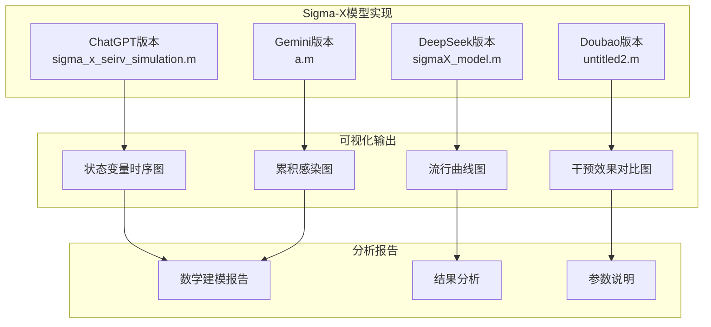

**图表来源**
- [sigma_x_seirv_simulation.m:62-91](file://chatgpt/sigma_x_seirv_simulation.m#L62-L91)
- [sigmaX_model.m:80-127](file://deepseek/sigmaX_model.m#L80-L127)
- [untitled2.m:50-75](file://doubao/untitled2.m#L50-L75)
- [a.m:51-79](file://gemini/a.m#L51-L79)

**章节来源**
- [sigma_x_seirv_simulation.m:1-154](file://sigma_x_seirv_simulation.m#L1-L154)
- [sigmaX_model.m:1-244](file://sigmaX_model.m#L1-L244)
- [untitled2.m:1-140](file://untitled2.m#L1-L140)
- [a.m:1-160](file://a.m#L1-L160)

## 核心组件

### 传播模型组件

四个实现版本都基于SEIRV模型，但采用了不同的建模策略：

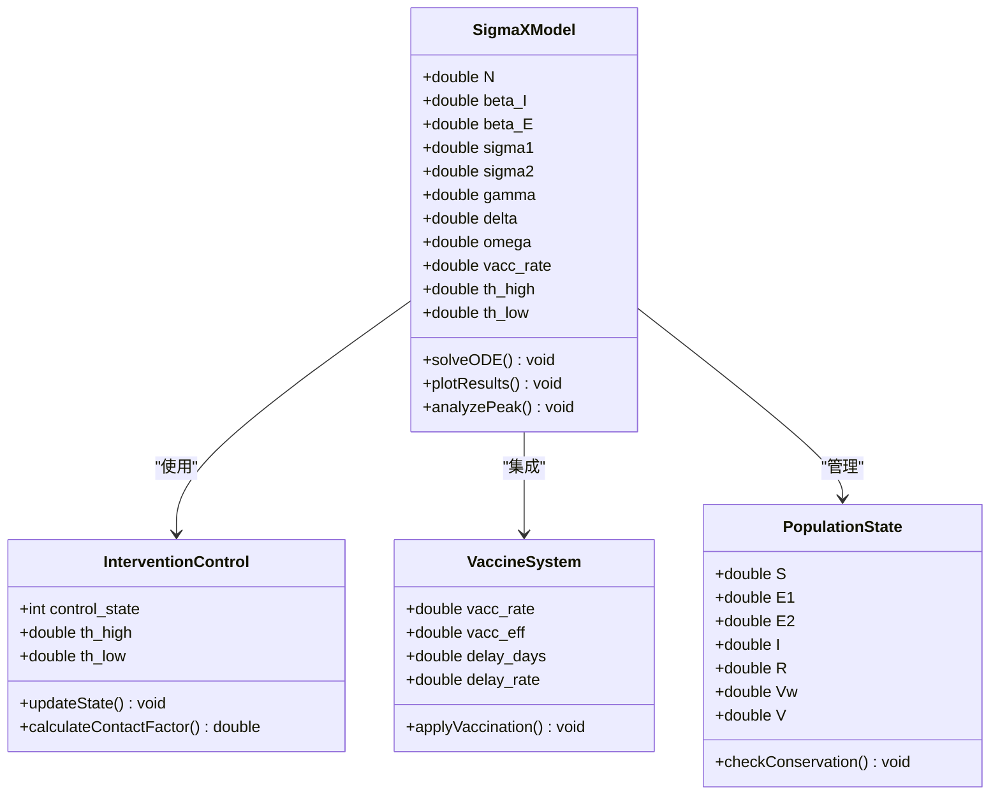

**图表来源**
- [sigma_x_seirv_simulation.m:95-154](file://sigma_x_seirv_simulation.m#L95-L154)
- [sigmaX_model.m:172-244](file://sigmaX_model.m#L172-L244)
- [untitled2.m:77-140](file://untitled2.m#L77-L140)
- [a.m:84-160](file://a.m#L84-L160)

### 可视化组件

每个实现都提供了独特的图表输出方式：

| 实现版本 | 图表类型 | 组件数量 | 特殊功能 |
|---------|---------|---------|---------|
| ChatGPT | 单一状态变量图 | 5个曲线 | 峰值检测 |
| DeepSeek | 四象限复合图 | 4个子图 | 多维度分析 |
| Doubao | 对比分析图 | 2个图 | 有/无干预对比 |
| Gemini | 双子图布局 | 2个子图 | 疫苗效果展示 |

**章节来源**
- [sigma_x_seirv_simulation.m:62-91](file://sigma_x_seirv_simulation.m#L62-L91)
- [sigmaX_model.m:80-127](file://sigmaX_model.m#L80-L127)
- [untitled2.m:50-75](file://untitled2.m#L50-L75)
- [a.m:51-79](file://a.m#L51-L79)

## 架构概览

### 传播动力学可视化架构

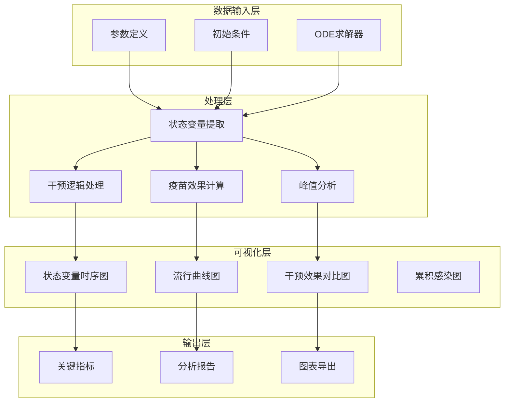

**图表来源**
- [sigmaX_model.m:62-127](file://sigmaX_model.m#L62-L127)
- [untitled2.m:22-49](file://untitled2.m#L22-L49)
- [a.m:27-49](file://a.m#L27-L49)

### 动态干预机制可视化

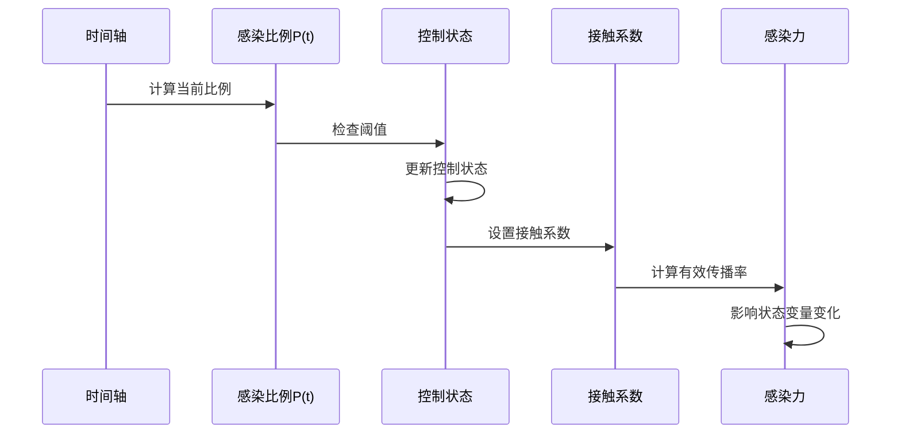

**图表来源**
- [sigmaX_model.m:188-210](file://sigmaX_model.m#L188-L210)
- [untitled2.m:87-109](file://untitled2.m#L87-L109)
- [a.m:97-111](file://a.m#L97-L111)

## 详细组件分析

### ChatGPT版本：单一状态变量可视化

#### 图表特点

ChatGPT版本提供了简洁而有效的单一图表展示：

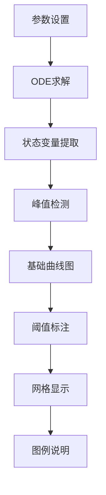

**图表来源**
- [sigma_x_seirv_simulation.m:48-91](file://sigma_x_seirv_simulation.m#L48-L91)

#### 流行曲线解读方法

| 曲线类型 | 颜色标识 | 解读要点 | 传播含义 |
|---------|---------|---------|---------|
| 易感人群S | 蓝色 | 持续下降，最终趋于稳定 | 疫情传播的燃料消耗 |
| 潜伏人群E | 紫色 | 先上升后下降，形成双峰 | 潜伏期传播特征 |
| 感染人群I | 红色 | 单峰曲线，峰值明显 | 疫情活跃程度 |
| 康复人群R | 绿色 | 持续上升，最终饱和 | 疫情结束标志 |
| 免疫人群V | 黑色 | 缓慢上升，后期显著 | 疫苗效果体现 |

#### 关键转折点识别

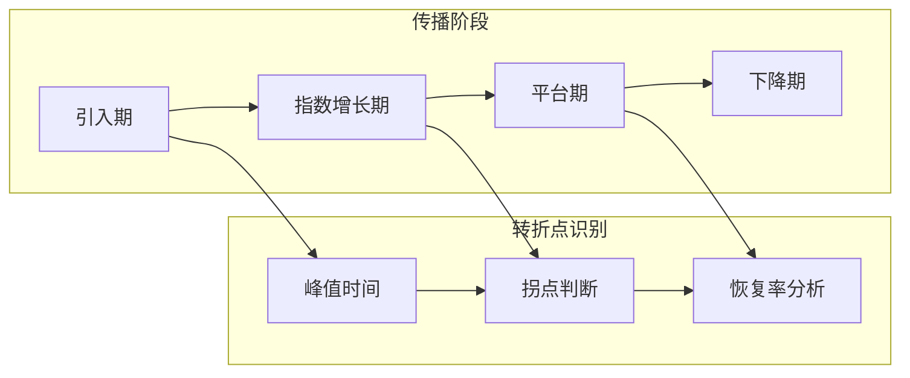

**图表来源**
- [sigma_x_seirv_simulation.m:85-91](file://sigma_x_seirv_simulation.m#L85-L91)

**章节来源**
- [sigma_x_seirv_simulation.m:62-91](file://sigma_x_seirv_simulation.m#L62-L91)
- [结果.md:1-2](file://chatgpt/结果.md#L1-L2)

### DeepSeek版本：四象限复合图

#### 多维度可视化策略

DeepSeek版本采用四象限布局，提供全面的传播分析：

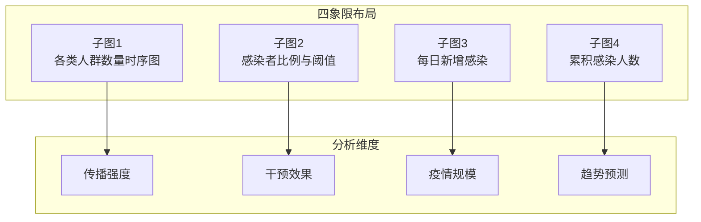

**图表来源**
- [sigmaX_model.m:83-126](file://sigmaX_model.m#L83-L126)

#### 子图解读方法

**子图1：各类人群数量时序图**
- **解读要点**：观察各人群曲线的相对位置和相互关系
- **传播特征**：通过曲线交叉点识别传播阶段转换
- **干预效果**：比较不同干预策略下的曲线差异

**子图2：感染者比例与干预阈值**
- **阈值线**：1%（严格管控）和0.1%（政策松动）
- **控制状态**：根据曲线与阈值的关系判断当前状态
- **迟滞效应**：观察状态切换的迟滞现象

**子图3：每日新增感染**
- **波峰识别**：通过导数分析识别新增感染的峰值
- **传播速度**：斜率变化反映传播速度变化
- **干预时机**：结合阈值判断干预效果

**子图4：累积感染人数**
- **最终规模**：曲线的最终水平反映疫情规模
- **增长模式**：判断是否存在二次波峰
- **政策影响**：比较不同政策下的累积效果

**章节来源**
- [sigmaX_model.m:80-127](file://sigmaX_model.m#L80-L127)
- [sigmaX_model_report.md:172-178](file://deepseek/sigmaX_model_report.md#L172-L178)

### Doubao版本：对比分析图

#### 对比可视化策略

Doubao版本专注于有/无干预的对比分析：

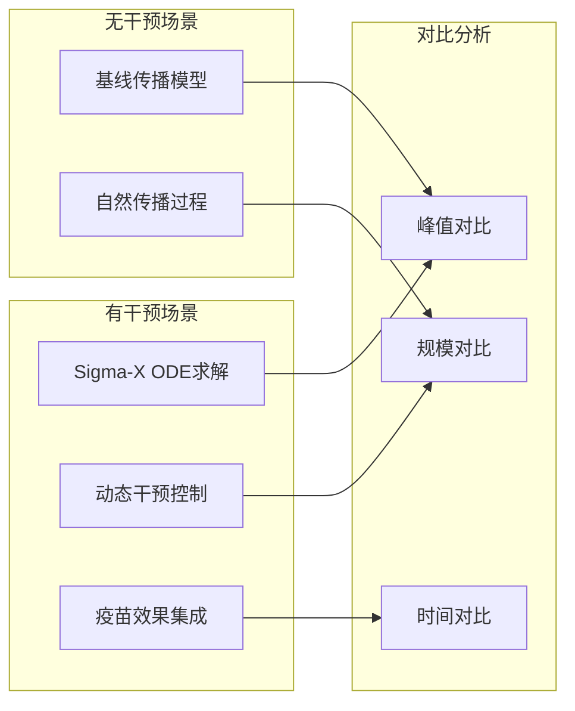

**图表来源**
- [untitled2.m:22-49](file://doubao/untitled2.m#L22-L49)

#### 对比图表解读

| 指标 | 有干预 | 无干预 | 变化幅度 | 解释 |
|------|-------|-------|---------|------|
| 峰值时间 | 第60.6天 | 第84.3天 | 提前23.7天 | 干预有效控制传播速度 |
| 峰值规模 | 154,959人 | 1,516,679人 | 减少约90% | 干预显著降低传播规模 |
| 占比影响 | 1.55% | 15.17% | 减少约90% | 有效控制疫情影响范围 |

**章节来源**
- [untitled2.m:34-49](file://doubao/untitled2.m#L34-L49)
- [结果.md:1-10](file://doubao/结果.md#L1-L10)

### Gemini版本：专业化双子图

#### 专业图表设计

Gemini版本提供了专业的双子图布局：

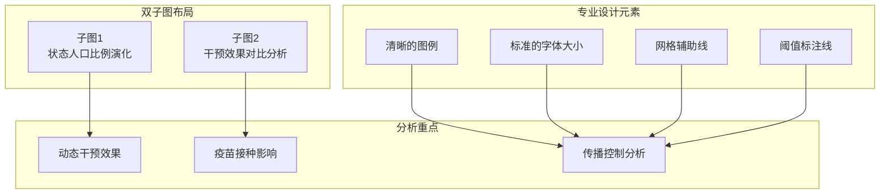

**图表来源**
- [a.m:51-79](file://gemini/a.m#L51-L79)

**章节来源**
- [a.m:51-79](file://gemini/a.m#L51-L79)
- [结果.md:1-4](file://gemini/结果.md#L1-L4)

## 依赖关系分析

### 模型参数依赖关系

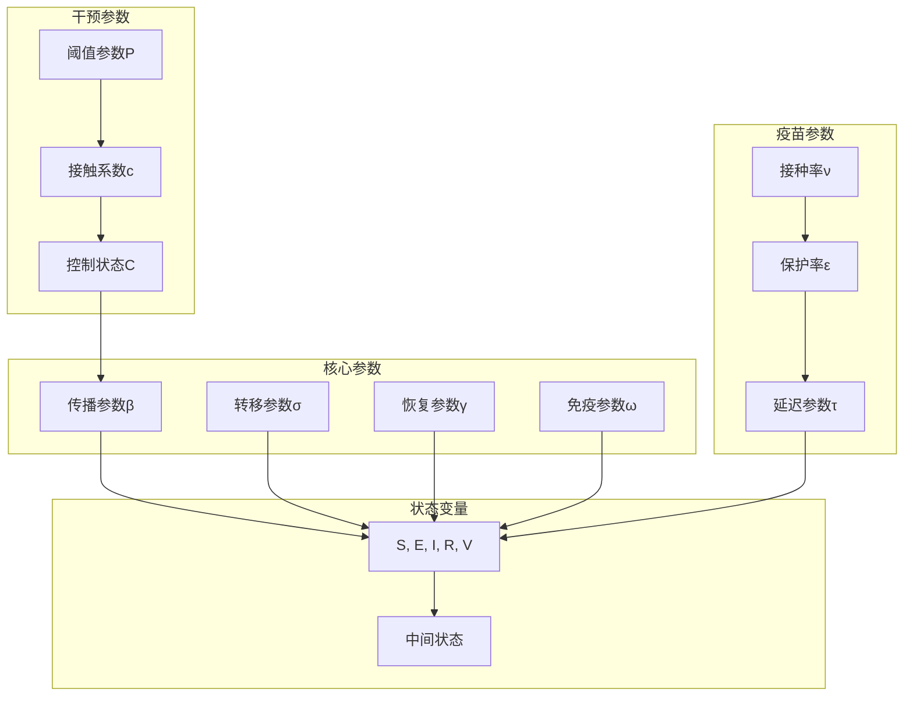

**图表来源**
- [sigmaX_model.m:172-244](file://sigmaX_model.m#L172-L244)
- [untitled2.m:77-140](file://untitled2.m#L77-L140)
- [a.m:84-160](file://a.m#L84-L160)

### 可视化组件依赖

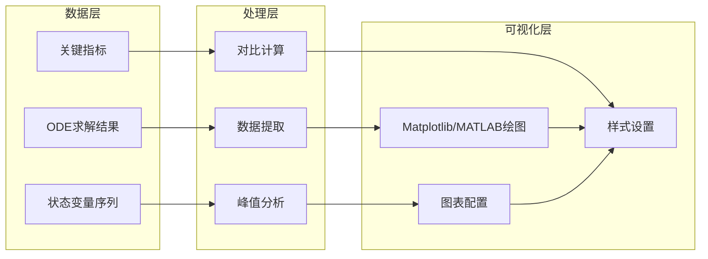

**图表来源**
- [sigmaX_model.m:62-127](file://sigmaX_model.m#L62-L127)
- [untitled2.m:22-75](file://doubao/untitled2.m#L22-L75)

**章节来源**
- [sigmaX_model.m:172-244](file://sigmaX_model.m#L172-L244)
- [untitled2.m:77-140](file://doubao/untitled2.m#L77-L140)
- [a.m:84-160](file://a.m#L84-L160)

## 性能考虑

### 计算效率优化

| 优化策略 | 实现方式 | 效果 |
|---------|---------|------|
| 非负约束 | `odeset('NonNegative',1:7)` | 提高数值稳定性 |
| 变步长求解 | `ode45`自适应步长 | 提升计算效率 |
| 持久化变量 | `persistent`控制状态 | 避免重复初始化 |
| 向量化操作 | 矩阵运算替代循环 | 加速数据处理 |

### 内存管理

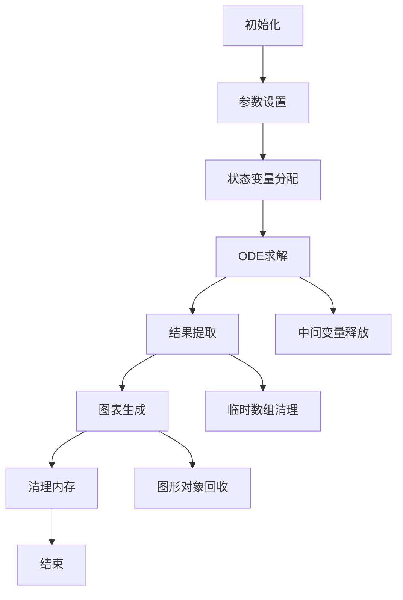

**图表来源**
- [sigmaX_model.m:60-66](file://sigmaX_model.m#L60-L66)
- [untitled2.m:23-24](file://doubao/untitled2.m#L23-L24)

### 可视化性能优化

| 优化方面 | 具体措施 | 性能提升 |
|---------|---------|---------|
| 图形渲染 | 合并绘制命令 | 减少图形更新次数 |
| 数据采样 | 适当的数据降采样 | 提升交互响应速度 |
| 字体设置 | 统一字体大小 | 减少字体渲染开销 |
| 网格显示 | 按需显示网格 | 降低图形复杂度 |

## 故障排除指南

### 常见问题及解决方案

#### 1. 函数定义顺序错误

**问题描述**：MATLAB脚本中函数定义必须位于文件末尾

**解决方案**：
- 将局部函数定义移动到文件末尾
- 确保所有代码按正确顺序排列

**参考实现**：
- [sigmaX_model.m:243-244](file://deepseek/sigmaX_model.m#L243-L244)

#### 2. 持久化变量状态残留

**问题描述**：上次仿真状态影响新仿真结果

**解决方案**：
- 在仿真前清空持久化变量
- 使用`clear`命令清除历史状态

**参考实现**：
- [doubao/untitled2.m:23](file://doubao/untitled2.m#L23)
- [gemini/a.m:29](file://gemini/a.m#L29)

#### 3. 数值不稳定问题

**问题描述**：仿真结果出现负值或异常波动

**解决方案**：
- 设置适当的数值求解器选项
- 添加非负约束
- 调整时间步长

**参考实现**：
- [sigma_x_seirv_simulation.m:43-46](file://chatgpt/sigma_x_seirv_simulation.m#L43-L46)
- [sigmaX_model.m:60](file://deepseek/sigmaX_model.m#L60)

#### 4. 图表显示异常

**问题描述**：图表坐标轴或标签显示不正确

**解决方案**：
- 检查坐标轴范围设置
- 验证字体和颜色配置
- 确认图例位置设置

**参考实现**：
- [sigmaX_model.m:94-95](file://deepseek/sigmaX_model.m#L94-L95)
- [a.m:68](file://gemini/a.m#L68)

**章节来源**
- [sigmaX_model_report.md:237-253](file://deepseek/sigmaX_model_report.md#L237-L253)
- [doubao/untitled2.m:23](file://doubao/untitled2.m#L23)
- [gemini/a.m:29](file://gemini/a.m#L29)

## 结论

通过对四个Sigma-X病毒传播模型实现的深入分析，我们总结了以下关键洞察：

### 图表解读的核心原则

1. **多维度分析**：单一图表往往无法完全反映复杂的传播动态，需要结合多个图表进行综合分析
2. **时间尺度重要性**：不同时间尺度的图表能够揭示不同的传播特征和趋势
3. **干预效果量化**：通过有/无干预的对比分析，能够准确量化政策干预的效果
4. **阈值识别**：动态干预机制中的阈值设置是理解传播控制的关键

### 最佳实践建议

1. **选择合适的图表类型**：根据分析目标选择最适合的图表布局
2. **保持视觉一致性**：统一的颜色方案、字体和标注风格
3. **突出关键信息**：通过标注、网格和特殊标记强调重要转折点
4. **提供对比分析**：包含对照组或历史数据进行比较

### 政策应用价值

这些可视化图表在公共卫生决策中发挥着重要作用：

- **早期预警**：通过阈值线和趋势分析提供预警信号
- **政策评估**：量化不同干预措施的效果
- **资源规划**：预测医疗需求和资源配置
- **公众沟通**：直观展示疫情发展态势

## 附录

### 图表制作最佳实践

#### 颜色搭配建议

| 类别 | 颜色方案 | 适用场景 |
|------|---------|---------|
| 科学图表 | 蓝、绿、红、紫、橙 | 学术报告和研究论文 |
| 商业演示 | 蓝、灰、白、黑 | 商务汇报和决策会议 |
| 公众传播 | 红、橙、黄、蓝、绿 | 社区公告和媒体发布 |
| 对比分析 | 实线vs虚线、实色vs灰色 | 有/无干预对比 |

#### 参数设置建议

| 参数类型 | 推荐设置 | 说明 |
|---------|---------|------|
| 字体大小 | 标题14-16pt，正文12pt | 确保可读性 |
| 线宽 | 1.5-2.5pt | 平衡清晰度和美观 |
| 网格 | 透明度0.3-0.5 | 提供参考但不干扰主体 |
| 图例 | 位置在右上角 | 不遮挡主要数据区域 |

#### 导出和分享标准

**图像格式**：
- 高分辨率PNG（300dpi）用于打印
- PDF矢量格式用于学术发表
- JPEG格式用于网页分享

**文件命名规范**：
- `sigmaX_model_results_v1.0.png`
- `intervention_comparison_2024.pdf`
- `public_communication_chart.jpg`

**分享渠道**：
- 学术数据库（如arXiv）
- 政府卫生部门报告
- 新闻媒体和社交媒体
- 公共卫生网站