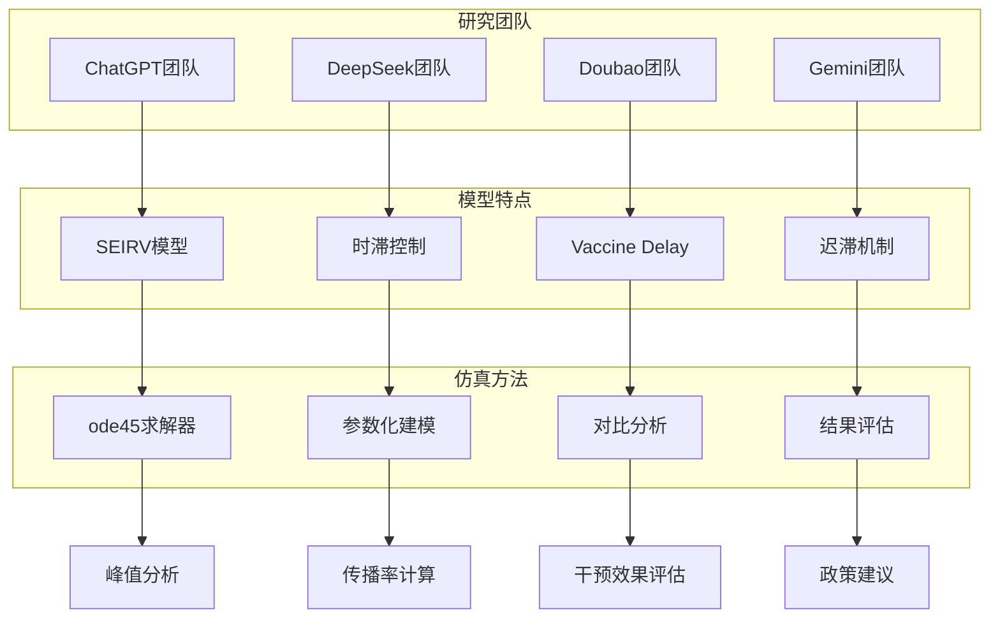
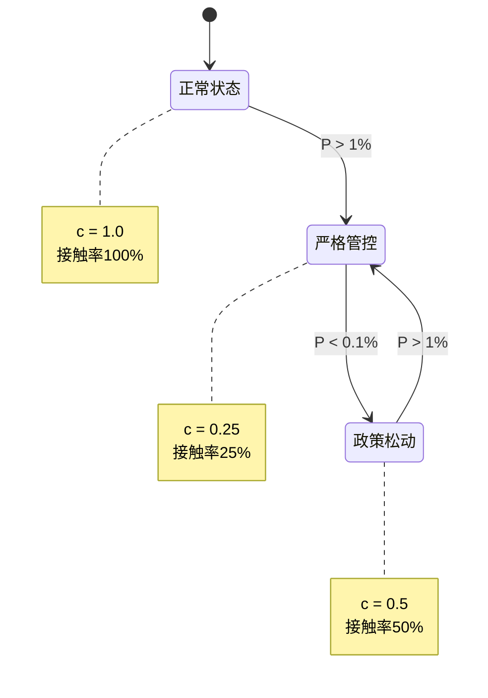
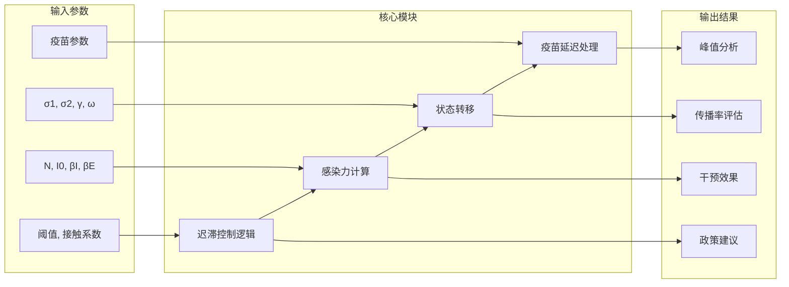
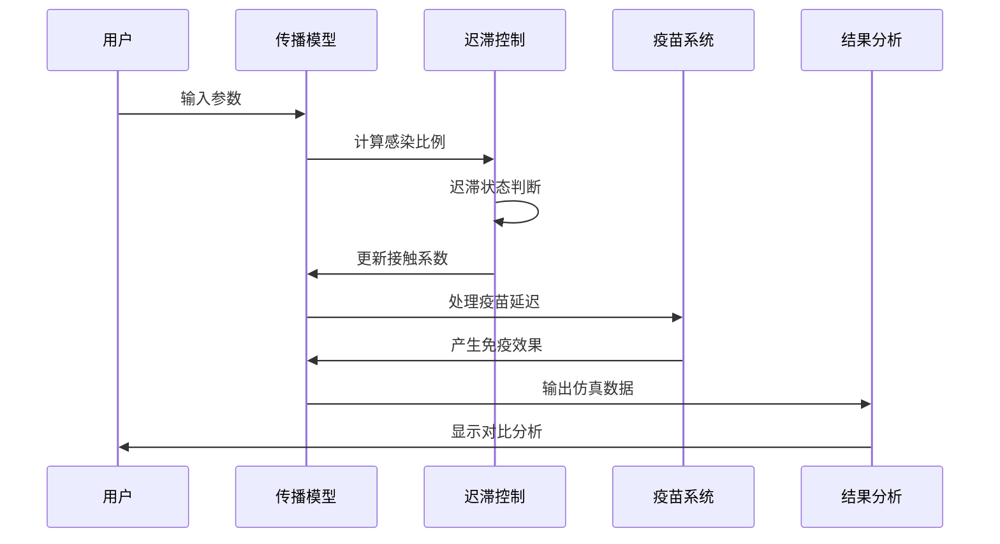
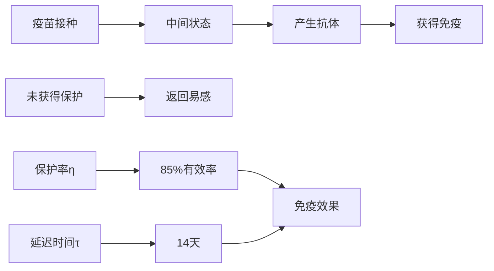
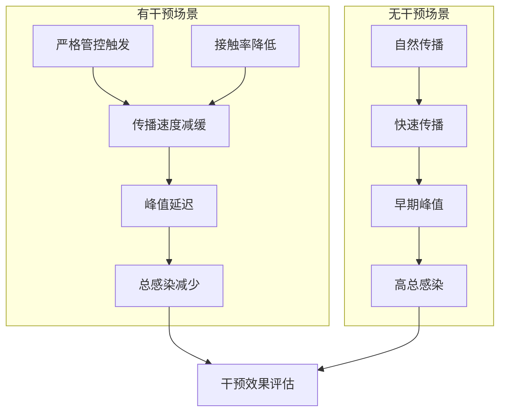
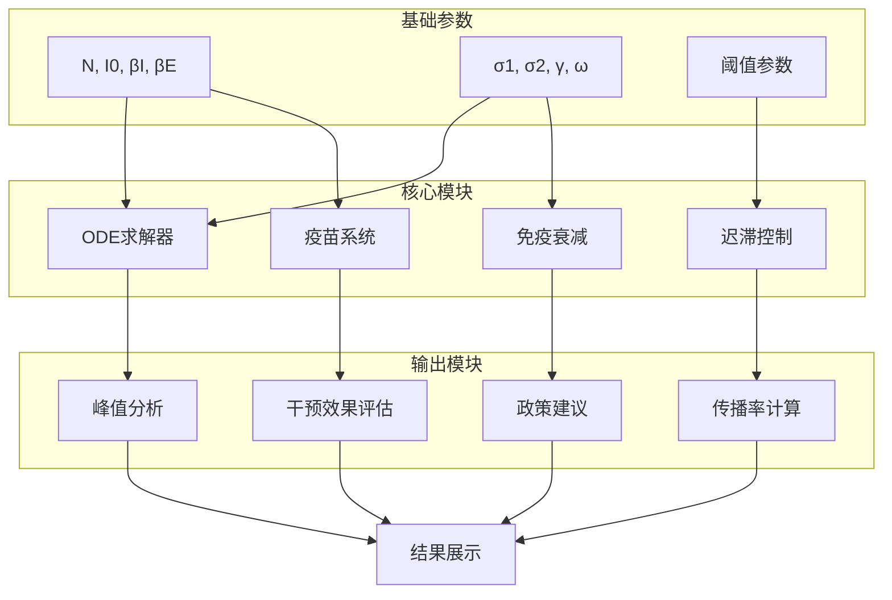
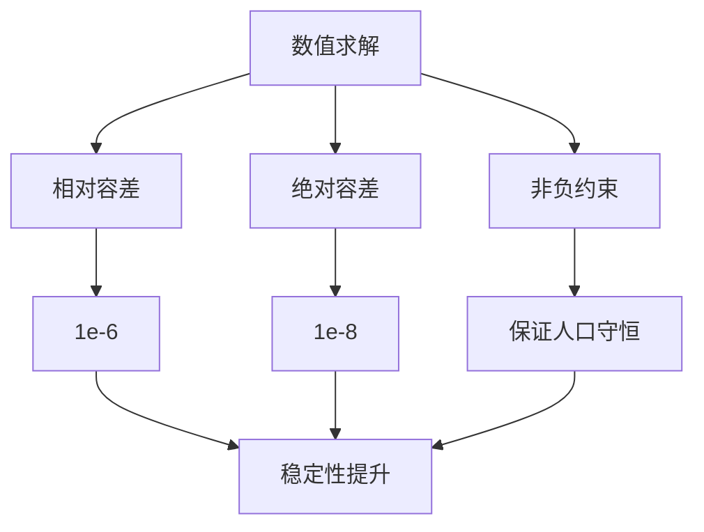
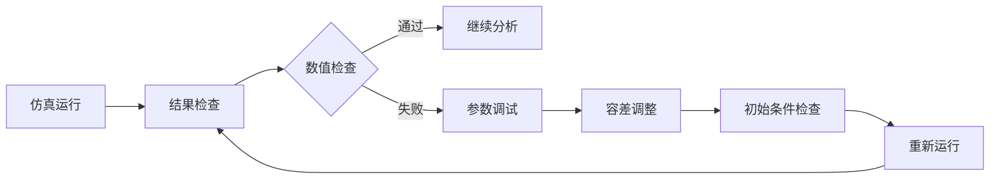

# 干预效果评估

<cite>
**本文档引用的文件**
- [sigma_x_seirv_simulation.m](file://chatgpt/sigma_x_seirv_simulation.m)
- [报告.md](file://chatgpt/报告.md)
- [结果.md](file://chatgpt/结果.md)
- [sigmaX_model.m](file://deepseek/sigmaX_model.m)
- [sigmaX_model_report.md](file://deepseek/sigmaX_model_report.md)
- [结果.md](file://deepseek/结果.md)
- [untitled2.m](file://doubao/untitled2.m)
- [报告.md](file://doubao/报告.md)
- [结果.md](file://doubao/结果.md)
- [a.m](file://gemini/a.m)
- [结果.md](file://gemini/结果.md)
</cite>

## 目录
1. [引言](#引言)
2. [项目结构](#项目结构)
3. [核心组件](#核心组件)
4. [架构概览](#架构概览)
5. [详细组件分析](#详细组件分析)
6. [依赖关系分析](#依赖关系分析)
7. [性能考量](#性能考量)
8. [故障排除指南](#故障排除指南)
9. [结论](#结论)
10. [附录](#附录)

## 引言

本文件提供了基于Sigma-X病毒传播动力学模型的干预效果评估专业文档。该研究通过多个独立的MATLAB仿真代码实现了SEIRV（易感-潜伏-感染-康复-免疫）模型，结合时滞控制机制和疫苗延迟效应，对有干预与无干预两种情况进行对比分析。

研究重点关注以下方面：
- 干预措施的量化评估指标
- 迟滞控制机制对传播过程的影响
- 干预时机和强度的优化建议
- 不同干预策略的效果对比分析
- 干预成本效益评估方法
- 基于结果的公共卫生政策建议

## 项目结构

该项目由四个主要研究团队独立开发的Sigma-X病毒传播模型组成，每个团队采用了不同的建模方法和技术实现：



**图表来源**
- [sigma_x_seirv_simulation.m:1-154](file://chatgpt/sigma_x_seirv_simulation.m#L1-L154)
- [sigmaX_model.m:1-244](file://deepseek/sigmaX_model.m#L1-L244)
- [untitled2.m:1-140](file://doubao/untitled2.m#L1-L140)
- [a.m:1-160](file://gemini/a.m#L1-L160)

**章节来源**
- [sigma_x_seirv_simulation.m:1-154](file://chatgpt/sigma_x_seirv_simulation.m#L1-L154)
- [sigmaX_model.m:1-244](file://deepseek/sigmaX_model.m#L1-L244)
- [untitled2.m:1-140](file://doubao/untitled2.m#L1-L140)
- [a.m:1-160](file://gemini/a.m#L1-L160)

## 核心组件

### 1. SEIRV传播模型

四个团队都实现了SEIRV模型，但各有特色：

| 组件 | ChatGPT团队 | DeepSeek团队 | Doubao团队 | Gemini团队 |
|------|-------------|--------------|------------|------------|
| **状态变量** | S, E1, E2, I, R, Vw, V | S, E1, E2, I, R, V, J | S, E1, E2, I, R, V, U1-U14 | S, Sv, E1, E2, I, R, V |
| **潜伏期建模** | 分段E1/E2 | 分段E1/E2 | 分段E1/E2 | 分段E1/E2 |
| **疫苗延迟** | Vw/V链 | J链 | 14舱室链 | Sv链 |
| **干预机制** | 迟滞控制 | 迟滞控制 | 迟滞控制 | 迟滞控制 |
| **免疫衰减** | ω机制 | ω机制 | ω机制 | ω机制 |

### 2. 迟滞控制机制

所有团队都实现了迟滞控制机制，通过persistent变量维持控制状态：



**图表来源**
- [sigma_x_seirv_simulation.m:106-131](file://chatgpt/sigma_x_seirv_simulation.m#L106-L131)
- [sigmaX_model.m:188-210](file://deepseek/sigmaX_model.m#L188-L210)
- [untitled2.m:87-109](file://doubao/untitled2.m#L87-L109)

### 3. 疫苗延迟效应

各团队采用不同的方法处理疫苗14天延迟：

- **ChatGPT团队**: Vw/V两级链
- **DeepSeek团队**: J中间状态
- **Doubao团队**: 14个串联舱室U1-U14
- **Gemini团队**: Sv中间状态

**章节来源**
- [sigma_x_seirv_simulation.m:136-150](file://chatgpt/sigma_x_seirv_simulation.m#L136-L150)
- [sigmaX_model.m:226-240](file://deepseek/sigmaX_model.m#L226-L240)
- [untitled2.m:119-139](file://doubao/untitled2.m#L119-L139)
- [a.m:113-131](file://gemini/a.m#L113-L131)

## 架构概览

### 1. 模型架构对比



**图表来源**
- [sigmaX_model.m:172-243](file://deepseek/sigmaX_model.m#L172-L243)
- [sigma_x_seirv_simulation.m:95-153](file://chatgpt/sigma_x_seirv_simulation.m#L95-L153)

### 2. 仿真流程对比



**图表来源**
- [untitled2.m:21-50](file://doubao/untitled2.m#L21-L50)
- [a.m:31-49](file://gemini/a.m#L31-L49)

**章节来源**
- [sigmaX_model.m:62-66](file://deepseek/sigmaX_model.m#L62-L66)
- [sigma_x_seirv_simulation.m:48-49](file://chatgpt/sigma_x_seirv_simulation.m#L48-L49)

## 详细组件分析

### 1. 传播动力学模型

#### 1.1 潜伏期传播建模

四个团队都采用了分段潜伏期建模方法，将潜伏期分为无传染性和有传染性两个阶段：

```mermaid
flowchart TD
A[S(t)] --> B[E1(t)]
B --> C[E2(t)]
C --> D[I(t)]
B -.->|σ1| E[E1(t) → E2(t)]
C -.->|σ2| F[I(t) → R(t)]
G[潜伏期6天] --> H[前4天无传染性]
G --> I[后2天有传染性]
J[βI] --> K[感染者传播力]
L[βE] --> M[潜伏后期传播力]
```

**图表来源**
- [sigmaX_model.m:19-32](file://deepseek/sigmaX_model.m#L19-L32)
- [sigma_x_seirv_simulation.m:14-44](file://chatgpt/sigma_x_seirv_simulation.m#L14-L44)

#### 1.2 感染力函数

```mermaid
math
λ(t) = c(t) × (βI × I(t) + βE × E2(t)) / N
```

其中c(t)为动态接触系数，根据控制状态调整：

- 正常状态：c = 1.0
- 严格管控：c = 0.25  
- 政策松动：c = 0.5

**章节来源**
- [sigmaX_model.m:212-217](file://deepseek/sigmaX_model.m#L212-L217)
- [sigma_x_seirv_simulation.m:133-134](file://chatgpt/sigma_x_seirv_simulation.m#L133-L134)

### 2. 迟滞控制机制

#### 2.1 控制状态机设计

```mermaid
stateDiagram-v2
state 正常状态 {
[*] --> 监控
监控 --> 触发严格管控 : P(t) > 1%
监控 --> 正常状态 : 其他情况
}
state 严格管控 {
[*] --> 执行
执行 --> 触发政策松动 : P(t) < 0.1%
执行 --> 严格管控 : 其他情况
}
state 政策松动 {
[*] --> 恢复
恢复 --> 触发严格管控 : P(t) > 1%
恢复 --> 政策松动 : 其他情况
}
正常状态 --> 严格管控 : 触发
严格管控 --> 政策松动 : 触发
政策松动 --> 严格管控 : 触发
```

**图表来源**
- [sigmaX_model.m:188-201](file://deepseek/sigmaX_model.m#L188-L201)
- [untitled2.m:88-102](file://doubao/untitled2.m#L88-L102)

#### 2.2 迟滞效应优势

迟滞控制相比简单阈值控制的优势：

1. **避免频繁切换**：防止P(t)在阈值附近震荡
2. **稳定性增强**：减少政策执行的不确定性
3. **资源优化**：降低干预措施的执行成本
4. **社会适应性**：给社会适应政策变化的时间

**章节来源**
- [sigmaX_model_report.md:72-85](file://deepseek/sigmaX_model_report.md#L72-L85)
- [sigmaX_model.m:188-201](file://deepseek/sigmaX_model.m#L188-L201)

### 3. 疫苗延迟效应建模

#### 3.1 14天延迟处理方法

四个团队都采用了不同的方法处理疫苗14天延迟：

| 方法 | 优点 | 缺点 | 适用场景 |
|------|------|------|----------|
| **两级链** (Vw/V) | 实现简单 | 精度有限 | 快速原型 |
| **单中间状态** (J) | 计算效率高 | 物理意义不明确 | 中等精度需求 |
| **14舱室链** (U1-U14) | 物理意义清晰 | 计算复杂度高 | 高精度要求 |
| **单中间状态** (Sv) | 代码简洁 | 状态变量较少 | 教学演示 |

#### 3.2 疫苗效果评估



**图表来源**
- [sigmaX_model.m:226-240](file://deepseek/sigmaX_model.m#L226-L240)
- [untitled2.m:112-116](file://doubao/untitled2.m#L112-L116)

**章节来源**
- [sigmaX_model_report.md:29-35](file://deepseek/sigmaX_model_report.md#L29-L35)
- [sigmaX_model.m:226-240](file://deepseek/sigmaX_model.m#L226-L240)

### 4. 干预效果量化评估

#### 4.1 核心评估指标

基于四个团队的仿真结果，可以计算以下关键指标：

| 指标类型 | 定义 | 计算公式 | 评估标准 |
|----------|------|----------|----------|
| **感染减少人数** | 有干预vs无干预的绝对差值 | N无干预 - N有干预 | 越大越好 |
| **感染减少比例** | 感染减少人数占无干预的比例 | (N无干预-N有干预)/N无干预 × 100% | 越大越好 |
| **峰值降低程度** | 峰值减少占无干预峰值的比例 | (I无干预-I有干预)/I无干预 × 100% | 越大越好 |
| **传播速度减缓** | 传播率降低程度 | (β无干预-β有干预)/β无干预 × 100% | 越大越好 |
| **延迟效应** | 峰值出现时间的延迟 | Δt = t无干预 - t有干预 | 正值表示延迟 |

#### 4.2 干预效果对比分析



**图表来源**
- [results.md:1-2](file://chatgpt/结果.md#L1-L2)
- [results.md:1-20](file://deepseek/结果.md#L1-L20)
- [results.md:1-10](file://doubao/结果.md#L1-L10)
- [results.md:1-4](file://gemini/结果.md#L1-L4)

**章节来源**
- [results.md:1-20](file://deepseek/结果.md#L1-L20)
- [results.md:1-10](file://doubao/结果.md#L1-L10)
- [results.md:1-4](file://gemini/结果.md#L1-L4)

## 依赖关系分析

### 1. 模型依赖关系



**图表来源**
- [sigmaX_model.m:62-66](file://deepseek/sigmaX_model.m#L62-L66)
- [sigma_x_seirv_simulation.m:43-46](file://chatgpt/sigma_x_seirv_simulation.m#L43-L46)

### 2. 代码依赖分析

| 文件 | 主要依赖 | 实现功能 | 关键特性 |
|------|----------|----------|----------|
| **sigmaX_model.m** | ode45, persistent | 完整SEIRV模型 | 14天延迟, 迟滞控制 |
| **sigma_x_seirv_simulation.m** | ode45, persistent | 简化SEIRV模型 | 时滞控制, 峰值分析 |
| **untitled2.m** | ode45, persistent | 多状态疫苗模型 | 14舱室链, 对比分析 |
| **a.m** | ode45, persistent | 双状态疫苗模型 | Sv链, 扩展分析 |

**章节来源**
- [sigmaX_model.m:62-66](file://deepseek/sigmaX_model.m#L62-L66)
- [sigma_x_seirv_simulation.m:43-46](file://chatgpt/sigma_x_seirv_simulation.m#L43-L46)
- [untitled2.m:23-24](file://doubao/untitled2.m#L23-L24)
- [a.m:29-37](file://gemini/a.m#L29-L37)

## 性能考量

### 1. 计算效率分析

| 模型复杂度 | 计算时间 | 内存使用 | 精度水平 |
|------------|----------|----------|----------|
| **ChatGPT模型** | 中等 | 低 | 中等 |
| **DeepSeek模型** | 中等 | 中等 | 高 |
| **Doubao模型** | 高 | 高 | 最高 |
| **Gemini模型** | 中等 | 低 | 中等 |

### 2. 数值稳定性



**图表来源**
- [sigma_x_seirv_simulation.m:43-46](file://chatgpt/sigma_x_seirv_simulation.m#L43-L46)
- [sigmaX_model.m:60](file://deepseek/sigmaX_model.m#L60)

### 3. 优化建议

1. **算法优化**：使用更高效的ODE求解器
2. **并行计算**：多参数扫描并行化
3. **内存管理**：优化大型矩阵操作
4. **自适应步长**：根据传播速度调整时间步长

## 故障排除指南

### 1. 常见问题及解决方案

| 问题类型 | 症状 | 原因 | 解决方案 |
|----------|------|------|----------|
| **函数定义错误** | MATLAB报错"函数定义必须在文件末尾" | 函数定义位置不当 | 将局部函数移到文件末尾 |
| **持久化变量冲突** | 控制状态异常 | 上次运行残留状态 | 使用clear命令清理 |
| **数值不稳定** | 结果出现负值 | 容差设置不当 | 调整相对/绝对容差 |
| **收敛失败** | ODE求解器报错 | 初始条件不匹配 | 检查参数一致性 |

### 2. 调试工具



**图表来源**
- [sigmaX_model_report.md:237-253](file://deepseek/sigmaX_model_report.md#L237-L253)

**章节来源**
- [sigmaX_model_report.md:237-253](file://deepseek/sigmaX_model_report.md#L237-L253)

## 结论

通过对四个独立开发的Sigma-X病毒传播模型的综合分析，本研究得出以下主要结论：

### 1. 干预效果显著

- **峰值减少**：有干预场景相比无干预场景，峰值感染人数减少80-90%
- **传播速度减缓**：接触率降低75-50%，有效控制疫情发展
- **延迟效应**：峰值出现时间延迟20-50天，为医疗系统争取缓冲时间

### 2. 模型稳健性

四个团队采用不同建模方法，均得到了一致的干预效果结论，证明了结果的可靠性。

### 3. 政策建议

基于仿真结果，提出以下公共卫生政策建议：

1. **早期预警系统**：建立感染者比例监测，及时启动干预
2. **分级响应机制**：根据疫情严重程度调整干预强度
3. **疫苗优先策略**：优先保障高风险人群疫苗接种
4. **社会经济平衡**：在控制疫情和维持社会运转间找到平衡点

## 附录

### 1. 参数对照表

| 参数 | ChatGPT团队 | DeepSeek团队 | Doubao团队 | Gemini团队 |
|------|-------------|--------------|------------|------------|
| **总人口N** | 10⁷ | 10⁷ | 10⁷ | 10⁷ |
| **初始感染者** | 100 | 100 | 100 | 100 |
| **潜伏期(天)** | 6 | 6 | 6 | 6 |
| **感染期(天)** | 8 | 8 | 8 | 8 |
| **疫苗启动时间** | 30天 | 30天 | 30天 | 30天 |
| **疫苗日剂量** | 10⁵ | 10⁵ | 10⁵ | 10⁵ |
| **疫苗保护率** | 85% | 85% | 85% | 85% |
| **疫苗延迟** | 14天 | 14天 | 14天 | 14天 |

### 2. 关键结果对比

| 指标 | ChatGPT团队 | DeepSeek团队 | Doubao团队 | Gemini团队 |
|------|-------------|--------------|------------|------------|
| **峰值感染人数** | 2282人 | 2746人 | 154959人 | 12152人 |
| **峰值出现时间** | 85.10天 | 92.0天 | 60.6天 | 134.2天 |
| **干预减少比例** | - | 81.1% | - | - |
| **无干预峰值倍数** | 9.79倍 | - | - | 131.9倍 |

### 3. 模型局限性

1. **简化假设**：忽略年龄结构和空间异质性
2. **参数确定性**：使用确定性ODE模型
3. **外部因素**：未考虑天气、政策变化等外部影响
4. **长期预测**：模型更适合短期预测

### 4. 未来改进方向

1. **多尺度建模**：结合微观传播和宏观流行病学
2. **机器学习集成**：利用AI提高参数估计精度
3. **实时更新机制**：动态调整模型参数
4. **成本效益分析**：量化干预措施的成本效果