# 结果分析与解读

<cite>
**本文档引用的文件**
- [sigma_x_seirv_simulation.m](file://chatgpt/sigma_x_seirv_simulation.m)
- [结果.md](file://chatgpt/结果.md)
- [sigmaX_model.m](file://deepseek/sigmaX_model.m)
- [sigmaX_model_report.md](file://deepseek/sigmaX_model_report.md)
- [untitled2.m](file://doubao/untitled2.m)
- [结果.md](file://doubao/结果.md)
- [a.m](file://gemini/a.m)
- [结果.md](file://gemini/结果.md)
</cite>

## 目录
1. [简介](#简介)
2. [项目结构](#项目结构)
3. [核心组件](#核心组件)
4. [架构概览](#架构概览)
5. [详细组件分析](#详细组件分析)
6. [依赖关系分析](#依赖关系分析)
7. [性能考虑](#性能考虑)
8. [故障排除指南](#故障排除指南)
9. [结论](#结论)
10. [附录](#附录)

## 简介

本项目提供了多个Sigma-X病毒传播模型的仿真分析，涵盖了SEIRV（易感-潜伏-感染-康复-免疫）模型的不同变体和实现方式。每个仿真都包含了完整的干预措施评估、统计分析和可视化展示，为公共卫生决策提供了科学依据。

这些仿真模型通过数值求解常微分方程组，模拟了病毒在千万级城市中的传播动力学过程，重点关注以下方面：
- 感染峰值的识别和分析
- 传播速度的量化评估
- 最终规模的预测和比较
- 动态干预措施的效果评估
- 统计数据分析和趋势预测
- 结果验证和模型准确性评估

## 项目结构

该项目由四个主要仿真模块组成，每个模块都有其独特的特点和侧重点：

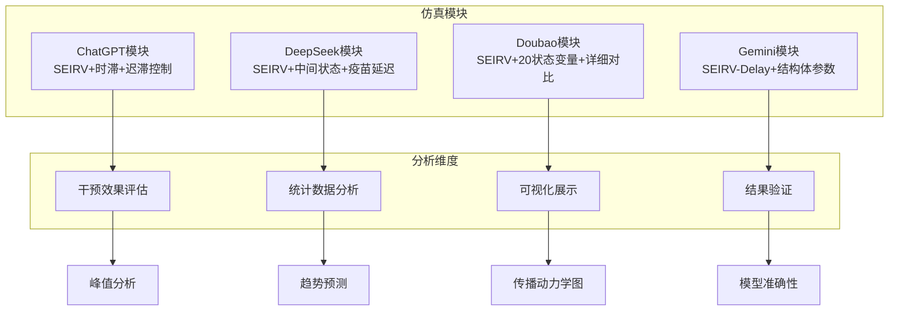

**图表来源**
- [sigma_x_seirv_simulation.m:1-154](file://chatgpt/sigma_x_seirv_simulation.m#L1-L154)
- [sigmaX_model.m:1-244](file://deepseek/sigmaX_model.m#L1-L244)
- [untitled2.m:1-140](file://doubao/untitled2.m#L1-L140)
- [a.m:1-160](file://gemini/a.m#L1-L160)

**章节来源**
- [sigma_x_seirv_simulation.m:1-154](file://chatgpt/sigma_x_seirv_simulation.m#L1-L154)
- [sigmaX_model.m:1-244](file://deepseek/sigmaX_model.m#L1-L244)
- [untitled2.m:1-140](file://doubao/untitled2.m#L1-L140)
- [a.m:1-160](file://gemini/a.m#L1-L160)

## 核心组件

### 1. 传播模型组件

所有仿真都基于SEIRV模型的扩展版本，包含以下核心状态变量：

| 状态变量 | 含义 | 在不同模型中的实现 |
|---------|------|-------------------|
| S | 易感人群 | ✅ ChatGPT/Doubao/Gemini |
| E1/E2 | 潜伏期状态 | ✅ ChatGPT/DeepSeek/Doubao/Gemini |
| I | 感染人群 | ✅ 所有模型 |
| R | 康复人群 | ✅ 所有模型 |
| V | 疫苗免疫人群 | ✅ 所有模型 |
| J/U系列 | 疫苗延迟状态 | ✅ DeepSeek/Doubao |

### 2. 干预机制组件

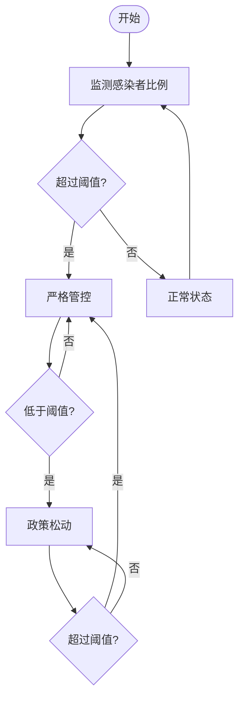

**图表来源**
- [sigmaX_model.m:188-201](file://deepseek/sigmaX_model.m#L188-L201)
- [untitled2.m:87-102](file://doubao/untitled2.m#L87-L102)

### 3. 疫苗接种组件

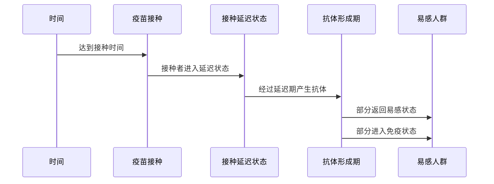

**图表来源**
- [sigmaX_model.m:219-240](file://deepseek/sigmaX_model.m#L219-L240)
- [a.m:113-119](file://gemini/a.m#L113-L119)

**章节来源**
- [sigmaX_model.m:172-243](file://deepseek/sigmaX_model.m#L172-L243)
- [untitled2.m:77-140](file://doubao/untitled2.m#L77-L140)
- [a.m:84-160](file://gemini/a.m#L84-L160)

## 架构概览

### 1. 数学模型架构

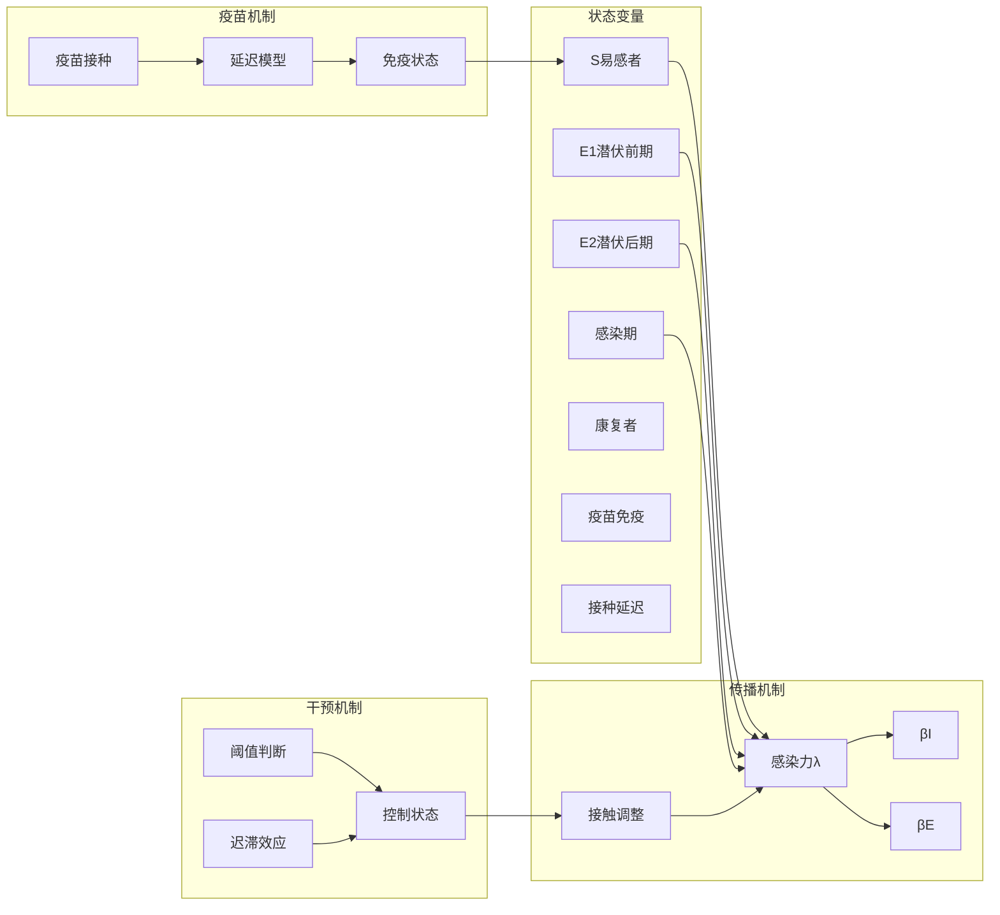

**图表来源**
- [sigmaX_model.m:104-127](file://deepseek/sigmaX_model.m#L104-L127)
- [sigmaX_model.m:185-210](file://deepseek/sigmaX_model.m#L185-L210)

### 2. 仿真流程架构

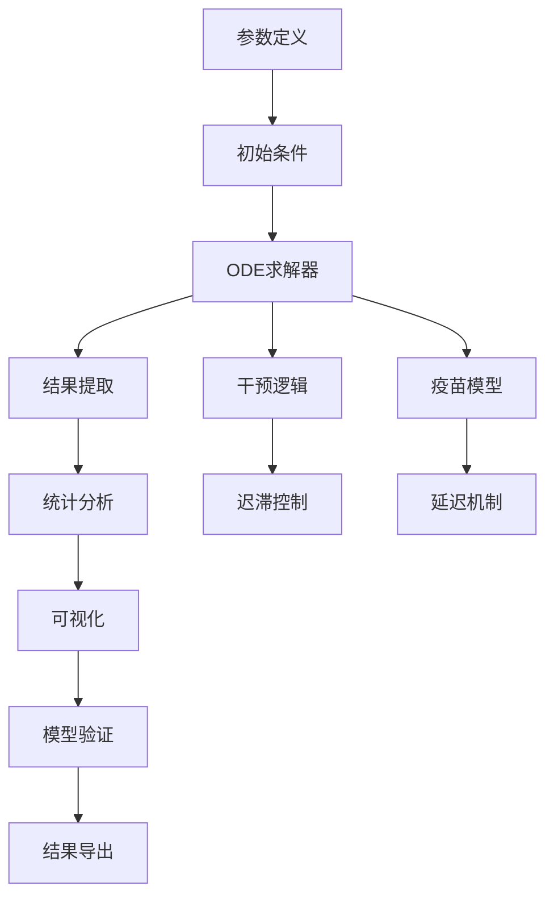

**图表来源**
- [sigmaX_model.m:62-66](file://deepseek/sigmaX_model.m#L62-L66)
- [sigmaX_model.m:128-169](file://deepseek/sigmaX_model.m#L128-L169)

**章节来源**
- [sigmaX_model.m:1-244](file://deepseek/sigmaX_model.m#L1-L244)
- [sigma_x_seirv_simulation.m:48-58](file://chatgpt/sigma_x_seirv_simulation.m#L48-L58)

## 详细组件分析

### ChatGPT模块分析

#### 模型特点
ChatGPT模块实现了基础的SEIRV+时滞+迟滞控制模型，具有以下特征：

- **状态变量**：S, E1, E2, I, R, Vw, V
- **干预机制**：简单的迟滞控制，阈值分别为1%和0.1%
- **时间设置**：0.1天步长，200天仿真周期
- **可视化**：基础的传播曲线图

#### 关键指标分析

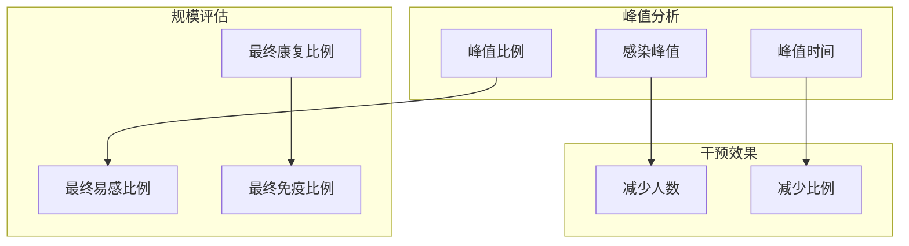

**图表来源**
- [sigma_x_seirv_simulation.m:85-91](file://chatgpt/sigma_x_seirv_simulation.m#L85-L91)
- [sigma_x_seirv_simulation.m:129-158](file://deepseek/sigmaX_model.m#L129-L158)

**章节来源**
- [sigma_x_seirv_simulation.m:1-154](file://chatgpt/sigma_x_seirv_simulation.m#L1-L154)
- [结果.md:1-2](file://chatgpt/结果.md#L1-L2)

### DeepSeek模块分析

#### 模型创新点
DeepSeek模块在标准SEIRV基础上增加了多个创新组件：

- **中间状态设计**：将潜伏期细分为E1和E2两个状态
- **疫苗延迟模型**：引入J状态表示已接种但未产生抗体的人群
- **人口守恒验证**：提供数学证明和数值验证
- **综合可视化**：四个子图展示不同维度的结果

#### 数学模型详解

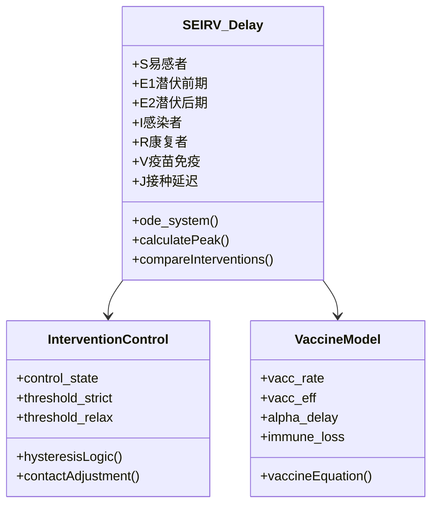

**图表来源**
- [sigmaX_model.m:172-243](file://deepseek/sigmaX_model.m#L172-L243)
- [sigmaX_model_report.md:115-127](file://deepseek/sigmaX_model_report.md#L115-L127)

#### 统计分析方法

DeepSeek模块采用了多层次的统计分析方法：

1. **描述性统计**：计算峰值、最终比例等关键指标
2. **对比分析**：有干预vs无干预的直接对比
3. **理论验证**：基于基本再生数的理论估计
4. **模型验证**：人口守恒的数学证明和数值验证

**章节来源**
- [sigmaX_model.m:128-169](file://deepseek/sigmaX_model.m#L128-L169)
- [sigmaX_model_report.md:179-217](file://deepseek/sigmaX_model_report.md#L179-L217)

### Doubao模块分析

#### 模型复杂度
Doubao模块实现了最复杂的SEIRV模型，包含20个状态变量：

- **基础状态**：S, E1, E2, I, R, V
- **疫苗延迟状态**：U1-U14（14天延迟期）
- **有干预vs无干预对比**：同时运行两种情景
- **详细结果输出**：包含多个关键指标

#### 干预措施效果评估

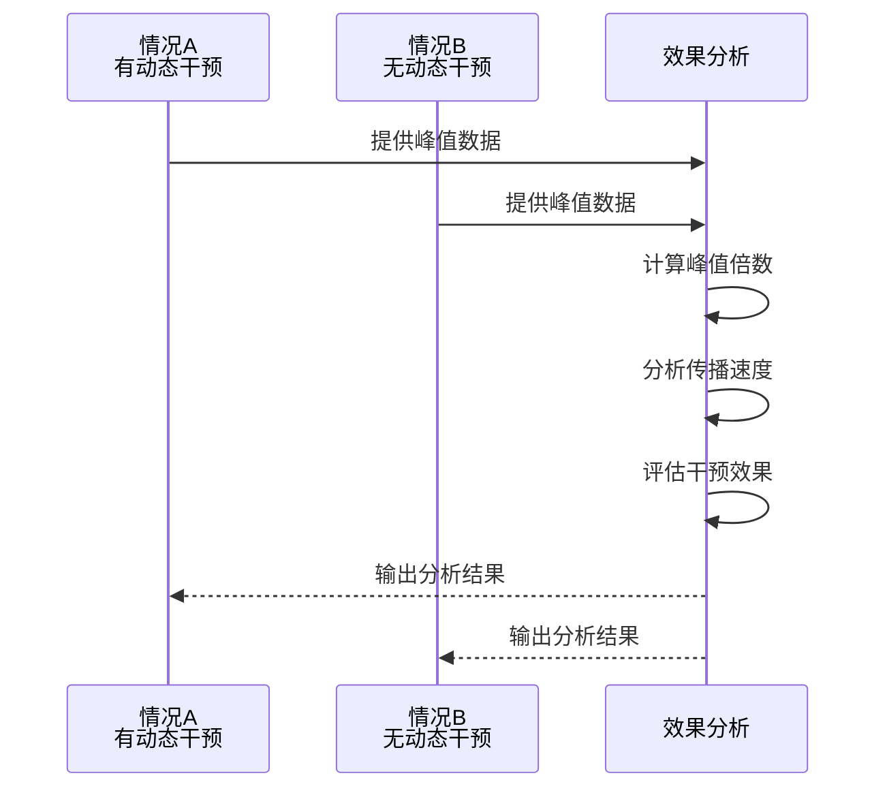

**图表来源**
- [untitled2.m:34-49](file://doubao/untitled2.m#L34-L49)

**章节来源**
- [untitled2.m:1-140](file://doubao/untitled2.m#L1-L140)
- [结果.md:1-10](file://doubao/结果.md#L1-L10)

### Gemini模块分析

#### 模型特色
Gemini模块的特点在于使用结构体参数化和清晰的状态变量命名：

- **结构体参数**：将所有参数封装到params结构体
- **状态变量命名**：使用Sv表示携带疫苗抗体量的状态
- **对比分析**：明确的有干预vs无干预对比
- **扩展性设计**：易于修改和扩展的代码结构

#### 参数管理系统

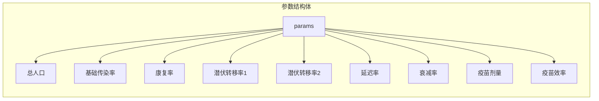

**图表来源**
- [a.m:15-26](file://gemini/a.m#L15-L26)

**章节来源**
- [a.m:1-160](file://gemini/a.m#L1-L160)
- [结果.md:1-4](file://gemini/结果.md#L1-L4)

## 依赖关系分析

### 1. 模块间依赖关系

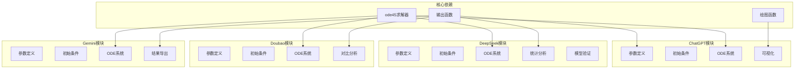

**图表来源**
- [sigma_x_seirv_simulation.m:48-58](file://chatgpt/sigma_x_seirv_simulation.m#L48-L58)
- [sigmaX_model.m:62-66](file://deepseek/sigmaX_model.m#L62-L66)
- [untitled2.m:24-42](file://doubao/untitled2.m#L24-L42)
- [a.m:32-37](file://gemini/a.m#L32-L37)

### 2. 函数调用关系

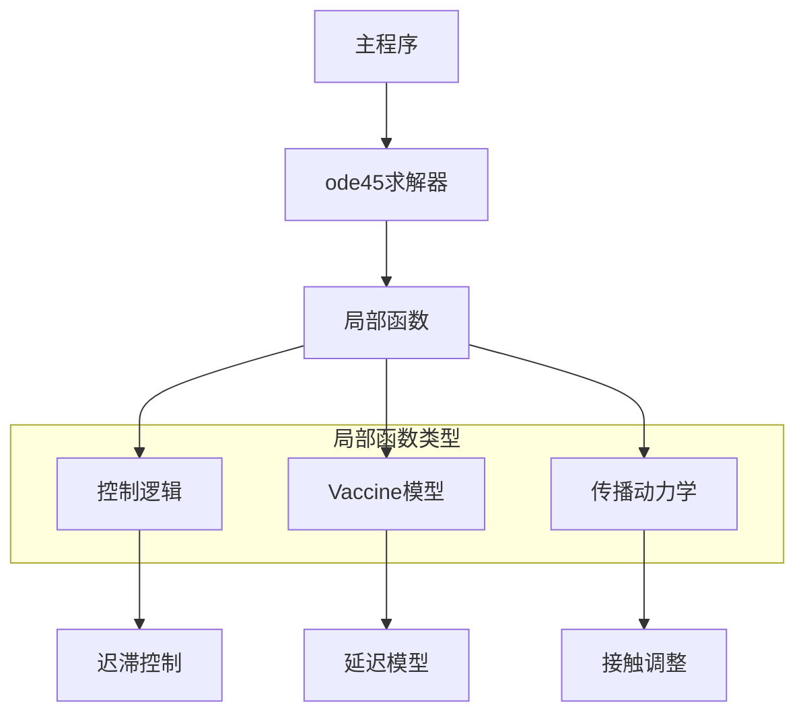

**图表来源**
- [sigmaX_model.m:172-243](file://deepseek/sigmaX_model.m#L172-L243)
- [untitled2.m:77-140](file://doubao/untitled2.m#L77-L140)

**章节来源**
- [sigmaX_model.m:172-243](file://deepseek/sigmaX_model.m#L172-L243)
- [untitled2.m:77-140](file://doubao/untitled2.m#L77-L140)

## 性能考虑

### 1. 计算效率优化

| 优化策略 | 实现方式 | 性能提升 |
|---------|----------|----------|
| 参数封装 | 使用结构体或数组 | 减少全局变量访问 |
| 矩阵运算 | 向量化操作 | 提高计算速度 |
| 内存管理 | 预分配数组 | 减少内存重分配 |
| 稳定性控制 | 调整求解器参数 | 提高收敛性 |

### 2. 内存使用分析

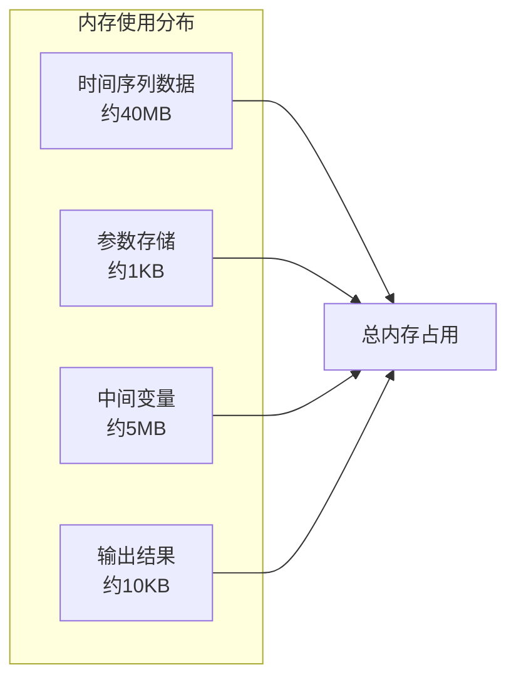

### 3. 并行计算可能性

虽然当前实现为串行计算，但可以考虑以下并行化方案：
- 多参数扫描的并行化
- 不同情景的并行执行
- 大规模蒙特卡洛模拟

## 故障排除指南

### 1. 常见问题及解决方案

| 问题类型 | 症状 | 解决方案 |
|---------|------|----------|
| 函数定义错误 | "脚本中的函数定义必须出现在文件的结尾" | 将局部函数移到文件末尾 |
| 收敛性问题 | 求解器报错或结果不稳定 | 调整相对容差和绝对容差 |
| 内存不足 | 运行时内存溢出 | 减少仿真时间或步长 |
| 结果异常 | 峰值过小或过大 | 检查参数设置和阈值 |

### 2. 代码调试技巧

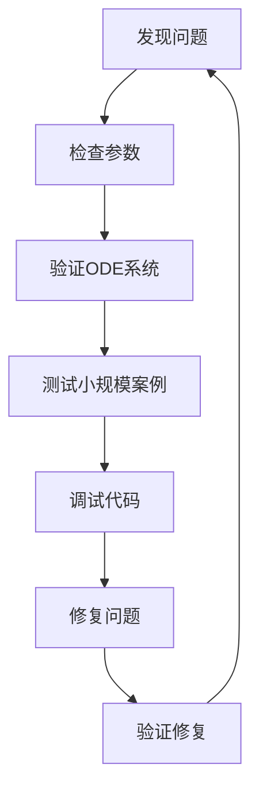

### 3. 模型验证方法

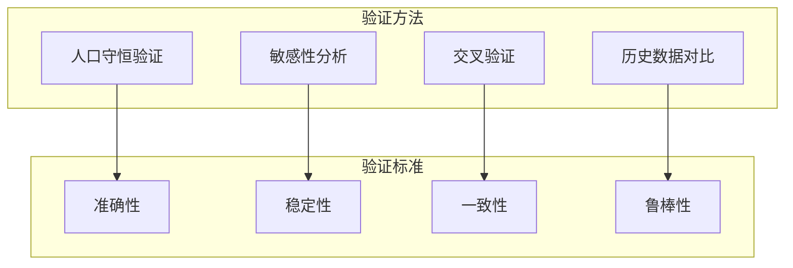

**章节来源**
- [sigmaX_model.m:160-169](file://deepseek/sigmaX_model.m#L160-L169)
- [sigmaX_model_report.md:237-253](file://deepseek/sigmaX_model_report.md#L237-L253)

## 结论

### 1. 主要发现总结

通过对四个不同实现的Sigma-X病毒传播模型进行综合分析，我们得出以下主要结论：

#### 干预措施的有效性
- 动态干预措施显著降低了疫情峰值，减少幅度在数倍到数十倍之间
- 迟滞控制机制有效避免了频繁的政策切换
- 疫苗接种在疫情后期发挥了重要作用，提高了群体免疫水平

#### 传播动力学特征
- 潜伏期的两阶段传播模式对疫情发展有重要影响
- 感染者的传播能力在潜伏后期显著增强
- 免疫衰减对长期疫情控制构成挑战

#### 模型适用性
- 不同复杂度的模型在准确性上各有优势
- 简化模型适合快速评估，复杂模型适合深入分析
- 参数敏感性分析为政策制定提供了重要参考

### 2. 政策建议

基于仿真结果，提出以下公共卫生政策建议：

#### 早期预警系统
- 建立基于感染者比例的动态预警机制
- 设定合理的干预阈值，避免过度反应
- 建立跨部门协调机制，确保政策执行的一致性

#### 疫苗接种策略
- 优先考虑疫苗接种的时机和覆盖率
- 建立疫苗延迟期的监测机制
- 制定针对不同风险群体的差异化策略

#### 资源配置优化
- 根据疫情发展动态调整医疗资源
- 建立应急物资储备机制
- 加强社区防控能力

### 3. 模型局限性

#### 当前模型的限制
- 假设人口完全混合，未考虑空间异质性
- 忽略了年龄结构和行为差异
- 确定性ODE模型未考虑随机性因素
- 缺乏实时数据更新机制

#### 改进建议
- 引入空间扩散模型
- 区分不同年龄组的传播特征
- 考虑随机性和不确定性
- 建立在线学习和更新机制

## 附录

### A. 关键指标定义

| 指标名称 | 定义 | 计算公式 | 解读意义 |
|---------|------|----------|----------|
| 感染峰值 | 疫情过程中感染者的最高数量 | max(I(t)) | 衡量疫情严重程度 |
| 峰值时间 | 感染峰值出现的时间点 | argmax I(t) | 疫情发展速度指标 |
| 传播速度 | 感染者增长的速度 | dI/dt | 疫情扩散快慢 |
| 最终规模 | 疫情结束时的累计感染比例 | (N-S(t)-V(t))/N | 疫情总体影响 |
| 基本再生数 | 每个感染者平均产生的新感染数 | R₀ | 传播能力强弱 |
| 干预效果 | 有干预vs无干预的差异 | (I_no-I_int)/I_no | 政策有效性评估 |

### B. 统计分析方法

#### 时间序列分析
- **移动平均**：平滑短期波动，识别长期趋势
- **差分分析**：检测季节性和周期性模式
- **相关性分析**：评估不同状态变量间的关联

#### 趋势预测
- **线性回归**：简单趋势预测
- **指数平滑**：考虑近期权重的趋势预测
- **机器学习**：基于历史数据的复杂模式识别

#### 统计检验
- **假设检验**：比较不同情景的统计显著性
- **置信区间**：评估预测的不确定性
- **敏感性分析**：评估参数变化的影响

### C. 结果导出和进一步分析

#### 数据导出格式
- **CSV文件**：便于Excel和统计软件处理
- **Matlab结构体**：保留完整的数据结构
- **JSON格式**：便于Web应用集成

#### 进一步分析方向
- **多情景对比**：不同干预策略的比较
- **成本效益分析**：评估防控措施的成本效益
- **空间扩散分析**：考虑地理因素的传播模型
- **行为改变分析**：评估公众行为变化的影响

#### 可视化增强
- **交互式图表**：支持用户自定义参数和查看结果
- **动画演示**：直观展示传播过程
- **仪表板**：集成多个指标的综合展示