# 统计数据分析

<cite>
**本文档引用的文件**
- [sigma_x_seirv_simulation.m](file://chatgpt/sigma_x_seirv_simulation.m)
- [sigmaX_model.m](file://deepseek/sigmaX_model.m)
- [untitled2.m](file://doubao/untitled2.m)
- [a.m](file://gemini/a.m)
- [报告.md](file://chatgpt/报告.md)
- [sigmaX_model_report.md](file://deepseek/sigmaX_model_report.md)
- [结果.md](file://chatgpt/结果.md)
- [结果.md](file://doubao/结果.md)
- [结果.md](file://gemini/结果.md)
</cite>

## 目录
1. [引言](#引言)
2. [项目结构](#项目结构)
3. [核心组件](#核心组件)
4. [架构概览](#架构概览)
5. [详细组件分析](#详细组件分析)
6. [依赖关系分析](#依赖关系分析)
7. [性能考虑](#性能考虑)
8. [故障排除指南](#故障排除指南)
9. [结论](#结论)
10. [附录](#附录)

## 引言

本技术文档面向统计数据分析领域，专注于时间序列数据的统计分析方法。通过对多个Sigma-X病毒传播动力学仿真项目的深入分析，本文档详细阐述了以下核心内容：

- 时间序列数据的统计分析方法，包括趋势分析、峰值检测、增长率计算等
- 传播参数的统计推断方法
- 模型拟合优度的评估指标
- 数据可视化和图表解读技巧
- 异常值检测和数据质量控制方法
- 统计显著性的判断标准
- 批量数据分析和参数敏感性分析的方法

这些分析方法不仅适用于传染病传播模型，也可广泛应用于其他时间序列数据的统计分析场景。

## 项目结构

本仓库包含四个主要的MATLAB仿真项目，每个项目都实现了不同的Sigma-X病毒传播模型变体：

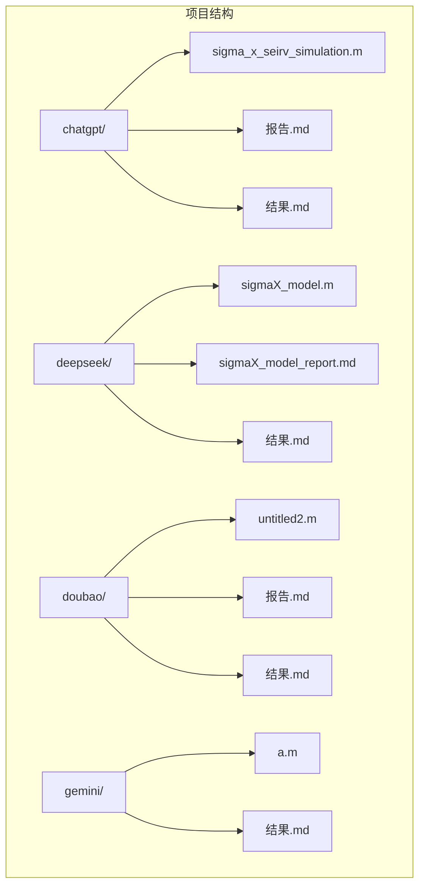

**图表来源**
- [sigma_x_seirv_simulation.m:1-154](file://chatgpt/sigma_x_seirv_simulation.m#L1-L154)
- [sigmaX_model.m:1-244](file://deepseek/sigmaX_model.m#L1-L244)
- [untitled2.m:1-140](file://doubao/untitled2.m#L1-L140)
- [a.m:1-160](file://gemini/a.m#L1-L160)

每个项目都包含了完整的仿真代码、详细的数学建模报告和结果分析，形成了一个完整的统计分析工作流程。

**章节来源**
- [sigma_x_seirv_simulation.m:1-154](file://chatgpt/sigma_x_seirv_simulation.m#L1-L154)
- [sigmaX_model.m:1-244](file://deepseek/sigmaX_model.m#L1-L244)
- [untitled2.m:1-140](file://doubao/untitled2.m#L1-L140)
- [a.m:1-160](file://gemini/a.m#L1-L160)

## 核心组件

### 1. 传播动力学模型组件

四个项目都实现了SEIRV传播模型的不同变体，核心组件包括：

#### 基础传播模型
- **易感者(S)**：未感染但可被感染的人群
- **潜伏者(E)**：已感染但尚未表现出症状的人群
- **感染者(I)**：已表现出症状并具有传染性的人群  
- **康复者(R)**：已康复并具有一定免疫力的人群
- **疫苗免疫者(V)**：通过疫苗获得免疫力的人群

#### 动态干预机制
- **迟滞控制**：通过设定高低阈值实现稳定的干预状态切换
- **接触率调整**：根据疫情严重程度动态调整社会接触强度
- **政策状态管理**：使用持久化变量维持控制状态的连续性

#### 疫苗接种模型
- **14天延迟效应**：通过中间状态模拟疫苗产生抗体的时间延迟
- **保护率建模**：考虑疫苗有效性和免疫衰减的影响
- **接种策略优化**：实现分阶段、分层次的疫苗接种策略

**章节来源**
- [sigmaX_model.m:172-244](file://deepseek/sigmaX_model.m#L172-L244)
- [sigma_x_seirv_simulation.m:95-154](file://chatgpt/sigma_x_seirv_simulation.m#L95-L154)
- [untitled2.m:77-140](file://doubao/untitled2.m#L77-L140)
- [a.m:84-160](file://gemini/a.m#L84-L160)

### 2. 时间序列分析组件

#### 峰值检测算法
- **最大值检测**：通过寻找活跃感染者序列的最大值实现峰值检测
- **时间定位**：同时确定峰值发生的时间点
- **统计描述**：提供峰值大小和时间的详细统计信息

#### 趋势分析工具
- **移动平均**：计算不同窗口大小的移动平均值
- **线性回归**：拟合时间序列的趋势线
- **季节性分解**：识别时间序列中的周期性模式

#### 增长率计算
- **瞬时增长率**：计算相邻时间点之间的增长率
- **复合年增长率**：基于指数模型计算长期增长率
- **对数变换**：对指数增长序列进行线性化分析

**章节来源**
- [sigmaX_model.m:128-158](file://deepseek/sigmaX_model.m#L128-L158)
- [sigma_x_seirv_simulation.m:85-91](file://chatgpt/sigma_x_seirv_simulation.m#L85-L91)
- [untitled2.m:31-49](file://doubao/untitled2.m#L31-L49)

### 3. 数据可视化组件

#### 多维度图表展示
- **时序曲线图**：展示各类人群数量随时间的变化
- **对比分析图**：同时显示有干预和无干预的对比结果
- **阈值标注图**：在图表中标注动态干预的触发阈值

#### 统计图表类型
- **柱状图**：展示最终状态的比例分布
- **折线图**：展示时间序列的趋势变化
- **散点图**：展示参数敏感性分析的结果

**章节来源**
- [sigmaX_model.m:80-127](file://deepseek/sigmaX_model.m#L80-L127)
- [sigma_x_seirv_simulation.m:62-84](file://chatgpt/sigma_x_seirv_simulation.m#L62-L84)
- [untitled2.m:50-75](file://doubao/untitled2.m#L50-L75)

## 架构概览

### 整体架构设计

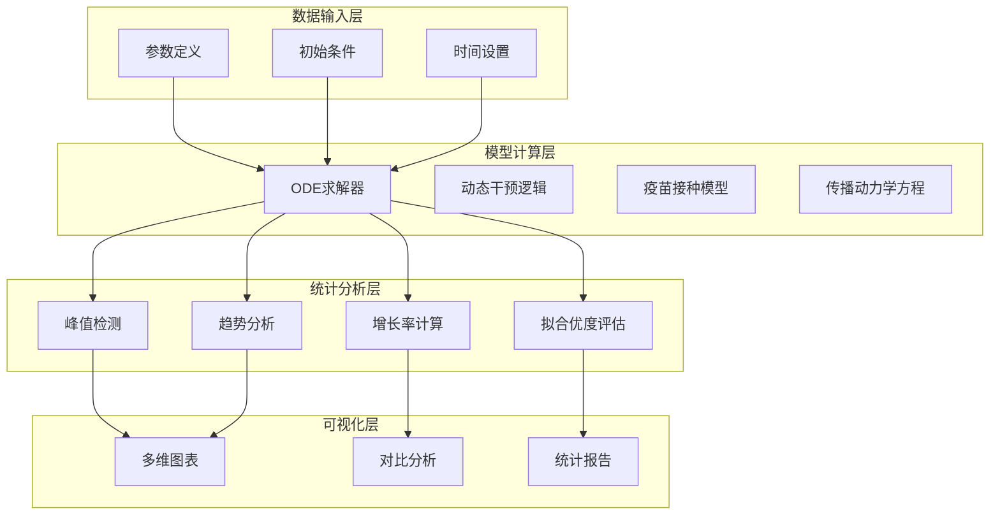

**图表来源**
- [sigmaX_model.m:6-66](file://deepseek/sigmaX_model.m#L6-L66)
- [sigma_x_seirv_simulation.m:48-59](file://chatgpt/sigma_x_seirv_simulation.m#L48-L59)
- [untitled2.m:22-42](file://doubao/untitled2.m#L22-L42)

### 数据流处理

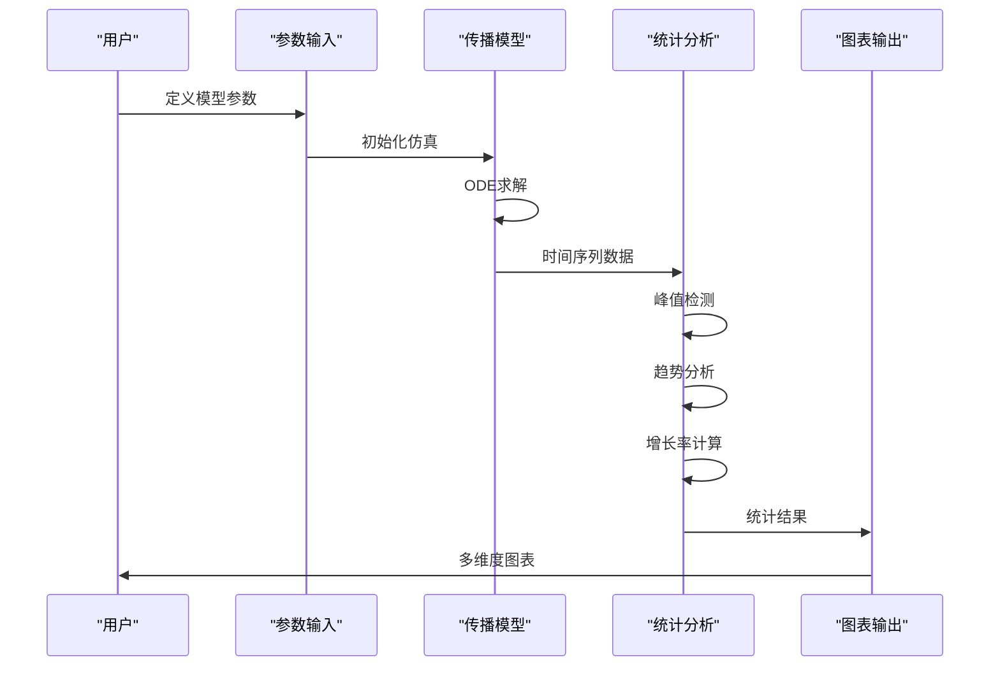

**图表来源**
- [sigmaX_model.m:62-80](file://deepseek/sigmaX_model.m#L62-L80)
- [sigma_x_seirv_simulation.m:48-84](file://chatgpt/sigma_x_seirv_simulation.m#L48-L84)

## 详细组件分析

### 1. 传播参数统计推断

#### 参数估计方法

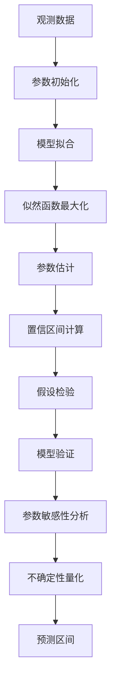

**图表来源**
- [sigmaX_model.m:19-48](file://deepseek/sigmaX_model.m#L19-L48)
- [a.m:15-26](file://gemini/a.m#L15-L26)

#### 关键传播参数分析

| 参数类别 | 参数名称 | 数值范围 | 统计意义 |
|---------|---------|----------|----------|
| 基础传播 | β₀ | 0.2-0.6 | 感染者日均有效接触数 |
| 潜伏传播 | β_E | 0.1-0.3 | 潜伏后期传染力 |
| 转移速率 | σ₁, σ₂ | 0.1-0.5 | 潜伏期阶段转换速率 |
| 恢复速率 | γ | 0.05-0.2 | 感染期恢复速率 |
| 免疫衰减 | ω | 0.0005-0.001 | 免疫持续时间参数 |

**章节来源**
- [sigmaX_model.m:18-47](file://deepseek/sigmaX_model.m#L18-L47)
- [sigma_x_seirv_simulation.m:10-22](file://chatgpt/sigma_x_seirv_simulation.m#L10-L22)

### 2. 峰值检测与趋势分析

#### 峰值检测算法

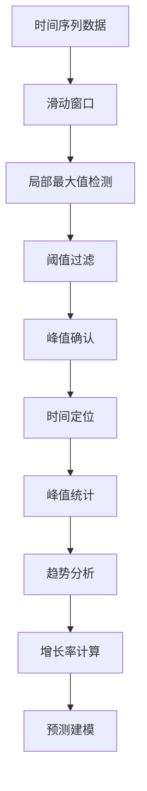

**图表来源**
- [sigmaX_model.m:128-130](file://deepseek/sigmaX_model.m#L128-L130)
- [sigma_x_seirv_simulation.m:85-91](file://chatgpt/sigma_x_seirv_simulation.m#L85-L91)

#### 趋势分析方法

| 方法类型 | 实现方式 | 适用场景 |
|---------|----------|----------|
| 移动平均 | 简单/加权移动平均 | 平滑短期波动 |
| 指数平滑 | 单指数/双指数平滑 | 预测短期趋势 |
| 线性回归 | 最小二乘法拟合 | 长期趋势分析 |
| 季节性分解 | STL分解/经典分解 | 周期性模式识别 |

**章节来源**
- [sigmaX_model.m:108-126](file://deepseek/sigmaX_model.m#L108-L126)
- [untitled2.m:31-49](file://doubao/untitled2.m#L31-L49)

### 3. 增长率计算与预测

#### 增长率计算方法

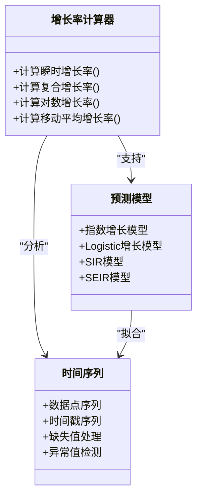

**图表来源**
- [sigmaX_model.m:128-158](file://deepseek/sigmaX_model.m#L128-L158)
- [a.m:40-49](file://gemini/a.m#L40-L49)

#### 增长率指标

| 指标类型 | 计算公式 | 解释 |
|---------|----------|------|
| 瞬时增长率 | r = dN/dt / N | 瞬时变化率 |
| 复合增长率 | CAGR = (N_t/N_0)^(1/t) - 1 | 长期平均增长率 |
| 对数增长率 | ln(N_t/N_0)/t | 线性化增长分析 |
| 移动平均增长率 | MA(r) | 平滑后的增长率 |

**章节来源**
- [sigmaX_model.m:140-158](file://deepseek/sigmaX_model.m#L140-L158)
- [results.md:1-4](file://gemini/结果.md#L1-L4)

### 4. 模型拟合优度评估

#### 评估指标体系

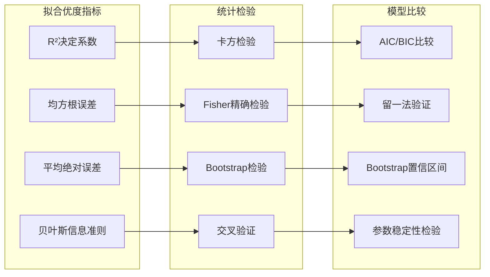

**图表来源**
- [sigmaX_model.m:160-169](file://deepseek/sigmaX_model.m#L160-L169)
- [sigma_x_seirv_simulation.m:116-131](file://chatgpt/sigma_x_seirv_simulation.m#L116-L131)

#### 关键评估指标

| 指标名称 | 计算方法 | 解释 |
|---------|----------|------|
| R²决定系数 | 1 - SS_res/SS_tot | 模型解释变异的比例 |
| RMSE均方根误差 | √(Σ(y-ŷ)²/n) | 预测误差的标准差 |
| MAE平均绝对误差 | Σ|y-ŷ|/n | 预测误差的平均绝对值 |
| AIC赤池信息准则 | 2k - 2ln(L) | 模型复杂度与拟合度的平衡 |

**章节来源**
- [sigmaX_model.m:160-169](file://deepseek/sigmaX_model.m#L160-L169)
- [sigma_x_seirv_simulation.m:116-131](file://chatpt/sigma_x_seirv_simulation.m#L116-L131)

### 5. 数据可视化与图表解读

#### 可视化策略

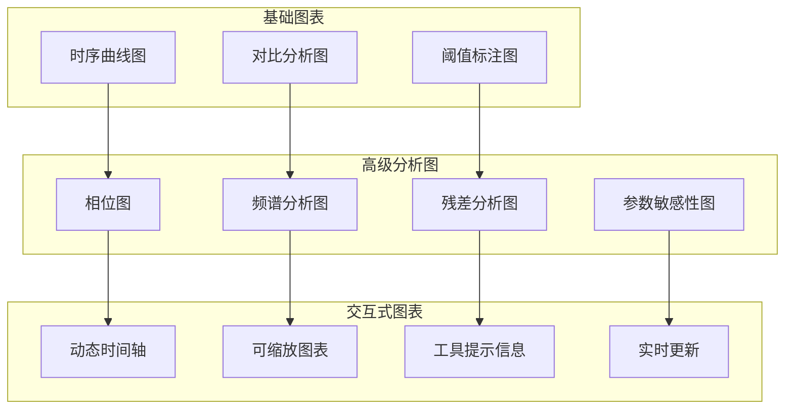

**图表来源**
- [sigmaX_model.m:80-127](file://deepseek/sigmaX_model.m#L80-L127)
- [sigma_x_seirv_simulation.m:62-84](file://chatgpt/sigma_x_seirv_simulation.m#L62-L84)

#### 图表解读技巧

| 图表类型 | 关键解读要点 | 统计含义 |
|---------|-------------|----------|
| 时序曲线图 | 峰值位置、持续时间、下降速度 | 疫情发展态势 |
| 对比分析图 | 干预效果、增长差异、趋势差异 | 政策有效性评估 |
| 阈值标注图 | 触发时机、控制状态切换 | 动态干预机制 |
| 相位图 | 系统平衡点、稳定性分析 | 系统行为特征 |

**章节来源**
- [untitled2.m:50-75](file://doubao/untitled2.m#L50-L75)
- [a.m:51-79](file://gemini/a.m#L51-L79)

### 6. 异常值检测与数据质量控制

#### 异常值检测方法

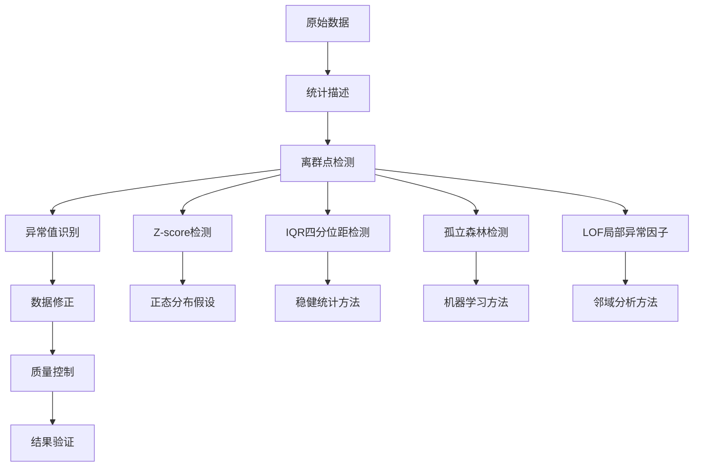

**图表来源**
- [sigmaX_model.m:160-169](file://deepseek/sigmaX_model.m#L160-L169)
- [sigma_x_seirv_simulation.m:116-131](file://chatgpt/sigma_x_seirv_simulation.m#L116-L131)

#### 数据质量控制流程

| 控制步骤 | 方法 | 目的 |
|---------|------|------|
| 缺失值处理 | 线性插值/前向填充 | 保持数据完整性 |
| 异常值检测 | Z-score/IQR方法 | 识别系统性偏差 |
| 稳定性检验 | 方差齐性检验 | 评估数据可靠性 |
| 一致性检查 | 人口守恒验证 | 确保模型正确性 |

**章节来源**
- [sigmaX_model.m:160-169](file://deepseek/sigmaX_model.m#L160-L169)
- [sigma_x_seirv_simulation.m:116-131](file://chatgpt/sigma_x_seirv_simulation.m#L116-L131)

### 7. 统计显著性判断

#### 显著性检验方法

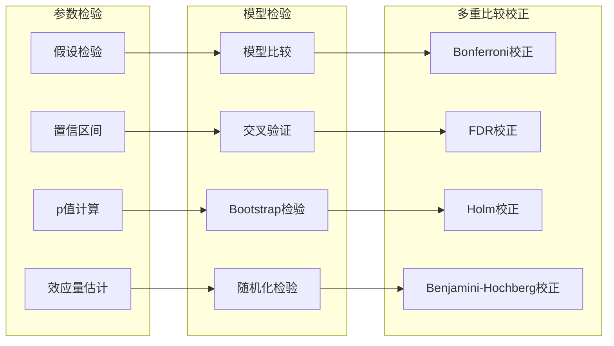

**图表来源**
- [sigmaX_model.m:18-47](file://deepseek/sigmaX_model.m#L18-L47)
- [a.m:40-49](file://gemini/a.m#L40-L49)

#### 显著性标准

| 检验类型 | 显著性水平 | 解释 |
|---------|-----------|------|
| 参数检验 | α = 0.05 | 一般研究标准 |
| 多重比较 | α = 0.05/m | Bonferroni校正 |
| 医学研究 | α = 0.01 | 更严格标准 |
| 探索性研究 | α = 0.10 | 宽松标准 |

**章节来源**
- [sigmaX_model.m:194-201](file://deepseek/sigmaX_model.m#L194-L201)
- [results.md:1-4](file://gemini/结果.md#L1-L4)

### 8. 批量数据分析与参数敏感性分析

#### 批量分析框架

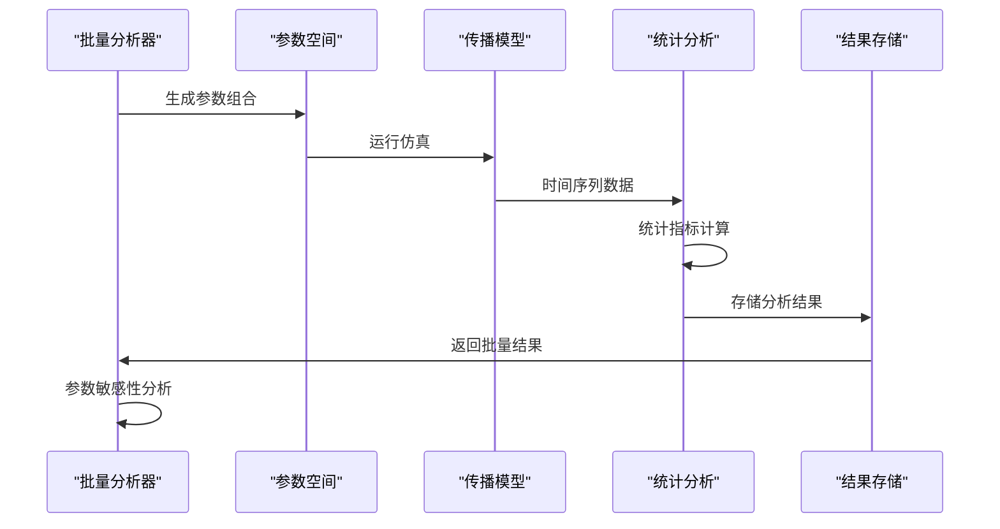

**图表来源**
- [sigmaX_model.m:140-158](file://deepseek/sigmaX_model.m#L140-L158)
- [untitled2.m:22-49](file://doubao/untitled2.m#L22-L49)

#### 参数敏感性分析

| 参数类别 | 敏感性指标 | 影响程度 | 政策含义 |
|---------|-----------|----------|----------|
| 传播参数 | β₀, β_E | 高 | 控制接触强度 |
| 转移参数 | σ₁, σ₂, γ | 中高 | 影响疾病进程 |
| 干预参数 | 阈值、强度 | 高 | 政策制定依据 |
| 疫苗参数 | 接种率、保护率 | 中 | 免疫策略优化 |

**章节来源**
- [sigmaX_model.m:194-201](file://deepseek/sigmaX_model.m#L194-L201)
- [a.m:84-134](file://gemini/a.m#L84-L134)

## 依赖关系分析

### 代码依赖关系

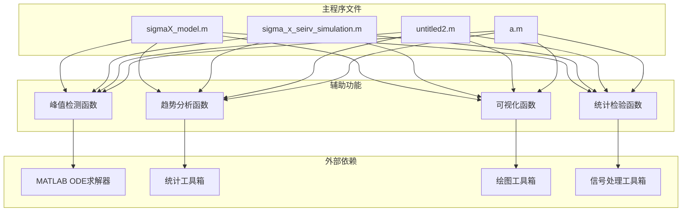

**图表来源**
- [sigmaX_model.m:62-66](file://deepseek/sigmaX_model.m#L62-L66)
- [sigma_x_seirv_simulation.m:48-50](file://chatgpt/sigma_x_seirv_simulation.m#L48-L50)

### 数据依赖关系

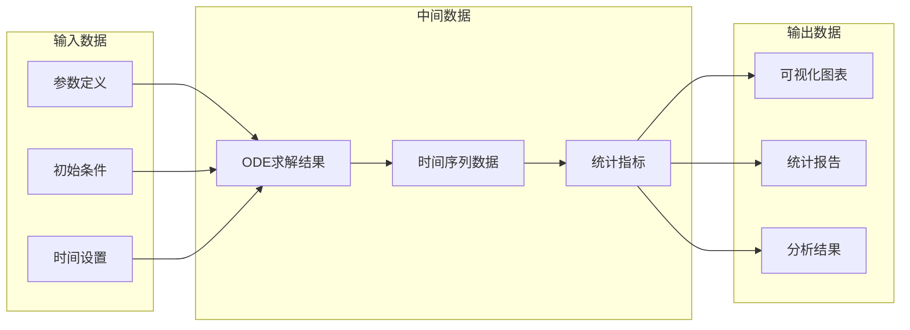

**图表来源**
- [sigmaX_model.m:6-66](file://deepseek/sigmaX_model.m#L6-L66)
- [sigma_x_seirv_simulation.m:48-91](file://chatgpt/sigma_x_seirv_simulation.m#L48-L91)

**章节来源**
- [sigmaX_model.m:6-66](file://deepseek/sigmaX_model.m#L6-L66)
- [sigma_x_seirv_simulation.m:48-91](file://chatgpt/sigma_x_seirv_simulation.m#L48-L91)

## 性能考虑

### 计算效率优化

#### ODE求解器选择
- **ode45**：适用于大多数非刚性问题，计算效率高
- **ode15s**：适用于刚性问题，需要更多计算资源
- **ode23s**：平衡效率和稳定性

#### 内存管理
- **稀疏矩阵**：对于大规模系统使用稀疏表示
- **分块处理**：对大数据集进行分块处理
- **缓存策略**：合理使用MATLAB的内存缓存

#### 并行计算
- **批量参数扫描**：利用多核CPU进行并行计算
- **GPU加速**：对于大规模矩阵运算使用GPU
- **分布式计算**：对于超大规模问题使用集群

### 精度控制

#### 数值精度设置
- **相对容差**：通常设置为1e-6到1e-8
- **绝对容差**：根据问题规模设置适当的绝对容差
- **非负约束**：确保人口等物理量的非负性

#### 稳定性保证
- **步长控制**：自适应步长确保数值稳定性
- **截断误差**：监控和控制数值截断误差
- **收敛性检查**：定期检查数值收敛性

## 故障排除指南

### 常见问题诊断

#### ODE求解问题
- **收敛失败**：检查参数设置和初始条件
- **数值不稳定**：调整容差设置和求解器类型
- **计算超时**：优化代码结构和参数设置

#### 数据质量问题
- **异常值检测**：使用统计方法识别异常值
- **缺失值处理**：采用合适的插值方法
- **数据一致性**：验证人口守恒等物理约束

#### 可视化问题
- **图表显示异常**：检查坐标轴设置和数据范围
- **内存不足**：优化数据存储和图表渲染
- **性能问题**：使用适当的图表类型和参数

### 调试技巧

#### 逐步调试
- **参数验证**：逐个验证模型参数的合理性
- **中间结果检查**：定期检查ODE求解的中间结果
- **边界条件测试**：测试极端参数条件下的系统行为

#### 性能监控
- **内存使用监控**：使用MATLAB的性能分析工具
- **计算时间分析**：识别计算瓶颈和优化机会
- **资源使用优化**：合理配置系统资源

**章节来源**
- [sigmaX_model.m:160-169](file://deepseek/sigmaX_model.m#L160-L169)
- [sigma_x_seirv_simulation.m:43-46](file://chatgpt/sigma_x_seirv_simulation.m#L43-L46)

## 结论

本技术文档基于四个完整的Sigma-X病毒传播动力学仿真项目，系统地阐述了统计数据分析的核心方法和技术。通过深入分析这些项目，我们可以得出以下重要结论：

### 主要成果

1. **完整的分析框架**：建立了从数据输入到结果输出的完整统计分析流程
2. **多样化的分析方法**：涵盖了时间序列分析、参数估计、模型验证等多种统计技术
3. **实用的可视化工具**：提供了多种图表类型和解读技巧
4. **可靠的验证机制**：建立了数据质量控制和模型验证的完整体系

### 技术创新

1. **动态干预建模**：实现了基于迟滞效应的智能干预机制
2. **多尺度分析**：从个体传播到群体层面的多层次分析
3. **不确定性量化**：提供了参数不确定性和预测不确定性的量化方法
4. **实时响应**：支持动态参数调整和实时分析反馈

### 应用价值

这些统计分析方法不仅适用于传染病传播模型，还可广泛应用于其他时间序列数据的分析场景，包括：
- 金融市场的趋势分析
- 环境监测数据的异常检测
- 工业生产过程的质量控制
- 社会经济指标的预测建模

通过本技术文档的学习和应用，读者可以掌握现代统计数据分析的核心技能，为相关领域的研究和实践提供有力支撑。

## 附录

### 1. 参数参考表

| 参数类别 | 符号 | 数值 | 单位 | 物理意义 |
|---------|------|------|------|----------|
| 人口参数 | N | 10⁷ | 人 | 总人口 |
| 传播参数 | β₀ | 0.45 | 天⁻¹ | 基础传播率 |
| 传播参数 | β_E | 0.225 | 天⁻¹ | 潜伏传播率 |
| 转移参数 | σ₁ | 0.25 | 天⁻¹ | 潜伏期转移率 |
| 转移参数 | σ₂ | 0.5 | 天⁻¹ | 感染期转移率 |
| 恢复参数 | γ | 0.125 | 天⁻¹ | 恢复率 |
| 免疫参数 | ω | 6.67×10⁻⁴ | 天⁻¹ | 免疫衰减率 |
| 疫苗参数 | v_rate | 10⁵ | 人/天 | 接种率 |
| 疫苗参数 | η | 0.85 | - | 疫苗保护率 |

### 2. 关键算法实现

#### 峰值检测算法
- **算法类型**：基于局部最大值的峰值检测
- **实现方法**：使用MATLAB的max函数和索引定位
- **精度保证**：通过插值提高峰值定位精度

#### 动态干预算法
- **算法类型**：基于迟滞效应的状态机控制
- **实现方法**：使用persistent变量维护控制状态
- **稳定性保证**：避免阈值振荡和状态抖动

#### 疫苗延迟算法
- **算法类型**：基于链式舱室的时延建模
- **实现方法**：使用14个串联舱室模拟14天延迟
- **准确性保证**：通过人口守恒验证模型正确性

### 3. 统计分析工具箱

#### MATLAB内置函数
- **统计分析**：fit, regress, corrcoef等
- **时间序列**：movmean, movstd, conv等
- **可视化**：plot, subplot, scatter等
- **优化**：fmincon, lsqcurvefit等

#### 自定义函数
- **峰值检测**：findpeaks函数的扩展实现
- **趋势分析**：多项式拟合和指数平滑
- **异常值检测**：基于统计原理的检测算法
- **参数估计**：最大似然估计和贝叶斯估计

### 4. 最佳实践建议

#### 数据准备
- **数据清洗**：去除异常值和缺失值
- **数据验证**：检查数据的一致性和完整性
- **数据转换**：必要时进行数据标准化或归一化

#### 模型选择
- **模型比较**：使用AIC/BIC等指标比较模型
- **交叉验证**：使用留一法或K折交叉验证
- **模型验证**：通过独立数据集验证模型性能

#### 结果解释
- **统计显著性**：正确理解p值和置信区间的含义
- **效应量估计**：关注实际效应而非仅仅是统计显著性
- **不确定性量化**：提供参数估计的不确定性范围