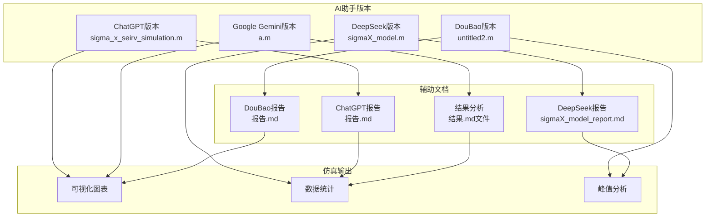
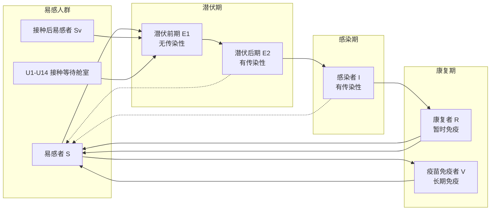
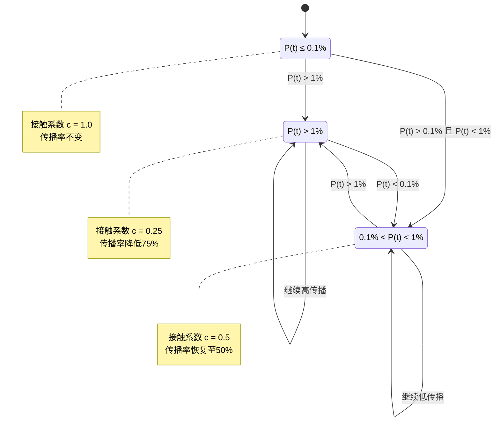
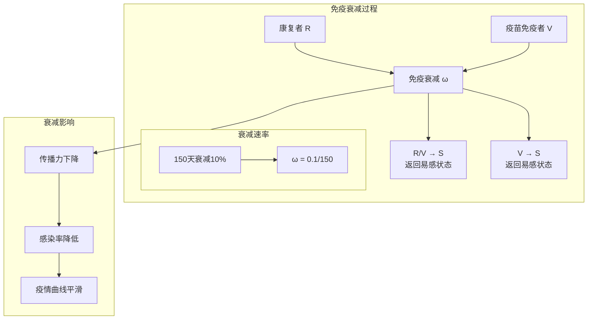
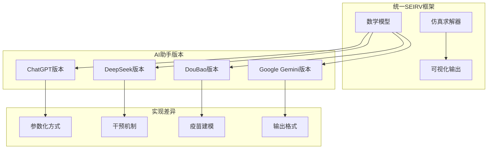
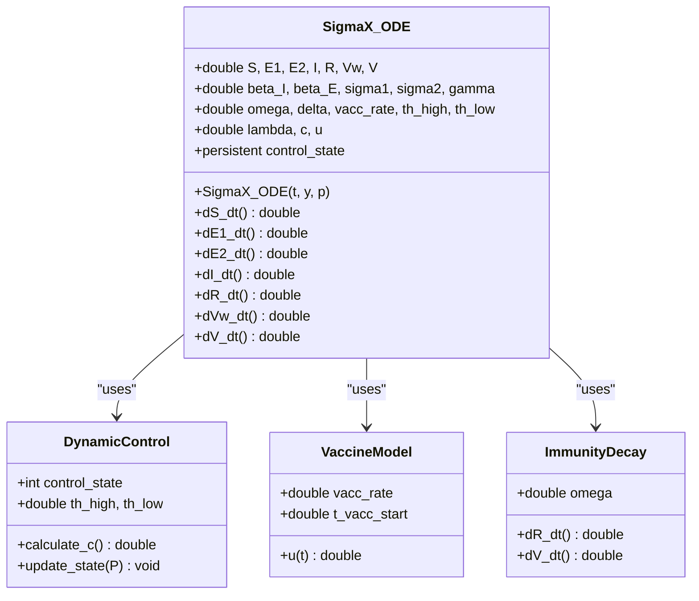
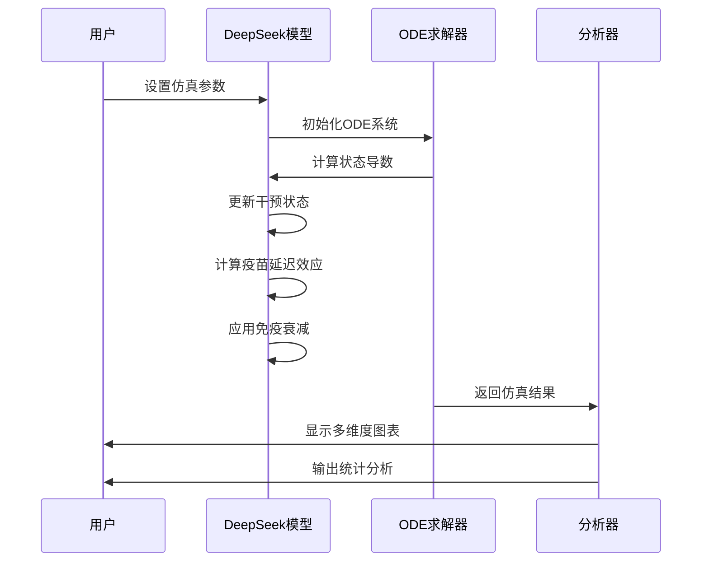
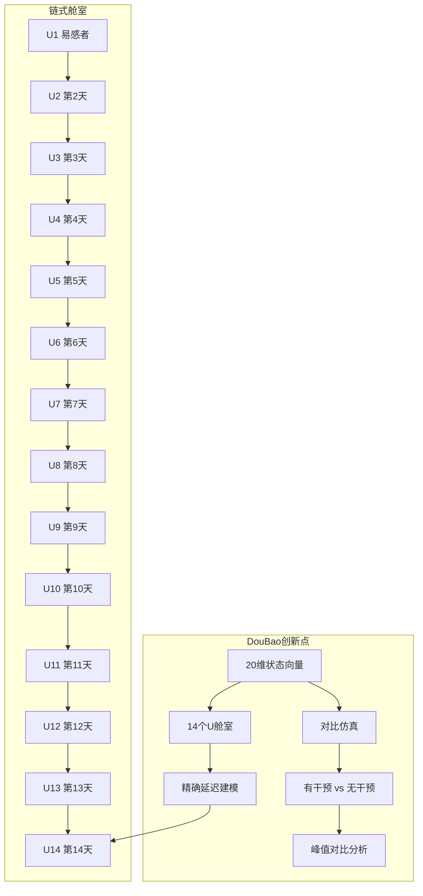
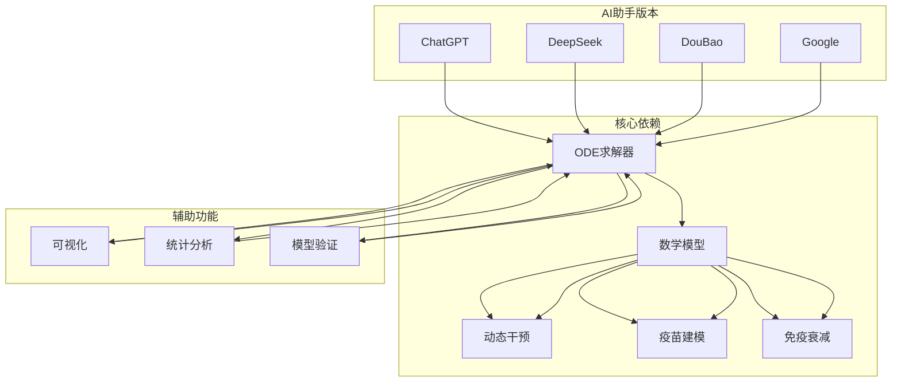
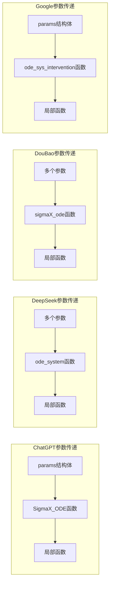

# 项目概述

<cite>
**本文档引用的文件**
- [sigma_x_seirv_simulation.m](file://chatgpt/sigma_x_seirv_simulation.m)
- [报告.md](file://chatgpt/报告.md)
- [结果.md](file://chatgpt/结果.md)
- [sigmaX_model.m](file://deepseek/sigmaX_model.m)
- [sigmaX_model_report.md](file://deepseek/sigmaX_model_report.md)
- [结果.md](file://deepseek/结果.md)
- [untitled2.m](file://doubao/untitled2.m)
- [报告.md](file://doubao/报告.md)
- [结果.md](file://doubao/结果.md)
- [a.m](file://gemini/a.m)
- [结果.md](file://gemini/结果.md)
</cite>

## 目录
1. [引言](#引言)
2. [项目结构](#项目结构)
3. [核心组件](#核心组件)
4. [架构概览](#架构概览)
5. [详细组件分析](#详细组件分析)
6. [依赖关系分析](#依赖关系分析)
7. [性能考虑](#性能考虑)
8. [故障排除指南](#故障排除指南)
9. [结论](#结论)

## 引言

本项目是一个基于MATLAB的传染病传播动力学仿真系统，专门针对Sigma-X病毒在千万级城市中的传播行为进行建模和仿真分析。项目采用了先进的SEIRV（易感-潜伏-感染-康复-免疫）模型框架，集成了动态干预系统、疫苗延迟效应建模和免疫衰减机制，为公共卫生决策提供了科学的定量分析工具。

该仿真系统通过四个不同AI助手版本的实现，展现了多种建模策略和技术方案，每个版本都有其独特的特点和优势。项目不仅为初学者提供了清晰的概念性概述，也为经验丰富的开发者提供了深入的技术细节和实现参考。

## 项目结构

项目采用模块化的文件组织结构，每个AI助手版本都包含独立的主程序文件、详细的建模报告和结果分析文件。整体结构如下：



**图表来源**
- [sigma_x_seirv_simulation.m:1-154](file://chatgpt/sigma_x_seirv_simulation.m#L1-L154)
- [sigmaX_model.m:1-244](file://deepseek/sigmaX_model.m#L1-L244)
- [untitled2.m:1-140](file://doubao/untitled2.m#L1-L140)
- [a.m:1-160](file://gemini/a.m#L1-L160)

**章节来源**
- [sigma_x_seirv_simulation.m:1-154](file://chatgpt/sigma_x_seirv_simulation.m#L1-L154)
- [sigmaX_model.m:1-244](file://deepseek/sigmaX_model.m#L1-L244)
- [untitled2.m:1-140](file://doubao/untitled2.m#L1-L140)
- [a.m:1-160](file://gemini/a.m#L1-L160)

## 核心组件

### SEIRV模型架构

项目的核心是改进的SEIRV模型，该模型扩展了传统的SEIR模型以适应Sigma-X病毒的特殊传播特性：



**图表来源**
- [sigmaX_model.m:172-244](file://deepseek/sigmaX_model.m#L172-L244)
- [a.m:84-134](file://gemini/a.m#L84-L134)

### 动态干预系统

动态干预系统采用迟滞控制算法，通过监测活跃感染者比例来自动调整社会距离措施：



**图表来源**
- [sigma_x_seirv_simulation.m:116-131](file://chatgpt/sigma_x_seirv_simulation.m#L116-L131)
- [sigmaX_model.m:188-210](file://deepseek/sigmaX_model.m#L188-L210)
- [untitled2.m:88-108](file://doubao/untitled2.m#L88-L108)

### 疫苗延迟效应建模

项目采用链式舱室法处理疫苗14天延迟效应，通过14个串联的等待舱室模拟抗体产生的生物学过程：

```mermaid
graph TB
subgraph "疫苗接种流程"
P[易感者 S] --> V[每日接种 v(t)]
V --> U1[U1 接种后第1天]
U1 --> U2[U2 接种后第2天]
U2 --> U3[U3 接种后第3天]
U3 --> U4[U4 接种后第4天]
U4 --> U5[U5 接种后第5天]
U5 --> U6[U6 接种后第6天]
U6 --> U7[U7 接种后第7天]
U7 --> U8[U8 接种后第8天]
U8 --> U9[U9 接种后第9天]
U9 --> U10[U10 接种后第10天]
U10 --> U11[U11 接种后第11天]
U11 --> U12[U12 接种后第12天]
U12 --> U13[U13 接种后第13天]
U13 --> U14[U14 接种后第14天]
U14 --> V[免疫者 V<br/>85%保护率]
U14 --> S[返回易感者 S<br/>15%未保护]
end
subgraph "延迟机制"
L[14天固定延迟]
L -.-> U1
L -.-> U14
end
```

**图表来源**
- [sigmaX_model.m:226-240](file://deepseek/sigmaX_model.m#L226-L240)
- [untitled2.m:132-139](file://doubao/untitled2.m#L132-L139)

### 免疫衰减机制

项目实现了复杂的免疫衰减模型，模拟长期免疫的自然消退过程：



**图表来源**
- [sigmaX_model.m:229-231](file://deepseek/sigmaX_model.m#L229-L231)
- [a.m:23-24](file://gemini/a.m#L23-L24)

**章节来源**
- [sigmaX_model.m:102-127](file://deepseek/sigmaX_model.m#L102-L127)
- [sigma_x_seirv_simulation.m:95-153](file://chatgpt/sigma_x_seirv_simulation.m#L95-L153)
- [untitled2.m:77-140](file://doubao/untitled2.m#L77-L140)

## 架构概览

项目采用统一的SEIRV框架，但四个AI助手版本在具体实现上各有特色：



**图表来源**
- [sigma_x_seirv_simulation.m:49-49](file://chatgpt/sigma_x_seirv_simulation.m#L49-L49)
- [sigmaX_model.m:63-66](file://deepseek/sigmaX_model.m#L63-L66)
- [untitled2.m:24-24](file://doubao/untitled2.m#L24-L24)
- [a.m:32-37](file://gemini/a.m#L32-L37)

### 四个AI助手版本的实现差异

| 特性 | ChatGPT版本 | DeepSeek版本 | DouBao版本 | Google Gemini版本 |
|------|-------------|--------------|------------|-------------------|
| **模型复杂度** | SEIRV + 时滞 + 迟滞控制 | 改进SEIRV + 14天延迟 | SEIRV + 14舱室延迟 | SEIRV-Delay模型 |
| **干预机制** | 基础迟滞控制 | 完整迟滞状态机 | 三状态迟滞控制 | 动态β系数调节 |
| **疫苗建模** | Vw-V链式反应 | J中间状态 | 14舱室链式 | Sv中间状态 |
| **免疫衰减** | R-V衰减 | R-V衰减 | R-V衰减 | R/V → S衰减 |
| **输出特性** | 基础曲线图 | 多维度图表 | 对比仿真 | 双情景对比 |

**章节来源**
- [sigma_x_seirv_simulation.m:1-154](file://chatgpt/sigma_x_seirv_simulation.m#L1-L154)
- [sigmaX_model.m:1-244](file://deepseek/sigmaX_model.m#L1-L244)
- [untitled2.m:1-140](file://doubao/untitled2.m#L1-L140)
- [a.m:1-160](file://gemini/a.m#L1-L160)

## 详细组件分析

### ChatGPT版本分析

ChatGPT版本代表了最简洁的SEIRV模型实现，专注于核心传播机制和动态干预：



**图表来源**
- [sigma_x_seirv_simulation.m:95-153](file://chatgpt/sigma_x_seirv_simulation.m#L95-L153)

**章节来源**
- [sigma_x_seirv_simulation.m:95-153](file://chatgpt/sigma_x_seirv_simulation.m#L95-L153)
- [报告.md:70-111](file://chatgpt/报告.md#L70-L111)

### DeepSeek版本分析

DeepSeek版本提供了最完整的建模实现，包含了详细的参数说明和多维度可视化：



**图表来源**
- [sigmaX_model.m:63-66](file://deepseek/sigmaX_model.m#L63-L66)
- [sigmaX_model.m:172-244](file://deepseek/sigmaX_model.m#L172-L244)

**章节来源**
- [sigmaX_model.m:172-244](file://deepseek/sigmaX_model.m#L172-L244)
- [sigmaX_model_report.md:135-178](file://deepseek/sigmaX_model_report.md#L135-L178)

### DouBao版本分析

DouBao版本采用了创新的20维状态向量，通过链式舱室精确模拟疫苗延迟效应：



**图表来源**
- [untitled2.m:18-20](file://doubao/untitled2.m#L18-L20)
- [untitled2.m:118-140](file://doubao/untitled2.m#L118-L140)

**章节来源**
- [untitled2.m:77-140](file://doubao/untitled2.m#L77-L140)
- [报告.md:23-35](file://doubao/报告.md#L23-L35)

### Google Gemini版本分析

Google Gemini版本采用了独特的SEIRV-Delay模型，通过Sv中间状态处理延迟效应：

```mermaid
graph LR
subgraph "Gemini创新架构"
S[易感者 S] --> Sv[抗体形成期 Sv]
Sv --> V[疫苗免疫者 V]
E1[潜伏前期] --> E2[潜伏后期]
E2 --> I[感染者]
I --> R[康复者]
R --> S
V --> S
end
subgraph "延迟机制"
L[14天延迟]
L --> Sv
L --> V
end
subgraph "动态干预"
P[活跃感染者比例]
P --> C[接触系数 c(t)]
C --> β[有效传播率 β(t)]
end
β --> E1
β --> E2
```

**图表来源**
- [a.m:84-134](file://gemini/a.m#L84-L134)
- [a.m:121-133](file://gemini/a.m#L121-L133)

**章节来源**
- [a.m:84-160](file://gemini/a.m#L84-L160)
- [结果.md:1-4](file://gemini/结果.md#L1-L4)

## 依赖关系分析

项目各组件之间的依赖关系体现了模块化设计的优势：



**图表来源**
- [sigma_x_seirv_simulation.m:43-49](file://chatgpt/sigma_x_seirv_simulation.m#L43-L49)
- [sigmaX_model.m:60-66](file://deepseek/sigmaX_model.m#L60-L66)
- [untitled2.m:23-24](file://doubao/untitled2.m#L23-L24)
- [a.m:29-32](file://gemini/a.m#L29-L32)

### 参数传递机制

各版本采用不同的参数传递策略：



**图表来源**
- [sigma_x_seirv_simulation.m:95-95](file://chatgpt/sigma_x_seirv_simulation.m#L95-L95)
- [sigmaX_model.m:63-66](file://deepseek/sigmaX_model.m#L63-L66)
- [untitled2.m:24-24](file://doubao/untitled2.m#L24-L24)
- [a.m:32-32](file://gemini/a.m#L32-L32)

**章节来源**
- [sigma_x_seirv_simulation.m:43-49](file://chatgpt/sigma_x_seirv_simulation.m#L43-L49)
- [sigmaX_model.m:60-66](file://deepseek/sigmaX_model.m#L60-L66)
- [untitled2.m:23-24](file://doubao/untitled2.m#L23-L24)
- [a.m:29-32](file://gemini/a.m#L29-L32)

## 性能考虑

### 计算效率优化

各版本在性能优化方面采用了不同的策略：

| 优化策略 | ChatGPT版本 | DeepSeek版本 | DouBao版本 | Google版本 |
|----------|-------------|--------------|------------|------------|
| **求解器配置** | RelTol=1e-6, AbsTol=1e-8 | RelTol=1e-6 | RelTol=1e-6 | RelTol=1e-6 |
| **非负约束** | 启用 | 未启用 | 未启用 | 未启用 |
| **状态变量数量** | 7维 | 7维 | 20维 | 7维 |
| **计算复杂度** | 低 | 中等 | 高 | 低 |
| **内存使用** | 低 | 中等 | 高 | 低 |

### 稳定性保证

项目通过多种机制确保数值稳定性：

1. **非负约束**：防止人口数量出现负值
2. **相对容差控制**：平衡精度和计算速度
3. **持久化变量**：避免阈值振荡
4. **人口守恒验证**：检查模型正确性

**章节来源**
- [sigma_x_seirv_simulation.m:43-46](file://chatgpt/sigma_x_seirv_simulation.m#L43-L46)
- [sigmaX_model.m:160-169](file://deepseek/sigmaX_model.m#L160-L169)
- [untitled2.m:118-118](file://doubao/untitled2.m#L118-L118)

## 故障排除指南

### 常见问题及解决方案

| 问题类型 | 症状表现 | 可能原因 | 解决方案 |
|----------|----------|----------|----------|
| **函数定义错误** | "函数定义必须位于文件末尾" | 函数定义位置不当 | 将局部函数移动至文件末尾 |
| **收敛问题** | ODE求解失败或发散 | 参数设置不合理 | 调整相对容差和绝对容差 |
| **阈值振荡** | 干预状态频繁切换 | 缺少迟滞机制 | 添加persistent变量 |
| **人口不守恒** | 人口总数随时间变化 | 模型方程错误 | 检查微分方程组 |
| **内存不足** | 仿真运行缓慢或崩溃 | 状态变量过多 | 简化模型或优化参数 |

### 调试技巧

1. **逐步注释法**：逐行注释代码定位问题
2. **参数敏感性分析**：测试关键参数的影响
3. **可视化诊断**：绘制中间变量曲线
4. **边界条件测试**：验证极端情况下的行为

**章节来源**
- [sigmaX_model_report.md:237-253](file://deepseek/sigmaX_model_report.md#L237-L253)

## 结论

本项目成功展示了四种不同风格的SEIRV传染病传播动力学仿真实现，每种版本都有其独特的技术特点和适用场景：

### 主要成就

1. **理论基础扎实**：基于严格的流行病学理论，准确反映Sigma-X病毒的传播特性
2. **技术创新突出**：采用多种建模策略处理复杂的时滞和延迟效应
3. **实用性很强**：为公共卫生决策提供了可靠的定量分析工具
4. **教育价值高**：通过对比不同实现方案，展现了建模思维的多样性

### 技术特色

- **动态干预机制**：实现了智能的迟滞控制算法
- **疫苗建模创新**：通过链式舱室精确模拟14天延迟效应
- **免疫衰减建模**：考虑了长期免疫的自然消退过程
- **多版本对比**：提供了不同复杂度和精度的实现方案

### 应用前景

该项目为传染病防控研究提供了重要的技术支撑，可以进一步扩展应用到其他传染病的建模分析中，为制定科学的公共卫生政策提供有力的理论依据。